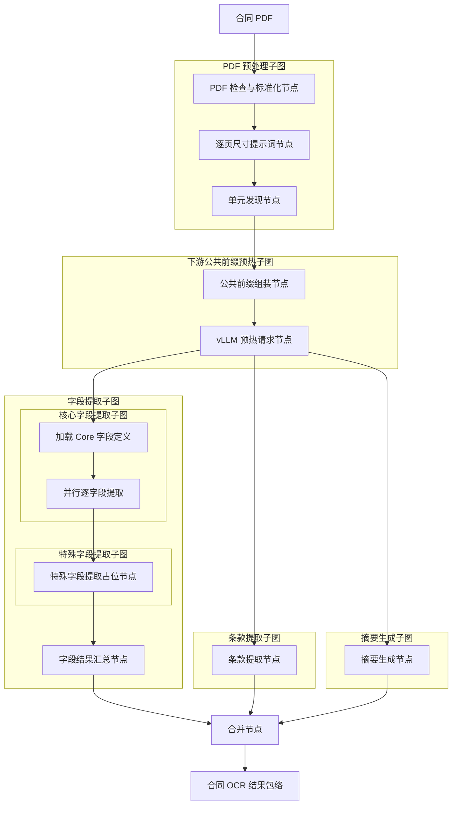

# 合同信息抽取 Agent 工作流

> **用途：** 本文定义合同信息抽取 Agent 的节点拓扑、子图边界和共享状态。当前已实现 PDF 预处理、文档结构发现、公共前缀预热和 Core 字段提取；Special、条款与摘要仍为占位结构。

---

## 总体结构

预处理子图完成页面标准化和结构发现后，预热子图组装“PDF + 文档结构”公共前缀并向 vLLM 发起预热请求；字段、条款和摘要三个子图随后并行执行。合并节点只在三个业务子图均结束后运行。工作流实现位于 `app.agent.contract_extraction`。

---

## PDF 预处理子图

`pdf_preprocessing` 是第一个上游子图，内部按顺序包含 `prepare_pdf`、`build_pdf_prompt_context` 和 `discover_document_units` 三个节点。`prepare_pdf` 调用[PDF 页面压缩工具](../capability/pdf-page-compression.md)，检查文件有效性、加密状态和页数，计算原始文件 SHA-256，并按整份合同的动态视觉预算逐页等比渲染。所有页面始终组成一个连续公共前缀，不切分请求。

`PreparedPDF` 产物包含原始文件标识、文件大小、页数、动态预算、总视觉 token 和完整页面列表。每页保存稳定的 PNG 字节、实际尺寸、渲染比例、视觉 token、图像 SHA-256 和是否发生缩放。

`build_pdf_prompt_context` 将每页页码和模型实际接收的图像宽高转换为确定性提示词计划，每条描述紧邻对应图片且不暴露压缩实现。公共阅读规范、页面消息和构造器统一位于 `subgraph/preprocessing/prompt.py`。

`discover_document_units` 复用同一 PDF 前缀，通过 `summary`、`think`、`generate_unit` 和 `finish` strict function tools 形成带短期记忆的单工具循环，并直接输出权威结构元数据。其工具、状态和专属提示词内聚在 `subgraph/preprocessing/document_structure/`。完整职责见[PDF 预处理子图](subgraph/pdf-preprocessing.md)和[文档结构发现节点](subgraph/document-structure.md)。

---

## 下游公共前缀预热子图

`preheat` 位于预处理与三个并行子图之间，内部只包含 `assemble_prefill_context` 和 `prefill_contract_context` 两个节点。节点一复用 `preprocessing.prompt.build_pdf_common_messages`，在 PDF 前缀后稳定追加 `DocumentStructureMetadata`；节点二追加预热任务并向本地 vLLM 发起异步单 token 请求。

子图输出 `ContractPrefillContext` 和 `ContractPreheatResult`。三个并行子图必须直接复用前者的消息，只在末尾追加各自任务，以获得最大前缀匹配。完整职责见[下游公共前缀预热子图](subgraph/preheat.md)。

---

## 并行子图

| 子图 | 当前占位节点 | 后续职责 |
| --- | --- | --- |
| 字段提取 | `core_field_extraction` → `special_field_extraction` → `merge_field_results` | 先提取稳定的核心字段，再携带核心结果提取合同类型相关的特殊字段。 |
| 条款提取 | `extract_clause` | 识别具有独立视觉边界和法律效果的条款，保留原始顺序与页码证据。 |
| 摘要生成 | `generate_summary` | 根据可引用的合同事实生成短格式化摘要，供后续向量检索使用。 |

三个业务模块在预热完成后并行执行，可只读使用 `ContractPrefillContext`、`PreparedPDF` 和 `DocumentStructureMetadata`，但字段、条款与摘要不得共享可变状态；子图只能回写自己拥有的结果键，避免并行分支同时覆盖父图状态。

字段提取模块已经拆为核心字段与特殊字段两个内部子图，并在字段模块内部按顺序运行，不阻塞条款和摘要模块。Core 已实现“加载定义 → 并行逐字段提取”两节点结构、专属提示词和三个 strict 工具；Special 仍为占位节点。完整边界见[字段提取子图](subgraph/field-extraction.md)。

---

## 合并与输出

`merge_extraction_results` 汇集预热、文档结构、字段、条款与摘要结果，形成单一合同结果包络。后续实现应在此处保留节点级错误、模型与提示词版本、字段目录版本和原始证据索引，而非直接丢弃失败分支。

当前 PDF 预处理、结构单元发现、两节点预热和 Core 字段提取已经可用；Special、条款和摘要仍为占位实现，因此合并结果还不是可用于存储、检索或专家审核的正式 OCR 结果。

---

## 扩展顺序

1. 使用缓存指标验证三个下游请求对完整公共前缀的实际命中率。
2. 使用不同页数、缓存压力和并发请求继续校准动态页面预算与 prefill 策略。
3. 使用测试合同验证 Core 字段准确率、放弃边界、并发稳定性和公共前缀缓存命中率。
4. 分别实现条款与摘要子图，保持与字段子图并行。
5. 最后实现合并后的结果契约、失败隔离、专家审核和 Elasticsearch 投影。
