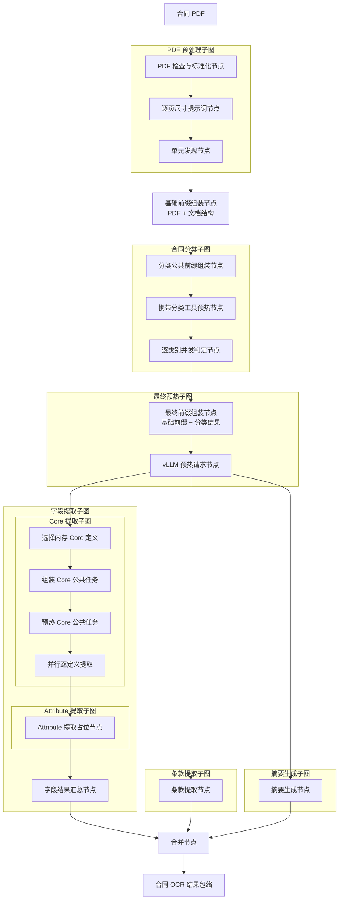

# 合同信息抽取 Agent 工作流

> **用途：** 本文定义合同信息抽取 Agent 的节点拓扑、子图边界和共享状态。当前已实现 PDF 预处理、基础前缀组装、合同并行分类、最终公共前缀预热和 Core 字段提取；Attribute、条款与摘要仍为占位结构。

---

## 总体结构

预处理子图完成页面标准化、结构发现和逐单元视觉定位后，主图单节点组装“PDF + 文档结构”基础前缀；分类子图读取该前缀并返回分类结果；最终预热子图将分类结果追加到基础前缀末尾并向 vLLM 发起请求。字段、条款和摘要三个子图随后并行执行，合并节点只在三者均结束后运行。工作流实现位于 `app.agent.contract_extraction`。

---

## PDF 预处理子图

`pdf_preprocessing` 是第一个上游子图，内部按顺序包含 `prepare_pdf`、`build_pdf_prompt_context` 和 `discover_document_units` 三个节点。`prepare_pdf` 调用[PDF 页面压缩工具](../capability/pdf-page-compression.md)，检查文件有效性、加密状态和页数，计算原始文件 SHA-256，并按整份合同的动态视觉预算逐页等比渲染。所有页面始终组成一个连续公共前缀，不切分请求。

`PreparedPDF` 产物包含原始文件标识、文件大小、页数、动态预算、总视觉 token 和完整页面列表。每页保存稳定的 PNG 字节、实际尺寸、渲染比例、视觉 token、图像 SHA-256 和是否发生缩放。

`build_pdf_prompt_context` 将每页页码和模型实际接收的图像宽高转换为确定性提示词计划，每条描述紧邻对应图片且不暴露压缩实现。公共阅读规范、页面消息和构造器统一位于 `subgraph/preprocessing/prompt.py`。

`discover_document_units` 复用同一 PDF 前缀，通过 `summary`、`think`、`generate_unit` 和 `finish` strict function tools 形成语义结构。随后 `locate_document_units` 为所有单元并发建立独立的 `think`、`draw_bbox`、`finish` 循环；每个会话只发送对应单元跨度内的带页码页面，并把完整结果写入权威结构元数据。相关工具、状态和专属提示词内聚在 `subgraph/preprocessing/document_structure/`。完整职责见[PDF 预处理子图](subgraph/pdf-preprocessing.md)和[文档结构与视觉定位节点](subgraph/document-structure.md)。

---

## 基础前缀组装节点

`assemble_base_context` 是主图中的独立节点，不再属于预热子图。它复用 `preprocessing.prompt.build_pdf_common_messages`，在 PDF 前缀后以带字段注释的稳定 YAML 追加包含 `unit_locations` 的 `DocumentStructureMetadata`，并输出版本为 `contract-base-context-v3` 的不可变 `ContractBaseContext`。分类子图必须直接读取该上下文，不能重新编码 PDF 或重新序列化文档结构。

---

## 合同分类子图

`classification` 包含 `assemble_classification_context`、`prefill_classification_context` 和 `classify_contract`。节点一复制 `ContractBaseContext` 并追加所有单类别请求共享的多标签分类规则，形成版本为 `classification-common-v4` 且带独立指纹的 `ClassificationContext`；节点二携带相同的三个分类工具和 `before_task` 布局向 vLLM 发起异步单 token 预热；节点三读取启动期内存目录，为每个类别并发执行独立工具循环。具体类别资料和工具历史只属于分类子图，不写回基础前缀。

分类只使用文档结构中的单元页码、文字锚点和摘要辅助导航，忽略 `unit_locations` 坐标，不按定位框裁剪页面，也不在分类证据中输出视觉位置；导航不足时必须回退完整相关页面核查。

分类节点把完整逐类别审计保留在私有 `classification_run`，只把紧凑 `classification` 写回主图。最终前缀的模型可读投影仅追加状态、命中卡片和必要的未映射类型描述，不注入失败类别 code、未命中证据或工具历史。完整边界见[合同分类子图](subgraph/classification.md)。

---

## 最终预热子图

`preheat` 位于分类与三个并行子图之间，内部包含 `assemble_prefill_context` 和 `prefill_contract_context` 两个节点。节点一复制 `ContractBaseContext`，在末尾稳定追加分类结果，生成新的 `ContractPrefillContext` 与独立指纹；节点二追加预热任务并向本地 vLLM 发起异步单 token 请求。

子图输出 `ContractPrefillContext` 和 `ContractPreheatResult`。三个并行子图必须直接复用前者的消息，只在末尾追加各自任务，以获得最大前缀匹配。完整职责见[最终公共前缀预热子图](subgraph/preheat.md)。

---

## 并行子图

| 子图 | 当前占位节点 | 后续职责 |
| --- | --- | --- |
| 字段提取 | `core_extraction` → `attribute_extraction` → `merge_field_results` | 先提取稳定的 Core，再携带 Core 结果提取经过治理的 Attribute。 |
| 条款提取 | `extract_clause` | 识别具有独立视觉边界和法律效果的条款，保留原始顺序与页码证据。 |
| 摘要生成 | `generate_summary` | 根据可引用的合同事实生成短格式化摘要，供后续向量检索使用。 |

三个业务模块在最终预热完成后并行执行，可只读使用 `ContractPrefillContext`、`PreparedPDF` 和 `DocumentStructureMetadata`，但字段、条款与摘要不得共享可变状态；子图只能回写自己拥有的结果键，避免并行分支同时覆盖父图状态。

字段提取模块已经拆为 Core 与 Attribute 两个内部子图，并在字段模块内部按顺序运行，不阻塞条款和摘要模块。Core 从启动期 `FieldDefinitionCatalog` 选择定义，按“选择定义 → 组装公共任务 → 预热公共任务 → 并行逐字段提取”运行；Attribute 仍为占位节点。完整边界见[字段提取子图](subgraph/field-extraction.md)。

---

## 合并与输出

`merge_extraction_results` 汇集分类、预热、文档结构、字段、条款与摘要结果，形成单一合同结果包络。后续实现应在此处保留节点级错误、模型与提示词版本、字段目录版本和原始证据索引，而非直接丢弃失败分支。

当前 PDF 预处理、结构单元发现、基础前缀组装、合同并行分类、两节点最终预热和 Core 字段提取已经可用；Attribute、条款和摘要仍为占位实现，因此合并结果还不是可用于存储、检索或专家审核的正式 OCR 结果。

---

## 扩展顺序

1. 使用真实合同验证逐类别判定准确率、工具重试、并发稳定性和分类公共前缀缓存命中率。
2. 设计主类别、次类别或并列关系的独立汇总规则，不让单类别会话越权决定类别关系。
3. 使用缓存指标验证三个下游请求对最终前缀的实际命中率。
4. 使用不同页数、缓存压力和并发请求继续校准动态页面预算与 prefill 策略。
5. 使用测试合同验证 Core 字段准确率、放弃边界、并发稳定性和公共前缀缓存命中率。
6. 分别实现条款与摘要子图，保持与字段子图并行。
7. 最后实现合并后的结果契约、失败隔离、专家审核和 Elasticsearch 投影。
