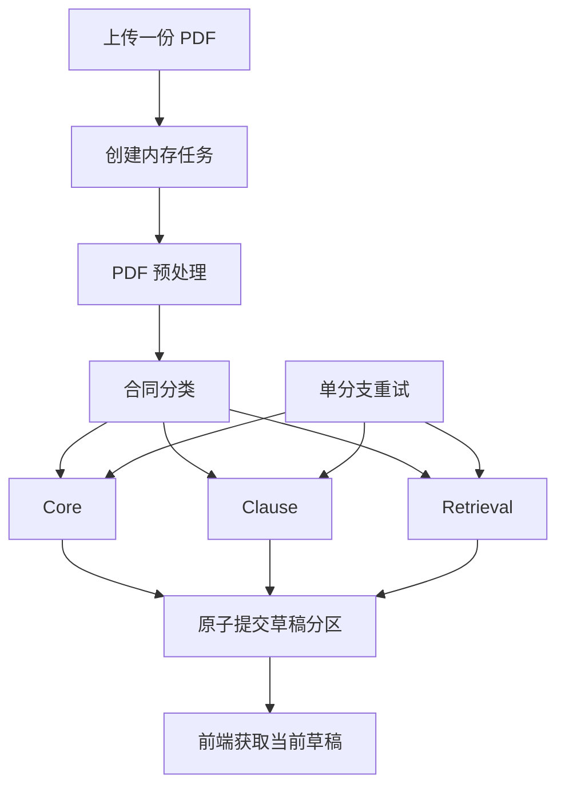

# 合同提取应用运行时

> **用途：** 本文定义单份 PDF 合同在应用层的内存任务、阶段状态、三路并发、增量草稿、分支重试和生命周期边界。HTTP 与 SSE 的精确线协议见[合同提取 API](../api/contract-extraction.md)。

---

## 与 Agent 工作流的关系

[合同信息抽取 Agent 工作流](contract-extraction-agent-workflow.md)定义模型节点、子图输入输出和共享前缀；应用运行时负责把这些能力组织成可供前端持续观察和独立重试的业务任务。

主 Agent 图可以等待三个下游分支全部结束后统一合并，适合实验或批处理。HTTP 服务不采用这个等待边界，而是复用相同的公共前置节点和三个业务子图：



三个下游分支只读同一份 `ExtractionContext`，不共享可变状态。任意一个分支首次成功即可形成可审核草稿，其他分支失败不会撤销已提交内容。

---

## 内存聚合边界

一次上传对应一个 `RunAggregate` 和唯一 `run_id`。聚合在当前 API 进程内持有：

- `SourceDocument`：安全展示文件名、原始 PDF 字节及字节 SHA-256；
- `stages`：全部用户阶段、当前状态、尝试次数和不可覆盖的历史尝试；
- `prerequisites`：预处理、文档结构、分类和下游公共上下文；
- `draft`：各业务分支当前生效的成功修订；
- `events`：有限长度的可回放业务事件；
- `subscribers`：当前 SSE 订阅队列；
- 聚合锁：保证状态、草稿修订和事件序号原子更新。

模型工具轨迹、用量、内部错误和高维向量只存在私有尝试记录或内部结果中。面向用户的快照由投影器重新构造，不能直接序列化 Agent 私有状态。

> **持久化边界：** 原始 PDF、处理中间状态和自动草稿不写临时文件，也不写 Elasticsearch。只有未来经专家确认的最终对象才允许进入正式存储。

---

## 用户业务阶段

内部 LangGraph 节点不会直接成为用户阶段。应用只暴露六个稳定业务阶段：

| `code` | 展示名称 | 内部范围 |
| --- | --- | --- |
| `document_reading` | 读取合同 | PDF 读取、页面渲染与基础页面事实。 |
| `document_understanding` | 理解文档结构 | 内容单元发现与视觉定位。 |
| `contract_classification` | 识别合同类型 | 公共分类上下文及逐类别判定。 |
| `core_extraction` | 提取核心信息 | Core 公共任务和逐定义提取。 |
| `clause_extraction` | 提取合同条款 | 条款发现、上下文组装与正文提取。 |
| `retrieval_preparation` | 准备智能检索 | 问题规划、生成、向量化与融合。 |

阶段状态为 `pending`、`running`、`succeeded`、`failed` 或 `retrying`。只有总量可由程序可靠得知时才填写离散 `progress`，模型生成阶段不得伪造百分比。

每次尝试保留开始时间、结束时间、私有结果或内部错误。SSE 和公共快照只返回当前阶段状态及面向用户的简洁消息。

---

## 运行状态推导

运行状态由阶段和草稿实时推导，不单独维护可能漂移的第二份状态：

| 状态 | 判定 |
| --- | --- |
| `processing` | 尚无可用分区，公共处理或业务分支仍在进行。 |
| `partial_ready` | 至少一个分区可用，但仍有分支运行、重试或失败。 |
| `ready` | Core、Clause 和 Retrieval 三个分支均已形成当前结果。 |
| `failed` | 公共前置阶段失败，或三个业务分支均未形成结果。 |
| `expired` | 聚合已到期并从内存注册表移除。 |

分支内部的 `partial` 是可提交结果：例如部分字段或条款失败时，成功项仍可进入草稿，并在分区上保留 `result_status: partial`。

---

## 增量草稿与修订

草稿由稳定文档身份、紧凑分类和三个可选分区组成：

```yaml
revision: 2
document: {}
classification: {}
core: null
clause: null
retrieval_view: null
updated_at: "..."
```

任一分区成功提交时：

1. 首次成功会建立草稿并发布“可查看”事件；
2. 草稿全局 `revision` 递增；
3. 目标分区自身 `revision` 独立递增；
4. 阶段状态、分区替换和事件发布在同一聚合锁内完成；
5. 兄弟分区及其修订保持不变。

Core 与 Clause 的精确前端对象、字段含义和状态负载见[合同提取 API 的快照响应](../api/contract-extraction.md#获取当前状态与草稿)。

---

## 分支重试

当前只有 `core_extraction`、`clause_extraction` 和 `retrieval_preparation` 可以独立重试。公共预处理或分类失败时，下游缺少权威上下文，用户应重新上传，而不是跳过前置阶段继续执行。

重试遵循“旧成功结果持续可读”的提交协议：

```text
已有分区 v1
  → 阶段进入 retrying，v1 仍是当前结果
  → 新尝试失败：保留 v1，仅更新阶段失败状态
  → 新尝试成功：原子替换为 v2，并发布 draft.updated
```

同一阶段正在执行时拒绝重复重试。首次执行计入尝试次数；达到配置上限后 `retryable` 变为 `false`。

---

## 事件、订阅与背压

每个业务事件拥有任务内严格递增的 `sequence`。订阅建立时，注册订阅队列和读取待回放事件在同一聚合锁内完成，从而避免“读取历史后、订阅生效前”丢失事件。

事件缓冲和每个订阅队列均有上限。慢订阅者队列满时只淘汰该订阅者最旧的事件，不允许反向阻塞模型执行或其他订阅者。完整草稿始终通过快照接口获取，因此事件丢失不会破坏权威结果；前端恢复规则见[合同提取 API 的 SSE 章节](../api/contract-extraction.md#订阅处理事件)。

心跳属于连接保活信号，不写入事件缓冲，也不占用业务序号。

---

## 生命周期与部署限制

任务的到期时间在业务状态更新时向后刷新。清理器跳过仍有活跃执行的任务；任务空闲且到期后，先向现有订阅者发布 `run.expired`，再从注册表移除整个聚合，使 PDF、渲染页面、私有审计、向量和草稿随引用释放。

TTL、清理周期、事件缓冲、SSE 心跳和分支尝试次数均由环境变量控制，具体配置项及默认值见[后端应用的合同处理内存配置](../capability/backend-application.md#合同处理内存配置)。

> **单进程限制：** 当前注册表不持久化且不跨进程共享。开发热更新会清空任务，多 worker 会让上传、SSE、查询和重试落到不同内存空间。采用当前方案时必须运行单 worker；未来如需横向扩展，应另行设计共享临时状态，不能借用 Elasticsearch 保存处理过程。

---

## 实现位置与验证

| 模块 | 职责 |
| --- | --- |
| `app.service.contract_extraction.registry` | 内存聚合和注册表。 |
| `app.service.contract_extraction.service` | 状态机、并发隔离、草稿提交、重试、事件与 TTL。 |
| `app.service.contract_extraction.executor` | 把现有 Agent 子图适配成公共处理和独立业务分支。 |
| `app.service.contract_extraction.projector` | 从私有 Agent 结果构造用户可见草稿。 |
| `app.service.contract_extraction.model` | 稳定运行状态、事件和草稿应用契约。 |

回归测试覆盖内存 PDF、一路成功形成草稿、失败隔离、成功重试原子替换、失败重试保留旧结果、事件回放和 TTL 释放。正式上传校验、鉴权、专家确认、正式对象修改与 Elasticsearch 投影尚未实现。
