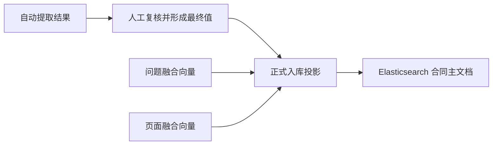
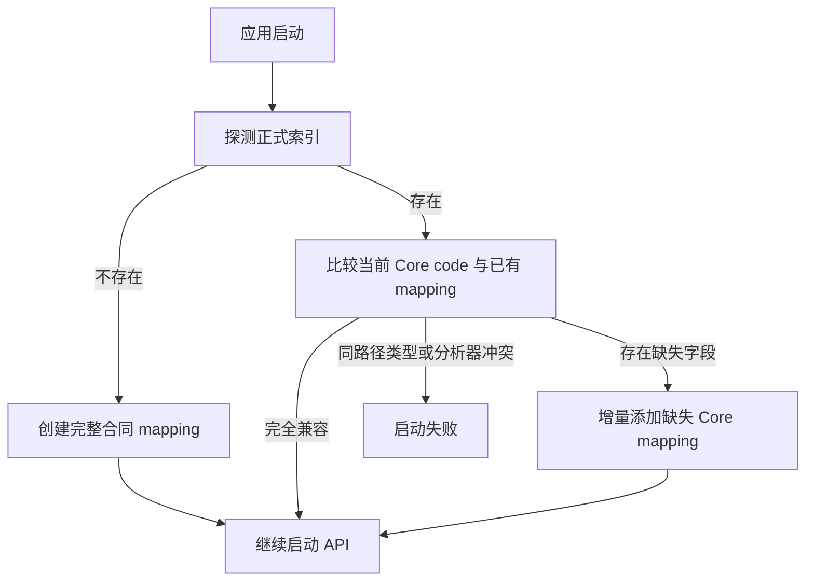

# 合同 Elasticsearch 文档结构

> **用途：** 本文定义复核完成后的合同写入 Elasticsearch 时使用的最终检索文档结构、字段边界和 mapping 原则。

本文是合同正式入库数据的参考契约。合同自动提取流程、内存草稿与 SSE 状态见[合同提取应用运行时](../system/contract-extraction-runtime.md)；Elasticsearch 客户端、索引名称和连接配置见[FastAPI 后端应用骨架](../../capability/application/backend-application.md#elasticsearch-边界)。

> **实现状态：** 应用启动时能够创建正式索引并增量同步 Core mapping；复核后合同正式入库、问题融合向量和 PDF 页面融合向量均已接入应用运行时。

---

## 设计边界

Elasticsearch 主文档只保存复核后的最终合同数据，不保存自动提取过程或用于复核的中间材料。

不进入主文档的数据包括：

- Schema 版本字段。
- PDF 文件字节和文件大小。
- 模型、提示词、目录指纹、运行轮次、token、耗时和工具调用等提取信息。
- 审核状态、审核版本和审核过程；只保留最终审核人与入库时间。
- Core 和 Clause 的自动提取状态、证据、推理、失败信息与候选结果。
- 模拟检索问题、单个问题向量和单页向量。

`document_id` 使用处理版 PDF 字节的 SHA-256。`file_uri` 指向同一份处理版 PDF，但 Elasticsearch 不保存该 PDF 的字节；当前本地部署使用 `/<document_id>.pdf`，由加载器解析到 `data/contract/<document_id>.pdf`。

---

## 顶层结构

一份合同对应 Elasticsearch 中的一份主文档。文档使用 `document_id` 作为 `_id`，同时在 `_source` 中保留该字段，方便普通响应和跨系统传递。

```json
{
  "document_id": "处理版 PDF 的 SHA-256",
  "file_name": "设备采购合同.pdf",
  "file_uri": "/document-id.pdf",
  "page_count": 18,
  "ingestion": {},
  "classification": {},
  "core": {},
  "clauses": [],
  "vectors": {}
}
```

| 字段 | 必填 | 说明 |
| --- | --- | --- |
| `document_id` | 是 | 处理版 PDF 字节的 SHA-256，也是 ES 文档 `_id`。 |
| `file_name` | 是 | 供业务界面展示的文件名。 |
| `file_uri` | 是 | 处理版 PDF 在外部文件存储中的位置，不参与检索。 |
| `page_count` | 是 | 处理版 PDF 的物理页数，用于解释条款页码。 |
| `ingestion` | 是 | 最终审核人与实际入库时间。 |
| `classification` | 是 | 复核后的合同分类最终值。 |
| `core` | 是 | 复核后的固定 Core 最终值。 |
| `clauses` | 是 | 复核后的最终条款目录和正文。 |
| `vectors` | 是 | 当前可用的合同级融合向量。 |

根 mapping 应使用 `dynamic: strict`，防止未定义字段静默进入正式索引。

---

## 入库信息

`ingestion` 只记录最终责任信息，不表达审核状态机。

```json
{
  "ingestion": {
    "reviewer": "张三",
    "ingested_at": "2026-09-01T15:30:00+08:00"
  }
}
```

| 字段 | ES 类型 | 说明 |
| --- | --- | --- |
| `reviewer` | `keyword` | 确认本次最终结果并允许入库的审核人。 |
| `ingested_at` | `date` | Elasticsearch 成功接收入库请求的业务时间，必须包含时区。 |

---

## 最终分类

分类只保存复核后的命中类别及当前合同实际交易场景，不保存分类证据、理由或失败类别。

```json
{
  "classification": {
    "categories": [
      {
        "code": "purchase",
        "name": "采购合同",
        "scenario": "甲方向乙方采购设备"
      }
    ]
  }
}
```

`categories` 使用 `nested`，其中 `code` 和 `name` 使用 `keyword`，`scenario` 使用项目配置的中文全文分析器。已命中正式类别时省略 `unmapped_type_description`；未命中目录类别时，`categories` 为空并写入复核后的类型描述。

---

## 最终 Core

`core` 只保存复核后的最终值。单值定义写入标量，多值定义写入对象数组；没有最终值的字段直接省略，不写入 `null`、`abandoned` 或 `failed`。

```json
{
  "core": {
    "contract_name": "设备采购合同",
    "contract_number": "CG-2026-001",
    "contract_subjects": [
      {
        "type": "设备",
        "name": "工业控制服务器",
        "brand": "示例品牌",
        "model": "ABC-1000",
        "quantity": 10,
        "unit": "台",
        "unit_price": 120000,
        "scope": "包含设备本体及随机附件"
      }
    ],
    "contract_total_amount": 1200000,
    "currency": "CNY",
    "related_parties": [
      {
        "name": "甲方有限公司",
        "role": "甲方"
      },
      {
        "name": "乙方有限公司",
        "role": "乙方"
      }
    ],
    "signed": true,
    "signing_date": "2026-08-20",
    "tax_included": true,
    "tax_rate": 13
  }
}
```

正式索引字段使用[模型提取对象定义结构](field-definition.md#elasticsearch-mapping-元数据)中的稳定英文 `code`，不使用可变的中文展示名作为 mapping 路径。单属性 `single` Core 直接映射为标量，`multiple` Core 使用 `nested` 并以属性 `code` 建立子字段，多属性 `single` Core 使用严格对象。

建议的当前 Core mapping 类型如下：

| 字段 | ES 类型 | 说明 |
| --- | --- | --- |
| `contract_name` | `text` | 支持中文全文检索。 |
| `contract_number` | `keyword` | 合同编号不分词。 |
| `contract_subjects` | `nested` | 保证同一标的的名称、数量和单价保持关联。 |
| `contract_total_amount` | `double` | 支持数值范围查询。 |
| `currency` | `keyword` | 入库前规范化为稳定币种值。 |
| `related_parties` | `nested` | 保证主体名称与角色保持关联。 |
| `signed` | `boolean` | 最终签章结果。 |
| `signing_date` | `keyword` | 入库前规范化为 ISO 日期文本并精确匹配。 |
| `tax_included` | `boolean` | 最终含税结果。 |
| `tax_rate` | `double` | 百分数中的数值，例如 `13%` 写入 `13`。 |

Core 标量 mapping 由[模型提取对象定义结构](field-definition.md#elasticsearch-mapping-元数据)中的属性定义驱动：`string` 属性只有显式配置 `tokenize: true` 时才映射为 `text`，并将 `analyzer` 与 `search_analyzer` 都设置为 `ELASTICSEARCH_TEXT_ANALYZER`；未配置或配置为 `false` 时映射为 `keyword`，且分词字段不附加精确值多字段。数值和布尔类型按自身类型映射，不能声明 `tokenize`。

当前 Core 根据检索价值使用以下分词策略：

| Core 对象属性 | 是否分词 | 检索考虑 |
| --- | --- | --- |
| 合同名称 | 是 | 用户通常按合同标题中的中文词语检索。 |
| 合同标的 / 标的名称 | 是 | 需要按产品、服务或工程名称中的词语召回。 |
| 合同标的 / 范围说明 | 是 | 需要按范围与配置描述中的词语召回。 |
| 相关方 / 名称 | 是 | 需要按主体完整名称及名称词语召回。 |
| 合同编号、币种、签订日期 | 否 | 主要用于精确筛选或标准化后的精确匹配。 |
| 标的类型、品牌、规格型号、单位、相关方角色 | 否 | 值较短或具有枚举、代码、型号特征，优先精确匹配。 |
| 金额、数量、单价、税率、签章与含税状态 | 不适用 | 使用数值或布尔 mapping，不属于字符串分词范围。 |

`code` 与 `tokenize` 只参与 Core mapping 投影，不进入字段提取提示词、工具 Schema 或最终 Core 值。启动同步和正式入库已经按上述规则消费通过校验的 Core 定义；入库请求中的未知字段、缺失目录字段、错误基数、未知对象属性和错误基本类型都会被拒绝。

---

## 最终条款

`clauses` 只保存复核后的条款身份、顺序、层级、页码和正文，不保存模型候选、边界证据、推理、状态或错误。

```json
{
  "clauses": [
    {
      "clause_id": "clause-0001",
      "order": 1,
      "identifier": "第一条",
      "title": "合同标的",
      "path": ["第一条 合同标的"],
      "level": 1,
      "start_page": 2,
      "end_page": 3,
      "content": "甲方向乙方采购工业控制服务器……"
    }
  ]
}
```

| 字段 | ES 类型 | 说明 |
| --- | --- | --- |
| `clause_id` | `keyword` | 当前合同内的稳定条款身份。 |
| `order` | `integer` | 原合同阅读顺序，从 1 开始。 |
| `identifier` | `keyword` | 原合同可见编号或稳定标识。 |
| `title` | `text` | 最终条款标题；没有标题时省略。 |
| `path` | `keyword` | 从外层到当前条款的可见路径。 |
| `parent_clause_id` | `keyword` | 最近的已保存正文父条款；没有时省略。 |
| `level` | `integer` | 条款在原合同中的绝对层级。 |
| `start_page` | `integer` | 条款起始物理页码。 |
| `end_page` | `integer` | 条款结束物理页码。 |
| `content` | `text` | 使用中文分析器建立全文索引。 |

`clauses` 使用 `nested`，使条款正文命中、页码、编号和标题始终来自同一条款，并允许查询通过 `inner_hits` 返回具体命中条款。

条款不读取 Core 的 `tokenize` 配置。`title` 和 `content` 始终使用 `ELASTICSEARCH_TEXT_ANALYZER` 执行全文分词；条款编号、层级、页码和路径等结构字段继续使用精确值或数值类型。

---

## 合同向量

`vectors` 最终只保存两个合同级融合向量，不保存参与融合的模拟问题、单个问题向量或单页向量。

```json
{
  "vectors": {
    "question_fusion": [0.012, -0.034],
    "page_fusion": [0.021, -0.017]
  }
}
```

| 字段 | 当前状态 | 来源 |
| --- | --- | --- |
| `question_fusion` | 已生成并接入正式入库 | 模拟问题分别向量化后形成的合同级融合向量；问题与单问题向量不入库。 |
| `page_fusion` | 已生成并接入正式入库 | 处理版 PDF 每页分别执行多模态向量化后形成的合同级融合向量；单页向量不入库。 |

两个字段均使用以下 mapping，其中维度读取 `ELASTICSEARCH_VECTOR_DIMENSIONS`：

```json
{
  "type": "dense_vector",
  "dims": 4096,
  "index": true,
  "similarity": "cosine"
}
```

正式入库要求两个融合向量同时存在、维度与 `ELASTICSEARCH_VECTOR_DIMENSIONS` 一致，并拒绝非有限数值或零向量。历史文档仍可通过 `exists` 查询判断是否具有页面融合向量。

页面融合直接复用 PDF 准备服务已经生成的逐页 PNG。单页多模态 Embedding 使用 `contract-near-duplicate-v2` 对称输入契约，全部页面并发向量化后采用尾页 `1.5` 倍加权融合；具体规则见 [PDF 查重 Agent 工作流](../workflow/pdf-deduplication/readme.md)。

---

## 入库投影流程

正式入库必须通过独立投影模型组装文档，不能直接序列化 Agent 工作流状态或内存审核草稿。



投影器接收运行中已经确认的分类与两个合同级向量，以及用户提交的最终 Core、Clause 和展示文件名。写入时由服务端设置 `ingestion.ingested_at`，并使用当前登录且通过运行所有权校验的审核人名称；请求体不能覆盖审核人。

正式写入使用 `ELASTICSEARCH_INDEX_NAME`，并以 `document_id` 执行覆盖式 `index`。服务先在 SQLite 登记 `ingesting`，再按 `data/contract/<document_id>.pdf` 幂等保存处理版 PDF 并写入 ES；SQLite 最终转为 `ready` 后才释放内存运行，失败时保留运行供相同请求重试。轻量目录结构见[合同 SQLite 元数据结构](contract-sqlite-metadata.md)，完整应用边界见[复核后合同正式入库](../../capability/application/contract-ingestion.md)。

---

## 索引与配置

正式索引使用 `ELASTICSEARCH_INDEX_NAME`，当前默认值为 `contracts-v1`。入库验收必须使用 `ELASTICSEARCH_INGESTION_EXPERIMENT_INDEX_NAME`，不能删除、重建或写入正式索引。

索引创建必须显式应用：

- `ELASTICSEARCH_NUMBER_OF_SHARDS` 与 `ELASTICSEARCH_NUMBER_OF_REPLICAS`。
- `ELASTICSEARCH_TEXT_ANALYZER` 对中文 `text` 字段的 `analyzer` 和 `search_analyzer` 设置。
- `ELASTICSEARCH_VECTOR_DIMENSIONS` 对两个 `dense_vector` 字段的维度约束。
- 根对象及固定业务对象的严格 mapping。

应用在 FastAPI 开始接收请求前执行以下同步：



同步只允许增加缺失的 Core 对象或对象属性，不删除索引中已有字段，也不尝试原地修改已有字段类型与分析器。配置删除不会自动删除历史 mapping；同一个 `code` 的类型或分析器与现有索引不一致时，应用必须启动失败，由显式索引迁移处理。Elasticsearch 不可达、SmartCN 插件缺失或索引元数据操作未确认同样会阻止启动。索引创建不等待活动分片，分片能否分配仍由 Elasticsearch 的磁盘水位和集群策略决定；运行环境必须另外监控索引健康状态。

开发 Elasticsearch 的启动、SmartCN 插件和安全限制见[Elasticsearch 本地开发部署](../../capability/infrastructure/elasticsearch-development.md)。
