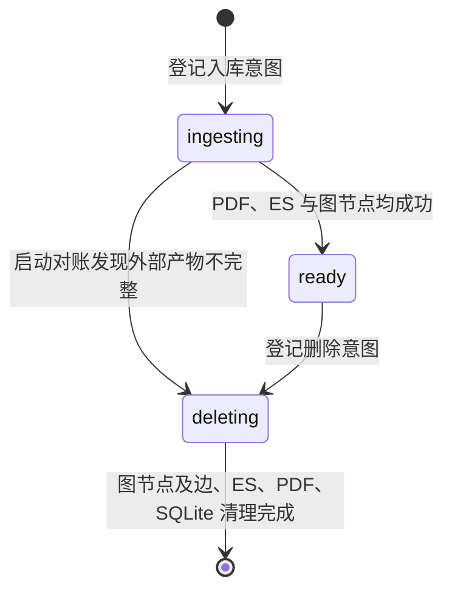

# 合同 SQLite 元数据结构

> **用途：** 本文定义正式合同在 SQLite 中的轻量文件目录、合同内容摘要、用户注意事项、入库状态，以及它与处理版 PDF、Elasticsearch 文档之间的一致性边界。

完整 Core、Clause、分类场景和向量仍以[合同 Elasticsearch 文档结构](contract-elasticsearch-document.md)为准；三处持久化的编排见[复核后合同正式入库](../../capability/application/contract-ingestion.md)。

---

## 存储位置与职责

默认数据库文件为 `data/abstract/contracts.db`，可通过 `CONTRACT_METADATA_DATABASE_FILE` 修改；相对路径按项目根目录解析。初始化会创建父目录、`contracts`、类别相关表、`contract_notes` 表及相应索引，并启用 WAL。数据库运行文件不进入版本控制。

SQLite 是文件选择和文件管理的权威目录。普通业务只读取 `ready` 记录，不需要访问 Elasticsearch。SQLite 同时保留可直接展示的类别摘要和可按稳定类别身份筛选的关系表。四种存储的职责固定如下：

| 存储 | 职责 |
| --- | --- |
| SQLite | 合同名称、类别摘要、签订日期、文件地址、审核人、落库时间、入库状态，以及合同内容摘要和用户注意事项（摘要目前仅初始化字段；注意事项已提供独立读写接口）。 |
| `data/contract` | 处理版 PDF 字节。 |
| Elasticsearch | 完整分类、Core、Clause、向量和入库审计。 |
| Neo4j | 合同 ID 节点及后续人工维护的关联边，见[合同关联图存储契约](contract-graph.md)。 |

[已入库合同元数据接口](../../api/contract.md#获取所有已入库合同元数据)复用 `list_ready()`，向所有已登录审核人提供共享正式目录，只投影七个公开字段，不暴露内部入库状态与尝试标识。

`document_id` 是处理版 PDF 字节的 64 位小写 SHA-256，同时作为 SQLite 主键、`data/contract/<document_id>.pdf` 文件名和 Elasticsearch `_id`。

---

## 表结构

SQLite 使用 `contracts`、`contract_category_metadata`、`contract_category_assignments` 和 `contract_notes` 四张表。每个连接都开启 `PRAGMA foreign_keys = ON`，使合同删除时能同事务级联清理类别关联及注意事项。

### 合同目录

`contracts` 表字段如下：

| 字段 | 类型 | 约束与含义 |
| --- | --- | --- |
| `document_id` | `TEXT` | 主键；统一关联 SQLite、PDF 和 ES。 |
| `file_name` | `TEXT` | 用户最终确认的展示名称。 |
| `summary` | `TEXT NULL` | 当前合同内容的单份摘要；暂未生成时为 `NULL`，非空值不允许空字符串或纯空格。 |
| `category` | `TEXT` | 模型命中类别 code 摘要；多类别以 ` / ` 连接，未映射时保存类型说明。 |
| `contract_time` | `TEXT NULL` | 最终 Core `signing_date` 规范化后的 `YYYY-MM-DD`；缺失时为 `NULL`。 |
| `file_uri` | `TEXT` | 唯一的根相对地址 `/<document_id>.pdf`。 |
| `reviewer` | `TEXT` | 当前登录审核人的名称。 |
| `ingested_at` | `TEXT` | 带时区的 ISO 8601 入库时间。 |
| `status` | `TEXT` | `ingesting`、`ready` 或 `deleting`。 |
| `ingestion_id` | `TEXT` | 单次入库尝试标识，防止旧尝试覆盖新状态。 |

`category` 使用“多类别 code 以 ` / ` 连接，未映射时保存类型描述”的投影规则，前端可通过类别列表接口将 code 映射为中文名称。类别筛选必须使用关联表，不对该文本做模糊匹配。完整分类场景仍只保存在 Elasticsearch。`contract_time` 不从文件名推断；入库边界仅接受完整且合法的年月日，并将 `YYYY-M-D`、`YYYY/M/D`、`YYYY.M.D` 或中文年月日统一为 `YYYY-MM-DD`。SQLite 与 Elasticsearch 写入同一标准值。

类别同步后会按关联表的 `position` 顺序，将已有合同摘要幂等更新为 code 拼接；也可调用 `normalize_category_summaries()` 单独迁移。无关联的历史记录先尝试按已知名称或 code 完整回填关联，无法识别时保持原值，不猜测。新写入只要包含类别关联，就从关联 code 生成摘要。ES 仍保留原有分类对象的 code/name 字段；启动对账从其中的 code 生成摘要，无需改写 ES 文档。

### 合同内容摘要

`contracts.summary` 与合同是一对一关系，直接融入元数据表，不另建摘要表，也不使用会话 FIFO 摘要记录。该字段与 `category` 类别摘要及类别关联中的 `reasoning_summary` 含义不同：它描述合同文件的主要内容，而不是分类结论或分类理由。

合同概览子图生成摘要并通过 SSE、快照提供审核初值；正式入库请求必填 `summary`，最终以用户提交内容为准，允许修改自动摘要。`file_name` 与 `summary` 均去除首尾空白并拒绝空值；摘要最多 3000 个字符。

`ContractMetadata.summary` 随 `begin_ingestion` 在同一事务写入 `contracts.summary`，同文档重试或更新时使用本次提交值覆盖，沿用现有 ingesting/ready 状态控制。摘要不写入 ES，目录列表不返回全文。旧合同仍允许 `NULL`，不自动回填；`get_summary(document_id)` 仅读取 ready 合同的已存储摘要，详见[摘要查询接口](../../api/contract.md#获取合同内容摘要)。


### 合同摘要向量

正式入库仅对用户确认的摘要独立向量化，合同名称保留为 `file_name` 原文，不参与编码、不保存名称向量，也不与摘要融合。

| 字段 | SQLite 类型 | 含义 |
| --- | --- | --- |
| `summary_embedding` | `BLOB` | 摘要的 L2 归一化向量，小端 float32。 |
| `summary_embedding_model` | `TEXT` | 编码模型名称。 |
| `summary_embedding_version` | `TEXT` | 指令版本 `contract-summary-v1`。 |
| `summary_embedding_dimensions` | `INTEGER` | 向量维度；BLOB 长度为维度乘以 4。 |

`app/service/contract_summary_embedding.py` 的 `embed_contract_summary(summary, settings)` 只接收摘要。ChatML 的 user 部分为去除首尾空白的摘要正文，不加 `summary:`；system 指令为：

```text
Represent this contract summary for retrieval. Emphasize the contract identity,
transaction subject, purpose and key terms. Preserve conditions, negation and uncertainty.
Use only the supplied information; do not add unstated facts.
```

指令强调合同身份、交易标的、用途及关键约定，保留条件、否定和不确定性。复用现有模型配置和全局配额，校验模型、数量、维度、有限数值和非零范数后归一化。编码失败时不开始持久化。

`begin_ingestion(metadata, summary_embedding=...)` 在同一事务保存原文和摘要向量；不带编码的底层写入清除旧摘要向量，避免内容错配。`get_summary_embedding(document_id)` 只读取 ready 合同，未编码返回 `None`。普通 HTTP 返回不公开向量。

初始化增加摘要向量字段，并移除旧 `overview_embedding*` 和 `file_name_embedding*` 字段。旧合并向量不能视为摘要向量，名称和摘要原文保留，新摘要向量留空；启动不调用模型回填。已有独立摘要向量原样保留。删除合同同时删除向量。后端加载代码并初始化后才更新实际数据库；本次未直接迁移运行中数据库。

测试覆盖仅摘要输入、非法编码响应、旧字段清理、独立摘要向量保留、原子替换和正式入库链路；未执行真实模型召回质量实验。

---

## 状态与可见性



- `ingesting`：入库未全部确认；不进入普通目录，保留至重试或启动恢复。
- `ready`：合同入库已完成，Neo4j 中存在对应身份节点。
- `deleting`：删除意图已提交，外部清理可能部分完成；对普通业务不可见，只能继续删除，禁止被新入库覆盖或重新发布。

状态本身是持久化恢复记录，无需另设内存重试队列。成功清理后才删除 SQLite 行及关联记录。

SQLite 事务不会跨越文件 I/O 或 ES 网络请求。它只原子登记一次尝试或切换状态，避免长时间占用 SQLite 写锁。

应用初始化时会将旧表的 `failure_reason` 和 `updated_at` 字段移除，清理历史 `failed` 记录，并保留有效元数据并将状态约束扩展为 `ingesting`、`ready`、`deleting`；父表重建暂时关闭外键级联，事务内保留注意事项、摘要及类别关联，并校验外键完整性后恢复外键检查。历史非空 `contract_time` 同时幂等规范为 `YYYY-MM-DD`；不完整或非法日期会中止启动并指明 `document_id`，不会猜测。现有 `contracts` 缺少 `summary` 时自动幂等增列，保留原数据并将旧行置为 `NULL`；重复初始化不覆盖已保存摘要或注意事项。全新数据库直接创建摘要字段及注意事项表。已存在的类别关联表会自动补充 `reasoning_summary` 字段。类别元数据同步后，对还没有关联行的旧合同，程序仅在 `category` 展示摘要能够完整匹配当前权威类别名称时回填关联；这些回填关联的推理摘要为空。未映射或无法无损识别的旧值保持无关联，不猜测类别。

---

## 启动对账

应用开始接收请求前先建立 Neo4j `Contract.document_id` 唯一约束，再扫描所有非 `ready` 记录：

1. `deleting` 继续按图节点及边 → ES → PDF → SQLite 清理，不能转回 `ready`。
2. `ingesting` 核验 PDF 哈希与 ES 中的名称、地址、审核人、时间、类别及签订日期；匹配后补建图节点并发布 `ready`，缺失或不匹配时转入 `deleting` 清理。
3. 为所有已存在的 `ready` 合同幂等补建节点，不改动既有关联。
4. 外部服务不可达或恢复失败中止启动，保留恢复入口。

各存储不共享事务，一致性由 SQLite 状态、固定文档身份、幂等操作和启动对账协调。实现与失败边界见[合同正式入库](../../capability/application/contract-ingestion.md)。

---

## 摘要全文索引

`contract_summaries_fts` 使用 Lindera（Jieba）索引摘要，首次初始化回填，增删改由事务触发器同步。已与独立摘要向量共同用于[摘要混合检索](../workflow/contract-communication/contract-summary-search.md)。

---

## 名称全文索引

`contract_names_fts` 仅索引合同名称，使用 Lindera（Jieba），初始化回填历史名称，触发器同步增删改。名称不向量化；查询契约见[合同名称检索](../workflow/contract-communication/contract-name-search.md)。
