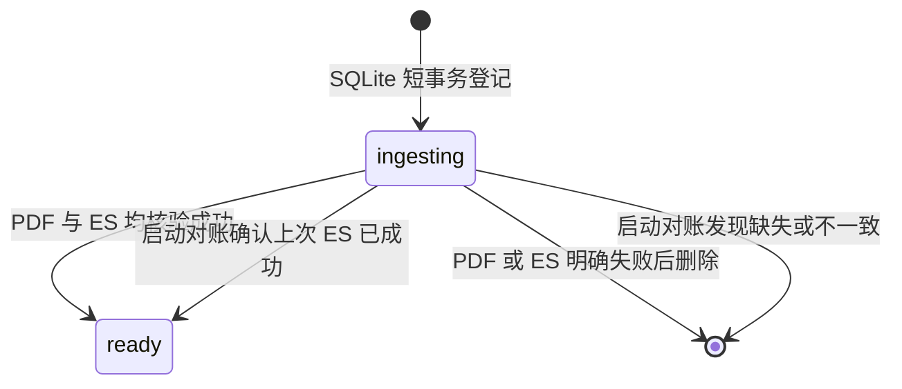

# 合同 SQLite 元数据结构

> **用途：** 本文定义正式合同在 SQLite 中的轻量文件目录、入库状态，以及它与处理版 PDF、Elasticsearch 文档之间的一致性边界。

完整 Core、Clause、分类场景和向量仍以[合同 Elasticsearch 文档结构](contract-elasticsearch-document.md)为准；三处持久化的编排见[复核后合同正式入库](../../capability/application/contract-ingestion.md)。

---

## 存储位置与职责

默认数据库文件为 `data/abstract/contracts.db`，可通过 `CONTRACT_METADATA_DATABASE_FILE` 修改；相对路径按项目根目录解析。初始化会创建父目录、`contracts` 表和状态索引，并启用 WAL。数据库运行文件不进入版本控制。

SQLite 是文件选择和文件管理的权威目录。普通业务只读取 `ready` 记录，不需要访问 Elasticsearch。SQLite 同时保留可直接展示的类别摘要和可按稳定类别身份筛选的关系表。三种存储的职责固定如下：

| 存储 | 职责 |
| --- | --- |
| SQLite | 合同名称、类别摘要、签订日期、文件地址、审核人、落库时间和入库状态。 |
| `data/contract` | 处理版 PDF 字节。 |
| Elasticsearch | 完整分类、Core、Clause、向量和入库审计。 |

[已入库合同元数据接口](../../api/contract.md#获取所有已入库合同元数据)复用 `list_ready()`，向所有已登录审核人提供共享正式目录，只投影七个公开字段，不暴露内部入库状态与尝试标识。

`document_id` 是处理版 PDF 字节的 64 位小写 SHA-256，同时作为 SQLite 主键、`data/contract/<document_id>.pdf` 文件名和 Elasticsearch `_id`。

---

## 表结构

SQLite 使用 `contracts`、`contract_category_metadata` 和 `contract_category_assignments` 三张表。每个连接都开启 `PRAGMA foreign_keys = ON`，使合同删除时能同事务级联清理类别关联。

### 合同目录

`contracts` 表字段如下：

| 字段 | 类型 | 约束与含义 |
| --- | --- | --- |
| `document_id` | `TEXT` | 主键；统一关联 SQLite、PDF 和 ES。 |
| `file_name` | `TEXT` | 用户最终确认的展示名称。 |
| `category` | `TEXT` | 模型命中类别 code 摘要；多类别以 ` / ` 连接，未映射时保存类型说明。 |
| `contract_time` | `TEXT NULL` | 最终 Core `signing_date` 规范化后的 `YYYY-MM-DD`；缺失时为 `NULL`。 |
| `file_uri` | `TEXT` | 唯一的根相对地址 `/<document_id>.pdf`。 |
| `reviewer` | `TEXT` | 当前登录审核人的名称。 |
| `ingested_at` | `TEXT` | 带时区的 ISO 8601 入库时间。 |
| `status` | `TEXT` | `ingesting` 或 `ready`。 |
| `ingestion_id` | `TEXT` | 单次入库尝试标识，防止旧尝试覆盖新状态。 |

`category` 使用“多类别 code 以 ` / ` 连接，未映射时保存类型描述”的投影规则，前端可通过类别列表接口将 code 映射为中文名称。类别筛选必须使用关联表，不对该文本做模糊匹配。完整分类场景仍只保存在 Elasticsearch。`contract_time` 不从文件名推断；入库边界仅接受完整且合法的年月日，并将 `YYYY-M-D`、`YYYY/M/D`、`YYYY.M.D` 或中文年月日统一为 `YYYY-MM-DD`。SQLite 与 Elasticsearch 写入同一标准值。

类别同步后会按关联表的 `position` 顺序，将已有合同摘要幂等更新为 code 拼接；也可调用 `normalize_category_summaries()` 单独迁移。无关联的历史记录先尝试按已知名称或 code 完整回填关联，无法识别时保持原值，不猜测。新写入只要包含类别关联，就从关联 code 生成摘要。ES 仍保留原有分类对象的 code/name 字段；启动对账从其中的 code 生成摘要，无需改写 ES 文档。

### 类别元数据

`contract_category_metadata` 保存用于外键和筛选的精简类别身份：

| 字段 | 类型 | 约束与含义 |
| --- | --- | --- |
| `category_id` | `INTEGER` | 自增主键；用于 SQLite 表间关联，并通过类别列表接口提供给前端。 |
| `code` | `TEXT` | 权威类别目录的稳定 code，全局唯一。 |
| `name` | `TEXT` | 类别标准中文名称，全局唯一。 |

应用启动时使用已经通过严格校验的 `ContractCategoryCatalog` 按 `code` 幂等插入或更新该表。SQLite 不复制 `meaning`、边界规则或专家卡片，这些仍以 `data/definition/contract-category` 为权威来源。

`SQLiteContractMetadataStore.list_categories()` 按 `category_id` 升序读取全表，不依赖合同关联记录；[合同类别列表接口](../../api/contract.md#获取合同类别列表)将其投影为前端选项。查询使用独立短连接，由同步 HTTP 处理函数在线程池内执行，不阻塞异步事件循环。

### 合同类别关联

`contract_category_assignments` 保存一份合同命中的零个或多个权威类别：

| 字段 | 类型 | 约束与含义 |
| --- | --- | --- |
| `document_id` | `TEXT` | 外键引用 `contracts.document_id`；合同删除时级联删除。 |
| `category_id` | `INTEGER` | 外键引用 `contract_category_metadata.category_id`；被引用类别不允许删除。 |
| `position` | `INTEGER` | 从 1 开始的稳定展示顺序，同一合同内唯一。 |
| `reasoning_summary` | `TEXT NULL` | 模型判定该合同命中当前类别的推理摘要；新入库关联必填，旧数据回填时因历史上未保存而可为空。 |

联合主键为 `document_id + category_id`，防止同一合同重复关联类别；同一 `document_id` 可有多行，表达一份合同同时属于多个类别。推理摘要属于此关联，而不属于全局类别元数据，因为同一类别对不同合同的命中理由不同。`category_id + document_id` 索引服务按类别反查合同。未映射合同不创建关联行，其自然语言类型描述继续保存在 `contracts.category` 供展示。

---

## 状态与可见性

- `ingesting`：本次元数据已提交，但 PDF 和 ES 尚未全部确认；不进入普通文件列表。
- `ready`：PDF 可按 `file_uri` 读取，且 ES 文档与本次元数据一致；可以对用户展示。

入库明确失败时，应用使用 `document_id + ingestion_id` 删除当前 SQLite 尝试记录，其类别关联由外键级联删除，失败原因只通过异常链与日志记录。

SQLite 事务不会跨越文件 I/O 或 ES 网络请求。它只原子登记一次尝试或切换状态，避免长时间占用 SQLite 写锁。

应用初始化时会将旧表的 `failure_reason` 和 `updated_at` 字段移除，清理历史 `failed` 记录，并保留 `ingesting` 与 `ready` 元数据。历史非空 `contract_time` 同时幂等规范为 `YYYY-MM-DD`；不完整或非法日期会中止启动并指明 `document_id`，不会猜测。已存在的类别关联表会自动补充 `reasoning_summary` 字段。类别元数据同步后，对还没有关联行的旧合同，程序仅在 `category` 展示摘要能够完整匹配当前权威类别名称时回填关联；这些回填关联的推理摘要为空。未映射或无法无损识别的旧值保持无关联，不猜测类别。

---

## 启动对账

应用开始接收请求前扫描所有非 `ready` 记录：

1. 按 `file_uri` 读取 PDF，并重新计算 SHA-256 与 `document_id` 比较。
2. 实时读取正式 ES 文档，核对 `document_id`、文件名、地址、审核人、落库时间、类别摘要和签订日期。
3. 两侧均匹配时将记录提交为 `ready`；缺失或内容不匹配时删除该尝试记录。
4. ES 无法访问时中止应用启动，不能在无法核验的情况下发布合同目录。

ES 写入返回异常时，服务还会立即实时读取同一 `_id`；文档与本次元数据完整匹配时按成功处理，否则删除 SQLite 尝试记录。启动对账进一步覆盖“ES 已成功但 SQLite 最终状态提交前进程退出”的不确定窗口。文件或 ES 的写入仍不属于 SQLite 事务，跨存储一致性依靠状态机、内容寻址、固定 ES `_id`、幂等重试和对账实现。
