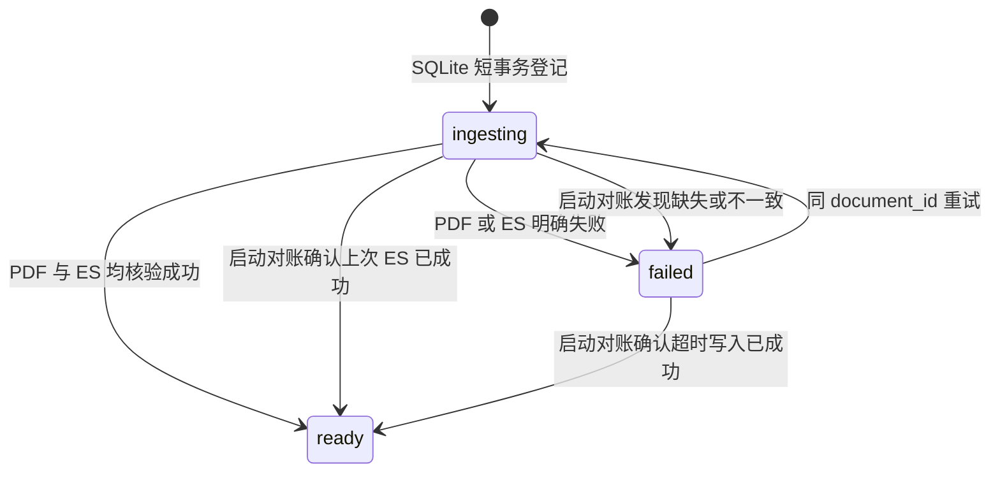

# 合同 SQLite 元数据结构

> **用途：** 本文定义正式合同在 SQLite 中的轻量文件目录、入库状态，以及它与处理版 PDF、Elasticsearch 文档之间的一致性边界。

完整 Core、Clause、分类场景和向量仍以[合同 Elasticsearch 文档结构](contract-elasticsearch-document.md)为准；三处持久化的编排见[复核后合同正式入库](../../capability/application/contract-ingestion.md)。

---

## 存储位置与职责

默认数据库文件为 `data/abstract/contracts.db`，可通过 `CONTRACT_METADATA_DATABASE_FILE` 修改；相对路径按项目根目录解析。初始化会创建父目录、`contracts` 表和状态索引，并启用 WAL。数据库运行文件不进入版本控制。

SQLite 是文件选择和文件管理的权威目录。普通业务只读取 `ready` 记录，不需要访问 Elasticsearch。三种存储的职责固定如下：

| 存储 | 职责 |
| --- | --- |
| SQLite | 合同名称、类别摘要、签订日期、文件地址、审核人、落库时间和入库状态。 |
| `data/contract` | 处理版 PDF 字节。 |
| Elasticsearch | 完整分类、Core、Clause、向量和入库审计。 |

`document_id` 是处理版 PDF 字节的 64 位小写 SHA-256，同时作为 SQLite 主键、`data/contract/<document_id>.pdf` 文件名和 Elasticsearch `_id`。

---

## 表结构

`contracts` 表字段如下：

| 字段 | 类型 | 约束与含义 |
| --- | --- | --- |
| `document_id` | `TEXT` | 主键；统一关联 SQLite、PDF 和 ES。 |
| `file_name` | `TEXT` | 用户最终确认的展示名称。 |
| `category` | `TEXT` | 模型命中类别名称摘要；多类别以 ` / ` 连接，未映射时保存类型说明。 |
| `contract_time` | `TEXT NULL` | 最终 Core `signing_date` 的原文值；缺失时为 `NULL`。 |
| `file_uri` | `TEXT` | 唯一的根相对地址 `/<document_id>.pdf`。 |
| `reviewer` | `TEXT` | 当前登录审核人的名称。 |
| `ingested_at` | `TEXT` | 带时区的 ISO 8601 入库时间。 |
| `status` | `TEXT` | `ingesting`、`ready` 或 `failed`。 |
| `ingestion_id` | `TEXT` | 单次入库尝试标识，防止旧尝试覆盖新状态。 |
| `failure_reason` | `TEXT NULL` | 非就绪记录的简洁失败原因。 |
| `updated_at` | `TEXT` | 当前状态最后更新时间。 |

`category` 只服务轻量列表展示和筛选，完整分类对象不在 SQLite 重复保存。`contract_time` 直接复用已经通过 Core 目录校验的 `signing_date`，不从文件名推断，也不改写原文日期格式。

---

## 状态与可见性

- `ingesting`：本次元数据已提交，但 PDF 和 ES 尚未全部确认；不进入普通文件列表。
- `ready`：PDF 可按 `file_uri` 读取，且 ES 文档与本次元数据一致；可以对用户展示。
- `failed`：入库未形成可发布结果；保留原因供重试和运维诊断，同样不进入普通文件列表。

SQLite 事务不会跨越文件 I/O 或 ES 网络请求。它只原子登记一次尝试或切换状态，避免长时间占用 SQLite 写锁。

---

## 启动对账

应用开始接收请求前扫描所有非 `ready` 记录：

1. 按 `file_uri` 读取 PDF，并重新计算 SHA-256 与 `document_id` 比较。
2. 实时读取正式 ES 文档，核对 `document_id`、文件名、地址、审核人、落库时间、类别摘要和签订日期。
3. 两侧均匹配时将记录提交为 `ready`；缺失或内容不匹配时标记为 `failed`。
4. ES 无法访问时中止应用启动，不能在无法核验的情况下发布合同目录。

ES 写入返回异常时，服务还会立即实时读取同一 `_id`；文档与本次元数据完整匹配时按成功处理，否则进入 `failed`。启动对账进一步覆盖“ES 已成功但 SQLite 最终状态提交前进程退出”的不确定窗口。文件或 ES 的写入仍不属于 SQLite 事务，跨存储一致性依靠状态机、内容寻址、固定 ES `_id`、幂等重试和对账实现。
