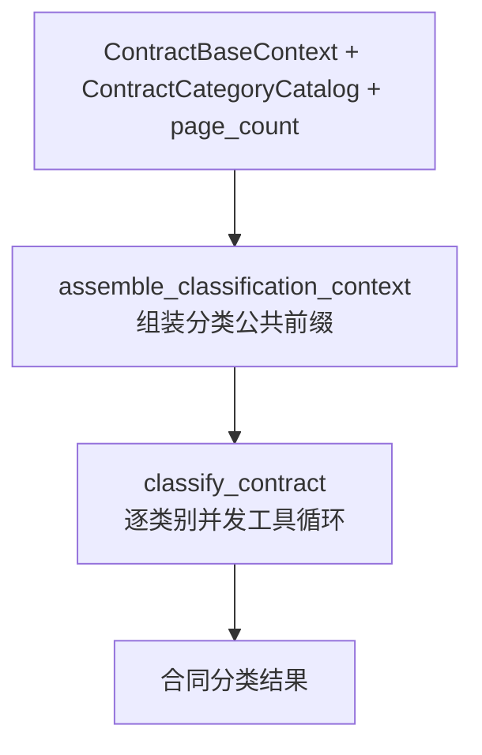

# 合同分类子图

> **用途：** 本文定义合同分类在主工作流中的输入、公共前缀、逐类别并发判定和输出边界。

---

## 子图定位

分类子图位于基础前缀组装节点与最终前缀组装节点之间。它读取已经稳定组装的 `ContractBaseContext`、启动期类别快照和 PDF 页数，对全部已知类别分别判断合同是否具备该类别的核心权利义务结构，并将紧凑分类结果交给最终前缀组装节点。



两个节点均已实现。类别定义与正反例由 FastAPI 启动生命周期全量加载为不可变 `ContractCategoryCatalog`，保存在 `application.state.contract_category_catalog`，再由业务用例作为显式输入传入主图和分类子图；子图不会在每份合同或每个类别请求中重复扫描 YAML，也不依赖可变的模块级全局目录。

---

## 分类公共前缀节点

`assemble_classification_context` 读取版本为 `contract-base-context-v3` 的不可变 `ContractBaseContext`，深复制其消息后，只在最后一个 user 内容块尾部追加分类公共规则，生成新的不可变 `ClassificationContext`。产物保留同一 `document_id`，独立记录 `classification-common-v7` 提示词版本和完整消息指纹，不修改或覆盖基础前缀。

公共规则统一说明单类别二元判断目标、原始 PDF 事实边界、权威定义与专家卡片优先级、多标签核心权利义务判断方法，以及三个工具的短期记忆和终止协议。同一复合交易分别完整满足多个类别的核心结构时允许多标签；相邻类别可能成立不能自动否定当前类别。分类只使用文档结构中的单元页码、文字锚点和摘要辅助导航，明确忽略 `unit_locations` 坐标，不裁剪页面，也不输出视觉位置；导航不足时回退完整相关页面。`think` 被明确约束为依次比较核心交换、成立条件、排除规则、相邻类别和证据强弱；输出顺序固定为证据、推理摘要、决定。

节点不读取或插入任何具体类别名称、`definition.yaml`、正反例、运行编号和工具历史。后续并行判别必须直接复用 `ClassificationContext`，再按稳定顺序追加当前类别定义、positive 卡片和 negative 卡片，使所有类别请求只从类别专属资料处开始分叉。

---

## 单类别任务尾部

`build_category_judgment_messages` 复制 `ClassificationContext.messages`，并把当前唯一目标类别作为一个新的 user 消息追加到公共前缀尾部。该消息使用独立的 `classification-category-v3` 版本，内容顺序固定为“当前类别完整权威定义 → 全部 positive 卡片 → 全部 negative 卡片”；同一输入必须产生完全相同的文本。该版本明确 `excludes` 只说明当前类别必要结构不成立的情形，并让 `distinguish_from` 同时表达单独命中和共同命中边界。

权威定义和每张专家卡片都以 YAML 代码块呈现。定义块先使用 YAML 注释逐项说明 `code`、`meaning`、`core_exchange`、边界和证据提示等字段；每张卡片也使用 YAML 注释说明 `scenario`、`evidence` 和 `reasoning_summary`。注释负责告诉模型字段职责，但不得改写对象中的权威取值。

三个资料区使用成对且唯一的显式边界：

```text
===== 当前目标类别权威定义：开始 =====
...
===== 当前目标类别权威定义：结束 =====

===== 当前目标类别专家正例：开始 =====
...
===== 当前目标类别专家正例：结束 =====

===== 当前目标类别专家反例：开始 =====
...
===== 当前目标类别专家反例：结束 =====
```

正反例区内按启动快照已经确定的文件名顺序列出全部卡片，并标注当前位置和总数。反例结束标记是该 user 消息的最后内容，不在示例之后追加会削弱边界的临时说明。公共前缀和类别任务使用两个 user 消息，使 `tool_placement="before_task"` 能把分类共享工具稳定放在二者之间。

---

## 单类别判别工具

分类节点私有的 function tools 位于 `subgraph/classification/tool.py`，只由正式判定节点使用，不从分类子图的公开入口导出。服务端 Schema 使用 `strict:false` 绕过 XGrammar，本地 Pydantic 仍禁止额外参数和宽松类型转换。

并发分类直接复用同一个 `ClassificationContext`、相同工具定义和稳定工具顺序，让 vLLM 在首批请求之间自然建立公共前缀缓存。隔离 A/B 实验表明显式单 token 分类预热只带来很小的计算 token 节约，未形成墙钟收益，因此分类子图不再额外发送预热请求。

每个单类别模型会话固定拥有三个工具：`think` 记录一段自然语言推理但不产生正式决定；`not_belong_to_category` 提交不命中决定并终止当前类别判别；`belong_to_category` 提交命中决定、生成下游命中卡片并终止当前类别判别。节点使用 `strict:false + tool_choice:auto`；提示词明确合法 XML 工具调用格式，程序每轮仍只接受恰好一个工具调用，绝不把自由文本解析为分类结果。

两个终止工具都按“证据 → 推理摘要 → 决定”组织参数。`not_belong_to_category` 的工具名称已经表达最终决定，因此只提交页面证据与不命中理由；`belong_to_category` 最后额外提交当前合同交易场景概括。证据只记录物理页码和可核对的短内容，不接受坐标或其他视觉位置。

`category_code` 与 `category_name` 不属于模型参数。程序必须从当前请求对应的权威 `definition.yaml` 注入这两个身份，并与模型提交的证据、推理摘要和场景概括共同构造 `CategoryMatchCard`。这样可以避免模型改写目标类别，也能让最终前缀和下游节点获得稳定、可审计的分类卡片。

工具成功反馈只保留是否接受和一句后续指引；错误反馈必须指出参数路径、具体问题和修正方向。参数缺失时要求补充，出现未定义参数时要求删除，类型或取值错误时要求按当前工具 Schema 修正。工具层只校验静态结构，页码是否超出当前 PDF 范围仍由后续节点结合文档状态校验。

`classify_contract` 按 MLLM 共享并发配额并发处理全部类别，每个类别拥有隔离的 messages、工具反馈和最多八轮短期记忆。没有恰好一个工具调用时，程序保留有限原始文本到私有审计，追加不回显原文的 XML 纠正反馈并提供两次恢复机会；未知工具、参数错误、连续 `think` 超限和终止证据页码越界也进入同一临时纠错记忆。后续动作通过全部校验后删除整条错误轨迹，只保留正确动作和私有审计；连续第三次协议失败才把该类别标记为 `failed`。终止工具引用的页码必须位于 `1..page_count`，单个类别失败不会取消其他类别任务。

当全部类别成功结束且没有任何 `matched` 时，节点额外发起一次 `unmapped-type-description-v3` 请求。该请求复用分类公共前缀，只提供一个 non-strict `describe_unmapped_type` 工具，并采用同一有界协议恢复，让模型按证据、推理摘要、最终描述生成一段简短中文交易类型说明。它不创建类别 code、不命名为 `other`、不写定义目录，也不触发第二套类别发现流程；`partial` 或 `failed` 不调用该兜底，因为此时不能确认正式目录确实没有覆盖合同。

兜底请求失败不改变 `unmapped` 状态，也不阻断下游：公开结果的 `unmapped_type_description` 保持 `null`，错误只记录在私有运行审计中。请求成功时，公开结果只携带最终描述字符串；证据和推理摘要留在 `classification_run`，避免继续放大下游前缀。

---

## 状态边界

- 输入：不可变的 `contract-base-context-v3` `ContractBaseContext`、启动期 `ContractCategoryCatalog` 和物理 `page_count`。
- 中间状态：不可变的 `ClassificationContext`，包含基础前缀与分类公共规则；只供分类子图内部使用。
- 私有输出：`ContractClassificationRun` 保存全部类别的 `matched`、`not_matched` 或 `failed` 终态、工具审计、用量、耗时，以及可选的未映射描述证据、错误和兜底工具审计，只供运行观测与实验分析。
- 下游输出：`ContractClassificationResult` 保存状态、目录与提示词版本、命中卡片、失败类别 code，以及 `unmapped` 时可选的一段类型描述，并追加到 `ContractPrefillContext`；未命中证据、工具历史和短期记忆不进入下游公共前缀。

紧凑结果状态含义如下：

| 状态 | 含义 |
| --- | --- |
| `classified` | 所有类别均成功结束，且至少命中一个类别。 |
| `unmapped` | 所有类别均成功结束但没有已知类别命中；额外生成一段类型描述供下游理解。 |
| `partial` | 至少一个类别失败，不能宣称类别覆盖完整；保留已确认命中。 |
| `failed` | 所有类别会话均失败。 |

> **前缀边界：** 单类别请求复用“基础前缀 + 分类公共规则”；三个下游任务复用“基础前缀 + 分类结果”。各上下文拥有独立指纹，不允许原地改写上游对象。

---

## 判定与汇总约束

分类节点读取启动阶段按[合同交易类别定义结构](../contract-category-definition.md)建立的 `ContractCategoryCatalog` 内存快照，并为每个类别并行发起一次独立判断。每次请求只注入当前类别对象中的权威定义、positive 正例和 negative 反例，判断合同是否具备当前类别要求的完整核心结构；类别卡片只用于边界校准，不能覆盖权威定义。

所有类别判断必须直接复用同一个 `ClassificationContext`。单类别结果只表达 `matched` 或 `not_matched`，不得在看不到其他完整类别定义时判断主类别、次类别或并列主类别。多个 `matched` 是合法结果，不需要为了得到唯一类别而互相消解；全部类别均未命中时，由分类结果状态表达 `unmapped` 并附带自然语言类型描述，不创建 `other` 类别。

分类提示词必须遵循[提示词工程规范](../../standard/prompt-engineering.md)，采用“证据 → 简洁推理摘要 → 最终分类决定”的输出顺序。分类输出只提供下游需要的稳定结论，不携带隐藏思维链或冗长工具历史。

---

## 依赖与验证

子图由 `app.agent.contract_extraction.subgraph.classification` 自行装配，主图只调用 `build_classification_subgraph`。当前最小验证包括：

- 子图严格按 `assemble_classification_context` → `classify_contract` 排列。
- 输入 `ContractBaseContext` 不被修改。
- 相同基础前缀重复组装时，`ClassificationContext` 消息和指纹完全一致。
- 所有并发分类请求携带相同的三个工具、固定工具顺序和同一公共消息前缀，不插入独立分类预热请求。
- 正式请求显式使用 `before_task`，并把工具稳定放在公共消息与类别任务消息之间。
- 单类别页码错误进入短期记忆后可以修正，命中身份始终由程序注入。
- 全部类别未命中时只额外调用一次描述工具，公开结果只保留类型描述字符串。
- 私有 `classification_run` 与下游 `classification` 结果严格分离。
- 主图顺序严格为“基础组装 → 分类 → 最终前缀组装”。
