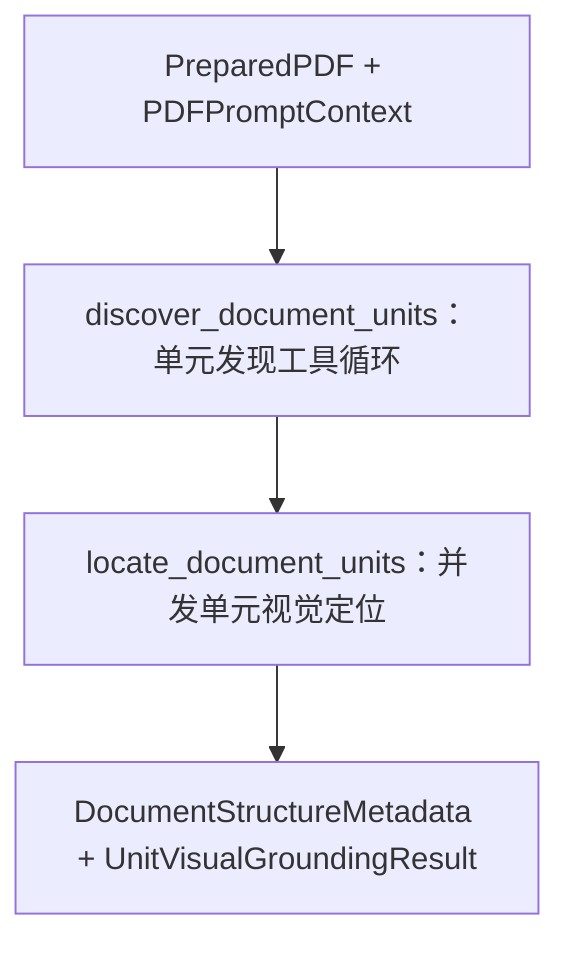

# PDF 预处理子图的文档结构与视觉定位节点

> **用途：** 本文定义 PDF 预处理子图内部的单元发现职责，以及后置视觉定位节点的当前边界。

---

## 节点目标

结构分析模型只完成两项任务：

1. 识别整份合同主要讨论的内容。
2. 将合同按宏观语义划分为连续内容单元，确定每个单元从哪里开始、在哪里结束。

本节点不执行完整 OCR，不提取正式字段，不逐条拆分法律条款，也不生成供检索使用的最终合同摘要。它产生的页面地图供字段、条款和摘要子图共同使用，减少各分支对合同整体结构的重复判断和方向偏差。

---

## 节点拓扑



`discover_document_units` 使用异步 `AsyncOpenAI` 适配器执行受工具状态机约束的单元发现循环，并生成不含坐标的语义结构。`locate_document_units` 随后为所有单元并发建立独立工具会话，把完整定位结果写入 `DocumentStructureMetadata.unit_locations`。发现与定位的详细审计分别保留在预处理子图私有的 `unit_discovery` 和 `unit_grounding` 状态中。

---

## 单元发现工具

工具定义位于 `app/agent/contract_extraction/subgraph/preprocessing/document_structure/tool.py`。它们只属于预处理子图的结构发现节点，不从子图包或合同抽取 Agent 的 `__init__.py` 导出，外部服务也不应直接调用。

| 工具 | 可用阶段 | 职责 | 关键参数 |
| --- | --- | --- | --- |
| `summary` | 仅首轮 | 形成合同整体认识 | `evidence → reasoning_summary → decision` |
| `think` | 后续轮次 | 记录下一步行动或边界疑点 | 单一自然语言 `reason` |
| `generate_unit` | 后续轮次 | 每次提交一个宏观连续单元 | `evidence → reasoning_summary → decision` |
| `finish` | 后续轮次 | 请求结束单元发现 | 自然语言 `reason` |

首轮只传递 `summary`；程序接受该调用后，不再向模型传递 `summary`，后续只传递 `think`、`generate_unit` 和 `finish`。所有轮次均使用 `tool_choice="auto"`，工具可见性仍由状态机决定，提示词只负责说明业务语义和粒度规则。

四个函数工具均使用 `strict: false`，配合 `tool_choice="auto"` 绕过本地 vLLM 的 XGrammar 结构化解码路径。程序不会把 `auto` 产生的普通文本当作结构化结果：若一轮没有恰好一个工具调用，原始普通文本仅截断保存在私有审计中，短期记忆临时加入该响应和不回显原文的 XML 格式纠正要求；连续两次纠正机会仍失败时显式终止。模型成功纠正后立即删除这段错误响应和恢复反馈，不让它们继续分散注意力。正常工具调用仍使用拒绝额外字段的 Pydantic 契约校验参数，并校验页码、非空文本和页面边界顺序等业务语义，再把接受或拒绝结果写回短期上下文。`finish` 只是终止请求，程序仍检查至少一个有效单元和全部物理页面跨度覆盖，再决定是否真正退出。

工具反馈只有 `ok` 和 `message`。成功反馈说明已完成的状态变化和下一步；错误反馈在同一个 `message` 中依次说明错误字段路径、具体问题和可执行改进方向，最多保留三个关键校验错误。错误码、重试标志和结构数据保留在程序内部，不重复占用模型上下文。

`unit_id` 由程序在接受 `generate_unit` 后按顺序生成，不交由模型提供，避免重复和跳号。模型的 assistant 工具调用和程序 tool 反馈通过 `tool_call_id` 逐轮追加，形成节点短期记忆。连续 `think`、最大轮次、越界页码、证据不在单元跨度内、跨页重叠、重复单元、单元过多和提前 `finish` 均有程序保护。

本地 vLLM 使用 `qwen3_xml` 时，嵌套对象可能以 JSON 字符串出现在顶层 XML 参数中；解析器只对形如 JSON 容器的字符串进行兼容解码，然后仍执行同一 Pydantic 契约，不绕过语义校验。

---

## 提示词与请求

节点提示词归属于 `preprocessing/document_structure/prompt/`，当前版本为 `document-structure-unit-discovery-v11`。消息通过预处理子图的唯一构造器复用“公共阅读规范 + PDF 页面”，结构发现任务只追加在页面之后。模型可见任务以已有完整 PDF、当前导航结构目标和下一步工具动作表达，不使用上下游节点或视觉定位节点等工程拓扑术语。

`discover_document_units` 显式传递 `tool_placement=after_task`，使首轮 `summary` 工具集和后续单元发现工具集都位于“PDF 页面 + 结构发现任务”之后、assistant/tool 短期历史之前。工具集随状态机轮次变化时只截断任务之后的缓存，不会在 PDF 公共前缀之前造成分叉。具体模板契约见 [vLLM 自定义聊天模板](../../capability/vllm-chat-template.md)。

证据只保留足以证明主题或边界的短片段，单条通常不超过 120 个汉字，禁止复制整页、整段条款或完整主体联系方式。请求固定关闭 thinking channel，业务上的证据、简洁推理摘要和决定仍按工具参数顺序表达。

当前节点直接读取预处理子图生成的唯一完整 PDF 前缀，不存在跨批摘要或跨批单元合并。

---

## 输入与事实边界

节点只读接收上游预处理产物。物理页码、PDF 页面尺寸、旋转角度、文本层状态、渲染尺寸、缩放比例和视觉 token 均由程序生成，模型不得重复推断或覆盖。具体页面事实见[PDF 预处理子图](pdf-preprocessing.md)。

模型负责合同主题、内容单元、可核对证据、边界依据和不确定性。结构 Schema 只固定“如何描述”，不预定义合同必须有哪些业务主题、页面角色或单元名称。

---

## 输出顺序

模型输出必须遵循[提示词工程规范](../../standard/prompt-engineering.md)的结构化推理纪律。合同主题和每个内容单元均按以下顺序生成：

```text
证据 evidence
→ 简洁推理摘要 reasoning_summary
→ 最终决定 decision
```

证据至少包含物理页码和可核对的短原文；边界推理说明为什么在当前锚点开始或结束；最终决定再给出名称、摘要和跨度。不得输出隐藏思维链、草稿或冗长自言自语。

---

## 合同主题

合同主题是面向结构导航的简短概览，不替代摘要子图。建议契约如下：

```yaml
evidence:
  - page_number: 1
    kind: text
    content: "买卖合同"
  - page_number: 1
    kind: text
    content: "加热台 ET-3030"
reasoning_summary: "标题和标的表格共同表明合同交易性质与主要标的。"
decision:
  title: "买卖合同"
  subject: "ET-3030 加热台采购"
  summary: "合同讨论加热台采购及相关履约、责任和签署事项。"
```

---

## 宏观内容单元

内容单元服务于下游导航，不是最小条款。编号、自然段或换页本身不能触发拆分；只有整体功能、高层级章节、独立附件或布局用途明显变化时才建立新单元。相邻编号条款若共同构成履约与责任区域，应合并为一个宏观单元，并可记录其中包含的编号范围。

```yaml
# unit_id 由程序接受工具调用后生成
evidence:
  - page_number: 1
    kind: text
    content: "（2）制造厂商"
  - page_number: 1
    kind: text
    content: "（11）仲裁"
reasoning_summary: "连续内容共同讨论履行和责任，从首个履约编号开始，在签署区域之前结束。"
decision:
  label: "合同履行与责任约定"
  summary: "约定制造、交付、付款、运输、质保、迟延责任和争议处理。"
  span:
    start:
      page_number: 1
      anchor_kind: text
      anchor: "（2）制造厂商"
      inclusion: inclusive
    navigation_anchors: []
    end:
      page_number: 1
      anchor_kind: text
      anchor: "签署区域"
      inclusion: exclusive
```

单元数量接近编号条款数量、大量单元只有一条短证据，或相邻单元具有相同下游用途时，应视为可能过细并要求归并。具体条款边界由条款提取子图处理。

---

## 语义边界

`top`、`middle`、`lower` 不能成为权威边界。单元发现阶段使用“开始边界 + 有序导航锚点 + 结束边界”表达连续语义范围：

```yaml
span:
  start:
    page_number: 2
    anchor_kind: text
    anchor: "第三条 交付与验收"
    inclusion: inclusive
  navigation_anchors:
    - page_number: 3
      anchor_kind: text
      anchor: "交付与验收条款续页"
    - page_number: 3
      anchor_kind: text
      anchor: "右栏：付款条件"
  end:
    page_number: 4
    anchor_kind: text
    anchor: "第五条 保密义务"
    inclusion: exclusive
```

单元发现工具不再接收 `bbox` 或 `anchor_bbox`。这能让结构模型专注语义切分，并避免把复合工具调用中的粗略坐标误当成可靠定位结果。文本锚点不可用时，可以使用视觉锚点及其简短描述。

`start` 与 `end` 始终是权威边界。`navigation_anchors` 是必填但可为空的列表，只服务于后续视觉模型沿阅读顺序定位，不改变连续范围：

- 普通单页单元通常使用空列表，视觉定位可以用一个框同时覆盖 start 和 end。
- 跨页延续、双栏换栏或复杂版式可以提供少量中间锚点，不能把每条条款或自然段都转成锚点。
- 模型只提交页码、锚点类型和可核对内容；`anchor_id` 与 `order` 由程序根据 start、中间锚点、end 的顺序生成。
- 中间页面没有可靠文本或视觉锚点时保持为空，后续定位准备逻辑可以补充 `page_body` 虚拟锚点。

程序校验中间锚点位于起止页范围内、页码非递减，并且不重复 start、end 或其他中间锚点。同页锚点的视觉先后关系留给后置定位阶段验证。

---

## 视觉定位节点

`locate_document_units` 位于单元发现之后，代码内聚在 `document_structure/visual_grounding/`。节点为每个单元创建一个独立短期记忆工具循环，再通过同一个 MLLM 并发信号量调度所有单元；单元失败彼此隔离，只有成功执行 `finish` 的完整定位框才能提升为下游权威结果。

提示词版本为 `unit-visual-grounding-v3`，工具版本为 `unit-visual-grounding-tool-v2`：

| 工具 | 参数 | 职责 |
| --- | --- | --- |
| `think` | `reasoning` | 思考最早未覆盖锚点、阅读顺序和单栏或双栏布局，不写入定位结果。 |
| `draw_bbox` | `anchor_ids`、`page_number`、`bbox_2d` | 一次绘制一个单页框，并消费同页一个或多个连续锚点。 |
| `finish` | `reason` | 请求结束当前单元定位；程序仅在全部锚点已覆盖时接受。 |

定位准备逻辑按 `start → navigation_anchors → end` 生成稳定的 `anchor_id` 和连续 `order`；跨度内没有显式锚点的中间页面自动补充一个 `page_body` 锚点。所有视觉定位工具使用 `strict:false + tool_choice:auto`，绕过 vLLM XGrammar；工具参数仍由本地 Pydantic 与状态校验严格检查。合法 XML 工具调用格式同时写入任务说明。若一轮没有恰好一个工具调用，程序记录普通文本用于审计，但不把它回显给模型；恢复反馈遵循[Non-strict auto 工具恢复](../../standard/prompt-engineering.md#26-non-strict-auto-工具恢复)，明确说明“未生成合法工具调用”，给出 `<tool_call> → <function=...> → <parameter=...>` XML 模板并禁止 `工具名: JSON` 伪调用，最多恢复两次后将该单元标记为失败。模型成功纠正为恰好一个工具调用后，程序立即从短期记忆中删除此前的伪调用文本与纠正反馈，只在私有审计中保留故障轨迹。`draw_bbox` 使用 `[x_min, y_min, x_max, y_max]` 的 `0～1000` 单页归一化坐标。本地状态校验继续执行以下规则：

- 每次必须从最早未覆盖锚点开始，只能消费同页连续锚点。
- 一个框可以覆盖多个连续锚点，一个锚点不能被重复消费。
- 每次成功调用至少消费一个锚点，因此成功次数不超过锚点总数；失败调用不消耗额度。
- 同页同栏按从上到下绘制；只有新框位于前框右侧且横向不相交时，才允许从左栏底部回到右栏顶部。
- 完全重复坐标、跨页锚点合框、页码与锚点不一致、提前 `finish` 都返回包含错误位置与改进方向的最小反馈。

每个单元请求只选择 `start.page_number` 到 `end.page_number` 的连续页面，绝不发送跨度外页面。选中的每张图片仍通过公共页面构造器在图片前插入“第 N 页”标签；页面标签、图片和 `page_number` 工具参数使用同一物理页码。工具对全部会话相同并使用 `tool_placement=before_task`，动态单元描述位于工具之后，使页面集合相同的会话尽量共享长前缀。

单元会话达到最大轮次、模型请求失败或工具协议无法恢复时记为 `failed`，私有审计保留已经接受的部分框；对于 auto 未调用工具的恢复轮，审计还保留最多 1,000 个字符的普通文本，供实验定位原因。`DocumentStructureMetadata.unit_locations` 对失败单元只暴露错误状态，不暴露可能误导下游的半成品坐标。汇总状态按全部成功、部分失败、全部失败分别为 `completed`、`partial`、`failed`。

权威输出按 `unit_id` 与语义单元关联：

```yaml
unit_locations:
  - unit_id: unit-003
    status: located
    regions:
      - anchor_ids: [unit-003-anchor-001]
        page_number: 2
        bbox_2d: [50, 460, 950, 880]
      - anchor_ids: [unit-003-anchor-002, unit-003-anchor-003]
        page_number: 3
        bbox_2d: [50, 60, 950, 940]
    error: null
```

失败结果使用 `status: failed`、空 `regions` 和非空 `error`；调用轮次、工具反馈、用量与部分框只保存在私有 `UnitVisualGroundingResult`，不进入下游权威结构。

---

## 下游约束

结构结果追加在稳定的“阅读规范 + PDF 页面”之后，并置于三个业务子图各自任务之前，使三个分支继续共享尽可能长的前缀。

- 程序页面事实和单元原始顺序属于硬约束。
- 标题、原文证据和可核对锚点属于主要导航依据。
- 单元名称与摘要用于召回和定位，不能作为排除原始页面的唯一依据。
- `unit_locations.status=located` 的区域可以增强导航；失败单元必须回退到页码、锚点和原始 PDF。
- 下游不得静默修改结构结果；发现冲突时应记录并进入审核信息。

两类工具调用历史分别保留在预处理子图私有状态中；主图只接收包含完整 `unit_locations` 的最终 `document_structure` 结果。现有真实模型验证入口见[文档结构与视觉定位实验](../../../experiment/document-structure/README.md)。
