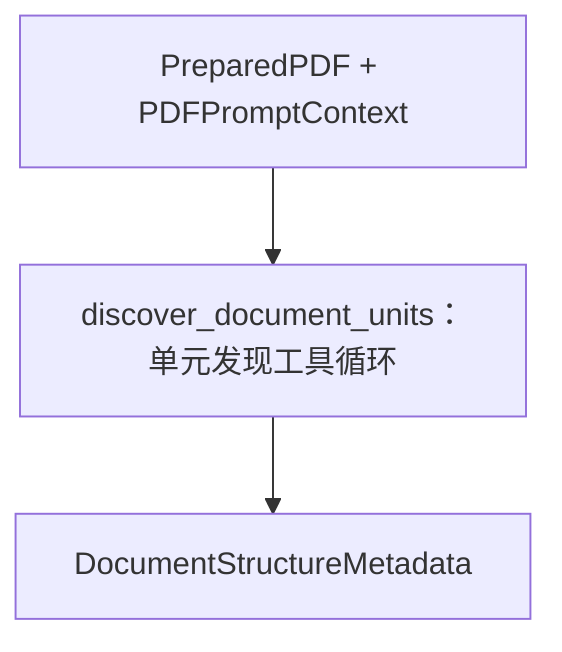

# PDF 预处理子图的文档结构发现节点

> **用途：** 本文定义 PDF 预处理子图内部 `discover_document_units` 节点的结构分析职责。

---

## 节点目标

结构分析模型只完成两项任务：

1. 识别整份合同主要讨论的内容。
2. 将合同按宏观语义划分为连续内容单元，确定每个单元从哪里开始、在哪里结束。

本节点不执行完整 OCR，不提取正式字段，不逐条拆分法律条款，也不生成供检索使用的最终合同摘要。它产生的页面地图供字段、条款和摘要子图共同使用，减少各分支对合同整体结构的重复判断和方向偏差。

---

## 节点拓扑



`discover_document_units` 是预处理子图的最后一个节点，使用异步 `AsyncOpenAI` 适配器执行受 strict function calling 约束的单元发现循环，并在成功结束时直接生成 `DocumentStructureMetadata`。运行审计保留在预处理子图私有的 `unit_discovery` 状态中，对外结构结果不包含主观置信度或复核占位状态。

---

## 单元发现工具

工具定义位于 `app/agent/contract_extraction/subgraph/preprocessing/document_structure/tool.py`。它们只属于预处理子图的结构发现节点，不从子图包或合同抽取 Agent 的 `__init__.py` 导出，外部服务也不应直接调用。

| 工具 | 可用阶段 | 职责 | 关键参数 |
| --- | --- | --- | --- |
| `summary` | 仅首轮 | 形成合同整体认识 | `evidence → reasoning_summary → decision` |
| `think` | 后续轮次 | 记录下一步行动或边界疑点 | 单一自然语言 `reason` |
| `generate_unit` | 后续轮次 | 每次提交一个宏观连续单元 | `evidence → reasoning_summary → decision` |
| `finish` | 后续轮次 | 请求结束单元发现 | 自然语言 `reason` |

首轮只传递 `summary`，并通过具名 `tool_choice` 强制调用。程序接受该调用后，不再向模型传递 `summary`；后续只传递 `think`、`generate_unit` 和 `finish`，使用 `tool_choice="required"` 并关闭并行工具调用。这样，工具可见性由状态机决定，提示词只负责说明业务语义和粒度规则。

四个函数工具均启用 `strict: true`，对象拒绝额外字段，所有声明字段都必须出现；确实允许未知的字段以显式 `null` 表达。服务端约束结构正确性后，程序仍使用 Pydantic 校验页码、非空文本、坐标范围、边界顺序等语义规则，并把接受或拒绝结果写回短期上下文。`finish` 只是终止请求，程序仍检查至少一个有效单元和全部物理页面跨度覆盖，再决定是否真正退出。

工具反馈只有 `ok` 和 `message`。成功反馈说明已完成的状态变化和下一步；错误反馈在同一个 `message` 中依次说明错误字段路径、具体问题和可执行改进方向，最多保留三个关键校验错误。错误码、重试标志和结构数据保留在程序内部，不重复占用模型上下文。

`unit_id` 由程序在接受 `generate_unit` 后按顺序生成，不交由模型提供，避免重复和跳号。模型的 assistant 工具调用和程序 tool 反馈通过 `tool_call_id` 逐轮追加，形成节点短期记忆。连续 `think`、最大轮次、越界页码、证据不在单元跨度内、跨页重叠、重复单元、单元过多和提前 `finish` 均有程序保护。

本地 vLLM 使用 `qwen3_xml` 时，嵌套对象可能以 JSON 字符串出现在顶层 XML 参数中；解析器只对形如 JSON 容器的字符串进行兼容解码，然后仍执行同一 Pydantic 契约，不绕过语义校验。

---

## 提示词与请求

节点提示词归属于 `preprocessing/document_structure/prompt/`，当前版本为 `document-structure-unit-discovery-v5`。消息通过预处理子图的唯一构造器复用“公共阅读规范 + PDF 页面”，结构发现任务只追加在页面之后。

证据只保留足以证明主题或边界的短片段，单条通常不超过 120 个汉字，禁止复制整页、整段条款或完整主体联系方式。请求固定关闭 thinking channel，业务上的证据、简洁推理摘要和决定仍按工具参数顺序表达。

当前节点直接读取预处理子图生成的唯一完整 PDF 前缀，不存在跨批摘要或跨批单元合并。

---

## 输入与事实边界

节点只读接收上游预处理产物。物理页码、PDF 页面尺寸、旋转角度、文本层状态、渲染尺寸、缩放比例和视觉 token 均由程序生成，模型不得重复推断或覆盖。具体页面事实见[PDF 预处理子图](pdf-preprocessing.md)。

模型负责合同主题、内容单元、可核对证据、边界依据和不确定性。结构 Schema 只固定“如何描述”，不预定义合同必须有哪些业务主题、页面角色或单元名称。

---

## 输出顺序

模型输出必须遵循[提示词工程规范](../../standard/prompt-engineering.md)的结构化推理纪律。合同主题和每个内容单元均按以下顺序生成：

```text
证据 evidence
→ 简洁推理摘要 reasoning_summary
→ 最终决定 decision
```

证据至少包含物理页码和可核对的短原文；边界推理说明为什么在当前锚点开始或结束；最终决定再给出名称、摘要和跨度。不得输出隐藏思维链、草稿或冗长自言自语。

---

## 合同主题

合同主题是面向结构导航的简短概览，不替代摘要子图。建议契约如下：

```yaml
evidence:
  - page_number: 1
    kind: text
    content: "买卖合同"
    bbox: null
  - page_number: 1
    kind: text
    content: "加热台 ET-3030"
    bbox: null
reasoning_summary: "标题和标的表格共同表明合同交易性质与主要标的。"
decision:
  title: "买卖合同"
  subject: "ET-3030 加热台采购"
  summary: "合同讨论加热台采购及相关履约、责任和签署事项。"
```

---

## 宏观内容单元

内容单元服务于下游导航，不是最小条款。编号、自然段或换页本身不能触发拆分；只有整体功能、高层级章节、独立附件或布局用途明显变化时才建立新单元。相邻编号条款若共同构成履约与责任区域，应合并为一个宏观单元，并可记录其中包含的编号范围。

```yaml
# unit_id 由程序接受工具调用后生成
evidence:
  - page_number: 1
    kind: text
    content: "（2）制造厂商"
    bbox: null
  - page_number: 1
    kind: text
    content: "（11）仲裁"
    bbox: null
reasoning_summary: "连续内容共同讨论履行和责任，从首个履约编号开始，在签署区域之前结束。"
decision:
  label: "合同履行与责任约定"
  summary: "约定制造、交付、付款、运输、质保、迟延责任和争议处理。"
  span:
    start:
      page_number: 1
      anchor_kind: text
      anchor: "（2）制造厂商"
      anchor_bbox: null
      inclusion: inclusive
    end:
      page_number: 1
      anchor_kind: text
      anchor: "签署区域"
      anchor_bbox: null
      inclusion: exclusive
```

单元数量接近编号条款数量、大量单元只有一条短证据，或相邻单元具有相同下游用途时，应视为可能过细并要求归并。具体条款边界由条款提取子图处理。

---

## 边界定位

`top`、`middle`、`lower` 只能作为展示信息，不能成为权威边界。开始和结束位置使用“物理页码 + 锚点 + 归一化坐标框”：

```yaml
start:
  page_number: 3
  anchor_kind: text
  anchor: "第五条 付款方式"
  anchor_bbox:
    x_min: 65
    y_min: 143
    x_max: 421
    y_max: 176
  inclusion: inclusive
```

`anchor_bbox` 使用具名的 `x_min`、`y_min`、`x_max`、`y_max`，每个坐标都位于 `0～1000`；无法可靠定位时传递 `null`，并在证据与推理摘要中说明可核对事实和未确定之处。映射回 PDF 或渲染图像时，必须使用对应页面自己的宽高。文本锚点不可用时，可以使用视觉锚点及其描述。

单元可以跨页，开始和结束分别引用自己的页面。程序至少校验页码范围、坐标范围、开始不晚于结束以及单元顺序；不能只依赖模型坐标判断边界正确性。

---

## 下游约束

结构结果追加在稳定的“阅读规范 + PDF 页面”之后，并置于三个业务子图各自任务之前，使三个分支继续共享尽可能长的前缀。

- 程序页面事实和单元原始顺序属于硬约束。
- 标题、原文证据和可核对锚点属于主要导航依据。
- 单元名称与摘要用于召回和定位，不能作为排除原始页面的唯一依据。
- 冲突、缺失坐标或未知边界必须允许下游回退查看原始 PDF。
- 下游不得静默修改结构结果；发现冲突时应记录并进入审核信息。

工具调用历史和候选单元保留在预处理子图私有 `unit_discovery` 状态中；主图只接收最终 `document_structure` 结果。现有真实模型验证入口见[文档结构发现实验](../../../experiment/document-structure/README.md)。
