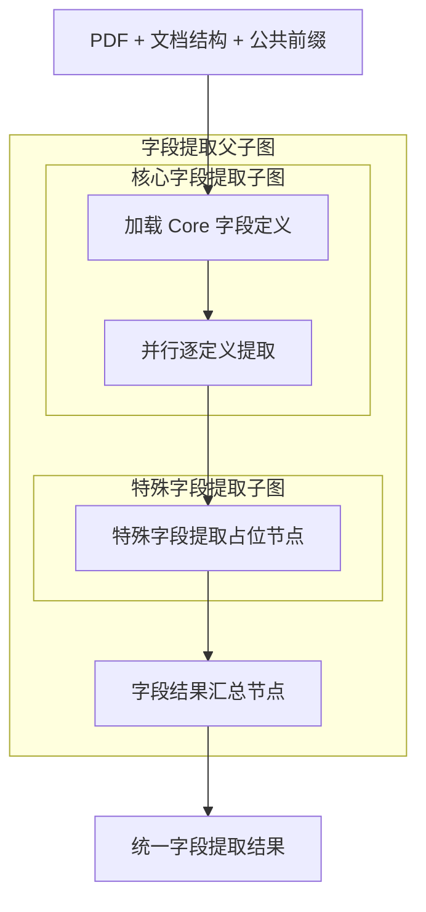

# 字段提取子图

> **用途：** 本文定义字段提取模块及其核心字段、特殊字段两个内部子图的结构边界。Core 已实现目录加载、并行单定义模型调用、扁平对象校验和基数状态机；Special 仍为占位结构。

字段模块是[合同信息抽取 Agent 工作流](../contract-extraction-agent-workflow.md)的三个并行下游模块之一。它复用预热后的公共前缀，但其内部两个子图按 Core → Special 顺序执行。

两个内部子图后续读取的动态定义必须遵循[模型提取对象定义结构](../field-definition.md)。该文档是对象基数、扁平基本类型属性和正负语义边界的权威来源。

---

## 拓扑



```text
PDF + 文档结构 + 公共前缀
  → 核心字段提取子图
  → 特殊字段提取子图（可读取核心字段结果）
  → 字段结果汇总
```

父子图只导出 `build_field_extraction_subgraph`。主工作流不直接引用两个内部子图，避免内部拓扑泄漏到外部编排层。

---

## 子图职责

| 子图 | 当前节点 | 后续职责 | 输出所有权 |
| --- | --- | --- | --- |
| 核心字段 | `load_core_field_definitions` → `extract_core_fields` | 加载稳定目录，并按对象定义并发执行独立工具循环 | `core_field_catalog`、`core_field` |
| 特殊字段 | `extract_special_field` | 根据合同类型和特殊字段目录提取扩展字段，可读取核心字段上下文 | `special_field` |

“特殊字段”当前对应项目全局设计中的固定 Attribute Extraction 边界，不表示允许模型临时创造字段，也不包含发现模式的 Attribute Candidate 治理。正式语义由后续字段契约确定。

---

## 状态流转

两个内部子图共同只读以下上游状态：

- `prepared_pdf`：经过动态预算处理的页面图像。
- `document_structure`：预处理阶段发现的权威文档结构。
- `prefill_context`：已完成 vLLM 预热的公共消息前缀。

核心字段子图产生 `core_field`。父子图随后将该结果额外传给特殊字段子图，使特殊字段提取能够复用主体、合同类型等稳定事实。特殊字段子图只能写入 `special_field`，不能改写核心字段结果。

Core 节点一按文件名排序读取 `data/definition/field/core/*.yaml`，校验一个文件只定义一种提取对象、`cardinality` 合法、属性只使用基本类型且名称不重复，并对文件名和原始字节计算目录指纹。

每个定义拥有隔离的短期消息历史，一个定义的思考、成功对象和错误反馈不会进入其他定义。每轮强制且只允许一个工具调用：

- 尚无成功对象时提供 `think`、`extract_object` 和 `abandon_extraction`。
- `single` 在第一个对象成功后自动结束，不需要额外终止调用。
- `multiple` 每次成功对象都会连同序号和紧凑 JSON 值写入工具反馈；后续轮改为提供 `think`、`extract_object` 和 `finish_extraction`，不再提供放弃工具。
- `finish_extraction` 只能在 `multiple` 至少有一个成功对象后使用，它是“已穷尽全部对象”的显式终止出口。

`extract_object.value` 根据 `properties` 动态生成 `additionalProperties: false` 的 strict 扁平对象 Schema。程序在本地二次校验必填属性、基本类型、有限数值、证据页码和理由结尾；对象或数组属性、未定义属性和完全重复对象均会被拒绝。

新定义契约在顶层提供 `name`、`aliases`、`meaning`、`excludes`、`cardinality` 和 `properties`，每个属性再定义名称、别名、基本类型、必填性和正负语义边界。提示词在 YAML 前先解释这些属性，并明确 `multiple` 是多次提交扁平对象，不是在一个属性中返回数组。

`merge_field_results` 只负责把两个私有结果包装为统一的 `field_extraction` 输出，不承担模型推理或字段校验。

---

## 当前实现边界

- 对象定义、Core/Attribute YAML、Core 提示词、动态工具和结果契约已统一为 `cardinality + properties`。
- Core 与 Special 的子图拓扑本轮未修改；Special 当前仍只有一个占位节点。
- `field_extraction/tool.py` 是两个字段子图共享的对象工具、动态 Schema 和本地校验唯一实现位置；Special 接入时不得复制工具定义。
- 第一版合同级 Core 与 Attribute YAML 均已建立；当前只有 Core 加载自己的目录。
- Core 输出包含目录指纹、提示词版本、定义基数、属性名称、一个或多个带独立证据和理由的扁平对象、终态、工具审计和 token 用量；失败时保留已成功的部分对象。
- 字段结果尚未形成 Elasticsearch 投影或专家审核契约。

---

## 后续扩展约束

1. 两个子图必须直接复用 `ContractPrefillContext.messages`，只在公共前缀末尾追加各自任务，以保持最大前缀匹配；Core 的所有并行字段也遵守同一规则。
2. Core 与 Special 规则应来自遵循[模型提取对象定义结构](../field-definition.md)的版本化机器契约，提示词不能成为唯一规则来源。
3. 每个对象必须保留原文证据、页码或位置，以及规范化结果；失败定义应保留已通过校验的部分对象。
4. Special 可以消费 Core 结果作为上下文，但最终仍以原始 PDF 为事实来源。
5. 两个内部子图的错误和审计信息应在字段结果汇总时完整保留。
