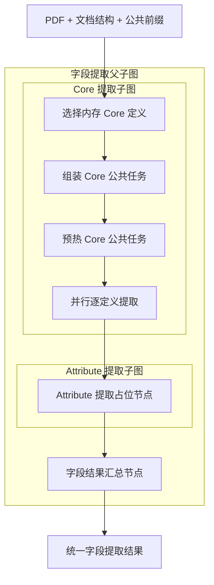

# 字段提取子图

> **用途：** 本文定义字段提取模块及其 Core、Attribute 两个内部子图的结构边界。Core 已实现启动快照选择、公共任务组装与预热、并行单定义模型调用、扁平对象校验和基数状态机；Attribute 仍为占位结构。

字段模块是[合同信息抽取 Agent 工作流](../contract-extraction-agent-workflow.md)的三个并行下游模块之一。它复用预热后的公共前缀，但其内部两个子图按 Core → Attribute 顺序执行。

两个内部子图后续读取的动态定义必须遵循[模型提取对象定义结构](../field-definition.md)。该文档是对象基数、扁平基本类型属性和正负语义边界的权威来源。

---

## 拓扑



```text
PDF + 文档结构 + 公共前缀
  → 核心字段提取子图
  → Attribute 提取子图（可读取 Core 结果）
  → 字段结果汇总
```

父子图只导出 `build_field_extraction_subgraph`。主工作流不直接引用两个内部子图，避免内部拓扑泄漏到外部编排层。

---

## 子图职责

| 子图 | 当前节点 | 后续职责 | 输出所有权 |
| --- | --- | --- | --- |
| Core | `select_core_definitions` → `assemble_core_context` → `prefill_core_context` → `extract_core` | 读取启动快照、预热稳定公共任务，并按对象定义并发执行独立工具循环 | `core_definitions`、`core_context`、`core_preheat`、`core` |
| Attribute | `extract_attribute` | 根据合同类型与 Attribute Profile 提取经过治理的扩展字段，可读取 Core 上下文 | `attribute` |

Attribute 表示 Core 之外经过专家确认的固定扩展字段，不允许模型临时创造字段，也不包含发现模式的 Attribute Candidate 治理。交易模式与业务领域 Profile 的选择将在后续实现，本轮只统一命名和状态边界。

---

## 状态流转

两个内部子图共同只读以下上游状态：

- `prepared_pdf`：经过动态预算处理的页面图像。
- `document_structure`：预处理阶段发现的权威文档结构。
- `prefill_context`：已追加分类结果并完成 vLLM 预热的最终公共消息前缀。
- `field_definition_catalog`：应用启动时一次性加载并严格校验的 Core 与 Attribute 不可变定义快照。

Core 子图产生 `core`。父子图随后将该结果额外传给 Attribute 子图，使 Attribute 提取能够复用主体、合同类型等稳定事实。Attribute 子图只能写入 `attribute`，不能改写 Core 结果。

`select_core_definitions` 只从 `FieldDefinitionCatalog.core` 选择已经按文件名稳定排序的定义及目录指纹，不执行文件 I/O。运行期间修改 YAML 不影响当前进程；需要显式重启服务才能形成新快照。

`assemble_core_context` 深复制 `ContractPrefillContext.messages`，只追加全部 Core 字段共同使用的任务规则、字段定义属性说明和合法 XML 工具调用格式，生成版本为 `core-common-v4` 的不可变 `CoreContext`。`prefill_core_context` 在其后追加一次性预热任务，使用异步单 token 请求写入 vLLM 前缀缓存；该任务不属于共享前缀。预热失败记录为 `degraded`，但不阻止后续字段提取尝试。模型可见文本只说明已获得合同和通用规则、当前尚缺唯一对象定义，以及收到定义后应执行的动作。

`extract_core` 为每个字段复制同一个 `CoreContext.messages`，再追加当前唯一字段 YAML。动态工具使用显式 `tool_placement=after_task`，因此实际 token 顺序为“最终合同前缀 → Core 公共规则 → 当前字段定义 → 当前字段工具 → 短期历史”。字段间差异只出现在当前字段定义处。

每个定义拥有隔离的短期消息历史，一个定义的思考、成功对象和错误反馈不会进入其他定义。请求使用 `strict:false + tool_choice:auto`，程序每轮仍只接受恰好一个工具调用：

- 尚无成功对象时提供 `think`、`extract_object` 和 `abandon_extraction`。
- `single` 在第一个对象成功后自动结束，不需要额外终止调用。
- `multiple` 每次成功对象都会连同序号和紧凑 JSON 值写入工具反馈；后续轮改为提供 `think`、`extract_object` 和 `finish_extraction`，不再提供放弃工具。
- `finish_extraction` 只能在 `multiple` 至少有一个成功对象后使用，它是“已穷尽全部对象”的显式终止出口。

`extract_object` 的参数顺序固定为 `evidence → reasoning → value`：证据负责可追溯事实，reasoning 只解释证据、规则和排除过程，`value` 是唯一正式提取决定。reasoning 不再重复 value JSON，也不因连接词或标点差异拒绝正确对象。`value` 根据 `properties` 动态生成 `additionalProperties: false` 的扁平对象 Schema。所有工具参数继续使用本地 Pydantic `strict=True`，程序二次校验必填属性、基本类型、有限数值和证据页码；`abandon_extraction` 与 `finish_extraction` 仍校验各自终止理由，防止状态语义含混。对象或数组属性、未定义属性和完全重复对象均会被拒绝。字段证据只保留物理页码和可核对短内容，不在对象提取会话中同时生成视觉坐标。

若模型输出普通文本、零个或多个工具调用，该轮只作为可恢复协议失败：有限原始文本写入私有审计，短期记忆追加统一 XML 纠正反馈；模型在两次机会内纠正后，程序移除错误响应与反馈，再继续正常对象状态机。连续第三次仍失败时才生成 `FailedCore`，并保留此前已成功提取的部分对象。

新定义契约在顶层提供 `name`、`aliases`、`meaning`、`excludes`、`cardinality` 和 `properties`，每个属性再定义名称、别名、基本类型、必填性和正负语义边界。提示词在 YAML 前先解释这些属性，并明确 `multiple` 是多次提交扁平对象，不是在一个属性中返回数组。

`merge_field_results` 只负责把两个私有结果包装为统一的 `field_extraction` 输出，不承担模型推理或字段校验。

---

## 当前实现边界

- 对象定义、Core/Attribute YAML、Core 提示词、动态工具和结果契约已统一为 `cardinality + properties`。
- Core 与 Attribute 保持串联拓扑；Attribute 当前仍只有一个占位节点。
- `field_extraction/tool.py` 是两个字段子图共享的对象工具、动态 Schema 和本地校验唯一实现位置；Attribute 接入时不得复制工具定义。
- 第一版合同级 Core 与 Attribute YAML 均已建立，并在应用启动时共同读入 `FieldDefinitionCatalog`；当前只有 Core 消费自己的内存集合。
- Core 输出包含目录指纹、公共任务预热结果、提示词版本、定义基数、属性名称、一个或多个带独立证据和理由的扁平对象、终态、工具审计和 token 用量；失败时保留已成功的部分对象。
- 字段结果尚未形成 Elasticsearch 投影或专家审核契约。

---

## 后续扩展约束

1. 两个子图必须复用最终合同公共前缀，只在末尾追加各自公共任务；Core 的并行字段必须继续复用同一 `CoreContext.messages`。
2. Core 与 Attribute 规则应来自遵循[模型提取对象定义结构](../field-definition.md)的版本化机器契约，提示词不能成为唯一规则来源。
3. 每个对象必须保留原文证据、物理页码和规范化结果；需要字段级视觉位置时应增加独立定位节点，不把坐标生成重新混入对象提取。
4. Attribute 可以消费 Core 结果作为上下文，但最终仍以原始 PDF 为事实来源。
5. 两个内部子图的错误和审计信息应在字段结果汇总时完整保留。
