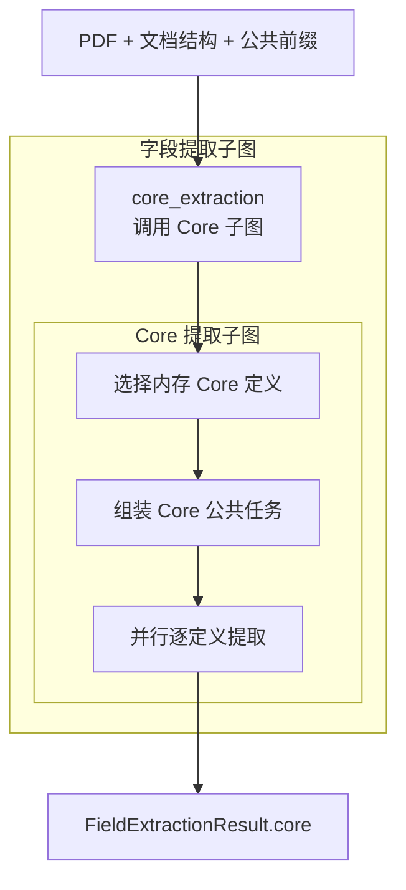

# 字段提取子图

> **用途：** 本文定义仅按权威 Core 目录提取合同字段的子图边界，包括启动快照选择、公共任务组装、并行单定义模型调用、扁平对象校验和基数状态机。

字段模块是[合同信息抽取 Agent 工作流](../contract-extraction-agent-workflow.md)的三个并行下游模块之一。它只读最终公共前缀，并按照[模型提取对象定义结构](../field-definition.md)中经过专家确认的 Core 定义工作，不在运行时创造目录外字段。

---

## 拓扑



```text
PDF + 文档结构 + 公共前缀
  → 字段提取子图
      → 选择 Core 定义
      → 组装 Core 公共任务
      → 并行逐定义提取
  → Core 字段结果
```

父子图只导出 `build_field_extraction_subgraph`。主工作流不引用 Core 内部节点，避免内部拓扑泄漏到外部编排层。

---

## 状态与目录

字段子图只读以下上游状态：

- `prepared_pdf`：经过动态预算处理的页面图像。
- `document_structure`：预处理阶段发现的权威文档结构。
- `prefill_context`：已追加分类结果的最终公共消息前缀。
- `field_definition_catalog`：应用启动时一次性加载并严格校验的 Core 不可变定义快照。

`select_core_definitions` 只从 `FieldDefinitionCatalog.core` 选择按文件名稳定排序的定义及目录指纹，不执行文件 I/O。`data/definition/field` 只允许包含非空的 `core` 目录；运行期间修改 YAML 不影响当前进程，需要重新加载应用才能形成新快照。

字段父子图最终只写入 `FieldExtractionResult.core`，不能改写其他并行分支的状态。

---

## 公共任务与并发提取

`assemble_core_context` 深复制 `ContractPrefillContext.messages`，只追加全部 Core 字段共同使用的任务规则、字段定义属性说明和合法 XML 工具调用格式，生成版本化的不可变 `CoreContext`。组装完成后直接进入并发提取，不发送独立预热请求；各字段请求由 vLLM 自然建立并复用最大公共前缀。

`extract_core` 为每个定义复制同一个 `CoreContext.messages`，再追加当前唯一字段 YAML。动态工具使用显式 `tool_placement=after_task`，因此实际 token 顺序为“最终合同前缀 → Core 公共规则 → 当前字段定义 → 当前字段工具 → 短期历史”。

每个定义拥有隔离的短期消息历史，一个定义的思考、成功对象和错误反馈不会进入其他定义。请求使用 `strict:false + tool_choice:auto`，程序每轮仍只接受恰好一个工具调用：

- 尚无成功对象时提供 `think`、`extract_object` 和 `abandon_extraction`。
- `single` 在第一个对象成功后自动结束。
- `multiple` 每次成功对象都会连同序号和紧凑 JSON 值写入工具反馈；后续轮提供 `think`、`extract_object` 和 `finish_extraction`。
- `finish_extraction` 只能在 `multiple` 至少有一个成功对象后使用。

`extract_object` 的参数顺序固定为 `evidence → reasoning → value`。证据负责可追溯事实，reasoning 解释证据、规则和排除过程，`value` 是唯一正式提取决定。`value` 根据定义的 `properties` 动态生成 `additionalProperties: false` 的扁平对象 Schema；本地校验继续约束必填属性、基本类型、有限数值、证据页码、重复对象和基数状态。

---

## 错误恢复与输出

模型输出普通文本、零个或多个工具调用时，该轮只作为可恢复协议失败：有限原始文本写入私有审计，短期记忆追加统一 XML 纠正反馈。未知工具、Schema 错误、越界页码、重复对象和非法状态同样只进入当前定义的临时纠错记忆；后续动作通过全部校验后，程序清除连续失败链，但完整审计仍保留。

Core 输出包含目录指纹、提示词版本、定义基数、属性名称、一个或多个带独立证据和理由的扁平对象、终态、工具审计和 token 用量。单个字段失败时保留其他字段和该字段已经成功的部分对象。

字段结果尚未形成 Elasticsearch 投影或专家审核契约；正式存储前仍需由用户核对并确认。

---

## 扩展约束

1. 新字段必须进入版本化 Core 目录并通过启动校验，不能仅在提示词中临时定义。
2. 每个对象必须保留原文证据、物理页码和规范化结果。
3. 需要字段级视觉位置时应增加独立定位能力，不把坐标生成混入对象提取。
4. Core 分支只能写入自身结果，不能依赖 Clause 或 Retrieval View 的运行结果。
5. 新增多轮动作或错误恢复时必须遵循[多轮 Agent 上下文与记忆管理规范](../../standard/agent-context-management.md)。
