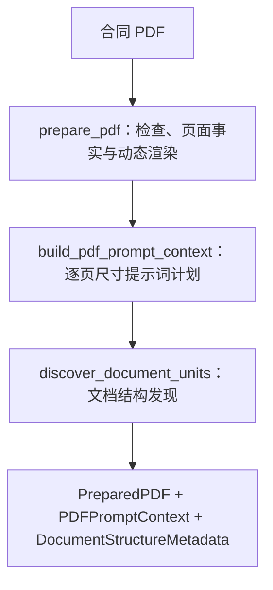

# PDF 预处理子图

> **用途：** 本文定义 PDF 预处理子图的职责、节点边界、页面事实和文档结构发现协议。

---

## 子图定位

PDF 预处理是合同信息抽取主图的第一个子图，为后续预热以及字段、条款、摘要子图提供标准页面和权威文档结构。它负责程序可确定的 PDF 事实和宏观结构发现，但不承担公共前缀预热，也不提取正式业务字段、逐条条款或最终检索摘要。



---

## `prepare_pdf` 节点

节点检查文件存在性、空文件、PDF 格式、加密状态和页数，计算原始文件 SHA-256，并按原始页序调用[PDF 页面压缩工具](../../capability/pdf-page-compression.md)。每页独立渲染和缩放；同一 PDF 内不得假设所有页面尺寸相同。

当前 `PreparedPDFPage` 已记录物理页码、PNG 字节、渲染宽高、实际渲染比例、视觉 token、图像 SHA-256 和是否缩放。后续如需扩展页面事实，应由本节点程序化补充：

```yaml
page_number: 1
source:
  width_points: 595.0
  height_points: 841.0
  rotation_degrees: 0
  has_text_layer: false
rendered:
  width_pixels: 1190
  height_pixels: 1682
  render_scale: 2.0
  visual_tokens: 2014
  was_scaled: false
content_sha256: "..."
```

原始宽高使用旋转生效后的页面可见矩形；文本层状态只表示程序能否读取非空文本，不代表文本完整或可信。模型不得重新生成或覆盖这些确定性字段。

节点根据上下文窗口动态计算视觉容量：扣除最大生成、公共提示词和多轮工具历史预留后，视觉总预算随 PDF 页数增长，直至容量上限。全部页面共享该容量；页数增加后，节点等比分摊单页预算并按需缩放，使整份 PDF 始终构造成一个连续公共前缀，不切分请求。

---

## `build_pdf_prompt_context` 节点

节点只读取 `PreparedPDFPage` 已有的页码和当前图像宽高，将其转换为轻量、确定性的 `PDFPromptContext`。它不重新打开 PDF、不重新计算尺寸，也不保存 Base64 图片副本。

每页描述紧邻对应图片，格式固定为：

```text
第 1 页，图像尺寸 1190 × 1682 像素
[第 1 页图像]

第 2 页，图像尺寸 1134 × 1604 像素
[第 2 页图像]
```

“图像尺寸”描述的是模型当前实际接收的图像，不向模型暴露渲染、压缩或缩放等实现细节。节点按整份 PDF 保存页码、宽高和描述文本，并校验每条描述与页面事实完全一致。

---

## `discover_document_units` 节点

节点读取 `PreparedPDF` 和 `PDFPromptContext`，在稳定 PDF 公共前缀之后追加结构发现任务，通过异步 strict function calling 生成合同整体认识和宏观连续内容单元。它直接输出 `DocumentStructureMetadata`，不再装配独立的文档结构子图。

工具、状态、提示词和详细边界规则统一位于 `subgraph/preprocessing/document_structure/`，具体设计见[文档结构发现节点](document-structure.md)。

---

## 输出与所有权

`PreparedPDF` 是页面事实的唯一来源，保存文档标识、源文件、总页数、动态预算和完整页面列表；`PDFPromptContext` 是从页面事实生成的轻量提示词计划；`DocumentStructureMetadata` 保存合同主题与内容单元。这三项共同传给后续预热子图。

结构发现节点只读使用页面产物。若模型语义结果与程序页面事实冲突，程序事实优先，冲突必须保留在证据或审核信息中，不能静默覆盖。

---

## 配置与验证

渲染比例、视觉 patch、单页上限和上下文预留均从 MLLM 配置读取；单请求预算由上下文窗口动态推导，也可通过环境变量显式设置更小上限。实现或调整预处理逻辑时，应验证：

- 每页渲染结果不超过单页视觉 token 预算。
- 整份 PDF 的视觉 token 总量不超过动态请求预算。
- 页码连续、唯一，页面事实与渲染结果一一对应。
- 每页提示词描述与对应页面的页码、宽度和高度一致，且紧邻该页图片。
- 提示词不出现“压缩后尺寸”等模型无法直接验证的实现表述。
- 同一输入重复构造时，公共消息前缀和前缀指纹保持稳定。
- 同一 PDF 使用每页自己的尺寸进行坐标映射。
- 文档结构结果与页面事实使用同一文档标识，且全部物理页面被宏观单元覆盖。

现有验证入口包括[真实数据预处理边界实验](../../../experiment/preheat-boundary/README.md)和[文档结构发现实验](../../../experiment/document-structure/README.md)。完整公共前缀的缓存验证见[预热实验](../../../experiment/prefill/README.md)。
