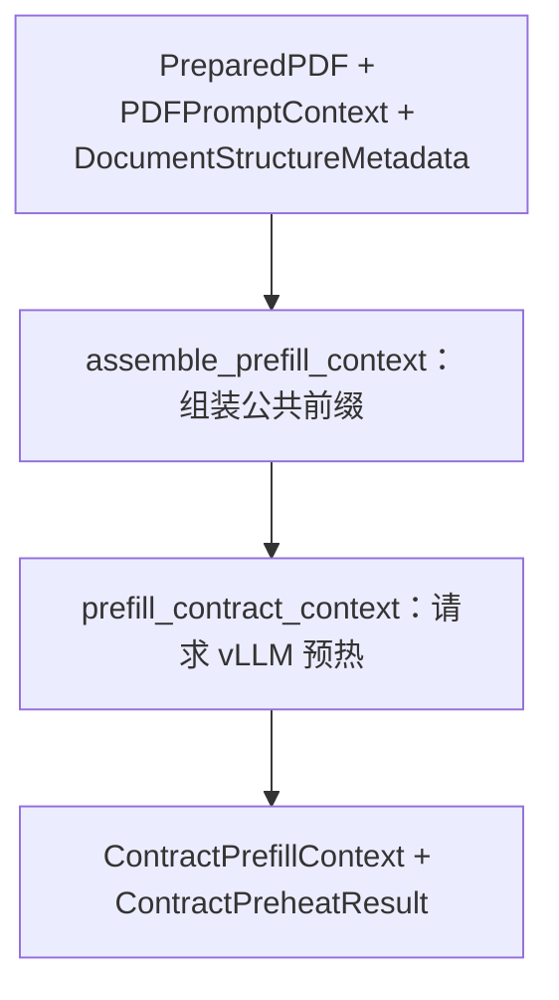

# 下游公共前缀预热子图

> **用途：** 本文定义预处理完成后、三个业务子图并行前的公共前缀组装和 vLLM 预热协议。

---

## 子图定位

预热子图接收 `PreparedPDF`、`PDFPromptContext` 和 `DocumentStructureMetadata`，生成三个下游分支必须逐 token 复用的公共消息前缀，并通过一次单 token 请求将其写入本地 vLLM 前缀缓存。



本子图不产生新的合同业务判断，不修改文档结构，也不执行字段、条款或摘要任务。

---

## `assemble_prefill_context` 节点

节点复用 `preprocessing.prompt.build_pdf_common_messages` 生成以下稳定前缀：

```text
PDF 阅读系统规范
→ 完整 PDF 页码描述与页面图像
→ 权威文档结构 scope + units
```

文档结构使用紧凑 JSON 按 Pydantic 字段顺序序列化；节点验证 `PreparedPDF` 与结构元数据的 `document_id` 一致，并对完整消息计算 `prefix_sha256`。输出 `ContractPrefillContext` 后不得再原地修改其消息；所有后续任务必须复制公共消息，再在末尾追加自己的任务后缀。

---

## `prefill_contract_context` 节点

节点复制 `ContractPrefillContext.messages`，仅在末尾追加预热任务，然后通过异步 `AsyncOpenAI` 适配器向本地 vLLM 发起请求。请求固定关闭 thinking、使用 `temperature=0`、要求至少生成一个 token 且最多生成一个 token。

网络或服务暂时不可用时返回 `degraded`，并保留错误信息；请求成功时返回 `warmed`、模型、完整公共前缀指纹、耗时和 token usage。预热任务不属于共享前缀，因此字段、条款和摘要子图不需要复用该任务文本。

---

## 下游复用约束

三个并行子图必须直接使用同一个 `ContractPrefillContext`：

```text
ContractPrefillContext.messages
→ 子图专属规范
→ 当前任务
→ 工具定义
```

- 不得重新构造或重新序列化 PDF 与文档结构。
- 不得改变系统消息、内容块顺序、图像字节、结构 JSON 或空白格式。
- 各分支只在公共消息之后追加自己的内容，且不得共享可变工具调用历史。
- `prefix_sha256` 用于审计三条请求是否使用完全相同的应用层前缀，不代表服务端缓存永不淘汰。

---

## 验证

实现或调整预热逻辑时至少验证：

- 子图拓扑严格为“组装 → 请求”两个节点。
- 同一输入重复组装得到相同消息和 `prefix_sha256`。
- 公共前缀以预处理模块生成的 PDF 消息开头。
- 文档结构位于 PDF 页面之后、各下游任务之前。
- 预热请求不会原地修改 `ContractPrefillContext.messages`。
- 三个下游请求的公共前缀逐 token 一致。

缓存与耗时验证入口见[PDF 公共前缀 Prefill 实验](../../../experiment/prefill/README.md)。
