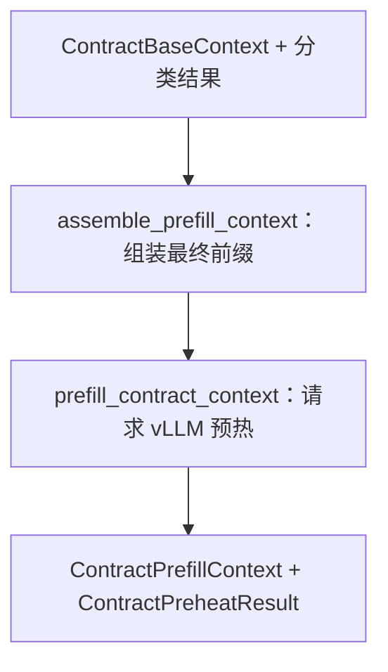

# 最终公共前缀预热子图

> **用途：** 本文定义合同分类完成后、三个业务子图并行前的最终公共前缀组装和 vLLM 预热协议。

---

## 子图定位

预热子图接收不可变的 `ContractBaseContext` 与合同分类结果，将分类结果追加到基础前缀末尾，生成三个下游分支必须逐 token 复用的最终公共消息前缀，并通过一次单 token 请求将其写入本地 vLLM 前缀缓存。



本子图不产生新的合同业务判断，不修改基础前缀或分类结果，也不执行字段、条款或摘要任务。

---

## `assemble_prefill_context` 节点

节点复制 `ContractBaseContext.messages`，并形成以下稳定前缀：

```text
PDF 阅读系统规范
→ 完整 PDF 页码描述与页面图像
→ 权威文档结构 scope + units
→ 合同分类结果
```

节点只接受正式 `ContractClassificationResult`，并校验分类结果与基础前缀的 `document_id` 一致；占位对象、逐类别运行审计或其他任意模型不得进入公共前缀。

文档结构与分类结果均使用带字段注释的简洁 YAML，并分别以 `document_structure`、`classification` 作为唯一根键。注释用于说明字段职责，数据仍由正式 Pydantic 契约产生；相同输入保持字段顺序、空白和序列化结果稳定。

分类的模型可读投影只保留 `status`、`matches`，以及实际存在时的 `unmapped_type_description`。`failed_category_codes`、模型名、提示词版本和类别目录指纹不注入前缀，继续保留在工作流状态中供审计。命中卡片内部保持“证据 → 推理摘要 → 类别决定”的顺序。

节点不会覆盖 `ContractBaseContext`，而是生成版本为 `contract-prefill-context-v4`、拥有独立 `prefix_sha256` 的 `ContractPrefillContext`。输出后不得再原地修改其消息；所有后续任务必须复制公共消息，再在末尾追加自己的任务后缀。

---

## `prefill_contract_context` 节点

节点复制 `ContractPrefillContext.messages`，仅在末尾追加“已读取 PDF、结构与分类结果”的预热任务，然后通过异步 `AsyncOpenAI` 适配器向本地 vLLM 发起请求。请求固定关闭 thinking、使用 `temperature=0`、要求至少生成一个 token 且最多生成一个 token。

网络或服务暂时不可用时返回 `degraded`，并保留错误信息；请求成功时返回 `warmed`、模型、完整公共前缀指纹、耗时和 token usage。预热任务不属于共享前缀，因此字段、条款和摘要子图不需要复用该任务文本。

---

## 下游复用约束

三个并行子图必须直接使用同一个 `ContractPrefillContext`：

```text
ContractPrefillContext.messages
→ 子图专属规范
→ 当前任务
→ 工具定义
```

- 不得重新构造或重新序列化 PDF、文档结构与分类结果。
- 不得改变系统消息、内容块顺序、图像字节、结构 JSON 或空白格式。
- 各分支只在公共消息之后追加自己的内容，且不得共享可变工具调用历史。
- `prefix_sha256` 用于审计三条请求是否使用完全相同的应用层前缀，不代表服务端缓存永不淘汰。

---

## 验证

实现或调整预热逻辑时至少验证：

- 子图拓扑严格为“组装 → 请求”两个节点。
- 同一输入重复组装得到相同消息和 `prefix_sha256`。
- 最终前缀严格以 `ContractBaseContext.messages` 开头。
- 分类结果位于 PDF 与文档结构之后、各下游任务之前。
- 占位对象与 `document_id` 不一致的分类结果会在组装时失败。
- 文档结构与分类结果均为合法 YAML，并包含稳定字段注释。
- `failed_category_codes` 和其他分类运行审计字段不会进入模型可读前缀。
- 预热请求不会原地修改 `ContractPrefillContext.messages`。
- 三个下游请求的公共前缀逐 token 一致。

缓存与耗时验证入口见[PDF 公共前缀 Prefill 实验](../../../experiment/prefill/README.md)。
