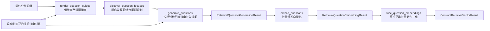

# 检索问题生成子图

> **用途：** 本文定义合同检索问题的动态规划、正式生成、状态输出和后续向量化边界。
>
> **实现状态：** 提问 YAML 契约、启动期加载、Bullet 渲染、问题规划、按规划并发生成、逐问题 Embedding 和合同级向量融合均已实现。项目不再生成问题答案；正式索引仍属于后续流程。

检索问题用于表示用户可能从哪些角度查找当前合同。每个问题保留足以区分合同的交易上下文和具体事实方向；同一合同可以生成多个问题，但不再为问题生成配套答案。

---

## 拓扑



父级兼容入口 `build_retrieval_view_generation_subgraph` 直接返回 `question_generation` 五节点子图，不再额外包装问题—答案两阶段父图。主工作流通过 `retrieval_question_generation` 节点并行调用该子图，并把 `retrieval_questions`、`retrieval_question_embeddings` 与 `contract_retrieval_vector` 写入最终合同结果。

---

## 职责与边界

本子图负责：

- 根据通用提问指南和全部领域提问指南发现适用于当前合同的问题关注点。
- 允许一个问题规划组合多个紧密相关的关注点。
- 按规划精确选择相关指南，并为每份规划建立隔离会话并发生成正式问题。
- 使用稳定的问题侧检索指令，按配置分批、并发地为每个正式问题生成独立向量。
- 对全部成功问题向量取算术平均并重新 L2 归一化，形成合同级检索向量。
- 保留问题证据、简洁推理、关注点稳定标识、顺序和工具审计。
- 使用后台 `RETRIEVAL_VIEW_MAX_QUESTIONS` 作为最大问题数量，不向模型暴露目标数量。

本子图不负责：

- 为生成的问题回答合同事实。
- 生成合同身份骨架、回答状态、条件与例外或答案证据。
- 把整份合同压缩成摘要。
- 在运行时按合同分类结果裁掉领域提问指南。
- 直接写入 Elasticsearch 或决定线上召回阈值。

字段、条款和检索问题三个业务分支只读同一 `ContractPrefillContext`，彼此不共享可变状态。检索问题不消费 Core 或条款结果。

---

## 指南目录与启动加载

权威定义位于 [`data/definition/retrieval-view/question`](../../../data/definition/retrieval-view/question/)：

```text
question/
  common.yaml
  category/
    sale.yaml
```

- `common.yaml` 定义跨合同法律结构、真实履约关注点、集合选题规则和自然问题表达规则。
- `category/<code>.yaml` 在领域命名空间内补充专业关注点，不复制通用规则。

完整字段契约和用户扩展方式见[检索问题指南定义结构](../retrieval-view-definition.md)。`answer/` 目录及其对象契约已经删除，启动加载器只允许根目录包含 `question/`。

应用启动时，`load_retrieval_view_guide_catalog` 一次性加载全部提问 YAML，校验目录布局、严格 Pydantic Schema、文件名与领域 code、重复标识和权威合同类别引用，并形成不可变 `RetrievalViewGuideCatalog`。同一份目录内容产生稳定 SHA-256 指纹。

`category` 只是组织命名空间。问题规划阶段读取全部领域指南，以免分类结果提前裁掉跨领域或复合交易关注点；正式问题生成阶段只读取当前规划 `attention_codes` 选择的关注点。

---

## YAML 存储与 Bullet 渲染

YAML 是机器权威来源，但不原样注入模型：

```text
问题规划请求
  → 通用提问指南
  → 按目录稳定顺序追加全部领域提问指南

正式问题请求
  → 根据 attention_codes 精确选择一个或多个提问关注点
  → 只渲染所选关注点的适用条件、重点事实和排除边界
```

`render_question_guides` 与 `render_selected_question_guides` 使用显式开始、结束分隔和中文含义标签。模型不会看到 `legal_significance:` 等 YAML 字段名，也不会把指南误认为输出 Schema。目录外的关注点标识立即失败，不允许模型猜测。

`render_question_guides` 节点复制最终公共前缀，只在末尾追加完整提问指南，形成不可变 `QuestionGenerationContext`。上下文记录 `document_id`、提示词版本、提问目录指纹、后台数量上限、消息和前缀 SHA-256；数量上限不进入模型消息。

---

## 五节点状态流

### 组装完整提问指南

`render_question_guides` 不调用模型，只构造全部问题规划共享的稳定上下文。它不会修改输入的 `ContractPrefillContext`。

### 发现问题关注点

`discover_question_focuses` 是带短期记忆的顺序工具循环：

- 首轮强制调用 `think` 形成整体规划。
- `propose_question_focus` 每次记录一份可由多个 `attention_codes` 组成的问题规划。
- `finish` 显式结束。
- 后台达到最大问题数时立即截断，不要求模型知道上限。

合法思考、正式规划和最小成功反馈保留在会话轨迹中；错误工具调用进入临时纠错记忆，正确动作完成后从模型上下文清除，但保留在私有审计中。

### 并发生成正式问题

`generate_questions` 为每份规划建立独立会话，只注入该规划选中的指南和当前 `focus_requirement`。各会话共享逐字一致的公共前缀，但不共享思考、错误反馈或工具轨迹。每个会话只提供 `propose_question`，通过有限恢复协议生成一个正式问题。

最终按规划原始顺序汇总为 `RetrievalQuestionGenerationResult`。单个并发会话失败时结果可标记为 `partial`；不得把普通自然语言响应当成结构化问题。

### 并发向量化正式问题

`embed_questions` 只读取已经通过校验的正式问题，不再调用 MLLM。节点使用异步 OpenAI 兼容 Embedding 客户端，按 `batch_size` 分批，并以 `max_concurrent_requests` 限制批次并发。每个问题使用固定版本的英文问题侧 instruction 单独编码，返回结果按 `question_id` 与 `order` 映射回原顺序。

节点校验响应数量、索引连续性、向量维度、有限数值和非零范数；配置启用时执行 L2 归一化。一个批次失败时保留其他成功批次，并将状态标为 `partial`；所有批次失败才标为 `failed`。本节点不写 Elasticsearch。

### 融合合同级检索向量

`fuse_question_embeddings` 不请求任何模型，只读取成功的逐问题向量。节点对每一维使用算术平均，再对平均向量执行 L2 归一化，输出稳定版本的合同级向量。融合结果记录参与的问题 ID、数量、Embedding 模型和提示词版本。

若上游只有部分问题向量成功，节点仍使用成功部分生成向量，但状态保持 `partial`；没有成功向量或融合结果为非法零向量时返回 `failed`，不得产生空向量占位。

---

## 输出与向量化边界

正式输出键为 `retrieval_questions`，值为 `RetrievalQuestionGenerationResult`，其中每个 `GeneratedQuestion` 至少保留：

- 自然中文问题文本。
- 证据页码与精简证据内容。
- 可审计的简洁推理。
- 来源与一个或多个关注点稳定标识。
- 稳定顺序及工具调用审计。

向量输出键为 `retrieval_question_embeddings`。每个条目只保存 `question_id`、`order` 和独立向量；结果包络同时记录模型、提示词版本、维度、归一化状态、请求数、token 用量与失败问题标识。问题文本及证据仍以 `retrieval_questions` 为权威来源，避免在向量结果中重复。

合同级输出键为 `contract_retrieval_vector`，采用版本化的 `arithmetic_mean_l2_normalized` 融合方法。逐问题向量仍予保留，以便审计和后续对照实验；正式索引默认消费合同级融合向量。问题侧与未来的用户查询侧使用版本绑定的英文成对 Embedding instruction，上线前仍需同领域硬负例和真实用户查询验证。

---

## 依赖与配置

| 配置 | 默认值 | 含义 |
| --- | ---: | --- |
| `RETRIEVAL_VIEW_GUIDE_DIR` | `data/definition/retrieval-view` | 提问指南根目录。 |
| `RETRIEVAL_VIEW_MAX_QUESTIONS` | `8` | 单份合同最多生成的问题数；必须大于0。 |
| `VLLM_EMBEDDING_BATCH_SIZE` | `32` | 单次 Embedding 请求包含的最大问题数。 |
| `VLLM_EMBEDDING_MAX_CONCURRENT_REQUESTS` | `10` | 同时运行的 Embedding 批次数上限。 |
| `VLLM_EMBEDDING_DIMENSIONS` | `4096` | 响应向量必须满足的维度。 |
| `VLLM_EMBEDDING_NORMALIZE` | `true` | 是否对每个问题向量执行 L2 归一化。 |

依赖包括 `PreparedPDF`、权威文档结构、`ContractPrefillContext`、启动期 `RetrievalViewGuideCatalog`、异步 MLLM 客户端以及统一工具恢复协议。

---

## 验证

```bash
PYTHONPATH=. pytest -q \
  test/test_retrieval_view_guide_catalog.py \
  test/test_retrieval_view_guide_prompt.py \
  test/test_retrieval_view_question_context.py \
  test/test_retrieval_view_question_focus_tool.py \
  test/test_retrieval_view_question_focus_node.py \
  test/test_retrieval_view_question_tool.py \
  test/test_retrieval_view_question_proposal_node.py \
  test/test_retrieval_view_question_embedding_node.py
```

测试应覆盖目录严格加载、稳定渲染、规划首轮思考、组合关注点、后台截断、问题会话隔离、工具纠错清理、Embedding 分批并发、结果顺序、向量校验和部分失败状态。
