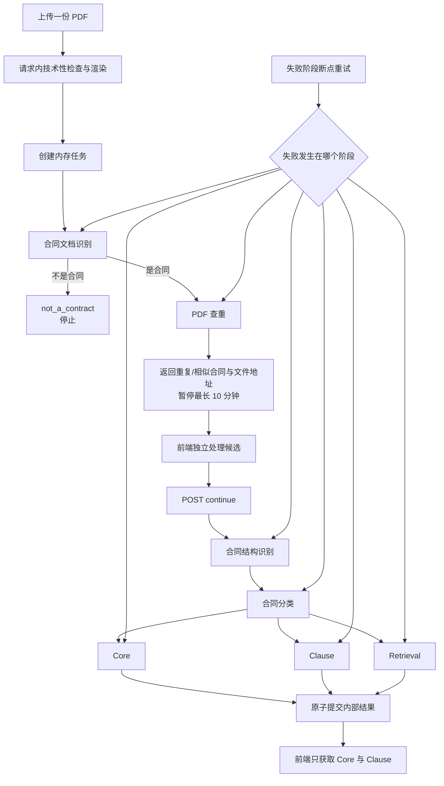

# 合同提取应用运行时

> **用途：** 本文定义单份 PDF 合同在应用层的内存任务、阶段状态、三路并发、增量草稿、失败阶段断点重试和生命周期边界。HTTP 与 SSE 的精确线协议见[合同 API](../../api/contract.md)。

---

## 与 Agent 工作流的关系

[合同信息抽取 Agent 工作流](../workflow/contract-extraction/readme.md)定义模型节点、子图输入输出和共享前缀；应用运行时负责把这些能力组织成可供前端持续观察和独立重试的业务任务。

主 Agent 图可以等待三个下游分支全部结束后统一合并，适合实验或批处理。HTTP 服务在创建任务后先判断上传内容是否属于合同；只有合同才执行查重并形成确认暂停点，只有前端继续后才运行合同结构识别，再复用相同的分类和三个业务子图：



三个下游分支只读同一份 `ExtractionContext`，不共享可变状态。Core 或 Clause 任一分支首次成功即可形成用户可见提取结果，其他分支失败不会撤销已提交内容；Retrieval 成功结果只在内存聚合中供后续入库使用，不进入提取响应。

---

## 内存聚合边界

一次上传对应一个 `RunAggregate` 和唯一 `run_id`。聚合在当前 API 进程内持有：

- `reviewer_user_name`：创建请求的免登码所对应的审核人名称，也是任务所有权标识；
- `SourceDocument`：安全展示文件名和处理版 PDF 字节 SHA-256，不持有上传字节；
- `prepared_pdf`：按视觉预算栅格化并重新封装的处理版 PDF，以及同次渲染形成的逐页 PNG 工作流缓存；
- `stages`：全部用户阶段、当前状态、尝试次数和不可覆盖的历史尝试；
- `document_detection_result`：合同或非合同决定、页面证据、推理摘要、工具审计与用量；
- `structure_result`：继续后形成并供分类复用的结构识别结果；
- `deduplication_result`：页面融合向量、Top-3 候选、逐候选判断和私有工具审计；
- `classification_view`：分类成功后固定保存的精简公共投影，供单任务快照恢复；
- 查重暂停状态、固定审核截止时间和实际继续时间；
- `prerequisites`：已准备页面、文档结构、分类和下游公共上下文；
- `draft`：分类、Core、Clause、检索向量等当前生效的内部结果；公共快照只投影 Core 与 Clause；
- `events`：有限长度的可回放业务事件；
- `subscribers`：当前 SSE 订阅队列；
- 聚合锁：保证状态、草稿修订和事件序号原子更新。

模型工具轨迹、用量、内部错误和高维向量只存在私有尝试记录或内部结果中。面向用户的快照由投影器重新构造，不能直接序列化 Agent 私有状态。

运行列表接口读取同一个 `MemoryRunRegistry`，先按当前审核用户筛选任务所有者，再投影仍可恢复任务的 `run_id`、处理版 PDF 元数据、时间摘要和独立的粗粒度状态。列表状态只有 `processing` 与 `blocked`：后台拓扑仍会自动推进时为前者；查重等待确认、公共前置阶段失败、全部分支停止或结果等待复核入库时为后者。业务分支部分失败但其他分支仍在运行时保持 `processing`，全部自动执行停止后再变为 `blocked`。非合同和过期任务不进入列表；其他失败任务继续保留为 `blocked`，供前端恢复后定位并重试。PDF 元数据直接来自聚合中的 `PreparedPDF`：文件大小使用重新封装后的字节数，页数使用处理版物理页数，封面宽高使用第 1 页压缩图像的像素尺寸，不复制 PDF 或 PNG 字节。创建响应、列表项和单运行快照使用同一个 `document` 结构。

列表查询不触碰 `updated_at` 或 `expires_at`；前端选中后再通过单运行快照和 SSE 同步完整状态。未来正式入库成功必须从注册表删除对应聚合，使该 `run_id` 同时失效并从列表消失。`document` 只服务运行恢复，不进入最终 Core/Clause 或 Elasticsearch 合同文档。

> **持久化边界：** 原始 PDF 不落盘，创建请求结束后释放上传字节；任务聚合只保存栅格化处理版 PDF。处理版 PDF、同源 PNG 页面缓存、中间状态和自动草稿只在运行聚合生命周期内存中存在，也不写 Elasticsearch。只有未来经专家确认的最终对象才允许进入正式存储。

---

## 任务所有权与用户隔离

创建接口只接受已通过鉴权依赖解析出的 `reviewer_user_name`，不从 Query 或 Body 接受可伪造的所有者字段。任务注册成功后，所有权在该聚合生命周期内保持不变；同一审核用户重新登录并取得新的免登码后，仍可访问自己尚未过期的任务。

所有读取或用户触发的状态变更都在应用服务层执行所有权校验，而不是只依赖路由过滤：

- 运行列表只包含当前审核用户的聚合；
- 单任务快照、SSE 订阅、取消、查重确认继续和失败阶段重试，都要求当前用户名与聚合所有者一致；
- 所有者不一致时统一抛出与未知、过期任务相同的 `RunNotFoundError`，HTTP 层返回 `404`，避免通过错误差异枚举其他用户的 `run_id`；
- 越权请求在读取状态或执行状态迁移前终止，不能续期、消费暂停点、启动重试或建立事件订阅。

周期清理和查重暂停到期属于系统内部生命周期操作，不模拟某个用户访问，因此仍可回收所有用户的到期聚合。未来正式入库接口必须采用相同的所有权校验，并直接使用聚合中保存的审核人名称形成入库审核信息；入库成功后删除该用户的聚合。

---

## 用户业务阶段与暂停点

内部 LangGraph 节点不会直接成为用户阶段。请求内 PDF 格式检查、渲染和处理版生成属于创建任务的技术前置条件，不再作为“合同预处理”或用户阶段暴露。应用只暴露七个稳定业务阶段：

| `code` | 展示名称 | 内部范围 |
| --- | --- | --- |
| `contract_document_detection` | 确认合同文档 | 读取处理版 PDF 全部页面，提交有证据的是或否合同判断。 |
| `pdf_deduplication` | 检查重复合同 | 页面向量融合、ES Top-3 召回与逐候选关系判断。 |
| `contract_structure_recognition` | 识别合同结构 | 内容单元发现与视觉定位。 |
| `contract_classification` | 识别合同类型 | 公共分类上下文及逐类别判定。 |
| `core_extraction` | 提取核心信息 | Core 公共任务和逐定义提取。 |
| `clause_extraction` | 提取合同条款 | 条款发现、上下文组装与正文提取。 |
| `retrieval_preparation` | 准备智能检索 | 问题规划、生成、向量化与融合。 |

阶段状态为 `pending`、`running`、`succeeded`、`failed` 或 `retrying`。只有总量可由程序可靠得知时才填写离散 `progress`，模型生成阶段不得伪造百分比。

`contract_document_detection` 成功判定为合同时自动开始 `pdf_deduplication`。判定为非合同时，该阶段仍为 `succeeded`，运行转为 `not_a_contract`，发布携带紧凑证据与理由的 `run.document_rejected`，查重及全部下游阶段保持 `pending`。模型连接、工具协议、材料可读性等失败属于技术失败，阶段为 `failed`，不能伪装成非合同。

`pdf_deduplication` 成功后不会自动开始合同结构识别。工作流内部仍完整保存 ES Top-3 召回及 `duplicate | similar | different | failed` 逐候选判断；应用层只向前端投影其中的 `duplicate | similar`，并返回原始 cosine、简洁理由，以及 Elasticsearch 原样提供的 `document_id`、友好 `file_name`、`file_uri` 和页数。随后服务发布 `run.deduplication_review_required`，把运行置为 `awaiting_deduplication_review`。过滤后候选可以少于三份，且原始排名可以不连续；没有重复或相似合同时数组为空，但仍形成同一个暂停点，确保前端调用顺序稳定。SSE 不提供 PDF 字节或运行级下载地址；前端通过独立资源接口按 `file_uri` 获取文件。

暂停期限从结果事件形成时固定为最长 600 秒。GET 快照、SSE 建连、断线重连和心跳不会延长期限。前端可以在此期间通过与提取流独立的接口处理已入库候选；处理完成后调用一次继续接口。成功继续会记录时间、取消暂停到期任务、恢复普通运行 TTL 并启动合同结构识别；结构识别成功后自动开始分类，重复继续返回冲突。

每次尝试在内部保留开始时间、结束时间、私有结果或内部错误。公共 `StageSnapshot` 额外投影当前尝试的 `started_at`：未开始阶段为 `null`，首次执行和每次重试开始时记录，成功或失败后继续保留。SSE 阶段事件和 GET 恢复快照共用该投影，因此前端可在运行期间以当前时间动态计时，并在终态以阶段 `updated_at` 固定耗时；此前尝试仍只保留在不可覆盖的内部历史中。

分类、Core、条款和检索问题四类并行内容处理统一发布三段式 `stage.progress`：

1. 开始统计时只更新消息，`progress` 为 `null`。
2. 固定目录或规划形成后返回真实总数，`progress` 为 `0 / total`。
3. 每个并行项目形成成功或受控失败终态后返回 `completed / total`，最终 `total / total` 保留在完成事件和后续快照中。

分类和 Core 的总数来自启动期不可变目录；条款和问题的总数分别等候候选发现与问题规划完成。内部进度通过单次异步任务局部的观察回调传递，不进入 LangGraph 权威状态、模型上下文、私有审计或正式草稿。进度回调属于非权威展示能力，发布异常不能反向中断正式提取。

---

## 运行状态推导

运行状态由阶段和草稿实时推导，不单独维护可能漂移的第二份状态：

| 状态 | 判定 |
| --- | --- |
| `processing` | 尚无可用分区，公共处理或业务分支仍在进行。 |
| `not_a_contract` | 文档识别可靠判定上传内容不是合同，后续处理已停止。 |
| `awaiting_deduplication_review` | 查重结果已返回，结构识别、分类与提取尚未启动，正在等待前端继续请求。 |
| `partial_ready` | Core 或 Clause 至少一个可供用户查看，但仍有分支运行、重试或失败。 |
| `ready` | Core、Clause 和 Retrieval 三个分支均已形成当前结果。 |
| `failed` | 公共前置阶段失败，或三个业务分支均未形成结果。 |
| `cancelled` | 用户主动终止任务，仅在删除前发布的 SSE 事件中可见。 |
| `expired` | 聚合已到期并从内存注册表移除。 |

分支内部的 `partial` 是可提交结果：例如部分字段或条款失败时，成功项仍可进入草稿，并在分区上保留 `result_status: partial`。

分类阶段成功时，服务把精简 `classification` 固定保存到运行聚合，并同时附加到该阶段的 `stage.completed` 事件。它包含分类状态以及每个命中类别的 `code`、名称和实际交易场景；未映射时可以携带简短类型描述。SSE 用于即时展示，单任务 GET 快照的 `run.classification` 用于持续恢复；该结果不进入可编辑的 Core/Clause `draft`。完整分类结果仍留在内存聚合中供后续入库。

---

## 内部结果与公共提取值

运行聚合内部保留分类、Core、Clause、问题融合向量及页面融合向量等后续入库材料；公共快照的 `draft` 只返回用户必须审核的两个字段：

```yaml
core: null
clauses: null
```

Core 使用 Elasticsearch mapping 的稳定 code 和值形状，但为了允许用户补充，未提取字段暂时保留为 `null`；Clause 直接使用 Elasticsearch `clauses` 元素结构并排除失败候选。Core 和 Clause 独立就绪，其中任一成功才发布 `run.review_ready` 与 `draft.updated`。Retrieval 仍更新自身阶段状态，但不发布没有用户可见变化的草稿事件。

后续入库请求计划只接收当前 `run_id`、用户自定义文件名以及修改后的 Core、Clause。服务端从内存聚合补齐文档身份、页数、分类、问题融合向量、页面融合向量、审核人与入库时间，并在正式投影时过滤 Core 的 `null` 和条款可选空值。该接口尚未实现。

Core 与 Clause 的精确前端对象、字段含义和状态负载见[合同 API 的快照响应](../../api/contract.md#获取当前状态与提取结果)。

---

## 失败阶段断点重试

七个用户业务阶段都可以在执行失败后重试。服务从失败点继续，严格复用更早阶段已经成功且仍保存在聚合中的权威结果，不允许回退重跑成功阶段：合同文档判断重试后继续查重；查重重试后重新形成确认暂停点；结构识别重试后继续分类；分类重试直接复用结构结果并在成功后启动三个下游分支；三个下游阶段各自独立重试。

创建请求内的 PDF 格式检查与渲染发生在任务建立前，不属于用户业务阶段，失败时不会产生 `run_id`，因此不能重试。业务阶段只有状态为 `failed` 且尝试次数未达上限时才令 `retryable=true`。

失败重试遵循“成功前置结果和兄弟分区持续可读”的提交协议：

```text
成功前置结果 + 目标阶段 failed + 其他已成功分区
  → 目标阶段进入 retrying，前置结果与其他分区保持不变
  → 新尝试失败：不提交目标结果，只更新失败状态和尝试记录
  → 新尝试成功：提交目标结果，并按正常流程继续后续阶段
```

运行中、等待中和已成功阶段都拒绝重试。阶段一旦有一次进入 `succeeded` 就永久关闭重跑能力，`result_status: partial` 也不例外。首次执行计入尝试次数；连续失败达到配置上限后 `retryable` 变为 `false`。每次接受重试以及随后产生的业务状态事件都会刷新普通运行 TTL。

---

## 事件、订阅与背压

每个业务事件拥有任务内严格递增的 `sequence`。订阅建立时，注册订阅队列和读取待回放事件在同一聚合锁内完成，从而避免“读取历史后、订阅生效前”丢失事件。

事件缓冲和每个订阅队列均有上限。慢订阅者队列满时只淘汰该订阅者最旧的事件，不允许反向阻塞模型执行或其他订阅者。Core 与 Clause 提取结果始终通过快照接口获取，因此事件丢失不会破坏权威结果；前端恢复规则见[合同 API 的 SSE 章节](../../api/contract.md#订阅处理事件)。

心跳属于连接保活信号，不写入事件缓冲，也不占用业务序号。

---

## 生命周期与部署限制

普通处理阶段的到期时间在业务状态更新时向后刷新。查重暂停点例外：它使用独立的精确定时任务和固定截止时间，最长 600 秒，读取操作不续期。到期后先向现有订阅者发布 `run.expired`，再从注册表移除整个聚合，使上传处理版 PDF、候选引用、渲染页面、私有审计、向量和草稿随引用释放；周期清理器继续作为普通 TTL 和定时任务异常情况下的兜底。

用户取消是独立于 TTL 的即时终止路径。服务在聚合锁内标记取消并从注册表移除任务，使并发的继续或重试操作不能在取消后重新调度节点；随后取消该运行的后台协程和查重到期任务。已经连接的订阅者先收到 `run.cancelled`，其 `overall_status` 为 `cancelled`，然后连接结束。取消不保留可恢复墓碑，之后所有按 `run_id` 的操作均返回不存在。

TTL、清理周期、事件缓冲、SSE 心跳和分支尝试次数均由环境变量控制，具体配置项及默认值见[后端应用的合同处理内存配置](../../capability/application/backend-application.md#合同处理内存配置)。

> **单进程限制：** 当前注册表不持久化且不跨进程共享。开发热更新会清空任务，多 worker 会让上传、SSE、查询和重试落到不同内存空间。采用当前方案时必须运行单 worker；未来如需横向扩展，应另行设计共享临时状态，不能借用 Elasticsearch 保存处理过程。

---

## 实现位置与验证

| 模块 | 职责 |
| --- | --- |
| `app.service.pdf_preparation` | 创建请求内异步检查、渲染并重新封装 PDF，形成任务保存的 `PreparedPDF`。 |
| `app.service.contract_extraction.registry` | 内存聚合和注册表。 |
| `app.service.contract_extraction.service` | 状态机、并发隔离、结果提交、重试、事件与 TTL。 |
| `app.service.contract_extraction.document_detection` | 将合同文档识别图适配为 SSE 运行时执行端口。 |
| `app.service.contract_extraction.deduplication` | 将 PDF 查重图适配为暂停点使用的执行端口。 |
| `app.service.contract_extraction.executor` | 把现有 Agent 子图适配成公共处理和独立业务分支。 |
| `app.service.contract_extraction.projector` | 从私有 Agent 结果构造用户可见 Core/Clause。 |
| `app.service.contract_extraction.model` | 稳定运行状态、事件和提取结果应用契约。 |

当前已验证内存 PDF 异步准备、合同与非合同分流、非合同 SSE 终态、工作流直接接收 `PreparedPDF`、合同结构识别阶段、ES 候选文件信息投影与事件回放、独立资源文件读取、固定期限销毁和一次性继续请求。文件大小与恶意内容策略、专家确认、正式对象修改与 Elasticsearch 投影尚未实现。
