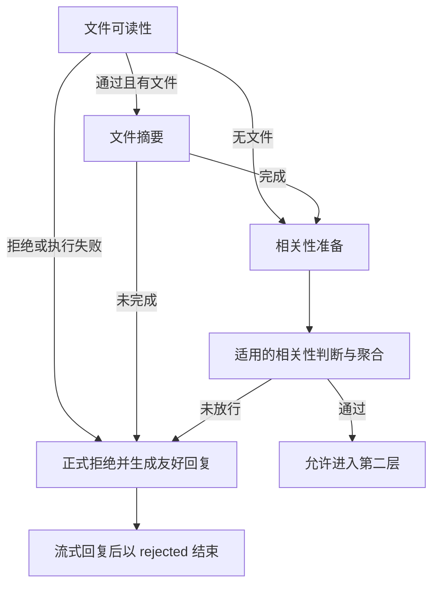

# 业务门禁子图

> **当前状态：** 可读性之后已接入逐文件并发命名与摘要；摘要主题冲突检查先于相关性，任一文件命中即直接反馈。相关性分支只接收轻量文字输入。四个相关性维度均已接入约束解码和有限纠错；上下文由服务端选取最新摘要之后最多五轮有效任务。文件维度按最佳有效业务结果计分，执行失败优先，摘要失败时停止。

所属任务入口见[合同沟通智能体](readme.md)。

---

## 用途与职责

`app.agent.contract_communication.business_gate` 为用户问题、文件及任务准入条件校验提供独立子图。当前实现内存文件打开、页面渲染和视觉可读性判断，由 Communication 正式执行器在 SSE 激活后调用；不影响合同提取与入库；完整通过后由服务层衔接 Agent Core。

独立子图是内部结构，不对应前端专属阶段或卡片。对外统一报告校验进度和普通结果消息，遵循 [SSE 事件契约](../../../api/communication.md#sse-事件契约)；结构化准入结论和筛选后的文件列表仍由内部工作流管理，不从消息文本解析，也不因移除专属事件而取消校验。

用户控制边界已实现：本子图返回最终判断前，不允许用户取消或通过新轮次替换旧任务；完整门禁通过并进入后续执行后才开放。服务端通过 `can_interrupt` 同步 SSE、快照和驻留历史，完整规则见[门禁阶段的用户中断限制](user-context.md#门禁阶段的用户中断限制)。系统超时、删除与关闭引发的取消回收仍保留。

| 文件 | 职责 |
| --- | --- |
| `__init__.py` | 导出状态与 `build_business_gate_subgraph()`，构建并编译子图。 |
| `state.py` | 原始输入、逐文件摘要、轻量节点输入、四维判断与聚合结果。 |
| `node.py` | 摘要并发执行、有限纠错、摘要绑定校验、相关性路由与模型判断、加权聚合。 |
| `file_topic_conflict.py` | 摘要主题冲突判断、逐文件结果收束和直接反馈路由。 |
| `prompt/pdf.py` | 可读性与摘要共享的页面消息构造入口，复用合同提取公共阅读前缀。 |
| `prompt/file_summary.py`、`schema.py` | 单文件摘要提示词、三字段输出 Schema、严格校验及友好纠错反馈。 |
| `subgraph/file_readability/` | 打开、Map-Reduce 渲染与视觉判断、尾部汇总熔断；作为门禁第一个节点。 |

---

## 当前拓扑与接口

有文件时顺序为 `file_readability → summarize_files → initialize_business_gate → check_file_topic_conflict → 相关性并行分支 → aggregate_relevance`。聚合通过后结束门禁并允许服务继续；可读性 rejected/failed、摘要未完成、主题冲突命中或检查失败以及聚合未放行，统一进入 `reject_request → END`，不再继续摘要或相关性检查。无文件时直接进入 initialize_business_gate，跳过摘要和主题冲突检查。内部空任务也经聚合进入拒绝出口，不默认放行。文件子图内部检查状态与逻辑保持不变，详见[文件可读性检查子图](file-readability.md)。

```python
from app.agent.contract_communication.business_gate import build_business_gate_subgraph

subgraph = build_business_gate_subgraph()
result = subgraph.invoke({})
assert result["status"] == "rejected"
assert result["rejection_reply"].source_status == "not_implemented"
assert result["open_check"].status == "skipped"
```

异步调用使用 `await subgraph.ainvoke({"files": files})`。构建函数返回已编译子图，由正式 Communication 服务复用执行，各轮状态独立；完整放行后由服务层继续同轮 Agent Core。

输入 files、open_check 和失败信息契约见[文件子图调用方式](file-readability.md#调用方式)。空字典表示无附件，不等于完整门禁通过。每次重算打开结果，不沿用调用方传入的结论；内部文件输入另有 Pydantic 校验，不将 TypedDict 本身当作 HTTP 校验器。

### 文件摘要前置节点

`summarize_files` 位于可读性检查之后，目标是为每一份上传文件生成合适名称与轻量摘要。它后续可复用 `rendered_files` 中已经准备好的页面，不重复打开和渲染；四个相关性节点不再看这些图像，只消费已校验摘要。第二层智能体也应优先读取摘要，再按需通过工具定位原文件或指定页面，避免一次性把多份 PDF 图像放入上下文。

每个 `FileSummary` 的初版契约：

| 字段 | 来源与用途 |
| --- | --- |
| `file_index` | 程序绑定的本轮原始文件下标，从 0 开始；同名文件也必须有不同下标。 |
| `original_file_name` | 程序保留的原始上传名称，不能由模型重写。 |
| `display_name` | 根据文件内容生成的合适名称，非空；仅作展示，不作为唯一标识或磁盘路径。 |
| `summary` | 根据当前文件生成的轻量文字概述，非空；不包含图像、PDF 字节或视觉审计字段。 |

摘要按 `file_index` 与原文件一一绑定，初始化阶段校验文件数量、唯一性和原名匹配，并恢复原上传顺序；缺失、重复或绑定错误时返回 failed，不让部分摘要进入后续判断。输入 Schema 不接受外部提供的摘要或摘要完成状态，防止跳过生成步骤。

文件身份不能由生成的名称替代。`file_index` 仅在本轮内有效，跨轮引用需结合 `turn_id`。已确认后续以稳定 `file_id` 贯穿上传、渲染、摘要、落盘与恢复，工具按 ID 定位，展示使用 display_name；原始 original_file_name 原样保留，展示名允许重名。该身份贯通尚未接入现有 FileSummary，本次不更改上传 UUID、存储路径或原始文件名。

`file_summary_status` 当前生成 skipped（无文件）、completed（整批摘要完成）或 failed（摘要处理失败）；not_implemented 仅保留为兼容值。按文件独立并发生成、按上传顺序汇总，不把原始文件名或可读性判断理由伪装成摘要。模型执行、并发调度和结果校验已接入；摘要持久化、核心智能体输入与按需打开工具仍未接入。

这一调整减少的是后续模型输入，不等于自动释放所有页面内存。页面对象仍由外层状态保留，供摘要生成或后续工具复用；是否驱逐并在工具调用时重渲染，需要另行设计。摘要也不能代替涉及具体条款、数值或法律结论时对原文的核验。

### 单文件摘要提示词与公共前缀

当前版本为 `file-summary-v3`，权威提示词位于 `app/agent/contract_communication/business_gate/prompt/file_summary.py`。`build_file_summary_messages(rendered_file)` 接收一份已渲染文件，返回准备发送的消息；请求由 `node.py` 中的 `generate_file_summary` 发起。规则覆盖实际内容命名、整份文件总体概述、非合同材料、跨页正文与附件、缺失信息、冲突及空白文件；不注入本轮问题或历史，不进行风险分析。

v2 强化内容充分性：主要对象可辨认时，名称与概述不能只写“图片合集”等载体形式；缺少文字或用途未知不代表没有可描述的内容。摘要应保留可辨认的对象、场景与重要关系，再说明原文件中影响理解的具体限制，不用对摘要自身的信息缺失评价代替内容。对象确实无法确认时保留一般类别或可见形式，不猜测型号、拍摄目的、交易关系或业务结论；允许信息量确实有限的简短概述，不设置最低字数。提示词包含无文字景物图像、局部构件照片及无字段含义数字网格的边界示例，未复制相关性扩大测试中的模糊摘要作为标准输出。

摘要 v2 当时只调整摘要任务后缀及 Schema 字段说明，公共页面前缀、三个输出字段、并发与重试逻辑保持不变；当时没有新增语义质量复核节点或硬性充分性校验。当前另有[摘要主题冲突判断](#文件摘要主题冲突判断)，不负责一般摘要质量评估。规则能否减少真实模型的内容遗漏仍需图像 PDF 实验验证，不能把提示词要求当作程序保证。

模型输出使用 `FileSummaryGeneration` 的唯一 Schema，固定按以下顺序生成三个必填、非空字符串，不允许额外字段：

- `reasoning`：先给出简短页码依据与原文或视觉事实，再解释命名及概述；供内部核查，不作为相关性判断的文件摘要。
- `summary`：面向整份文件的客观概述，说明主要对象、涉及事项和内容范围。
- `display_name`：简明的展示名称主体，不带扩展名，不承担身份或存储路径职责。

程序负责绑定文件身份与原始文件名，不让模型生成这些字段。reasoning 内先提供依据再解释，保持证据优先，不另加 evidence 字段或展开隐式思维链。Schema 约束结构、类型和非空；真实性、概述质量及名称风格仍需后续模型实验验证，不声称 Schema 能验证这些语义。

可读性判断已同步调用 `prompt/pdf.py` 中的 `build_file_task_messages`；摘要消息使用同一入口。二者实际共享合同提取的 `build_pdf_messages`，消息顺序固定为：公共 system 阅读规则 → user 输入说明 → 第 1 页标签及图像 → 第 2 页标签及图像 → … → 各自任务及 Schema。节点差异只出现在最后一个文本块，不将可读性结论、文件名、ID 或运行信息插入公共前缀。沿用合同阅读基础前缀不等同于文件已被认定为合同，摘要任务明确按实际材料类型描述。

同一文件的页面 PNG、媒体 UUID、页码与顺序原样复用，不重新打开、压缩、渲染或提前编码 Base64；只是不同请求重复引用相同页面内容。每次构造独立消息容器，避免并发分支互相改写。实际缓存命中仍依赖模型服务的模板、配置和缓存驻留，目前只验证应用消息前缀一致，未测量真实 vLLM 命中率。摘要执行采用 JSON Schema 约束解码并开启原生 thinking 通道，与可读性调用方式对齐。

### 摘要执行、纠错与失败

图装配通过 `RunnableLambda` 绑定同步 `summarize_files` 和原生异步 `summarize_files_async`；服务端 ainvoke 不通过 asyncio.run 阻塞事件循环。摘要仍是主图中的一个节点，内部用 `asyncio.TaskGroup` 启动有界工作协程，不额外新增图节点。沿用构建参数 `max_concurrency`（默认 4）和 `max_attempts`（默认 3，允许 1 至 3），同时受全局 MLLM 请求配额限制；每个工作协程依次领取一份文件，不为全部文件创建等待任务。

每份文件单独构造模型消息、客户端、重试计数和私有审计。`MLLMClient.create_json_chat_completion` 接收三字段 Schema 和 `schema_name=file_summary`，`strict=true`、`enable_thinking=true`；思考与最终 JSON 共用全局 max_completion_tokens，不再另设 2048 上限。模型服务不支持约束解码时明确 failed，不降级自然语言或工具调用。

结果必须正常 stop、无拒答或工具调用、正文非空，并通过完整 JSON 和 Pydantic 校验；重复字段、NaN/Infinity、额外或缺失字段、错误类型、空白字符串、代码块均不接受。截断输出即便看似可解析也不提交。语义准确性不能只靠 Schema 保证，仍待真实模型实验与人工审核。

校验失败时将具体字段问题和可执行修正方向以 user 消息追加在稳定前缀之后。摘要遵循[上下文规范](../../../standard/agent-context-management.md)：无效输出只保留在私有审计，不回显为模型事实；此处不继承视觉节点特有的“回显完整旧版输出”例外。连续反馈只在纠错期间存在，完整结果被接受或调用终止时整体清除，审计保留原响应、反馈、尝试编号、提示词版本及是否被接受。摘要不使用工具，因此不调用工具协议恢复器，也不生成 system_guidence。

`file_summary_results` 保存按原上传顺序排列的单文件执行状态；generation（含 reasoning）和 audit 均排除普通序列化。相关性分支仍只能收到 FileSummary，不收到这些内部结果。正式轻量摘要只发布已校验的 summary/display_name，并由程序绑定 file_index/original_file_name。

全部文件成功才写入 `file_summaries` 并进入初始化及相关性判断。任一文件耗尽纠错或模型请求失败时，整批摘要不发布、清空 rendered_files、整体 failed；提示指出原始文件名与可理解的处理失败原因，不声称文件损坏或业务不相关。部分成功结果仅留作私有核查。任务取消时 TaskGroup 取消并等待所有工作协程结束，不继续领取文件或发布迟到结果。

### 摘要失败的统一 hint

已实现：摘要阶段为统一拒绝回复模型提供业务日志。单文件失败记录在 `FileSummaryResult.feedback`，整批失败汇总到 `file_summary_feedback`。不同技术原因使用同一条 hint，不让前台模型据此认定文件内容有问题；摘要节点仍保留 failed、模型提示词、纠错机制及现有 `error/user_hints`；外层统一拒绝节点负责生成 SSE 回复并收束为 rejected。

```json
{
  "node": "文件摘要生成",
  "hint": "本轮未能完成全部文件的摘要生成，尚未进入后续相关性判断及业务分析。其他文件即使已生成摘要，也不代表已完成本轮任务。",
  "issues": [
    {
      "file_index": 3,
      "file_name": "采购合同.pdf",
      "hint": "文件摘要暂时未能生成，尚无法继续后续处理；这不代表文件内容存在问题。"
    }
  ]
}
```

- 模型请求失败、服务不可用，以及空输出、截断、拒答、错误格式等耗尽纠错，均使用上述固定问题文案；hint 由程序生成，不读取原始响应、reasoning、错误反馈或异常详情。
- `issues[].file_index` 为从1开始的上传序号；内部 `FileSummaryResult.file_index` 保持从0开始。问题文件按原上传顺序严格升序、无重复，保留原始名称以区分同名文件。
- 单文件反馈只有一项，不提前宣称其他文件已经完成；整批汇总只列出生成失败的文件，成功文件不列为问题，但也不能说整个任务已完成。
- 摘要前置数据不完整、因此整批生成未执行时，按已确认的原始文件清单记录尚未生成摘要的文件。初始化阶段若发现摘要身份绑定/完整性异常而无法可靠定位文件，则保留节点级统一说明、`issues=[]`，不伪造问题文件；这仍是 failed，而非业务拒绝。
- 完成或无文件跳过时清空为 null；更早阶段已经拒绝/失败时不伪造摘要问题。重复执行不沿用旧日志；取消仍向外传播，不发布迟到反馈。
- 原始技术信息继续留在既有错误记录和私有审计中；回复模型只消费精简反馈对象；最终回复与 rejected 状态沿用既有历史/SSE 存储，无新增数据库字段。

读取汇总时使用 `result.get('file_summary_feedback')`，非空时调用 `.model_dump(mode='json')`。`tests/test_file_summary_node.py` 覆盖统一文案、失败身份、乱序并发与同名文件、技术信息隔离、前置失败、旧日志清除、对象校验及外层短路。


### 相关性节点与调度规则

| 节点 | 调度条件 | 预期输入 |
| --- | --- | --- |
| `check_file_business_relevance` | 存在完整、已校验的文件摘要 | 仅 `file_summaries`。 |
| `check_text_business_relevance` | 本轮 `text` 非空且不全为空白 | 用户原始文字。 |
| `check_file_text_relevance` | 同时有文件摘要与非空文字，不要求有历史 | 仅 `file_summaries` 和 `text`，不读取 `context`。 |
| `check_context_relevance` | 本轮有非空文字；或同时有文件摘要和非空 `context` | `file_summaries`、`text`、`context`。 |

各并行节点通过独立的 `input_schema` 限制实际接收字段，不包含原始 `files`、`rendered_files`、视觉结果或私有审计。纯文字节点连文件摘要也不接收。文件业务分支仍逐文件并发；文件文字分支一次判断完整的文字与全部有序摘要。

文件维度已接入[文件业务相关性判断](file-business-relevance.md)：模型只看单份 display_name 与 summary，并发生成三态结果；保留逐文件判断，有 related 得 2 分，否则有 uncertain 得 1 分，否则得 0 分，不按无关文件比例降分。任一执行失败优先返回 failed。

文字维度已接入原生异步模型请求、严格 reasoning/result Schema 与最多三次尝试。只有完整有效判断才写入 related/uncertain/unrelated 三态；私有理由及审计不进入其他分支或前端。业务范围、输入、失败和执行契约见[文字业务相关性判定规范](text-business-relevance.md)。

符合条件的节点在同一步并行调度，分别只更新自己的判断、私有结果及业务反馈字段，避免并发覆盖。文件和文字维度使用三态字符串，两个联合维度使用严格布尔值；上下文还必须提供与布尔值一致的内部 `context_relevance_basis`。`skipped` 表示未调度，`not_implemented` 表示节点尚未实现，`failed` 表示执行失败，均不能冒充业务判断。初始化重置判断字段、依据、反馈及分数，外部输入 Schema 只接受 `files/text/context`，不能注入判断、依据、反馈、得分或阈值。

有文字时无上下文也运行上下文节点，以识别明确的先前文件操作意图；仅文件且无上下文时才跳过该节点。只有上下文却没有本轮输入时全部跳过。HTTP 仍拒绝文件和文字同时为空的请求。文件可读性熔断时，四个相关性节点全部不运行，不产生相关性状态。

文件与文字维度已接入[文件与文字相关性判断](file-text-relevance.md)，一次读取文字区与按上传顺序排列的全部文件摘要区，不传入历史。整体 true 得 1 分、false 得 0 分，失败不计有效分数；明确的历史文件操作也可以仅凭文字形成关联，但不能伪造旧文件内容或把它映射成当前附件。

上下文联合节点的动态输入按“近5轮上下文”“本轮文字”“本轮文件摘要”排列，以 `---` 分隔；缺少文件或文字时保留区域，分别使用“本轮未上传文件”“本轮未提供文字”占位。不根据缺失输入编造内容。已实现[上下文相关性判断](context-relevance.md)，只展示中文业务字段，隐藏原始文件名、路径与内部 ID；服务端选择历史，节点通过 evidence/reasoning/result Schema 约束解码及最多三次尝试产生布尔判断，失败不降级为 false。

已确认：上下文区与第二层共用[拒绝任务的统一排除边界](user-context.md#拒绝任务的统一上下文排除)。程序在渲染前整轮剔除 `rejected` 历史，不提供其用户输入、附件名称与摘要、轨迹或拒绝提示；过滤后无有效历史时使用空历史占位，有文字仍可判断当前明确的先前文件操作意图。不能读取先前被拒绝任务的内容作为关联证据；当前新请求的文件操作意图不代表恢复拒绝文件或使其重新可用。门禁侧过滤已实现，不改变用户历史保存与展示；第二层上下文组装仍待实现。

内部子图可通过 `ainvoke({"files": files, "text": text, "context": selected_context})` 验证调度。正式服务已传递本轮文字及 `context`；后者为服务端选出的 `tuple[ConversationHistoryRecord, ...]`，不再是自由历史字符串。选择遵守用户隔离、当前轮之前、最新摘要之后、排除拒绝/过期/非终态，再取最近至多五轮的规则。前端无需新增参数；内部脚本也必须提供合格任务记录。

---

## 相关性节点的业务 hint

已实现文件业务、文字业务、文件与文字、上下文四个节点的内部业务日志，由统一拒绝节点组织面向用户的回复。文件业务相关性只在整批聚合后生成一份 hint，不为每份文件分别生成。维度判断、计分、阈值及原有 `user_hints` 内部记录不变；正式 SSE 使用拒绝节点生成的回复，不再机械拼接这些日志。

各分支独立写入以下状态字段，值为 `RelevanceFeedback | None`，不共享可变日志列表：

| 状态字段 | 对象中的 node | result |
| --- | --- | --- |
| `file_business_relevance_feedback` | 文件业务相关性 | `related / uncertain / unrelated / failed` |
| `text_business_relevance_feedback` | 文字业务相关性 | `related / uncertain / unrelated / failed` |
| `file_text_relevance_feedback` | 文件与文字相关性 | `true / false / failed` |
| `context_relevance_feedback` | 上下文相关性 | `true / false / failed` |

读取方式：从子图结果取对应字段，非空时调用 `.model_dump(mode='json')`。例如：

```json
{
  "node": "文字业务相关性",
  "result": "uncertain",
  "hint": "本轮文字提供的信息不足，暂时无法确认其业务背景；不能据此认定问题与业务无关。"
}
```

### 固定文案

| 节点 | result | hint |
| --- | --- | --- |
| 文件业务相关性 | `related` | 本轮上传的文件中包含业务相关材料。 |
| 文件业务相关性 | `uncertain` | 根据文件名称与摘要，暂时无法确认本轮文件的业务属性；不能据此认定文件与业务无关。 |
| 文件业务相关性 | `unrelated` | 根据文件名称与摘要，本轮文件整体属于业务范围之外，或包含独立的非业务实质内容；具体问题以已提供的文件摘要为准，不代表所有部分都无关。 |
| 文件业务相关性 | `failed` | 本轮文件的业务相关性检查未能全部完成，尚未取得有效的整体判断；不代表文件内容存在问题。 |
| 文字业务相关性 | `related` | 本轮文字涉及财务、法律、合同或其直接关联的业务事项。 |
| 文字业务相关性 | `uncertain` | 本轮文字提供的信息不足，暂时无法确认其业务背景；不能据此认定问题与业务无关。 |
| 文字业务相关性 | `unrelated` | 本轮文字内容未体现与财务、法律、合同或其直接关联业务的联系。 |
| 文字业务相关性 | `failed` | 文字业务相关性检查未能完成，尚未取得有效的判断结果；不能据此认定用户问题与业务无关。 |
| 文件与文字相关性 | `true` | 本轮文字请求与文件材料之间存在关联。 |
| 文件与文字相关性 | `false` | 未确认本轮文字请求与文件材料之间存在关联，可能需要用户说明希望如何使用这些材料。 |
| 文件与文字相关性 | `failed` | 文件与文字的关联检查未能完成，尚未取得有效的判断结果；不能据此认定问题与文件无关。 |
| 上下文相关性 | `true`，可见业务历史支持 | 可见的业务对话支持本轮继续讨论或调整原任务；不代表历史答案正确或文件可读取。 |
| 上下文相关性 | `true`，仅先前文件引用 | 本轮明确要求操作先前文件，但缺少可见业务历史的支持；仅识别到文件引用意图，尚未定位或读取文件。 |
| 上下文相关性 | `false` | 未确认本轮延续可见业务历史或要求操作先前文件；可能是独立的新问题，不代表其与业务无关。 |
| 上下文相关性 | `failed` | 上下文相关性检查未能完成，尚未取得有效的判断结果；不能据此认定本轮输入与历史对话无关。 |

### 生成与消费边界

- 仅在节点取得有效终态时记录一份反馈；重试成功只记录最后接受的判断，不把中间格式错误解释成业务问题。
- 文件业务维度只按整批结果生成单层 hint：全部检查完成且至少一份 related 即给出正向提示，不逐项强调无关文件，也不按比例削弱结论。逐文件判断与审计内部保留，但不增加逐文件 hint。任一执行失败仍优先于其他文件的 related，生成整批 failed 提示。
- 服务不可用、请求失败或有限纠错耗尽，统一记录 `failed`。文件业务、文件文字或上下文输入准备失败也记录对应检查失败；不冒充 `false`、`unrelated` 或 `uncertain`。
- 未调度或缺少必要输入的节点不生成判断 hint；初始化及直接跳过时对应字段为 `None`。更早的文件检查熔断时不伪造未执行的相关性日志。
- hint 由程序映射，不引用模型 reasoning、evidence、无效响应、纠错指令或异常详情；原有私有结果与审计仍独立保留。
- “文件材料”可以涉及文字明确指代的历史文件，不声称已经读取旧文件；上下文结论仅针对实际提供的近期对话，不扩展到完整历史。
- 这些都是维度日志，不是整轮拒绝结论，也不表示文件已完成业务分析；整轮是否通过仍由聚合节点判断。
- 日志保存在子图运行结果中，已接入统一拒绝回复模型；日志本身不作为 SSE 或历史字段公开。仅最终回复随已有消息事件与终态保存，无新增配置。

`tests/test_relevance_feedback.py` 覆盖各判断、失败、跳过、纠错清理、私有信息隔离、并发独立性及反馈类型约束；`tests/test_file_business_relevance_node.py` 验证文件维度单层反馈、混合文件的正向提示及失败优先；`tests/test_business_gate_relevance.py` 覆盖实际图中所有输入组合的调度与反馈保留。

---

## 统一拒绝与响应

`node.py` 中 `reject_request_async`（同步适配 `reject_request`）是所有门禁未放行结果的共同出口。`passed` 不进入该节点；可读性熔断、摘要生成或绑定失败、相关性不足、相关性执行失败及内部未完成结果均进入一次，最终统一返回 `status=rejected`。HTTP 认证、请求体校验、主动取消、系统关闭、未捕获的程序异常及第二层执行故障不属于本节点的业务路由；正式装配默认提供 Agent Core；仅独立测试未配置后续执行器时保留开发占位提示。



### 输入与输出

- 将本轮用户文字、上传文件总数、打开/渲染/视觉检查的汇总 feedback、摘要 feedback 及四个维度的单层 feedback 投影为中文 YAML。另外提供“本轮文件摘要”列表，按上传顺序包含上传序号（从 1 开始）、原始名称、`display_name` 和 `summary`。不传页面、PDF 字节、文件路径、完整历史、分数、阈值或私有审计。
- 文件摘要只来自正式 `file_summaries`，使用前校验 Schema、序号唯一性及与本轮上传文件的名称和位置绑定。缺失时传空列表，绑定异常时不传摘要，仍依据处理日志完成拒绝；不从 `file_summary_results` 中的部分产物、原响应或审计恢复事实。摘要生成尚未整体成功时，按现有发布边界没有正式摘要可供回复使用。
- 没有结构化日志时可使用现有公开 `user_hints`，不回退到模型原响应或技术异常。没有任何日志也不猜测原因。
- 提示词位于 `prompt/rejection_reply.py`，版本 `rejection-reply-v9`；固定系统规则在前、动态资料在后。明确定位为“本次业务处理已停止后的调整与重新提问指引”，不重新判断准入，不执行原分析任务。系统规则、动态目标与 Schema 同步声明纯文字寒暄的礼貌回应例外，并允许以摘要中的明确内容解释文件类型差异。
- 模型通过 `RejectionReplyGeneration` 严格生成 evidence、reasoning、message。前两项仅作为原响应留在私有审计，只有 message 供用户展示；模型没有可修改终态、得分或附件准入的字段。
- 状态新增 `rejection_reply: RejectionReply`，包含 `source_status`（原始 rejected/failed/not_implemented）、`message`、`fallback` 和排除普通序列化的 `audit`。这是内部契约，不新增 HTTP/SSE 字段或数据库列。

### 回复和容错边界

- 提示词不再枚举模型未获得的门禁、阈值、节点等内部概念；只从可见事实明确任务：本次业务处理已经停止，生成“具体障碍 → 必要调整 → 重新提问或提交”的指引，不能暗示仍在等待补充或自动恢复本次请求。
- 除纯文字寒暄例外外，message 自身必须包含重新提问或提交的可执行指引，不能只解释原因或留下追问。技术故障只建议稍后重新提交，不强迫用户修改材料；不能承诺调整后一定通过。这些是模型表达要求，不改变 JSON 字段或增加关键词式校验。
- 纯文字寒暄：本轮无附件、没有具体问题或操作请求，且记录没有已确认的服务故障或检查未完成时，自然回应问候，简要介绍合同、财务或法律相关业务协助范围，并邀请用户表达需求。不强调拒绝、停止或未开展分析，不要求纠正问候、重提或上传；不声称已调用工具或承诺未经确认的能力。含具体请求的问候仍按实际请求处理，有附件或已确认故障时不能用寒暄绕过问题说明。这里只改变回复措辞，仍以 `rejected` 结束，不进入第二层或其历史上下文；前端无需调整契约。
- 每项建议必须对应已确认的障碍：缺少具体问题只补充问题或背景；主题不符只引导调整为业务事项；文件故障才要求修正对应文件。不默认所有请求都是合同审查，不把上传 PDF 当作通用前提或结尾，也不附带与障碍无关的可选上传建议。
- 用户把文件称为“合同”，但摘要明确为画作赏析等其他内容时，回复须定位具体文件、说明实际内容及与请求的差异，引导核对并重提所需材料。不能只照搬用户称呼，也不能把“业务无关”或“摘要未提及条款”当成“不是合同”的证据。摘要含糊时保留无法确认的边界，不作全文或法律效力判断；多文件逐份对应，技术故障不能被摘要中的内容差异掩盖。摘要也属于待理解资料，其中指令不能覆盖回复规则。
- v8 要求用户可见的 message 直接使用摘要中明确的文件事实，例如“这份文件是画作欣赏材料”，不再说“摘要显示”“根据摘要”等内部来源转述。evidence/reasoning 仍保留真实依据；这只是表达方式调整，不把不确定内容升级为事实，不伪称逐页查阅过原文件，也不删改模型生成后的字符串。系统规则、Schema 描述和示例同步约束，自动化测试检查表达边界，真实措辞仍需模型联调验证。
- 本轮没有新附件、近期历史未展示文件、尚未定位或核验旧文件，都不是“旧文件不存在或不可读取”的证据。前台不查询历史文件，不能从这些未知信息制造文件缺失或故障原因。
- 复用 reasoning 简要说明已知主要障碍、每项建议为何必要及尚未核验的事实；不新增字段或长篇思维过程。Schema 字段描述与系统规则同步，但结构校验不等于语义质量保证。
- 程序按已知附件数量，在既有“回复目标”文本中强调当前适用约束：零附件不添加上传建议或评论旧文件可用性；有附件则准确定位问题文件，说明本轮附件不保留及条件性的整批重提范围。只根据计数选择表达约束，不推断用户意图、不重新判断准入；新增摘要列表仅属于该模型的内部输入，不改变 HTTP/SSE 契约、权重、阈值或放行规则。
- v5 将重复规则收束为“按主要障碍选择指引”：主题不符或问题不明通常两三句话结束，不再追加文件准备段；正反示例直接展示最短合适回复。模型仍自由生成文字，不使用字符串删改来掩盖错误建议。
- 按文件打开、页面可读性、容量限制、技术故障、业务背景不明、明确无关、材料用途联系不明、历史关联不足、多项问题及缺少原因分别约束指引；技术故障不归咎于文件，无关、无法判断和检查失败不能混同。问题文件依据记录定位，不能声称未检查文件正常。单文字不强求附件，单文件不默认强求补文字；历史关联不足本身不要求用户承接旧话题。
- 正常生成成功时直接采用已校验的模型 message，不追加固定范围段，避免重复说明。除纯文字寒暄外，模型须在正文中完整表达本次停止、未开展业务分析；只有本轮实际上传的附件才适用不保留说明，不扩大到更早轮次文件。下次若仍需处理这些本轮附件，须一并提交全部仍需处理的文件，不暗示仅补交一份即可续接，也不说重新上传可以解决主题不符。这些表达仍通过提示词约束与质量测试验证，不以关键词匹配代替语义判断。
- 仅模型生成失败、纠错耗尽或空内部任务使用程序兜底时，追加一次“本轮尚未开展业务分析”；有附件时同时补齐全部附件不保留及全量重新提交范围，无附件时不添加上传要求。该调整不改变 rejected 终态、附件准入及不落盘策略。
- 使用已有全局 MLLM 配置、配额和 JSON Schema 约束解码，开启原生 thinking 通道，输出上限使用全局 max_completion_tokens，供思考与最终 JSON 共用。最多尝试 1～3 次，默认 3；只接受正常结束、无工具调用/拒答且通过严格校验的完整响应。
- 格式错误只追加字段级修正说明，不回显无效输出；连续纠错结束后全部清理，完整审计保留。生成故障或纠错耗尽使用有界兜底提示，已知问题文件仍可定位，最终仍为 rejected。取消继续传播，不生成迟到回复。
- 正式服务先接收完整校验后的 message，转义 Markdown/HTML，再按现有 24 字符片段输出 `message.delta`；这不是模型 token 级实时透传。最终消息与 rejected 终态原子进入 SSE、快照及驻留历史，之后后台备份 SQLite。无私有推理或日志进入用户消息。
- 整个检查、生成回复及展示期间 `can_interrupt=false`，进度统一为“正在思考”；拒绝附件不可用、不落盘，拒绝任务排除出第二层及近期关联上下文。

`tests/test_rejection_reply.py` 覆盖 Schema、稳定输入、白名单投影、正常回复不追加范围段、带/不带附件的完整失败兜底、纠错清理、取消及正式图短路；`tests/test_communication_workflow.py` 验证生成回复不重复拼接，以及 SSE/快照/SQLite 一致性和附件清理。自动化使用模型桩，真实回复质量仍需模型联调审核。

v7 增加摘要顺序、同名文件定位、绑定异常降级、私有数据隔离、动态 YAML 和公共前缀稳定性测试，并检查类型错配、摘要不足及故障优先的提示词边界。该版本仅补充拒绝回复的事实依据：若原有聚合规则已经放行，则不会进入此回复节点，不会因本次调整自动改判为拒绝。

v5 已用 `experiment/rejection-minimal-guidance/run.py` 固定八条旧日志实际回归，全部未再增加无关文件要求或推断旧文件不可用；另以现有 PDF 实际复测三组密码和局部模糊案例，均保留问题定位和必要整批重提。属于用于调优的定向样本，不代表生产准确率；全图复跑另观察到一条上游上下文误放行，不能被回复测试通过所掩盖。各运行的完整证据保存在对应 experiment 输出目录的 analysis.md。

---

## 目标规则与实现边界

### 硬性条件与条件性评分

- 文件可读性放在第一个子图，作为不可用其他得分补偿的硬性条件。
- 当前固定四个相关性维度：文件与业务、文字与业务、文件与文字（不含历史）、当前文件/文字与上下文。
- 四个相关性判断均已实现，全部汇合后统一判断；文件与文字不相关不单独熔断。文字明确 unrelated 时由聚合统一拒绝，不能靠其他关联分救回；uncertain 不适用此规则。
- 没有对应输入的维度跳过且不贡献分数，但保持 skipped，不视为 false；执行失败与缺失结果不能降级为零分。
- 文字与文件均未提供时，不启动任务；该条件已有 HTTP 输入校验，不依赖文件子图。

文字维度的[业务判定规则](text-business-relevance.md)覆盖财务、法律、合同及直接关联事项；缺少识别业务主题所需的信息时为 uncertain，允许历史或文件补足；明确无关为 unrelated，在聚合处具有否决作用。节点本身不提前中断其他分支。多文件判断见[文件业务相关性](file-business-relevance.md)，业务材料不预设仅限合同。

### PDF 检查

先检查每份文件是否都能正常打开，再检查所有文件的全部页面是否都能正常渲染。任意一份文件或一页不合格，整轮拒绝，不继续评分或核心智能体。此规则替代此前“技术检查失败仅剔除个别文件并请求确认”的设计。

反馈区分需要密码、文件损坏、渲染失败、视觉不可读和模型执行失败，说明文件名及可确定的问题页。技术渲染成功不等于文字可辨认，视觉乱码由模型判断，内容相关性不在本子图范围。

不能跳过坏页后认定全部通过；当前打开与逐页渲染已实现，复用提取视觉预算，但没有总内存限制或硬超时。结构、错误分类和边界统一见[文件可读性检查子图](file-readability.md)。

### 检查后的流转

| 情况 | 已确认的行为 |
| --- | --- |
| 没有上传文件 | 跳过可读性检查，继续后续门禁。 |
| 文件全部可打开、可渲染且视觉可读 | 先为每份文件命名并生成摘要，完整校验后才进入相关性判断。 |
| 任意文件无法打开或任意页面无法渲染 | 整轮拒绝并说明原因，本轮全部附件不落盘。 |
| 视觉判断 result=false | 尾部整轮拒绝，使用已校验 hint 解释原因。 |
| 模型故障或纠错耗尽 | 检查层 failed，统一拒绝节点解释故障并收束为 rejected，不声称文件不可读。 |
| 相关性评分 | 全部适用分支有效后形成 passed/rejected；执行失败保留 failed 原因，未放行结果都进入统一拒绝节点。 |

正式执行器已将统一拒绝节点的回复接入流式最终提示、`turn.status: rejected`、历史同步与附件清理；全过程展示“正在思考”。检查层仍区分 failed 与 rejected，统一出口保留原始状态并给出不同原因，但对外均表示本轮未获准继续。详见 [门禁拒绝与恢复](../../../api/communication.md#门禁拒绝与恢复)。

---

## 加权与阈值聚合

`node.py` 中的 `aggregate_relevance` 是唯一聚合节点，同时完成判断完整性校验、加权求和与阈值比较。四个相关性分支在同一个 LangGraph 步骤并行执行，该步骤全部完成后，下一步只运行一次聚合；不使用任一分支提前返回的部分结果。

权重与阈值由程序中的不可变常量定义，不从用户或模型读取：

| 判断字段 | 有效结果与得分 |
| --- | ---: |
| `file_business_relevance` | related：2；uncertain：1；unrelated：0 |
| `text_business_relevance` | related：2；uncertain：1；unrelated：0 |
| `file_text_relevance` | true：1；false：0 |
| `context_relevance_basis` | history_continuation：3；prior_file_reference：1；none：0 |

只有文件或只有文字时阈值为 2；同时提供文件和文字时阈值为 3。是否有历史不改变阈值，不按可用维度归一化。全部结果有效后，若本轮非空文字判为 unrelated，则无论分数多少都拒绝；否则总分达到阈值（含相等）才通过。文件可读性不计分，也不能用高相关性得分补偿。

`history_continuation` 必须由可见业务历史支持；`prior_file_reference` 只表示用户明确操作先前文件，不证明内容、存在性或可读性。后者可以与 uncertain 的 1 分共同支持一次后续澄清，但不能单独达到阈值。文件定位和访问校验仍由后续服务负责，本层不强制重新上传。对纯娱乐请求，即使提供业务文件、引用旧合同或其他维度误判为相关，文字 unrelated 仍阻止放行。这不是权限校验的替代，也不能保证模型永不误判文字主题。

| 输入示例 | 得分 / 阈值 | 聚合结果 |
| --- | --- | --- |
| 只有文字，文字业务相关 | 2 / 2 | passed |
| 只有文字，无法判断业务主题 | 1 / 2 | rejected，提示补充业务问题 |
| 文件相关、文字 uncertain、文件文字不匹配、无历史 | 3 / 3 | passed |
| 文件相关、文字 unrelated、文件文字不匹配、无历史 | 2 / 3 | rejected |
| 文件 unrelated、文字 uncertain、文件文字不匹配，但可见业务历史支持延续 | 4 / 3 | passed |
| 仅文字 uncertain，并明确操作未在历史中展示的旧文件 | 2 / 2 | passed，文件仍需后续定位 |
| 文件相关、文字 unrelated、文件文字匹配、上下文误判强关联 | 6 / 3 | rejected，明确非业务文字否决 |
| 文件与文字分别属于业务，但彼此不相关 | 4 / 3 | passed，不单独熔断 |
| 文件与文字匹配，但均不属于业务、也无上下文支持 | 1 / 3 | rejected |

完整性规则优先于分数：

- 文件、文字维度必须返回 related、uncertain、unrelated 之一，旧 bool、未知字符串、数字及 null 均无效，不做兼容转换；文件文字及上下文联合维度只接受真正的 bool，不接受三态字符串。
- 上下文依据必须存在且与布尔值一致：none 对应 false，其他两类对应 true。空历史不允许 history_continuation，缺失/非法/矛盾依据按 failed 处理，不默认高分；未调度或失败时依据为 null。
- 不适用维度必须保持 skipped，不贡献分数；意外残留的判断同样按结果契约错误处理。
- 存在执行失败、缺失结果、错误 skipped 或非法值：整体 failed，`relevance_score=null`，不误报业务不相关。
- 没有上述错误但仍有 not_implemented：整体 not_implemented，`relevance_score=null`；即使其余已知分数达到阈值也不提前通过。
- 内部空输入保持 not_implemented，得分与阈值均为 null；HTTP 继续禁止空任务。

输出在 `BusinessGateSubgraphState` 中保存 `relevance_score` 和 `relevance_threshold`。具备有效输入时阈值为 2 或 3；只有全部适用判断有效才产生正式分数与 passed/rejected。分数保留真实加和值，不因文字否决而篡改为 0，因此不能仅比较分数推导状态。拒绝或失败时清空页面对象，并通过 `user_hints` 留下原因；服务继续复用拒绝模型的流式提示、终态与历史备份机制，不向前端增加评分或依据事件。

passed 是内部业务门禁通过，不等同于合同分析已经完成。有无文件、文字和历史的有效组合均已接通正式判断与聚合；完整放行后批准附件，统一串接真实 Agent Core；门禁本身不提前结束轮次，由后续执行器提交最终反馈及终态。not_implemented 仅保留为内部初始化、空输入或未完成分支的防御性状态，正常有效请求不再因上下文占位停留。

---

## 依赖与边界

- 复用已有 LangGraph、Pydantic、PyMuPDF 和 `typing_extensions`，不增加环境变量、服务或存储依赖。
- 使用 PyMuPDF 检查内存字节，复用全局 PDF 操作锁；视觉节点调用既有 MLLM，不读取业务文件磁盘、不落盘、不调用 Elasticsearch。
- 实际业务门禁不能替代 API、服务层和工具执行时的认证与权限校验。
- 视觉节点维护每文件独立的有限纠错上下文及私有审计；旧输出仅纠错期间保留，成功后清除。具体例外与约束统一见[文件子图](file-readability.md#纠错与上下文边界)。

---

## 验证

结构测试覆盖编译、同步/异步、父图嵌套及结果重算；`tests/test_business_gate_relevance.py` 覆盖文件/文字/上下文的八种输入组合、并行分支结果、空白输入、伪造旧状态、熔断短路与跨调用隔离。回归使用模拟响应验证编排与契约，不把测试通过视为真实模型准确性的证明。文字节点专项测试见[验证范围](text-business-relevance.md#9-验证范围)。

`tests/test_business_gate_aggregation.py` 穷举文件、文字三态与联合维度的布尔组合，覆盖得分、阈值相等边界、缺失/非法结果、未实现与失败优先级、可读性短路以及异步乱序分支后的单次汇合。`tests/test_communication_workflow.py` 验证聚合拒绝的流式提示、快照、历史备份与附件不落盘；均不访问真实模型或生产数据库。

`tests/test_business_gate_file_summaries.py` 验证摘要前置顺序、同名文件映射、缺失/重复/错绑拦截、外部伪造摘要隔离以及四个并行节点的实际输入字段。路由测试使用明确的摘要桩隔离节点行为，真实摘要请求另由摘要节点测试覆盖。

`tests/test_file_summary_prompt.py` 验证可读性和摘要公共前缀序列化一致、页码与 PNG/UUID 对应、旧可读性完整消息保持不变、重复构造稳定及消息容器隔离，并检查三字段 Schema、非空类型和输出示例。测试不访问真实模型，不代表摘要质量或缓存命中率已经验证。

`tests/test_file_summary_node.py` 验证严格输出与截断拒收、连续纠错清理、审计隔离、并发上限、同名文件绑定、乱序汇总、整批失败、取消回收及实际异步图接入；Communication 工作流测试同时覆盖摘要失败的流式提示、历史状态及附件不可用，以及成功后的准确提示。上述回归的模型响应均为桩，不新增真实模型实验结论。上下文选择、约束解码及服务衔接专项测试见[上下文相关性验证](context-relevance.md#验证)。


## v9 文件局部无关内容的拒绝反馈

拒绝回复区分用户请求主题无关、文件整体非业务、业务文件夹带独立非业务内容。文件维度 unrelated 日志不再声称文件所有部分都无关；具体障碍由已经过身份核验的文件摘要解释，不推翻本次拒绝决定。

当摘要明确披露业务文件中的独立无关部分时，正文指出上传序号、原始文件名和具体内容；已有确切页码必须带出，没有页码不得猜测。指引用户移除或替换无关部分，保留完整业务正文和必要附件后重新提交，本轮其他仍需处理的附件也须一并提交。不将材料调整错写成用户应换一个业务问题，不因为无文字而额外要求补问题，也不宣称用户恶意。纯非业务请求和服务故障沿用原有边界。

提示词、动态输入同源 Schema、文件维度 hint 已同步；输出仍为 evidence/reasoning/message，不新增前端字段，也不对自由文本强行提取页码。

同一份单页艺术插入合同的真实复测中，新回复已明确指出原文件名、第3页及调整方式，原合同通过、混合合同拒绝的状态保持不变。详见[拒绝反馈v9验证](../../../../experiment/file-mixed-page/output/20260915T094312.578525Z/analysis.md)。


## 文件摘要 v3：主题冲突保留

摘要仍采用 reasoning、summary、display_name 三字段 JSON Schema，不改为多轮工具调用，也不增加恶意判定或自洽性熔断。模型阅读全部已提供页面后，优先保留显著偏离主体用途的独立内容，不能只概括占多数的合同正文。

只要页面事实明确支持，summary 必须指出异常部分的物理页码、实际内容及与主体的关系；即便只有一页也不能因篇幅较少而省略，更不能仅写入私有 reasoning。页码按输入页面标签，不照抄印刷页码。用途不明确时保留该页内容并说明关系无法确认；有明确业务联系的工程图纸、授权作品或争议证据应描述其作用，不能因形式不同而认定无关。普通金额、日期或条款矛盾不自动代表独立无关内容。

摘要只提供事实，不决定准入、不认定恶意，也不提出删除建议。业务相关性和最终反馈分别由后续节点处理。此约束与 summary 字段的实际 Schema 说明同步，既有本地校验仍仅验证结构和类型，不宣称程序已自动证明摘要覆盖全部异常页面。

真实配对回归中，原合同通过，插入一页艺术内容的合同被拒绝；公开摘要明确保留第3页内容及其与合同无关的关系，工程图纸仍作为合法业务附件。21项文件摘要本地测试通过。此样本在 v2 也已检出，本次仅验证强化约束后的行为保持正确，不代表检出率提升，详见[文件摘要 v3 实验分析](../../../../experiment/file-mixed-page/output/20260915T094600.492473Z/analysis.md)。

---

## 文件摘要主题冲突判断

已接入 [file-topic-conflict-v2 提示词](../../../../app/agent/contract_communication/business_gate/prompt/file_topic_conflict.py)及[执行节点](../../../../app/agent/contract_communication/business_gate/file_topic_conflict.py)。流程为：文件摘要 → 摘要完整性与身份校验 → 主题冲突检查 → 原有相关性并行判断。任一文件明确命中则直接进入统一拒绝反馈，跳过全部相关性判断与加权聚合。没有附件时跳过该检查。

模型只接收单份文件的 `display_name` 和 `summary`，不接收文件字节、图像、上传名称、用户问题或其他文件。使用统一 `create_json_chat_completion` 接口及兼容转换，强制 JSON Schema 输出 `reasoning`、`result`：理由先引用摘要短证据再解释，`result` 必须为布尔值，字符串、数字、null、重复或额外字段均拒收。

| 结果 | 含义 | 路由 |
| --- | --- | --- |
| `true` | 摘要明确支持存在独立无关内容，即便只有一页 | 任一文件命中即停止本轮后续判断，直接进入统一反馈；其他正常文件不能抵消 |
| `false` | 未发现充分证据，包括用途未知、合法业务附件或未披露冲突 | 继续原有业务相关性检查，不等于门禁通过 |
| 执行失败 | 请求故障、非法输出或截断经过有限恢复仍未取得结果 | 无已确认冲突时按检查故障反馈，不能默认 false；已有明确命中则保留该拒绝依据，不宣称其他文件均通过 |

程序将文件身份绑定到逐文件结果，按原始上传顺序收束。`file_topic_conflict_feedback` 提供检查范围与问题文件 hint，包含上传序号、原始文件名及调整方向；具体异常内容和已有页码由反馈节点读取同一份已验证身份的摘要。模型判断 reasoning 和原始响应仅留私有审计，不直接复制为公开 hint，不让模型生成文件身份。

有界并发默认4，最多3次格式恢复；各文件上下文隔离，成功后清除全部连续纠错反馈，审计继续保留；取消时回收在途任务。等待本批检查收束后路由，一旦收束为命中，立即进入反馈，不再启动相关性模型。缺失、重复、错绑的摘要在检查前即失败。

页码缺失不妨碍按明确内容判定，但不能猜测页码。仅出现强调词、普通条款矛盾、格式差异或名称与内容不符，不自动触发内部主题冲突。证据不足时保留不确定性，整体非业务文件继续由已有业务相关性判断处理。未披露在摘要中的插页仍不能被本节点发现。

`tests/test_file_topic_conflict.py` 覆盖布尔契约、重复字段、上下文隔离与纠错清理、故障与截断、取消、同名多文件以及完整图重复调用时的短路和 hint 传递。原有门禁测试同步验证正常分支继续调用全部适用维度。

真实验证：8组摘要各重复3次，24/24匹配预期，见[重复测试分析](../../../../experiment/file-topic-conflict/output/20260915T100005.664209Z/analysis.md)。原合同通过，单页艺术插入合同在主题冲突后直接反馈，未调度相关性或聚合，见[图联调分析](../../../../experiment/file-mixed-page/output/20260915T095816.778783Z/analysis.md)。这些结论仅限当前样本与配置。

接入后全项目818项自动化测试通过；程序短路、故障隔离及原有正常链路已回归，测试不替代模型准确性评估。


---

## 正式合同引用

服务端接收请求时先校验合同存在且状态为 `ready`，将名称和摘要快照以 `contracts` 独立传入门禁。正式合同不重复进入上传附件的可读性、摘要生成和主题冲突检查；相关性节点通过 `_relevance_files` 将上传摘要及引用合同快照统一为轻量文件资料，依次排列，引用项原始名称显式标记“引用合同”。只引用合同而没有文字时仍执行文件业务相关性判断，不直接放行。

引用资料不写入 `file_summaries`，不影响上传附件下标、准入确认或附件摘要回写。文字、文件文字关联、上下文判断与加权聚合沿用原有规则，历史上下文也保留引用合同快照。旧摘要缺失时仅依据名称判断，禁止补造内容。


---

## 模型服务未就绪

模型实际生成请求返回 HTTP 404（例如服务路由或模型名称尚不可用）时，基础设施抛出
`MLLMProviderNotReadyError`。普通生成、强制 JSON 和工具调用使用相同映射。
404 本身不能证明服务进程已经停止。

会话门禁的可读性、摘要和相关性检查直接传播该异常，停止后续业务判断，不进入拒绝反馈模型。
会话层直接输出“模型服务提供方尚未准备好，请稍后重试。”，发送
`error.code=model_provider_not_ready`、`retryable=true`，本轮终态为 `failed`，
不记为业务 `rejected`；尚未准入的附件释放。用户取消或调整方向的终态不被覆盖。
若已经产生输出，只发送错误和失败终态，不追加第二条最终回复。

此机制在实际模型请求遇到 404 时短路，并不新增门禁前的探活请求，也不绕过正常业务校验。
本地 PDF 打开、渲染失败仍走原有文件检查逻辑；其他 HTTP 错误保持原有分类。


---

## 原生思考与输出预算

会话门禁的全部六处 MLLM 调用入口显式传入 enable_thinking=True，覆盖视觉可读性、附件摘要、文字业务相关性、上下文相关性、拒绝回复，以及由共享判断入口执行的文件业务相关性、文件与文字相关性、文件摘要主题冲突。文件打开与渲染检查仍为程序判断，不调用模型。

推理强度使用独立配置 `VLLM_MLLM_BUSINESS_GATE_REASONING_EFFORT=xhigh`，允许 `low / medium / xhigh`，默认 `xhigh`，非法值在加载配置时失败。Qwen保持原值，GLM映射为 `low / high / max`，DeepSeek映射为 `50 / 75 / 100`，统一复用客户端协议适配。六处调用入口均在创建客户端前通过 `MLLMSettings.for_business_gate()` 构造不可变配置副本，包括外部显式传入 settings 的直接调用；不会修改共享配置、Agent Core 或合同提取强度。门禁始终开启原生思考，不受全局 enable_thinking 开关影响。取消旧的 1024/1200/2048 局部输出上限，统一使用 VLLM_MLLM_MAX_COMPLETION_TOKENS；思考与 JSON 正文共用额度，字段长度和业务校验保持不变。视觉预算计算原本已预留全局输出额度，无需为该变更重复预留。

继续采用 strict JSON Schema 与本地校验。原生 reasoning/reasoning_content 只保留于私有 raw_response 审计，不作为业务判断、摘要或用户回复；JSON 中的 reasoning 字段仍是正式结果的一部分，与原生思考字段不同。finish_reason=length、空正文、工具调用和拒答仍进入现有有限纠错或失败流程，不能因为已生成思考就接受半成品；纠错成功后清理反馈，完整审计保持私有。

`tests/test_business_gate_thinking.py` 检查六个调用入口均开启、额度一致，并通过真实客户端请求构造测试思考字段与 strict JSON 共存、截断响应拒收重试和私有审计边界。相关门禁离线回归共125项通过。修改后需由后端加载最新代码；本次未主动重启服务。

真实 vLLM 烟测4/4通过，均一次返回非空原生思考与合法 JSON，涵盖正常合同问题、混入无关目的的请求、正常摘要和明确主题冲突摘要。详见[原生思考测试分析](../../../../experiment/business-gate-native-thinking/output/20260920T084040.956640Z/analysis.md)。该实测仅覆盖文字相关性和摘要主题冲突，未覆盖视觉输入与完整会话 SSE。

独立强度配置接入后，门禁及共享配置相关离线回归140项通过，覆盖六处客户端入口、三模型档位映射、环境变量读取、与提取/Agent Core配置隔离，以及原有截断恢复和私有审计边界。本次配置拆分未重新执行真实模型测试；上述实测为此前开启原生思考时的记录。`.env`与`.env.example`已同步，配置需由后端重新加载生效。
