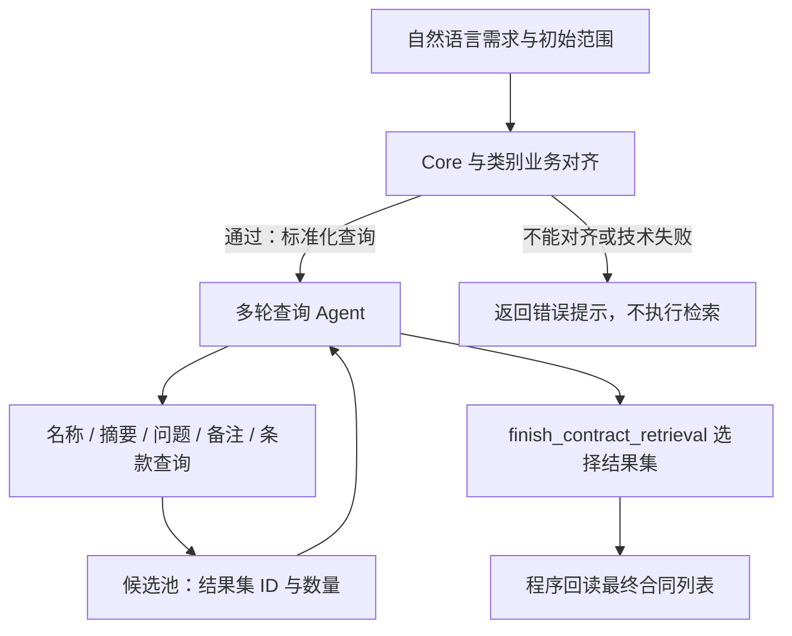

# 合同候选查询子图

`agent_core/subgraph/contract_retrieval` 收束名称、摘要、问题、用户备注、条款五种文本查询及动态 Core、合同类型筛选。主 Agent Core 调用 `search_contracts` 提交自然语言需求；最终列表存入独立会话缓存，搜索返回 ID 和数量，通过 `view_contract_candidates` 分页查看。图片检索及其查看、关系检索及其查看仍在主模型侧。

---

## 输入输出与职责

主工具参数为 query 和可选 result_id。query 保留完整条件，不要求主模型预先选择内部检索方式；result_id 可引用当前会话的图片检索集合或已有最终候选集合。宿主先解析为不可变合同 ID 范围，子模型看不到完整初始名单。省略则查询全库 ready 合同，空范围不退回全库；初始引用查询期间失效则整个查询失败。

子图输出 status、candidates、explanation，失败带 error。子图内部返回最终列表后，主工具将其 ID、分数、查询方式和说明存入独立最终结果池，返回 result_id、count 和 explanation，不直接展开列表，也不返回子图中间引用。零结果不建池、不返回 ID。每个候选包含完整 document_id、当前 file_name、summary、综合排序 score、最近一次相关性查询的 raw_score/search_type、score_kind 和 has_relevance；不同方式的原始分数不可直接比较。列表由程序按所选池顺序回读，仅保留仍 ready 的合同，不接受模型撰写的合同列表。

候选表示检索相关性，不表示全部业务条件已满足。说明必须指出尚未验证的条件；子 Agent 未查看正文，不能声明合同具体约定已经核实。

---

## 子图及多轮工具



七种查询工具位于 `subgraph/contract_retrieval/tool/`，不再在主 Agent Core 注册。查询后仅回显 count、内部 result_id 和必要提示，不展开名单，没有 view 工具。子 Agent 按自然语言需求和数量反馈选择下一步，不执行固定六路并行。

| 内部查询 | 输入风格 | 实现 |
| --- | --- | --- |
| `search_contracts_by_name` | “xxx合同”式简短名称 | 名称 BM25 |
| `search_contracts_by_summary` | 简短、正式的拟写摘要 | 摘要向量＋BM25、RRF |
| `search_contracts_by_question` | 用户直接提问的自然问句 | ES 问题融合向量；未注入 ES 时不提供该工具 |
| `search_contracts_by_notes` | 用户观察、风险、提醒式备注 | 备注向量＋BM25、RRF，归并合同 |
| `search_contracts_by_clause` | 简洁的目标条款表述，保留条件、否定与例外 | ES 条款标题＋正文 BM25，最高条款分；未注入 ES 时不提供 |
| `search_contracts_by_category` | category 标准类型代码、可选 result_id | ES nested类别code精确筛选，保留原排名 |
| `search_contracts_by_core` | 按动态 Core 字段选填 eq/gt/gte/lt/lte/match，已填条件按AND组合 | ES Core 筛选，不引入新排名；需要 ES |

类型筛选详见[合同类型筛选工具](contract-category-search.md)。

Core 筛选由启动期字段目录自动编译，详见[动态 Core 筛选工具](contract-core-search.md)。查询风格及底层索引细节分别见对应专题文档。

### 查询策略与事实边界

系统提示词按“需求与查询方式、结果引用与多步查找、调整与结束、交互规则”分层，并为五种查询提供改写示例。只使用原需求中的线索，保留否定、时间限制与不确定性，不为了拟写完整名称或摘要补造事实。

- 优先选择适合主要线索的查询方式；仅在存在新筛选目的时追加查询，不要求全部查询方式执行。
- 带 result_id 的查询仅在已有候选中继续检索；省略或 null 回到初始范围。串行检索不适合替代条件的并集，OR 可分别查询分支后使用 union_contract_results 合并。
- 计数是有限召回数量，不能据此比较集合质量或声称全库无匹配。语义命中不证明日期、金额、否定等必要条件已通过严格校验。
- 查询已充分表达主要线索时可以提交候选，不要求子 Agent 查看其无法读取的正文。未核实必要条件、未覆盖分支和执行失败造成的限制必须通过 explanation 说明。
- 零结果可调整表达或查询方式，但不得静默删除必要条件；失败不能被解释为零结果。多步示例同时说明正常提交与第二次查询无结果的边界。


---

## 候选池与完成规则

每次子图调用创建独立 CandidatePool，内部引用为 `candidate-set:UUID`，保存合同 ID、综合分数、本轮原始分数、查询方式和相关性标记；按既有 `COMMUNICATION_CONTRACT_SEARCH_CACHE_MAX_QUERIES` 容量执行 LRU。没有正文缓存或查看/分页方法，不向主模型暴露内部池引用。

每次查询可引用之前的 result_id 限定范围；省略时回到本次初始范围，不能扩大宿主限定。不同查询生成独立集合，不覆盖旧集合；在父结果范围内查询时融合历史与本轮排名，不直接混合原始分值。零结果没有 ID。被驱逐的引用报错，需重新查询。

`tool/finish.py` 集中定义结束工具参数、执行适配和注册，`session.py` 保留结果读取逻辑，`agent.py` 仅装配工具并接收完成结果。

`finish_contract_retrieval` 接收可选内部 result_id 和可选查询说明。传入有效 ID 则提交该列表；省略或 null 表示没有找到合适的合同并结束，即使池中已有候选也允许不提交。空字符串、伪造或驱逐引用报错，不转换为空结果。执行异常仍不能解释为数据库没有相关合同。完成时程序读取真实名单，过滤已不可用合同，再释放整个内部池。图片检索会话池不受影响。

---

## 上下文、失败与配置

提示词 `contract-retrieval-v12` 使用注入工具模板；启用模型思考，但成功历史只保留工具调用与计数回执，长思考仅留私有审计。每轮恰好一个工具，不带普通正文，所有参数经过本地兼容解析与 Schema 校验。连续错误使用 system-guidence 纠错，成功后清除失败链，审计保留原响应。

最多三次连续错误；`COMMUNICATION_CONTRACT_RETRIEVAL_MAX_ROUNDS` 默认 16，范围 1–64。达到上限、模型异常、会话释放均失败，不发布未收束的部分列表。主工具 SSE 为 local-search，返回普通引用回执；`view_contract_candidates` 为 thinking，返回 foldable 页面。

宿主将子图审计保存在会话工具状态的 search_audit 中，随会话释放。现有各检索 top_k、模型、分词和数据库配置不变；不新增数据库表或回填向量。

---

## 验证

测试覆盖成功回执不含名单、无内部 view 工具、多步结果池引用、初始范围不可扩大、空结果合法收束、伪造引用纠错、错误链清理与审计、轮数上限、LRU、已删除合同过滤、主模型统一入口，以及图片结果传入子图。此轮使用模拟生成与编码，不构成真实模型查询策略质量验证。


---

## 主模型最终结果池与查看工具

`tool/contract_retrieval.py` 中的 `ContractRetrievalResults` 是每个驻留会话独立的最终结果池，引用前缀 `contract-query:`；与图片的 `contract-search:`、关系的 `relation-search:`、子图内部 `candidate-set:` 隔离。

- 搜索只返回最终结果集 ID、数量和查询说明；不自动展开第一页。
- `view_contract_candidates(result_id, page?)`：省略页码首次第1页，后续下一页；显式页码可重看。越界与末页反馈分开，失败不移动游标。
- 只缓存合同 ID、分数、查询方式及查询说明，不缓存合同名称、摘要或渲染页面。分页实时读取；合同不可用时显示提示，排名仍是原查询快照。
- 每个结果集保存独立游标，采用 LRU；会话驱逐、删除、关闭时立即释放并撤销签名，迟到查询不得恢复缓存。不落盘，不跨服务重启。
- 查询可再次引用这个最终集合限定范围。失效或类型错误引用报错，不退回全库。
- 备注来源只展示合同候选，不再展开命中备注。综合分数按 raw/rrf/filter 区分；跨查询 RRF 同时展示本轮原始分数，不作为置信度。

独立配置：`COMMUNICATION_CONTRACT_RETRIEVAL_CACHE_MAX_QUERIES=10`、`COMMUNICATION_CONTRACT_RETRIEVAL_PAGE_SIZE=5`。子图中间池保持单次调用生命周期和既有容量配置，不提供 view 工具。

宿主 `CommunicationFileTools` 统一装配搜索、查看、页面解析与会话释放；缓存测试覆盖隔离、LRU、实时读取、签名、分页、零结果、迟到响应和用最终结果继续限定范围。


---

## 条款检索

实现位于 `subgraph/contract_retrieval/tool/contract_clause_search.py`，注册名为 `search_contracts_by_clause`，参数为 query 与可选 result_id。query 拟写目标条款表述，不补造金额、期限或权利；命中仅代表文字相关。当前 Agent 在有 ES 客户端时注入该工具，主 Agent 仍通过统一 search_contracts 调用子智能体，不单独暴露内部工具。

所有已入库条款都参与查询：在 clauses nested 内对 clauses.title 与 clauses.content 执行 multi_match / most_fields，两个字段等权参与，合并同一条款的得分；nested.score_mode=max 将最高命中条款分作为合同得分，不按条款数量累加。依赖现有中文分析器和默认 BM25，不调用向量服务，不新增 mapping。不同条款间不会被拼成一条满足所有条件的原文。未来若要求多个独立条款条件同时满足，需另行定义多条件查询语义。

result_id 先解析为合同 ID 白名单，作为 ES 父文档 filter；省略时使用本次初始范围。显式空范围直接返回零结果，不查全库。ES 超时、分片失败、非法分数及引用中途失效均返回错误，不伪装零结果。

`COMMUNICATION_CONTRACT_CLAUSE_SEARCH_TOP_K` 默认10，允许1～50。最多多取4倍（上限200）ES候选，过滤 SQLite 非 ready 合同后按得分降序、同分合同ID升序截取；因此 count 是有限候选数，并非全库精确总数。零结果不生成ID。结果池记录 search_type=clause，收束和主模型分页沿用现有机制，页面标注“条款匹配分数（BM25，最高条款分）”。不向子模型返回条款正文或名单，也不额外提供 view 工具。

测试覆盖 max 查询结构、范围隔离、空范围、零结果、引用过期、ES 部分失败、工具参数描述、子智能体工具调用与完成，以及最终缓存分页。已对开发索引执行只读查询，核对2份命中合同的父文档分数与最高 inner_hit 分数一致；不构成真实模型选用工具或召回准确率的验证。


---

## 检索前业务对齐

`node.py` 统一定义业务对齐节点 `align_contract_query`、正式查询节点 `retrieve_contracts` 及其校验和多轮查询逻辑。`workflow.py` 仅负责节点装配与路由，先调用业务对齐节点，只有通过才将 result 作为下一层 query；初始合同 ID 范围保持不变。失败直接返回错误，不查询数据库、不建结果池，也不解释为零命中。主工具把节点生成的友好提示作为错误 message 交还主模型。

节点输入 query；按 `definition/field` 与合同类别目录中对应条件进行标准化，其他条款、备注等内容保持原样。裸符号币种歧义、非法枚举、无法表达的税率或无法唯一确定的相关类别条件应熔断；不属于两个目录的内容不是拒绝理由。金额保持浮点数能力，不能强制整数。

使用原生思考与强制 JSON Schema，输出按顺序为 evidence、reasoning、can_align、result。通过时 result 是完整对齐查询；拒绝时 result 是模型生成的具体原因及澄清建议。evidence 保存原文片段、Core/类别 code、属性 code、标准值和局部转换表述，供程序校验目录、枚举、范围及替换位置；程序核对 result 等于局部转换后全文，避免改写无关部分。语义映射正确性仍需模型判断，机器校验不能证明所有业务解释均准确。

`prompt.py` 的 `render_business_definitions` 将权威定义分为 Core 字段和合同类别两大区，每个字段/类别独立标题加精简 YAML。保留名称、code、别名、含义与排除边界；Core 额外提供属性类型、基数、硬约束、转换规则；类别提供核心义务交换、包含条件与相邻类别区分。不注入路径、哈希、索引分词/日期配置或专家案例。正式应用由 bootstrap 经 CommunicationFileTools 注入启动期不可变目录快照；独立构图可按同一路径加载，不能从模型生成定义。

业务对齐节点仍通过 `render_business_definitions` 注入 Core 与合同类型目录。后续查询智能体不再将两份配置重复追加到 system；Core 定义仅通过动态工具参数 Schema 提供。对齐节点与 Core 工具继续使用同一启动期字段快照，类别目录交给对齐节点与类型工具编译器。用户消息仍只承载查找需求和初始范围，工具注入位置不变。查询提示词版本为 `contract-retrieval-v12`。

查询提示词保留能力边界：合同类型通过独立 search_contracts_by_category 筛选，不能作为 Core 字段提交，也不能把名称或摘要命中描述为已完成类别筛选。

对齐提示词版本 contract-query-alignment-v2，最多3次生成校验尝试；失败输出只留私有审计，纠错上下文仅追加精确错误提示，通过后清除整段反馈。合法业务拒绝立即终止，不要求模型改口通过；技术失败返回通用错误，不泄漏内部异常。业务对齐本身不执行查询；实际筛选由 Core 工具执行，合同类型由独立类型工具筛选。

测试覆盖无需对齐原样放行、枚举转换、浮点金额、类别代码校验、无关文字保留、错误恢复、业务拒绝和失败阻止检索，以及初始范围完整传递；生成客户端为模拟，不代表真实模型对齐准确率已验证。


---

## 跨查询排名融合

`agent_core/contract_ranking.py` 集中定义排名计算，五种内部查询均将 parent_result_id 传给 CandidatePool。首次相关性查询直接使用本轮原始分数；在已有相关性结果上继续查询时，仅对本轮幸存合同计算加权 RRF：

```text
score = history_weight / (k + historical_rank)
      + (1 - history_weight) / (k + current_rank)
```

历史排名先在本轮幸存集合中重编号；同分共享名次（竞争排名，例如1、1、3），融合后同分按合同ID稳定排序，不能把ID次序当成额外相关性证据。每次只融合上一集合的综合排名与当前排名，不累加所有历史原始分数，也不进行集合并集。工具的 top_k 先决定本轮召回集合，融合仅重排这些候选，无法恢复未召回条目。

配置 `COMMUNICATION_CONTRACT_RETRIEVAL_RRF_K=60`、`COMMUNICATION_CONTRACT_RETRIEVAL_HISTORY_WEIGHT=0.5`；本轮权重为1减历史权重。分数含义通过 score_kind 区分：raw 为原始排序分值（摘要/备注的原始值本身可为工具内部RRF）、rrf 为跨查询融合、filter 为首次纯过滤。

CandidatePool.filter 是 Core 工具使用的筛选入口。已有集合经精确过滤后，综合分数、最近一次相关性原分、score_kind、has_relevance 和相对顺序全部继承；首次全库过滤时统一记1并标记 has_relevance=false，ID顺序仅用于展示。下一次相关性查询忽略这种无相关性历史，直接采用本轮分数。

主模型的图片/最终候选引用进入新查询时，除了初始ID范围，还传递内部 initial_ranking 快照；对齐节点只修改 query，不修改排名及范围。最终候选缓存保留原始分数和综合分数，后续再次查询仍能继续融合。引用失效、越过父集合、重复ID或非法分数必须拒绝，不允许隐式放大全库或发布部分结果。

测试覆盖分值尺度变化不影响排名融合、同分处理、幸存排名、权重、精确过滤保分保序、首次过滤不引入偏差、最终分页标签及跨结果池排名快照。上述属于确定性算法和模拟工具回归，未据此声称实际召回质量提升。

主 Agent 的 `search_contracts_by_image` 同样接受图片或最终候选 `result_id`，以 ES ID 前置过滤限定范围，并使用上述共享配置融合历史排名与本轮图片排名。输出仍存入图片结果池、由 `view_contract_search_results` 查看；原始余弦门槛先于融合执行。详见[合同图像相似检索](contract-image-search.md#候选范围与排名融合)。


---

## 两表 OR 合并

`tool/union.py` 定义并注册 `union_contract_results(left_result_id, right_result_id)`，供子 Agent 调用，不单独暴露给主模型。两参数为本次子图的完整候选引用；取合同 ID 并集去重，成功返回新 ID、数量，继续沿用内部LRU。相同ID复用原集合，避免重复计分；引用失效或越过宿主初始范围报错，失败不发布半成品。默认SSE为thinking。

每表等权0.5，采用 `0.5/(k+左排名)+0.5/(k+右排名)`，复用 `COMMUNICATION_CONTRACT_RETRIEVAL_RRF_K`。不存在的一路不贡献分数，不按每个合同命中路数调整分母。两表没有历史/新查询之分，不使用串行查询的历史权重配置。交换左右结果不改变排名，同分按合同ID稳定展示。

只有相关性表提供排名证据；混合并集中纯筛选独有合同贡献为0但保留。两表均无相关性时统一记1、标记filter和has_relevance=false，不制造相关性顺序。混合并集采用union/rrf，其raw_score为本次合并分数而非任一路余弦或BM25；后续精确过滤保分保序。再次合并或相关性查询时，原并集中零贡献成员不会凭展示名次产生历史证据。

正式结束时沿用ready核验；最终缓存、分页及跨查询排名快照支持union类型，页面注明零分语义。不访问数据库的合并数量是驻留候选数量，合同删除后最终回读数量可能减少。零结果没有ID：一表空时直接选另一表，两表均空则不提交ID。

为实现OR，应在相同初始范围独立执行两次查询，不能先用第一表限定第二次查询（那是AND）。本工具不追踪完整来源谱系：不同ID若继承同一份历史证据，仍可能重复计分；提示词禁止为抬分反复合并同源结果。超过两路逐次合并不是全局等权多路RRF，结合顺序可能影响排名。

`tests/test_contract_results_union.py` 覆盖缺席贡献、等权交换不变、纯筛选与混合并集、零贡献后续继承、相同ID、LRU/失效、收束分页及子Agent串联调用。均为离线验证。


---

## 组合查询质量实验

[实验方案](../../../../experiment/contract-retrieval-quality/README.md)提供29个常规、边界及协议恢复用例；其中26题可使用真实模型执行业务对齐与多轮工具选择，3题以离线故障脚本验证纠错。合成后端隔离生产数据，覆盖七种查询、AND/OR、金额/日期边界、同主体条件、空范围、非法枚举及熔断。通过结果只说明该可控后端上的调用策略，不代表真实ES/SQLite召回质量；逐次产物与人工分析位于实验output目录。

真实服务测试使用实验中的 `run_real.py`，包含明确路径引导、真实Embedding请求、SQLite两路命中和候选池融合分数记录。当前两份旧提取合同只验证旧数据上的运行与排名链路，不以历史中文币种/角色漏查评价新字段强约束；具体边界及复现见实验方案。
