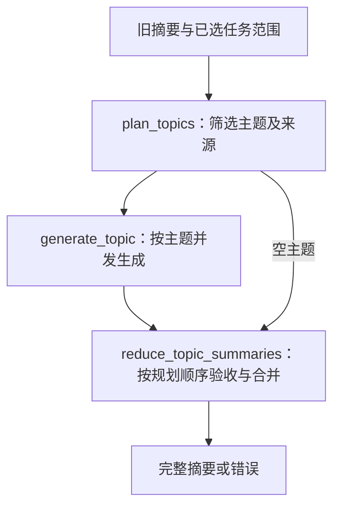

# FIFO 工作记忆摘要

本模块位于`fifo_management/fifo_summary/`，把选定轨迹及旧累计摘要整理为可继续工作的主题记忆。它负责内容摘要，不负责选择FIFO驱逐范围、修改工作区或执行用户工具。容量和轨迹管理由外围FIFO管理子图负责。

当前采用业务无关的筛选规则：规划提示词`fifo-topic-planning-v10`、生成提示词`fifo-topic-generation-v17`、输入渲染`fifo-topic-readable-v4`、最终结构`fifo-topic-summary-v2`。提示词不预设付款、交付等领域分类，示例使用通用状态更新和产物版本。

---

## 目标与保留原则

摘要让模型继续任务时不遗漏关键约束、不误判当前状态、不重复已经完成的工作。它不是完整交互报告，不要求覆盖所有历史任务或逐次记录查询、核验和答复。

- 相关问题合并为主题，按后续使用价值筛选内容。
- 全局目标、偏好和跨主题限制集中到一个全局主题；业务主题不重新提取早期全局目标。只约束特定事项的条件与暂停仍保留在相关主题。
- 可靠更新通常覆盖旧状态，必要历史用一句话说明；未被新资料提及的有效旧信息不自动失效。
- 过程仅在方法、失败原因或检索范围可以避免重复探索时保留；交付记录合并为有用的产物标识、版本与覆盖范围。
- 已解决或撤销事项不继续列为未决，暂停不意味着解决或允许自行恢复。
- 允许局部省略，不允许改反事实、遗漏关键条件或把不确定性写成确定事实。

节点2仅筛选、合并、改写已有信息及明确的状态更新，不推导新事实、结论或完成状态；未经资料确认的合理推测宁可省略。请求不等于完成，成功反馈不扩展到其未明确指向的事项；合并不改变主体、对象、范围、条件或确认程度，引用须支持实际表述。这一规则使用通用动作与证据概念，不加入特定业务案例。

这些属于模型的语义约束，程序不把结构合法等同于内容准确或压缩充分。

---

## 输入输出与工作流

入口为`build_fifo_summary_subgraph(planner=..., generator=...)`，两个依赖均可注入。默认采用真实主题规划器和生成器；显式占位函数仅用于测试，抛出`NotImplementedError`。



等价流程：输入校验 → 主题规划 → 按主题并发生成 → 最终验收；空主题直接进入最终验收。最后节点始终为`reduce_topic_summaries`，只有它连接结束节点。

输入为`FIFOCompressionRequest`，包括旧`summary`、选定`tasks`、完整`scope`及执行阶段。任务标识唯一，任务顺序与范围一致，压缩范围末项必须为completed且范围内不得含active任务。模型不决定FIFO驱逐边界。

输出为`FIFOSummaryResult`：成功时包含完整新摘要；失败时只有错误类别及反馈，不提交部分生成结果。新摘要包含程序维护的version、latest_coverage及按规划排序的topics。未引用旧主题不自动继承，只有完整成功替换后才移除；失败不会修改原摘要。

---

## 节点1：记忆主题筛选

`run_topic_planner`联合阅读旧摘要与过滤后的有效轨迹，输出`TopicPlan`。主题数量0至32，不按任务数分配，也不为每次查询或答复单独建主题。旧主题无新增资料但仍有价值时需显式引用；已完成且不影响继续工作的过程可以舍弃。

工具保持两个：

| 工具 | 用途 |
| --- | --- |
| extract_topic | 提交主题标识、名称、简短scope及新旧来源；同标识完整替换，顺序不变。 |
| finish_topic_planning | 确认完成，简述筛选情况；允许空规划，不能由普通文本代替。 |

每次最多一个工具调用，允许独立分析轮；普通文本不提交主题。工具定义由接口提供，调用格式从可信配置注入，不在提示词中复制参数模板。参数字段均有Schema描述。

scope仅说明有保留价值的当前状态、关键限制、未决事项和排除范围，不预写事实结论、金额日期清单或完整时间线。task_ids引用本次任务，previous_topic_ids引用旧主题；列表不得重复，每个主题至少一种来源。减少输出内容不等于忽略改变结论的更正、撤销、暂停和完成记录。

默认总轮数96，连续无效动作上限3。成功动作后清理连续失败上下文，保留私有审计；独立分析轮不等同工具成功，不重置纠错状态。

---

## 节点2：两区域主题记忆

接口为异步`generator(TopicGenerationRequest) -> TopicSummary`。每个分支独立获得唯一主题、其引用的任务副本与选定旧主题；不共享可变输入，不调用主助手工具，不递归管理FIFO。

模型通过JSON Schema提交：

```json
{
  "summary": {
    "current_memory": [],
    "open_items": []
  }
}
```

| 区域 | 内容 |
| --- | --- |
| current_memory | 可继续使用的当前事实、条件、必要限制和重要交付状态；全局主题可包含有效要求。必要历史仅简要保留。 |
| open_items | 未解决的问题、必要前提和暂停状态，不新增调查计划。 |

条目保持`content、task_ids、sources`结构。同一信息优先放一个区域，不重复全文，无独立内容时使用空列表。两区域不是将旧五区域全部堆进current_memory。

sources只能来自已提供的可定位出处或来源说明；缺少时为空。task_ids只能引用本分支本次任务，来自旧摘要的条目可为空，旧历史任务标识不可冒充本次引用。程序补齐topic_id和title，模型不能生成这两个身份字段。

两个节点的提示词及生成纠错提示均不显式说明推理模式，只描述任务、工具行为和输出格式。模型推理开关由请求参数控制，不属于模型可见任务说明。

生成默认最多3次尝试，可传`max_attempts=1`作单次实验。拒答、工具调用、截断、空正文、非法JSON、Schema错误及任务引用越界均不提交。纠错仅追加最小反馈，不回显失败正文；全部原始响应保留私有审计，正常完成后仅业务摘要进入结果。

---

## 旧五区域兼容

兼容仅发生在旧摘要输入边界，不放宽新模型输出：

- `fifo-topic-summary-v1`读取为`LegacyTopicSummary`，保留用户要求、已知信息、探索结果、交付内容、未决事项五个原区域。
- `fifo-topic-summary-v2`读取两区域`TopicSummary`。
- 无version的旧调用方按单个主题字段识别五区域或两区域；混入两套字段的单个主题拒绝，不静默丢弃字段。
- 显式版本与字段不匹配、未知版本、缺字段或非法来源结构拒绝；不猜测迁移。

旧五区域在生成输入中以原分区呈现并说明其历史性质，不由程序扁平合并成当前事实。模型依据最新证据重新选择，再输出两区域。新摘要下一轮可直接作为旧输入；新输出不接受五区域。历史原始产物不改写。

---

## 节点3：Reduce

Reduce不调用模型。它按规划顺序检查所有结果恰好对应一个主题、身份与名称一致、条目引用合法。缺失、重复、未知主题或任何分支失败均返回错误；全部成功才生成v2摘要。空规划返回空topics，不沿用旧主题。

当前没有跨主题语义消歧或全局约束强制注入，因此主题边界与全局要求去重仍需实验检查，不能仅凭Schema校验作质量结论。

---

## 模型配置与验证

两个节点继续使用Qwen3.8-Flash-Next官方推理采样：temperature=1.0、top_p=0.95、top_k=20、min_p=0、presence_penalty=0、repetition_penalty=1。显式开启推理，强度统一读取 VLLM_MLLM_REASONING_EFFORT（默认 xhigh）；seed与输出额度来自应用配置，当前分别为3407和16384。依据[官方模型卡](https://huggingface.co/Qwen/Qwen3.8-Flash-Next#best-practices)。推理与最终输出共用额度；原生推理只留审计，不作为事实依据。

本次离线验证覆盖旧五区域保留、新两区域发布与再次读取、混合字段及版本错误拒绝、失败不提交、工具恢复、并发排序与引用边界。提示词筛选效果和实际压缩量尚需真实模型复测。

相关实验：

- [单主题推理实验与复测入口](../../../../experiment/fifo-reasoning-json/README.md)。
- [完整主题摘要联调入口](../../../../experiment/fifo-topic-generation/README.md)。
- [旧五区域独立长轨迹结果](../../../../experiment/fifo-topic-generation/output/20260914T141140.123437Z/analysis.md)：全部分支成功，但出现跨主题旧目标污染，摘要剩余70.57%。该结果属于旧v14五区域，不能作为当前两区域效果证明。


---

## 两区域长轨迹复测

规划v10、生成v16在同一24任务口述史场景完成8主题、17次调用，无截断或重试，旧五区域输入成功转换为v2。输入23025 tokens，摘要7165 tokens，保留31.12%，较旧五区域摘要小55.90%。主要业务状态保留；公开许可主题错误声明备忘录已交付，全局保全解除条件被简化，不能判为完全准确。见[完整分析](../../../../experiment/fifo-topic-generation/output/20260914T142731.512580Z/analysis.md)。


---

## 事实边界v17复测

同一24任务长轨迹完整复测：8主题、17次调用一次通过，无截断；59条摘要、7672 tokens。上一轮备忘录交付错误及更新引用错位未复现，主要事实状态正确；仍有条件性新检索表述和恢复发布主体泛化，不能声称严格零推导。以事实准确性为主评估，单纯遗漏不计错。见[实验分析](../../../../experiment/fifo-topic-generation/output/20260914T143702.617558Z/analysis.md)。
