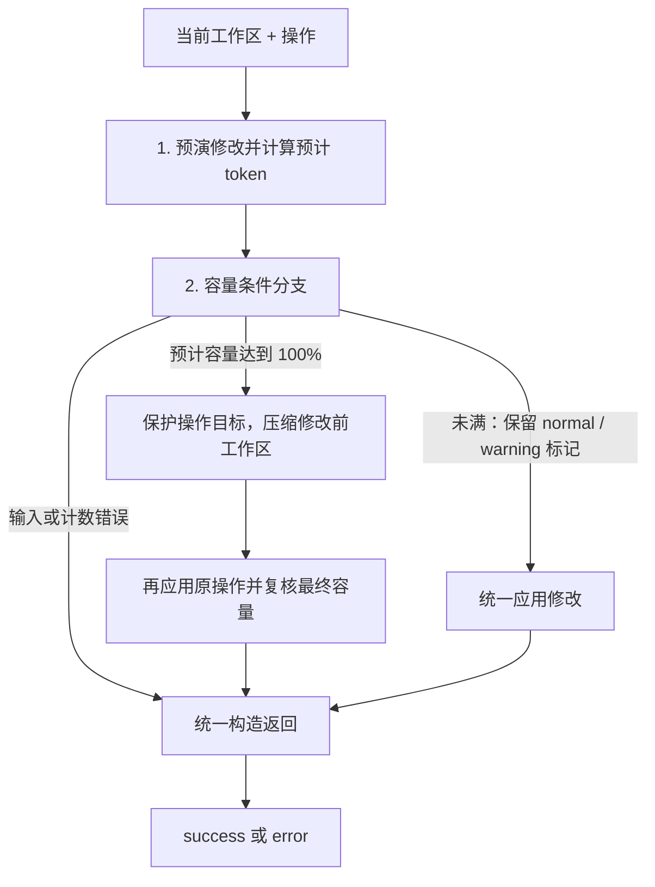

# 工作区管理子图

> **当前状态：** 已构建可独立执行、可注入依赖的工作区管理子图，包含预演、容量分支、目标保护、应用操作和统一返回。节点 1 已默认通过 vLLM `/tokenize` 异步计数，压缩后的复核也使用同一计数接口。自动压缩子 Agent 的调用入口及前后校验已实现，多轮工具循环、原生思考、纠错清理和私有审计已接入；主助手执行入口及提交后的主任务轨迹接入尚未实现；依赖不可用时返回明确错误，不伪造成功。

FIFO 外层与工作区内层已通过注册表执行器装配，入口、提交与回执边界见[主助手工具执行](tool-execution.md)；正式模型循环仍待接入。

所属模块见 [Agent Core](agent-core.md)，操作定义见[工作区管理工具](workspace-tools.md)，内容契约见 [SQLite 工作区](../../data/communication-sqlite.md#工作区-kv-内容)。代码入口是 [workspace_management](../../../../app/agent/contract_communication/agent_core/subgraph/workspace_management/__init__.py)。

容量预算的统一输入、3:7 分配及累计摘要扣减见[上下文预算](context-budget.md)；纯计算方法已实现，正式上下文计数与自动装配尚待接入。

---

## 输入与输出

外部输入严格限定两个内容，由 `WorkspaceManagementRequest` 校验：

| 输入 | 内容 |
| --- | --- |
| `workspace` | 当前 WorkspacePayload 内容；不包含用户身份、会话 ID 或提交版本。 |
| `operation` | `{name, arguments}`，name 为已有三个工具之一，arguments 为真实工具调用的原始 JSON 参数字符串。 |

外部输出由 `WorkspaceManagementResult` 校验：

| 状态 | workspace | tool_feedback | system_guidence | error_feedback |
| --- | --- | --- | --- | --- |
| `success` | 新的候选工作区。 | 成功提示 + 最终使用量。 | 超阈值或自动压缩时的 user 角色提示；普通成功为 null。 | null。 |
| `error` | null。 | null。 | null。 | 普通工具调用错误反馈。 |

成功不意味着持久化已经完成。调用方持有原始版本，需先通过受权接口校验版本并提交，成功后以 tool_feedback 记录正常工具结果，再把非空 system_guidence 作为独立 user 消息追加到模型任务轨迹。错误时整次操作不提交，包括自动压缩后仍无法应用操作的情况。用户展示轨迹与模型轨迹分开处理，系统提示不自动作为用户可见回答。

tool_feedback 示例：`工作区修改成功。当前使用量：720/1000 token（72.0%）。` 使用量取最终候选（包括自动压缩后再应用操作的结果），不使用压缩前预估值。workspace 供外部更新动态工作区，不应把整个子图输出重复作为工具消息写入任务轨迹。若外部提交冲突或失败，不能发布候选成功反馈。

子图不读取数据库、不写入会话服务、不修改输入对象，也不接收来自模型的执行身份。调用方仍需保证单工具调用、审计、有限纠错、取消/替代及迟到结果隔离。

---

## 包与节点

```text
agent_core/subgraph/workspace_management/
  __init__.py    对外导出
  schema.py      请求、结果和压缩依赖契约
  state.py       图输入、输出和私有状态
  node.py        预演、分支、应用和反馈
  token_count.py 工作区统一渲染与异步接口计数
  workflow.py    绑定依赖与装配拓扑
  compression/   自动压缩子 Agent（schema、agent、runtime、prompt、feedback、tool）
```



阅读环境不渲染 Mermaid 时，等价顺序为：输入 → 预演计数 → 分支；满容量走保护与压缩 → 应用原操作；未满统一应用修改，保留 normal / warning 标记传给最终节点；各分支统一返回。

| 节点 | 当前行为 |
| --- | --- |
| `estimate_modified_tokens` | 复用工具 Schema 在副本预演，冻结新增 ID，等待异步计数接口（可替换为测试计数器）。失败进入错误收尾。 |
| `choose_capacity_branch` | 内部记录 normal、warning、full 或 error；使用整数比较避免浮点误差。 |
| `compress_before_modification` | 生成目标保护契约，调用 compression 子 Agent；成功候选传给应用节点，错误传给尾部收尾。 |
| `apply_after_compression` | 将预演冻结的修改应用到压缩候选，完整校验并重新计数。 |
| `apply_without_compression` | 未满容量统一应用预演结果，透传 branch=normal/warning；最终节点据此决定是否附加整理提示。 |
| `build_final_result` | 根据实际分支、最终容量和错误状态构造外部结果；不泄漏内部候选或异常原文。 |

normal / warning 是图内状态标记，两者路由到同一个应用节点，不额外引入并发信号量或重复的布尔字段。最终节点读取保留的 branch 构造反馈。

这里“应用”指构造可提交的输出，不代表写入正式存储。压缩失败后下一个应用节点只传播错误，不继续修改，也不生成成功通知。

---

## 容量分支与提示

以预算 B 和预演 token 数 N 判断：

- N ≥ B：满容量分支优先。
- 0.8B < N < B：提醒分支；成功提示要求优先整理至严格低于 80%。
- N ≤ 0.8B：正常分支。80% 本身不触发超阈值提醒。

满容量分支压缩后重新应用操作，最终候选必须严格低于预算的 80%，否则返回 error，不能只因低于硬上限就宣布自动压缩成功。CompressionRequest.target_tokens 使用 `(7 * B - 1) // 10` 表达压缩副本严格低于 70% 时允许的最大整数 token 数，不包含待执行修改。默认压缩子 Agent 在副本达标且 finish_compression 被接受后返回，再应用原操作，最终仍须低于 80%，才可恢复任务。

每次成功均通过 tool_feedback 提供已用 token、预算与展示百分比，正常分支不再发送 system-guidence。自主整理时模型依据工具反馈继续判断，使用率低于 80% 即可结束整理；恰好 80% 虽不触发新的告警，但尚未达到严格低于 80% 的整理目标。边界判断使用实际 token 比例，不能依赖四舍五入后的展示百分比。主助手自主整理不需要跨调用整理状态字段；70% 仅用于自动压缩子 Agent 的副本目标。

自动压缩成功的提示明确告知“达到 100%，系统已触发自动压缩”，并记录预计修改后的容量判定依据、最终计数、已低于 80% 与“先压缩后应用修改”的事实，不虚构模型未提供的条目级压缩总结。系统提示在外部提交成功后才加入任务轨迹，防止版本冲突时主助手误信已更新。

---

## 修改目标保护

`CompressionRequest` 包含原工作区、原操作、protected_values、reserved_path、硬预算与自动压缩目标；压缩依赖只返回候选工作区，不替主助手执行待处理操作。

- 修改或删除具体条目时保护该条目；修改信息或探索记录的某一字段时，保护整个对象，避免原操作覆盖压缩后的其他语义变化。
- 主任务和补充约束按其精确路径保护。
- 向已探索区新增时，保护待转移的剩余方向以及本次结论所需的已知信息。
- 普通新增在预演时分配 ID，并保留最终路径；压缩结果不能占用该路径。后续应用不重新调用工具预演生成第二个 ID。
- 压缩结果必须通过完整工作区 Schema，且保护值逐项保持不变。随后才移除、替换或加入预演结果，并再次校验引用、区域互斥与容量。

目标保护是程序可执行的最低边界。压缩是否保留其余用户要求、来源和关键结论，已通过专用提示词约束，但仍需真实合同样本的语义验收及实验验证；当前结构校验不能证明信息完全无损。

---

## 依赖与使用

`build_workspace_management_subgraph(token_budget=..., counter=..., compressor=...)` 返回编译后的图：

- token_budget 必须为正整数，由程序配置，不来自模型操作参数。
- counter 默认使用 `count_workspace_tokens`，异步调用 vLLM；允许注入返回整数或 awaitable 整数的函数用于测试。显式传入 None 会返回计数不可用错误，不用字符数冒充真实 token。子图通过 `ainvoke` / `astream` 执行。
- compressor 为异步函数 `CompressionRequest -> WorkspacePayload`；只有 full 分支使用。省略时默认执行已接入的多轮压缩子 Agent；接口失败或超限时返回错误，允许注入自定义实现用于测试。
- 装配时不读取模型配置、不创建连接；实际执行计数时才读取配置和请求服务。满容量时按需创建 MLLMClient 执行压缩；装配本身不发送请求。

```python
from app.agent.contract_communication.agent_core.subgraph.workspace_management import (
    build_workspace_management_subgraph,
    WorkspaceManagementResult,
)

graph = build_workspace_management_subgraph(
    token_budget=workspace_budget,
    # 默认使用接口计数和多轮压缩子 Agent，无需额外绑定。
)
output = WorkspaceManagementResult.model_validate(await graph.ainvoke({
    "workspace": current_workspace,
    "operation": {
        "name": "workspace_replace",
        "arguments": '{"path":"/task_constraints/task","value":"核对首款支付情况"}',
    },
}))
```

调用方只需提供工作区预算；默认计数和压缩子 Agent 均复用现有 MLLM 配置。如需显式绑定配置，可传入 `partial(count_workspace_tokens, settings=mllm_settings)`。现有 `execute_workspace_tool` 仍是原有独立适配，本次没有将它自动切换到子图，也未接入实际任务轨迹。


---

## 自动压缩子 Agent

`compression.run_workspace_compression_agent(request, compressor=None)` 是普通异步调用入口，不构建额外 LangGraph。输入为 CompressionRequest，输出为 CompressionResult：status 为 success/error，成功携带 workspace 候选，错误仅携带 error_feedback。

父图的 compress_before_modification 负责准备保护契约并调用子 Agent。入口先验证原始保护值和容量目标，复制输入，再调用核心，最后校验候选结构、保护项及预留 ID。父图先对压缩候选计数并验收严格低于 70%，达标候选才继续进入 apply_after_compression → build_final_result → END；失败也经过尾部返回，应用节点不执行修改。

**核心实现：** `compression/runtime.py` 的 `run_compression_tool_loop`。复用 MLLMClient、当前 MLLM 配置、可信 tool_tag 文件及全局请求配额；默认 32 轮总调用、连续 3 次错误终止。参数可通过该函数的关键字参数覆盖，用于测试或显式绑定运行策略。工具列表固定为工作区增删改和 finish_compression，开启模型原生 thinking 通道，推理强度统一读取 VLLM_MLLM_REASONING_EFFORT。显式 think 工具及其参数、连续调用计数、软提醒和执行分支已删除。原生思考字段不作为工具正文或工作区事实；成功工具响应中的思考随本次子 Agent 调用历史保留，失败响应仍只进入私有审计。思考与工具参数共用 max_completion_tokens，截断响应不会提交修改。

循环先计数；即使初始副本已低于70%，仍需模型主动调用 finish_compression。其余每轮严格接受一个完整工具调用：工作区操作复用原有参数解析与纯预演工具，逐次校验保护项、预留 ID、引用和已有信息/探索状态（保留的原有信息 status 与探索 outcome 均不得改变）；不允许无实际变化的修改或伪造探索收束。计数成功后才更新隔离副本并写入成功反馈，副本达标后允许继续整理，只有合法完成工具调用才结束。不递归调用工作区管理子图。

复用 ToolProtocolRecovery 管理连续失败范围；协议、参数及业务错误共用边界，正确动作通过全部校验后清除整段失败轨迹。错误响应的普通文本和原始参数不回显，使用最小 system-guidence 反馈；协议提示沿用当前注入模板。模型误调用已删除的工具时按普通非法工具处理，修正成功后清除失败轨迹。

私有审计记录每轮原始调用参数、受长度限制的普通文本、响应与 token 指标、耗时、接受状态、工具反馈和系统提示，以及提示词/渲染版本和终止原因。CompressionResult.private_audit 不进入 model_dump，父图通过内部 compression_audit 保留，不能作为工具结果或主助手上下文。调用方也可传入独立 audit 列表，在取消或异常时保留已记录内容；当前未接入审计磁盘持久化。失败不输出循环中的半成品，取消正常传播，客户端按调用生命周期关闭。

子 Agent 不执行主助手待处理操作、不持久化、不向主助手轨迹直接追加内部工具过程。最终是否完成压缩写入，由父图应用原操作并通过接口复核容量后判断；严格低于 80% 才返回成功及自动压缩通知。


### 压缩提示词初版

`compression/prompt.py` 提供 `workspace-compression-v6`，独立于主助手工作区管理提示词。稳定规则说明低于 70% 的副本目标、四个区域的信息保留原则、保护项不可变、单工具调用、错误反馈和程序结束条件，并给出精简重复事实、保护条目及 70% 边界的示例。它不包含主助手的 80% 告警和 100% 自动压缩循环，不允许递归触发压缩。

- `build_workspace_compression_prompt(tool_call_template=...)`：生成稳定任务规则，工具调用格式来自可信配置注入，工具 JSON Schema 由 `build_compression_tools()` 生成并交给 vLLM 注入，不在提示词内复制。
- `build_workspace_compression_task_prompt(request)`：生成本次固定要求，只包含 token_budget、target_tokens、protected_values 和 reserved_path。保护值以 JSON 数据提供；完整工作区与主助手待执行的原操作不重复加入。

上下文按已约定的四部分组装：任务要求（稳定规则 + 本次固定约束）→ 工具定义 → 本次调用轨迹 → 最新工作区。最新工作区使用 `render_workspace`，每轮替换为最新副本，不能在末尾累计历史快照。请求显式使用 tool_placement=after_task、tool_task_index=1，将工具块锚定在固定任务约束之后，新增纠错消息和最新工作区不会移动工具块；仓库聊天模板已通过离线渲染测试，远端自定义模板仍需联调确认。

```python
from app.agent.contract_communication.agent_core.subgraph.workspace_management.compression import (
    build_workspace_compression_prompt,
    build_workspace_compression_task_prompt,
)

rules = build_workspace_compression_prompt(tool_call_template=trusted_tool_template)
task = build_workspace_compression_task_prompt(compression_request)
```

提示词已接入实际模型循环，逐步保护校验、工具反馈、轮数限制与完成工具验收由 runtime.py 落实。`tests/test_workspace_compression_prompt.py` 验证重复渲染、注入花括号保留、动态约束字段范围和非法目标拒收，这些测试不调用真实模型；历史版本已完成真实服务实验，范围见下文。


### 压缩工具清单

`compression/tool/__init__.py` 统一构造 workspace_replace、workspace_add、workspace_delete 和 finish_compression。每次构建独立定义，不再提供分析摘要工具、连续 think 计数或 action_guidance 软提醒。模型推理使用原生通道；每轮仍只接受一个完整的实际工具调用。`tests/test_compression_tools.py` 校验清单与构建隔离，runtime 测试覆盖旧 think 调用拒绝及后续恢复。

### finish_compression 完成工具

工具参数 summary 为非空简短完成说明，最多1000字符，不包含工作区全文。低于70%只表示允许完成，程序不自动中断模型；模型可继续有价值的整理，再主动调用完成工具。接收完成工具时校验参数、最新已确认用量、工作区结构和保护项，未达标则进入正常纠错。摘要只记录到私有审计，不覆盖工作区或主助手回答。

只有完成工具成功才返回候选；即使已经低于70%，耗尽32轮仍未完成也按失败处理，不发布半成品。父图仍复核70%副本目标和应用原操作后的80%上限。达标后的容量提示建议核对后完成，不强迫无意义修改。

### 容量提示的分段规则

`compression/feedback.py` 统一构造最新工作区消息和成功增删改反馈的容量提示：实际使用率达到或超过70%时强调继续压缩至严格低于70%；低于70%时明确“目前容量已经安全”，建议核对事实、来源和保护项后调用finish_compression，仅在确有必要时继续整理。判断使用整数token比例，不依据展示百分比的四舍五入值。

容量安全提示只是建议，不自动结束，最终仍需完成工具通过验收。提示词版本为 workspace-compression-v6：保留容量分段建议及信息状态约束，删除显式 think 与连续调用提醒。旧实验结论仅对应其当时版本；原生思考版本的实测另见下文。

---

## 节点 1：接口计数

计数入口为 `token_count.count_workspace_tokens`，HTTP 实现位于 `app/infrastructure/vllm_tokenizer.py`。节点先完成操作校验及副本预演，随后对完整候选计数；非法操作不会发送 HTTP 请求。普通分支复用这次计数；满容量分支分别对压缩副本（低于 70%）和应用原操作后的最终候选（低于 80%）重新计数。

### 文本口径

`render_workspace` 使用 `workspace-json-v1`：完整 WorkspacePayload 转为 JSON，保留中文和条目顺序，固定两空格缩进，不添加代码围栏或尾部换行。计数包含键、值、格式字符，不包含 WorkspaceSnapshot 的 revision、updated_at、消息外壳、角色提示词、工具定义或任务轨迹。后续动态工作区上下文必须复用该渲染函数，避免计数与模型看到的文本不一致；压缩子 Agent 已复用该渲染，主助手完整上下文组装仍未接入。

### 请求与配置

复用 `VLLM_MLLM_BASE_URL`、`VLLM_MLLM_MODEL`、`VLLM_MLLM_API_KEY`、`VLLM_MLLM_TIMEOUT_SECONDS` 及 MLLM 全局并发额度。仅支持 provider=vllm；不下载本地 tokenizer，不执行生成。

地址转换移除末尾 `/v1` 后添加 `/tokenize`，并保留代理前缀。例如 `http://127.0.0.1:6006/v1` 转为 `http://127.0.0.1:6006/tokenize`；`https://host/proxy/v1` 转为 `https://host/proxy/tokenize`。代理必须支持该路径。模型别名使用实际配置，不硬编码示例部署名称。

请求正文为：

```json
{
  "model": "配置中的模型别名",
  "prompt": "render_workspace 生成的完整文本",
  "add_special_tokens": false
}
```

读取响应 count，要求其为非负整数，且 tokens 为等长的非负整数 ID 列表；布尔值、数字字符串、缺字段或数量不一致均拒绝。服务端 max_model_len 不替代程序的工作区 token_budget，工作区预算仍独立配置。

HTTP 连接按调用创建并关闭，使用现有超时和全局 MLLM 并发限制，不自动重试或跟随重定向。超时、HTTP 错误、非法 JSON 或计数不可信均走普通错误返回，原工作区不变；任务取消正常传播。工具错误不回显响应正文、认证信息或工作区原文。分词请求不记录为模型生成指标。

---

## 验证与后续

`tests/test_workspace_management_graph.py` 用模拟依赖覆盖 79%、80%、81%、99%、100% 边界、真实节点路径、外部输出字段、输入不可变、缺失依赖、先压缩再应用、保护项被改变、最终未低于 80%、普通成功无系统提示、成功工具反馈中的最终使用量、错误结果隔离及预分配 ID 保留；未调用真实模型或 tokenizer。

`tests/test_workspace_token_count.py` 使用 HTTP MockTransport 验证请求路径、认证、响应校验、超时及取消，并验证默认节点对修改后候选计数、压缩后异步复核及失败不发布候选。未连接远端部署做实测。

压缩 Agent 已实现。后续需把主助手工作区工具路由到子图，完成外部版本提交、错误工具反馈及成功提示的任务轨迹追加，并扩展真实合同语义验收和审计持久化。容量判断的最新顺序以本文为准：先预估，再决定先压缩或直接应用，替代早期“先正式写入，再检查容量”的构想。

`tests/test_workspace_compression_agent.py` 验证执行失败连接父图尾部、保护契约拒收、输入隔离、预留 ID 冲突与无效候选拒收；成功压缩后应用修改及容量边界继续由父图测试覆盖。

自动压缩测试另外覆盖副本 69%、70%、71% 的验收边界，以及副本达标但原操作后仍达到或超过 80% 的失败路径。

`tests/test_compression_runtime.py` 覆盖已删除 think 的拒绝与恢复、原生思考不写入工作区、成功用量反馈、混合错误清理与审计保留、保护项拒收后恢复、模型/计数故障、轮数与连续错误上限、取消、并发会话隔离、初始达标仍需完成工具，以及仓库聊天模板的工具锚点。所有模型和计数响应均为测试替身，未进行远端实测。

离线模板测试按 [vLLM 消息预处理](https://github.com/vllm-project/vllm/blob/main/vllm/entrypoints/chat_utils.py) 将已接受历史调用的 JSON 参数字符串转为对象后渲染；实际 HTTP 消息继续遵循 OpenAI 工具参数字符串格式。

`tests/test_workspace_management_integration.py` 从管理图默认入口验证完整链路，不传 counter 或 compressor，仅替换外部模型与分词服务：覆盖原生思考与精简工具清单、压缩达标后应用原操作、最终成功提示、循环失败与最终容量超限时不提交，以及未满分支不创建模型客户端。验证保留内部审计，外部结果不泄漏审计或子 Agent 调用轨迹；未连接远端服务。

真实服务初次压缩质量验证已完成，见[工作区压缩实验](../../../../experiment/workspace-compression-quality/README.md)及[本次分析](../../../../experiment/workspace-compression-quality/output/20260914T091525.626938Z/analysis.md)。三例均通过容量与样例保真核验，不代表复杂真实合同压缩已完成全面验收。

完成工具真实对照已完成，见[对照分析](../../../../experiment/workspace-compression-quality/output/20260914T092212.746068Z/analysis.md)：三个样例均主动结束且满足容量要求，最终内容更小，但调用数增加；逐字核验的两项差异已人工复核。


### 原生思考与移除 think 的真实回归

workspace-compression-v6 已使用当前 Qwen3.8 服务运行两轮、每轮三个虚构工作区，共54次生成；6/6完成压缩与原操作，未出现 think 误调用、错误工具轮或截断。保护项、引用、容量门槛通过，人工核对关键事实未见错误；旧字面核验对等义改写和信息合并仍会报差异。见[首轮分析](../../../../experiment/workspace-compression-quality/output/20260920T082955.554968Z/analysis.md)和[第二轮分析](../../../../experiment/workspace-compression-quality/output/20260920T083121.649292Z/analysis.md)。这属于小样本回归，不代表任意长工作区无损或长期稳定性保证。
