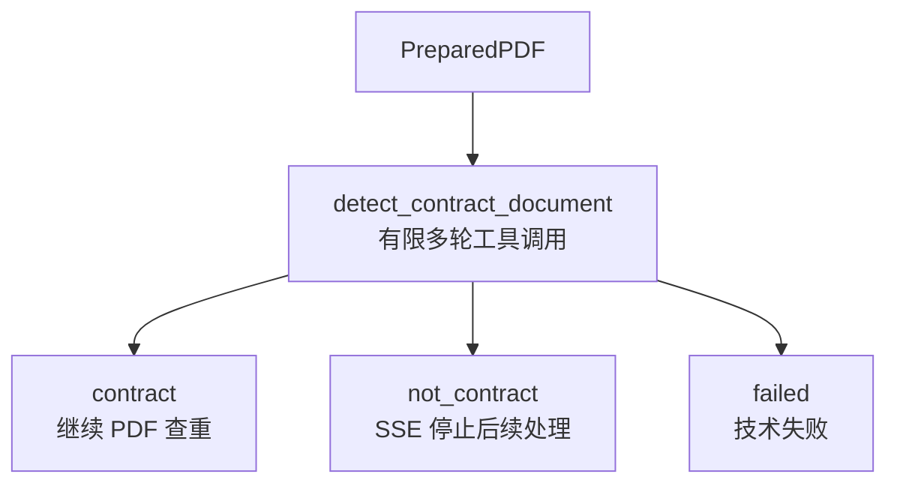

# 合同文档识别 Agent 工作流

> **用途：** 本文记录在 PDF 查重前判断上传内容是否属于合同文档的独立 Agent、工具协议与 SSE 接入边界。

> **实现状态：** 当前已实现版本化提示词、严格工具契约、有限多轮 MLLM 节点、完整私有审计和 SSE 运行时分流。可靠判定为合同时继续查重，判定为非合同时停止后续处理。

该工作流位于 `app.agent.contract_document_detection`，与[PDF 查重 Agent 工作流](../pdf-deduplication/readme.md)及[合同信息抽取 Agent 工作流](../contract-extraction/readme.md)并列。

---

## 目标与边界

工作流接收 PDF 准备服务生成的 `PreparedPDF`，判断整份文档是否属于允许进入合同查重与提取流程的合同类材料。它只判断文档类型，不判断合同是否成立、生效、可执行或具有法律效力。

当前包不负责 PDF 校验、压缩和渲染，也不执行查重、结构识别、合同分类或内容提取。页面不可读、模型不可达、工具协议连续失败或有限轮次内没有可靠决定时形成技术失败，不产生猜测性二分类结果。

---

## 当前流程



代码职责如下：

| 模块 | 当前职责 |
| --- | --- |
| `state.py` | 定义输入、可靠二分类或技术失败结果、逐轮工具审计和 token 指标。 |
| `node.py` | 执行有限多轮 MLLM 工具循环、协议恢复、页码校验和结果提交。 |
| `workflow.py` | 装配从 `START` 到识别节点再到 `END` 的单节点图。 |
| `prompt/` | 定义版本化业务标准，并在现有 PDF 公共前缀后确定性追加识别任务。 |
| `tool.py` | 定义 `think`、最终判断工具、严格参数模型和 vLLM/Qwen 参数兼容解析。 |
| `app.service.contract_extraction.document_detection` | 将识别图适配为合同提取 SSE 运行时执行端口。 |

---

## 合同文档权威定义

提示词版本为 `contract-document-detection-v2`。法律概念以[《民法典》第四百六十四条](https://www.cac.gov.cn/2020-06/01/c_15925617772683192.htm)关于合同的定义为基础，并转换为项目可执行的文档类型规则；本 Agent 不判断合同成立、生效、可执行或法律效力。

判定为合同要求文档整体同时具备相对方主体或稳定角色、协议关系，以及至少一组实质性权利义务。标题、编号、金额、签章和争议条款只能作为辅助线索，均不能单独决定结果。完整但未签署的合同草案仍属于合同类文档；发票、普通报价、价目表、说明书、送货验收记录、内部审批和报告等缺少协议性权利义务结构时属于非合同。

边界材料按其页面实际内容判断：补充、变更、保密和框架协议属于合同；合同附件必须明确关联合同并包含约束性内容；采购订单必须呈现交易相对方、确定事项及约束性履行内容。页面整体不可读或关键证据冲突时，不允许把不确定性伪装成非合同，节点会形成技术失败。

消息构造器复用 `build_pdf_messages`：公共系统规范和按页码排列的全部图像保持逐字节一致，唯一节点差异作为最后一个任务内容块追加。静态工具使用 `after_task` 布局，由 vLLM 模板在任务后渲染真实 Schema；显式 `think` 承担可审计推理，不启用模型私有 thinking 块。

---

## 工具契约

工具版本为 `contract-document-detection-tool-v1`，采用 `tool_choice=auto`，并固定按以下顺序提供：

| 工具 | 作用 | 是否形成终态 |
| --- | --- | --- |
| `think` | 提供简洁的真实推理空间，用于综合全部页面并检验合同判断假设。 | 否 |
| `submit_contract_document_judgment` | 按“页面证据、推理摘要、二分类决定”的顺序提交正式结果。 | 是 |

最终决定使用严格布尔字段 `is_contract`，只表达“是合同”或“不是合同”。证据项只保存物理页码和可直接复核的简短页面观察：正向判断的证据至少应覆盖相对方关系及实质性权利义务；负向判断应说明实际文档性质及缺失的决定性协议结构。该工具不提供第三种“不确定”业务类别，页面不可读或关键证据无法消解时，节点在有限恢复后形成技术失败，不能把它转换为 `false`。

函数 Schema 由 Pydantic 模型生成，每个模型可见字段和嵌套字段均有非空 `description`。服务端 `strict` 保持关闭，以兼容 vLLM/Qwen 的 XML 工具解析；收到参数后仍由本地 `extra="forbid"`、`strict=True` 的 Pydantic 模型重新校验。解析器同时兼容 Qwen 将嵌套证据数组再次编码为 JSON 字符串的情况。参数校验失败时，统一转换为只包含字段位置、问题和修正方向的最小反馈，该反馈仅进入连续纠错期间的模型上下文。

节点最多执行 6 轮，单次响应最多请求 4096 completion tokens。`think` 的完整工具响应不得超过 1024 completion tokens，且不得连续成功调用超过两次。节点复用 `ToolProtocolRecovery`：错误调用及反馈只保留到下一次动作完全通过，私有审计继续保存全部轮次，可靠终态不会携带已经清理的失败轨迹进入下游上下文。

---

## SSE 接入

```text
创建请求内 PDF 准备
  → 合同文档识别
  → PDF 查重
  → 返回 Top-3 并暂停
  → 前端继续
  → 合同结构识别、分类与提取
```

应用新增 `contract_document_detection` 阶段。创建接口返回时该阶段为 `running`，其余阶段为 `pending`：

- `contract`：阶段成功，自动启动 `pdf_deduplication`。
- `not_contract`：阶段成功，运行状态变为 `not_a_contract`，发布 `run.document_rejected`；事件与快照均提供 `is_contract=false`、页面证据和推理摘要，查重及后续阶段保持 `pending`。
- `failed`：阶段失败，运行状态为 `failed`；公共接口不公开模型原始响应、工具轨迹或内部错误。

完整 HTTP/SSE 字段见[合同 API](../../../api/contract.md)，多轮错误清理遵循[多轮 Agent 上下文与记忆管理规范](../../../standard/agent-context-management.md)，后续提示词修改继续遵循[提示词工程规范](../../../standard/prompt-engineering.md)。
