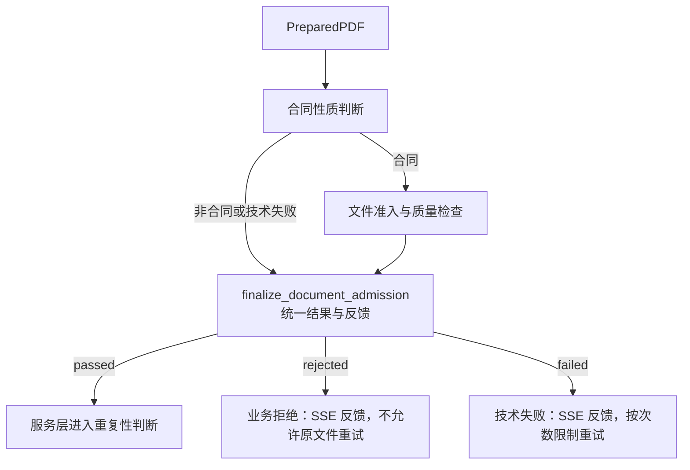

# 合同文档识别 Agent 工作流

> **用途：** 本文记录在 PDF 查重前检查上传文件的合同性质、恶意内容及可读性的独立 Agent、工具协议与 SSE 接入边界。

> **实现状态：** 合同性质判断已实现；其后已实现文件准入与质量检查节点。文件质量检查已接入原生思考与强制 JSON Schema，统一兼容解析、本地校验和最多三次输出修复；收束节点统一处理放行、业务拒绝与技术失败。

该工作流位于 `app.agent.contract_document_detection`，与[PDF 查重 Agent 工作流](../pdf-deduplication/readme.md)及[合同信息抽取 Agent 工作流](../contract-extraction/readme.md)并列。

---

## 目标与边界

工作流接收 PDF 准备服务生成的 `PreparedPDF`，判断整份文档是否属于允许进入合同查重与提取流程的合同类材料。合同性质判断只判断文档类型；新增文件质量检查节点负责报告恶意或明显无关内容、可读性不足。两者均不判断合同是否成立、生效、可执行或具有法律效力。

当前包不负责 PDF 校验、压缩和渲染，也不执行查重、结构识别、合同分类或内容提取。合同性质节点无法可靠判断、模型不可达、工具协议连续失败或有限轮次内没有可靠决定时形成技术失败，不产生猜测性二分类结果。质量节点依据页面证据明确判定严重不可读时属于业务拒绝，禁止原文件重试。

---

## 当前流程




代码职责如下：

| 模块 | 当前职责 |
| --- | --- |
| `state.py` | 定义输入、可靠二分类或技术失败结果、逐轮工具审计和 token 指标。 |
| `node.py` | 执行有限多轮 MLLM 工具循环、协议恢复、页码校验和结果提交。 |
| `workflow.py` | 装配合同判断、文件质量检查与统一收束节点；所有正常返回的检查路径均进入收束节点，再到 END。 |
| `prompt/` | 定义版本化业务标准，并在现有页面图像公共前缀后确定性追加识别任务。 |
| `tool.py` | 定义 `think`、最终判断工具、严格参数模型和 vLLM/Qwen 参数兼容解析。 |
| `app.service.contract_extraction.document_detection` | 将识别图适配为合同提取 SSE 运行时执行端口。 |

---

## 合同文档权威定义

提示词版本为 `contract-document-detection-v4`。模型只被告知已经获得按原始顺序排列的上传文档页面图像，不接收文件格式暗示。法律概念以[《民法典》第四百六十四条](https://www.cac.gov.cn/2020-06/01/c_15925617772683192.htm)关于合同的定义为基础，并转换为项目可执行的文档类型规则；本 Agent 不判断合同成立、生效、可执行或法律效力。

判定为合同要求文档整体同时具备相对方主体或稳定角色、协议关系，以及至少一组实质性权利义务。标题、编号、金额、签章和争议条款只能作为辅助线索，均不能单独决定结果。完整但未签署的合同草案仍属于合同类文档；发票、普通报价、价目表、说明书、送货验收记录、内部审批和报告等缺少协议性权利义务结构时属于非合同。

边界材料按其页面实际内容判断：补充、变更、保密和框架协议属于合同；合同附件必须明确关联合同并包含约束性内容；采购订单必须呈现交易相对方、确定事项及约束性履行内容。页面整体不可读或关键证据冲突时，不允许把不确定性伪装成非合同，节点会形成技术失败。

消息构造器复用 `build_pdf_messages`：公共系统规范和按页码排列的全部图像保持逐字节一致，唯一节点差异作为最后一个任务内容块追加。静态工具使用 `after_task` 布局，由 vLLM 模板在任务后渲染真实 Schema；显式 `think` 承担可审计推理，不启用模型私有 thinking 块。

---

## 工具契约

工具版本为 `contract-document-detection-tool-v3`，采用 `tool_choice=auto`，并固定按以下顺序提供：

| 工具 | 作用 | 是否形成终态 |
| --- | --- | --- |
| `think` | 提供简洁的真实推理空间，用于综合全部页面并检验合同判断假设。 | 否 |
| `submit_contract_document_judgment` | 按“页面证据、推理摘要、二分类决定”的顺序提交正式结果。 | 是 |

最终决定使用严格布尔字段 `is_contract`，只表达“是合同”或“不是合同”。证据项只保存物理页码和可直接复核的简短页面观察：正向判断的证据至少应覆盖相对方关系及实质性权利义务；负向判断应说明实际文档性质及缺失的决定性协议结构。该工具不提供第三种“不确定”业务类别，页面不可读或关键证据无法消解时，节点在有限恢复后形成技术失败，不能把它转换为 `false`。

函数 Schema 由 Pydantic 模型生成，每个模型可见字段和嵌套字段均有非空 `description`。服务端 `strict` 保持关闭，以兼容 vLLM/Qwen 的 XML 工具解析；收到参数后仍由本地 `extra="forbid"`、`strict=True` 的 Pydantic 模型重新校验。解析器同时兼容 Qwen 将嵌套证据数组再次编码为 JSON 字符串的情况。参数校验失败时，统一转换为只包含字段位置、问题和修正方向的最小反馈，该反馈仅进入连续纠错期间的模型上下文。

节点最多执行 6 轮，开启原生思考，强度与输出预算遵循[提取配置](../contract-extraction/readme.md#原生思考配置)。`think.reasoning` 最多2000字符，且不得连续成功调用超过两次；不再用包含原生推理的整轮 token 数限制工具内容。节点复用 `ToolProtocolRecovery`：错误调用及反馈只保留到下一次动作完全通过，私有审计继续保存全部轮次，可靠终态不会携带已经清理的失败轨迹进入下游上下文。

---

## SSE 接入

```text
创建请求内 PDF 准备
  → 合同性质判断
  → 文件准入与质量检查（仅合同进入）
  → 统一收束（仅 passed 继续）
  → PDF 查重
  → 返回 Top-3 并暂停
  → 前端继续
  → 合同结构识别、分类与提取
```

应用新增 `contract_document_detection` 阶段。创建接口返回时该阶段为 `running`，其余阶段为 `pending`：

- 合同性质为 `contract`：继续质量检查；仅统一收束结果为 `passed` 时阶段成功并自动启动 `pdf_deduplication`。
- `not_contract`：阶段成功，运行状态变为 `not_a_contract`，发布 `run.document_rejected`；事件与快照均提供 `is_contract=false`、页面证据和推理摘要，查重及后续阶段保持 `pending`。
- 质量拒绝或技术失败：阶段及运行状态为 `failed`，通过 `stage.failed` 反馈；业务拒绝 `retryable=false`，技术失败按次数限制重试。公共接口不公开模型原始响应、工具轨迹或内部错误。

完整 HTTP/SSE 字段见[合同 API](../../../api/contract.md)，多轮错误清理遵循[多轮 Agent 上下文与记忆管理规范](../../../standard/agent-context-management.md)，后续提示词修改继续遵循[提示词工程规范](../../../standard/prompt-engineering.md)。


---

## 文件准入与质量检查

节点 `check_contract_file_quality` 接收同一份 `PreparedPDF` 及通过的合同判断，返回 `result.file_quality`。页面无需再次打开或渲染。该节点合并异常内容检查和可读性检查，不生成内容摘要，也不再增加两个并发判断节点。

| 字段 | 契约 |
| --- | --- |
| `document_id` | 与处理版 PDF 和合同判断一致。 |
| `status` | `generated` 表示形成可靠输出，`failed` 表示技术失败；不混同业务拒绝。 |
| `malicious_content_detected` | 严格布尔值，达到恶意或明显无关内容拒绝条件时为真。 |
| `readability_insufficient` | 严格布尔值，大量模糊、有依据的缺失或关键内容不可读导致无法可靠提取时为真。 |
| `evidence` | 问题类型、物理页码列表和观察及影响说明；拒绝信号必须有对应类型的依据。 |
| `error` | 技术失败说明；成功时为空。 |

少量模糊不自动拒绝，相关插图和正常合同条款不自动视为恶意，不凭常见合同结构推测缺页。缺失内容引用能证明缺失的现有页面，程序校验问题页码不得超出文件范围。任务提示词及真实模型调用已实现；当前三字段版本已完成离线验证，真实模型效果仍待复测；历史实验使用带摘要的旧契约。

收束节点根据两个检查结果生成 `result.outcome`，服务层只消费该决定，不再次判断质量信号或拼接证据。质量拒绝与技术失败沿用 `contract_document_detection` 阶段及 `stage.failed` 事件，但质量拒绝禁止重试，技术失败按次数限制重试；非合同仍走 `not_a_contract` 终态。

当前节点已调用配置中的 MLLM，开启原生思考，最终正文强制采用 JSON Schema；输出额度沿用 `generation.max_completion_tokens`，采样为 temperature=1、top_p=0.95、top_k=20、min_p=0、presence_penalty=0、repetition_penalty=1。不增加环境变量，也不写入 `contracts.summary`。后续建议名称与正式摘要生成不属于本次变更。

验证使用 `tests/test_contract_preliminary_summary.py`，覆盖合同进入质量检查、非合同及识别失败跳过、缺失检查禁止放行、异常页码、两类业务拒绝、技术失败和成功放行。测试使用隔离替身验证流程，不验证模型检测效果。


---

## 文件质量检查任务提示词

任务提示词位于 `prompt/file_quality.py`，版本为 `contract-file-quality-v1`。复用已有页面公共前缀，在全部页面之后追加任务及由 `FileQualityGeneration` 生成的 Schema。状态及输出模型统一定义在 `state.py`，质量检查节点位于现有 `node.py`，不设独立包。

按当前约定使用模型原生思考加最终正文强制 JSON Schema，不提供显式 `think` 工具，也不要求在 JSON 中转录思考过程。模型按 `evidence` → `malicious_content_detected` → `readability_insufficient` 的顺序生成三个必填字段；`document_id`、执行状态及技术错误由程序补齐。模型请求显式开启 `enable_thinking=True`，使用统一 JSON 兼容解析及本地结果校验。截断、工具调用、错误字段顺序、无依据拒绝和越界页码不会形成权威结果；最多三次尝试，失败只留私有审计并最终形成技术失败。

提示词覆盖完整页面阅读、异常记录在带页码的证据列表、明确无关与关系不明的区别、局部模糊与关键内容不可读的区别，以及有依据的缺失、正常图像附件和干扰指令边界。拒绝信号必须具备对应类别的问题证据，两个信号独立计算。

`tests/test_contract_preliminary_summary_prompt.py` 验证公共前缀一致性、重复渲染稳定性、必填字段及嵌套描述、严格布尔值和结果投影。测试未调用模型，不代表恶意或模糊检测效果已经验证。


---

## 统一收束与服务层衔接

`node.py` 的 `finalize_document_admission` 是子图最后一个节点，采用确定性反馈模板，不新增模型调用。无论合同判断拒绝、合同判断技术失败，还是文件质量检查完成或失败，都进入该节点；未捕获异常由服务层兜底为技术失败。

输出 `result.outcome` 使用 `DocumentAdmissionOutcome`：`status` 为 `passed / rejected / failed`，`source` 标识合同判断或文件质量检查，`message` 是公开反馈，`error` 只保存私有技术错误。原合同判断和质量证据仍留在结果中。

| 情形 | 收束及服务行为 |
| --- | --- |
| 非合同 | rejected；使用合同判断理由与页面证据形成反馈；发布 run.document_rejected，不进入质量检查或查重。 |
| 恶意或明显无关内容 | rejected；反馈相应页码和依据，发布 stage.failed，retryable=false。 |
| 模糊不可读或有依据的缺失 | rejected；反馈相应页码、依据和影响，发布 stage.failed，retryable=false。 |
| 两类质量问题同时出现 | 一次合并两类原因，禁止继续和重试原文件。 |
| 判断失败、检查生成失败、检查结果缺失、身份或页码异常 | failed；公开简洁失败说明，私有保存技术原因，按次数限制重试。 |
| 两项检查均通过 | passed；服务层完成当前阶段，并直接调用现有 PDF 重复性判断流程。 |

重试接口实际校验 `stage.retryable`，不只依赖前端隐藏按钮；业务拒绝重试返回既有 StageRetryError 对应错误响应。文件质量检查模型调用已接通；单元测试使用受控结果验证放行、拒绝和 SSE，真实模型样本另见 `experiment/contract-admission/`。


私有 `file_quality.audit` 保存每次原始响应及是否被接受。连续纠错仅追加最小错误信息，不回显失败正文；成功后清除纠错后缀。实验入口及原始产物位于 `experiment/contract-admission/`，不会调用 ES 或执行正式入库。


当前 `contract-file-quality-v1` 已移除 summary 字段，仅输出 evidence 与两项判断；不生成合同内容摘要，也不进行法律效力或交易合规审查。历史 10 例实测使用旧版带摘要契约，不能视为当前提示词的重新实测。本次变更通过离线 Schema、模型替身和分流测试验证。
