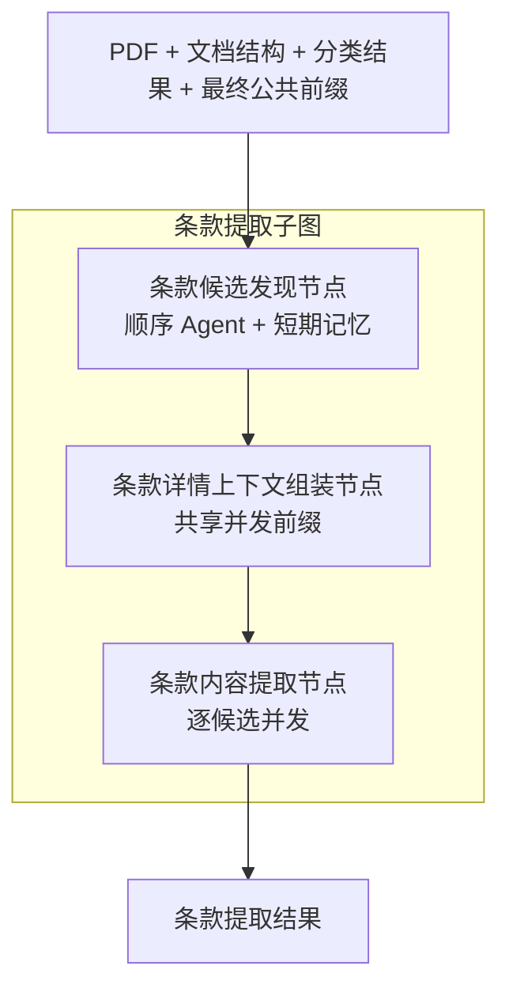

# 条款提取子图

> **用途：** 本文定义已经实现的条款提取三节点结构：顺序候选发现、详情公共上下文确定性组装，以及逐候选并发内容提取。

条款子图是[合同信息抽取 Agent 工作流](readme.md)的三个并行下游模块之一。它与字段提取、检索视图生成并行，只读最终合同公共前缀，不消费 Core 结果。

---

## 拓扑



```text
最终合同公共前缀
  → 顺序发现全部层级的条款候选
  → 组装条款详情提取的共享上下文
  → 逐候选并发提取直接内容
  → 条款结果
```

外部只调用 `build_clause_extraction_subgraph`，不直接编排内部节点。

---

## 节点职责

| 节点 | 计划职责 | 当前输出 |
| --- | --- | --- |
| `discover_clause_candidates` | 使用隔离的短期记忆和候选管理工具，按原始阅读顺序发现具有自身直接正文的主条款及子层级条款 | `ClauseCandidateDiscoveryResult` |
| `assemble_clause_extraction_context` | 读取固定候选目录，确定性组装后续全部条款详情请求共享的稳定上下文 | `ClauseExtractionContext` |
| `extract_clause_contents` | 复用固定公共上下文，为每个候选追加唯一动态目标，并发提取其直接内容，不改变目录与层级 | `ClauseExtractionResult` |

节点一拥有候选目录；节点二只读候选目录并拥有公共上下文；节点三只读候选目录和公共上下文，并拥有最终条款结果。候选目录只包含具有自身直接正文的条款，但每个候选通过 `document_path` 和绝对 `level` 保留原合同完整层级。只有编号、标题或分组名的结构父级不进入正文候选，却必须作为路径项保留；`parent_candidate_id` 仅引用路径上最近的已记录正文祖先，不能决定或压平原合同层级。

节点一使用异步 OpenAI 兼容客户端顺序调用本地 vLLM；节点二不调用模型；节点三按候选异步并发提取。主工作流已经通过 `ainvoke` 调用整个条款子图。

条款阶段开始时应用先报告“正在统计待提取的合同条款数量”。候选发现尚未结束前总数保持未知；只有 `discover_clause_candidates` 形成通过校验的固定候选目录后，`extract_clause_contents` 才报告 `0 / m`，并在每个候选形成 `extracted` 或 `failed` 终态时依次报告 `k / m`。只有编号或标题的结构父级不属于正文候选，因此不计入总数。

进度是任务局部的观察信号，不写入候选工作区、模型短期记忆、工具审计或 `ClauseExtractionResult`。候选发现失败时不会伪造总数或完成比例，阶段按既有失败协议结束。

---

## 节点二组装契约

节点二只执行确定性组装，不调用模型，也不执行任何单条款正文提取。节点首先校验 `PreparedPDF`、`ContractPrefillContext` 与 `ClauseCandidateDiscoveryResult` 的 `document_id` 完全一致，并要求节点一已经以 `completed` 状态生成非空候选目录；失败或部分候选不能被当作权威目录使用。

稳定上下文按以下顺序组装：

```text
最终合同公共前缀（PDF + 文档结构 + 分类）
  → 单条款完整直接内容公共规则
  → 带字段注释的完整候选目录 YAML
  → 固定 extract_clause_content 工具 Schema（由聊天模板放置）
```

消息部分保存为不可变 `ClauseExtractionContext`，记录 `document_id`、公共提示词版本 `clause-content-common-v10`、工具版本 `clause-content-tool-v9`、消息元组和消息指纹。指纹只覆盖确定性消息；固定工具块由独立工具版本标识，后续节点必须同时复用相同消息、工具版本、工具顺序和 `before_task` 布局。模型可见公共文本只说明已有合同材料与权威候选目录；各请求随后追加当前唯一候选，不暴露节点编号、并发或缓存概念。组装后直接并发发送各候选请求，由 vLLM 自然建立公共前缀缓存。

---

## 节点一工具契约

节点一采用程序管理的追加式工作区。模型负责提交边界证据、推理摘要和候选决定；`candidate_id` 与 `order` 由程序生成，模型不能伪造。`document_path` 表示从原合同最外层到候选自身的完整路径，`level` 是该路径长度；`parent_candidate_id` 只关联最近的已记录正文祖先，供正文排重使用。

> **候选准入：** 移除全部下级条款正文后，当前条款仍须具有可从 PDF 直接对应的自身规范文字。纯编号、纯标题、章节名或分组名不得调用记录工具；其视觉范围仍用于寻找下级条款，并必须保留在下级候选的 `document_path` 中，但不能成为 `parent_candidate_id`。

| 工具 | 作用 | 是否改变工作区 |
| --- | --- | --- |
| `analyze_clause_hierarchy` | 首轮扫描整份 PDF，提交页面结构证据、详细层级分析和合同专属提取指导 | 是，写入一次性层级分析 |
| `think` | 思考下一个尚未记录的条款标号、层级、父级和边界 | 否，只进入短期记忆 |
| `record_clause_candidate` | 按阅读顺序提交一个主条款或子层级条款的边界候选 | 是，追加一个精简候选 |
| `revise_last_clause_candidate` | 完整替换最后一个候选，并保留其程序身份 | 是，只修改尾项 |
| `finish_clause_discovery` | 提交末尾证据、完成理由和实际检查终点，请求结束发现 | 否，程序校验后终止 |

首轮只开放 `analyze_clause_hierarchy`，模型不能直接记录候选。层级分析成功后，该工具永久移除，工作区保存分析对象，并开放 `think` 和 `record_clause_candidate`；至少成功记录一个候选后，才进一步开放修正和结束工具。所有决定型工具的参数顺序均为“证据 → 推理摘要 → 最终决定”。服务端工具 Schema 统一使用 `strict:false`，本地校验仍保持严格。

候选发现工具版本为 `clause-discovery-tool-v9`。记录工具的推理摘要必须先说明移除下级正文后仍有哪些文字直接属于当前候选，再说明边界、原合同绝对层级、完整路径和最近的已记录正文祖先；仅凭标题或视觉分组不能形成正文候选。

候选发现请求使用 `tool_choice=auto`。任务提示词给出合法 XML 模板；若一轮没有恰好一个工具调用，有限普通文本只保存在私有审计中，程序在短期记忆尾部追加不回显原文的纠正反馈。非法工具、参数或候选状态反馈与协议反馈共用临时纠错范围；某个动作通过全部校验后，整条失败轨迹会被清除，工作区和此前正常工具历史不受影响。连续第三次协议失败才结束候选发现。

首轮层级分析采用以下结构：

```yaml
evidence:
  - page_numbers: [1, 2]
    observation: "页面使用‘第一条’主编号及其下‘（1）’子编号。"
reasoning_summary: "结合编号前缀、缩进和标题范围，判断中文条次为一级、括号编号为二级。"
decision:
  structure_summary: "合同正文采用两级条款结构。"
  extraction_guidance:
    - "连续中文条次保持同级。"
    - "括号编号挂到最近的中文条次下。"
```

`evidence` 只记录整份合同的页面结构事实，不复制完整正文；`reasoning_summary` 详细比较编号、同级序列、真实父级、编号重置、跨页延续和特殊版式；`decision` 提炼后续逐条发现持续遵循的合同专属指导。局部 PDF 证据与首轮计划冲突时，以 PDF 为准，模型使用 `think` 说明调整，但不能回写首轮分析。

`record_clause_candidate` 和修正工具使用固定的“证据 → 推理摘要 → 最终决定”结构：

```yaml
evidence:
  start:
    page_number: 2
    anchor: "3（2）乙方应按照……"
  end:
    page_number: 3
    anchor: "乙方完成安装后应提交验收记录。"
reasoning_summary: "起止锚点之间形成第3项下的独立子条款。"
decision:
  identifier: "3（2）"
  title_hint: "乙方义务"
  document_path:
    - identifier: "3"
      title_hint: "乙方义务"
    - identifier: "3（2）"
      title_hint: "乙方义务"
  parent_candidate_id: "clause-0003"
  level: 2
```

起止锚点均为必填、最多 160 个字符的页面原文短片段，不复制完整条款。两者固定属于当前条款：起始锚点定位编号、标题或首句，结束锚点定位当前条款自身最后一段原文。结束锚点不得使用下一条款、签署区、附件或其他非当前条款内容，不接收 `inclusion`、边界类型或 `null`。页码只由证据提供，最终决定不重复提交。

候选 `end` 只描述当前候选的局部内容终点，不承担“是否还有后续条款”的状态职责。模型必须继续扫描合同；只有独立的 `finish_clause_discovery` 工具能够声明整份候选发现完成，并提交实际检查终点及末尾证据。

程序接受候选后，将整组 `evidence.start` 和 `evidence.end` 原样保存到精简工作区。节点三后续必须携带这组证据定位并提取正文，同时结合候选父子关系排除子条款内容；不再要求节点三根据相邻候选临时猜测外部边界。

程序校验首轮层级分析引用的全部物理页码均属于当前 PDF。执行记录工具时继续校验：起止页码范围、起始页不晚于结束页、候选起点页码单调性、重复起始锚点、前一候选结束锚点是否被错误复用为当前候选起点、`level` 是否等于 `document_path` 长度、路径末项是否表示候选自身，以及 `parent_candidate_id` 是否指向路径上最近的已记录正文祖先。若相邻起止锚点相同，模型必须先修正最后候选的 `end` 为其自身末尾原文，再记录当前候选。结束工具至少要求候选目录非空、检查终点不早于最后候选的结束锚点，并具有来自最后检查页的精简证据。

> **状态边界：** 工具模块只负责参数解析、状态校验、工作区条目构造和反馈，不直接持有或修改 Agent 状态。节点循环拥有并更新工作区；成功追加或修正后清空短期记忆，并重新注入完整精简工作区和下一步方向。

---

## 节点三内容工具契约

节点三为每个候选启动隔离的短期会话，并只提供一个终止工具 `extract_clause_content`。每个候选已经由节点一确认具有自身直接正文，因此不提供放弃或重新划分工具；请求失败、页图不可读或达到轮次上限由节点三运行状态表达，模型不能用 `null`、“无法提取”或空文本冒充成功内容。

全部候选共用一个异步 `MLLMClient`，并通过 `models.mllm.max_concurrent_requests` 创建的信号量限制同时在途请求。已填充页面在这些并发请求中只发送媒体 UUID 引用，不再重复序列化 Base64；不同候选的 assistant / tool 历史仍完全隔离。`asyncio.gather` 按输入顺序返回结果，因此并发完成先后不会改变候选原始顺序。引用失效时由统一客户端完整重填一次，具体边界见[vLLM 多模态媒体引用](../../../capability/infrastructure/vllm-media-reference.md)。

节点三复用 `models.mllm.generation` 的正式采样参数和 `max_completion_tokens` 统一生成上限，并固定关闭 thinking；不再按长度分级预算。`finish_reason=length` 且没有形成完整工具调用时同样进入统一协议恢复，每次仍使用相同上限，连续第三次失败后明确终止；若服务端在 `length` 状态下仍返回了工具调用，则直接拒绝该可能被截断的结果。完整工具调用的参数校验失败进入最多 6 轮的短期记忆修正。

参数解析、起止锚点覆盖或子条款排除校验失败时，程序把包含错误位置、问题和修正方向的最小反馈追加到当前候选临时纠错记忆，再使用同一动态目标重试。零个或多个工具调用时，有限原始文本只进入私有审计，模型收到不回显原文的 XML 格式反馈；后续正文工具通过全部校验后程序删除协议和参数失败形成的整条错误轨迹。单候选遇到连续三轮协议失败、vLLM 请求失败或耗尽最大轮次时生成 `FailedClause`，不会取消其他候选。

> **完整内容边界：** 叶子候选提取其起止锚点范围内的整条原文；父候选提取自己的编号、标题、引导语和独立正文，但排除已经作为候选存在的全部子孙条款正文。这样每段原文只归属于最具体的候选，父子结果不会重复储存同一正文。

工具版本为 `clause-content-tool-v9`，工具 Schema 显式设为 `strict: false`，并使用 `tool_choice=auto`。这避免长正文并发提取进入 vLLM XGrammar 的逐 token Schema 约束路径；模型输出后仍由 Pydantic 严格解析、候选身份、起止锚点和子孙条款排除校验共同约束，不通过时进入有界修正重试。节点三只有一个业务工具，提示词要求它完成提取时调用 `extract_clause_content`；程序仍要求每轮恰好一个对应调用。

表单横线、填写线和文字下方的下划线样式属于版式而非正文；无论横线上方为空白还是已有文字，模型都不得把整条横线或其中一段转写为 `_`。提示词提供“人民币连续填写线、后段线上印有金额”的正反例，要求只保留金额文字；具有明确语义的原文下划线字符仍须保留。作为视觉转写波动的程序兜底，起止锚点只用于定位，不承担正文字符保真校验。位置比较先忽略空白、常见填写线和 Unicode 标点；仍不能精确定位时，再计算锚点与正文任意连续片段的最小 Levenshtein 距离，相似度达到 `0.85` 即视为覆盖。该宽松规则只用于起止位置判断，不改写模型提交的正文。最终结果仍只确定性清除 `人民币`、`RMB`、`￥` 或 `¥` 与紧随其后的数字金额之间的下划线字形，其他位置的下划线原样保留，避免破坏合同编号、账号或技术标识。候选身份、页码和子孙排除校验不受影响。

证据不由模型重复提交：节点三的动态尾部只追加当前候选的程序身份及包含式起止页码与锚点，不再重复提交子孙候选；完整候选目录已经位于公共上下文中。工具参数保持“推理摘要 → 最终正文”顺序，但去除不必要的 `decision` 嵌套：

```yaml
reasoning_summary: "正文完整覆盖当前候选的包含式起止锚点；未包含子条款正文。"
content: |-
  第一条 付款方式
  收到发票后十日内付款。
```

该结构仍遵循证据优先原则：证据已经位于当前任务输入中，模型先基于既有证据形成最多 500 字符的推理摘要，再提交正文，不能复制或改写一份平行证据。工具不让模型重复提交 `candidate_id`、页码、层级、父级和候选边界。程序在工具成功后补入当前 `candidate_id`，形成不可变 `ExtractedClauseContent` 对象；通过 `candidate_id → ClauseCandidate → evidence.start / evidence.end → PDF` 保持审计链。

`content` 使用 Markdown 兼容纯文本保留原始编号、标题、段落顺序、换行、项目符号和必要表格结构，不进行摘要、改写、翻译、规范化或合同外补全。

程序校验以下边界：

- 当前候选必须原样存在于程序持有的候选目录，模型不能修改其身份、层级或边界。
- 程序持有的候选起始锚点必须能以归一化精确匹配或不低于 `0.85` 的近似子串匹配定位到最终 `content`。
- 程序持有的候选结束锚点固定属于当前候选，也必须能按同一宽松位置规则定位到最终 `content`。
- 父候选内容不得出现任何子孙候选的起始锚点，防止重复提取子条款正文。
- 空文本、缺失占位值、模型自行添加的 `evidence` 及其他 Schema 外字段全部拒绝；错误反馈只返回出错位置、问题和改进方向。

单候选成功后形成 `ExtractedClause`，同时保存完整候选、推理摘要、正文、轮次、耗时、token 用量和逐轮工具审计；失败形成结构相同但携带 `error` 的 `FailedClause`。每次模型请求另存为 `ClauseContentRequestAudit`，记录请求序号、工具校验轮次、生成预算、`finish_reason`、工具调用数、排队耗时、模型耗时和 token 用量；因此即使 `length` 截断时没有完整工具调用，也不会丢失关键证据。

`ClauseExtractionResult` 按候选原始顺序保存全部结果，并使用以下汇总状态：全部成功为 `completed`，部分失败为 `partial`，全部失败为 `failed`。结果同时记录公共和动态提示词版本、工具版本、公共上下文指纹、预热观测和实际使用的 `ClauseContentGenerationProfile`。

节点三要求 PDF、候选目录、公共上下文和预热结果的 `document_id` 一致，并校验提示词版本、工具版本及前缀指纹。预热为 `degraded` 时仍允许使用相同上下文冷启动提取；身份、版本或指纹不一致属于状态损坏，直接拒绝执行。

该工具是节点二与节点三共享的固定 Schema。节点二已经把稳定详情规则、完整候选目录和该工具块一并纳入预热边界；节点三只在其后追加当前候选动态信息。

---

## 内容提取提示词与缓存边界

单条款内容提示词位于 `clause_extraction/prompt/content.py`，公共版本为 `clause-content-common-v10`，动态目标版本为 `clause-content-target-v4`。拼接分为稳定公共层和单候选动态层：

```text
最终公共前缀（PDF + 文档结构 + 分类）
  → 单条款完整直接内容公共规则
  → 带字段注释的完整候选目录
  → 固定 extract_clause_content 工具 Schema
  → 当前唯一候选
  → 当前候选 assistant / tool 重试历史
```

完整候选目录对同一合同的所有条款详情请求完全相同，因此放在工具之前进入共享前缀。目录使用确定性 YAML，逐字段解释 `candidate_id`、顺序、层级、父级和起止证据，不包含模型名、耗时、token 或节点一工具审计。独立的末尾 user 消息只包含当前候选，不复制子孙候选列表；其 `evidence.start` 与 `evidence.end` 直接限定当前提取目标。

固定工具使用 `before_task` 布局，实际模型 token 顺序为“公共规则与完整目录 → 工具 → 当前候选”。节点二使用同一公共消息、同一非 strict 工具和独立预热动作发送单 token 请求；预热动作不属于稳定前缀。节点三直接复用公共消息，只替换当前候选动态尾部，从而尽可能保留 PDF、任务规则、候选目录和工具 Schema 的缓存命中。

公共任务明确以下正文规则：

- 叶子候选提取边界内全部正文；父候选只提取自身直接内容并排除全部子孙正文。
- 父级直接片段被子条款分隔时按原顺序以一个空行连接，不加入省略说明。
- 保留编号、标点、换行、项目符号和可可靠恢复的表格结构，不执行摘要、翻译、纠错或规范化。
- 局部确实无法辨认时只在原位置使用 `〔无法辨认〕`，并在推理摘要记录物理页及影响范围，禁止猜测补全或整条放弃。
- 节点一持有的候选证据已经位于模型推理之前；工具不重复接收 evidence，通过 `candidate_id` 保持结果到候选、anchor 和 PDF 的审计链。

提示词拼接、节点二公共上下文及预热结果和节点三并发模型调用均已实现。

---

## 节点一任务提示词与记忆位置

节点一任务提示词位于 `clause_extraction/prompt/`，当前版本为 `clause-discovery-v13`。稳定任务描述明确首轮层级分析、直接正文准入、原合同绝对层级与完整 `document_path`、粒度、排除边界、包含式起止锚点、结构证据优先级、保守层级策略、深度优先顺序、可用工具变化、记忆清理、结束复核和合法 XML 工具调用格式；动态工作区与恢复方向不写入该稳定文本。模型只被告知已有资料、当前条款发现任务、程序工作区和下一步动作，不读取工程节点位置。

实际模型序列固定为：

```text
最终公共前缀（PDF + 文档结构 + 分类）
  → 稳定节点任务描述
  → non-strict 工具定义
  → 动态工作区 + 下一步方向 user 消息
  → 当前轮 assistant / tool 短期记忆
  → 下一次生成
```

工作区必须位于任务描述之后、短期记忆之前。节点使用 `before_task` 工具布局，并始终追加一个独立工作区 user 消息，包括初始空工作区；聊天模板因此把稳定工具块放在任务描述与动态工作区之间。这样“公共前缀 + 节点任务 + 工具定义”可以保持最长稳定前缀，工作区变化不会提前截断缓存复用。

首轮只包含层级分析工具，后续请求改为候选发现工具集，因此工具块本身会在首轮后变化；工具块位于最终公共前缀和稳定节点任务之后，这次状态机切换不会破坏此前的 PDF 与任务前缀复用。进入候选发现阶段后，同一阶段内的工具顺序保持稳定，只在首个候选成功后追加修正与结束出口。

首轮层级分析成功后，程序从稳定任务消息重新构造会话，将完整分析对象写入工作区并清空首轮工具历史；后续请求不再提供首轮工具。每次成功记录或修正候选后，程序再次重建会话，持续注入层级分析和全部已完成候选，再开始空的短期工具循环。

工作区保留首轮层级分析的页面证据、详细推理摘要和最终指导，同时保留候选的程序身份、起止证据和决定；候选自己的 `think`、`reasoning_summary`、失败调用、时间戳和完整正文仍不进入长记忆。工作区 YAML 对层级分析、候选列表、程序身份、起止证据、候选决定及续接信息均提供逐字段注释；模型不得依赖字段名自行猜测语义。

动态 user 消息的最末尾始终具有独立的“下一步方向”分隔区。初始请求强制模型先扫描整份 PDF 并调用层级分析工具；分析写入后，方向改为依据工作区指导从第一个候选开始；候选重置后的请求再点名最后完成的 `identifier` 与 `candidate_id`，要求先判断是否确有子层级。该方向位于消息尾部，既补偿短期历史被清空后的行动断点，也避免“每个已记录候选都可能有子级”的错误诱导。

`think` 的正常调用保留在当前短期记忆中。无效参数和状态校验错误只在连续纠错期间暂存；下一个通过全部校验的动作会删除整条失败轨迹。成功的 `record_clause_candidate` 和 `revise_last_clause_candidate` 仍会进一步根据权威工作区重建上下文；`finish_clause_discovery` 校验成功后直接形成终态。每轮只接受恰好一个工具调用。

提示词将层级定义为原文显式文档结构的复原，而不是按主题或法律重要性重新组织合同。模型按“复合编号前缀 → 局部编号体系及重置 → 标题与视觉排版 → 引导范围 → 语义确认”的顺序取证；语义不能单独创建父子关系。相同编号形式、缩进和排版组成的连续序列默认同级，无法确认时保持在最近已确认父级下同级，不存在共同父级时置于顶层，禁止创造抽象父节点。

提示词仍要求按深度优先顺序继续，但只有原文存在明确子层级结构证据时才进入对应范围；纯结构父标题只在 `think` 中确认后跳过正文候选。父标题与第一个子项同处一行时，只有父级还具有不属于子项的独立规范正文才分别记录；否则只记录子项。局部编号可以重置且不限制原文结构层数，输出的 `identifier` 始终保留页面原始编号。跳过的纯结构父级不能成为 `parent_candidate_id`，却必须保留在其下候选的 `document_path` 中；子条款的绝对 `level` 不得因此降低。

附件采用“实体排除、规范文字保留”的边界：附件标题、目录、编号、图纸、规格表、报价表、产品清单及其他附件实体不作为条款；正文引用或同等效力声明不能把附件实体转化为条款。附件附近独立表达权利、义务、责任、适用条件、法律效力或风险分配的文字仍须记录。例如，“本合同附件与正文具有同等法律效力”是无编号效力条款，而“8.附件：设备技术图纸”及图纸页面不是条款。排除附件后仍要检查后续页面，不能把排除动作当作文档扫描终点；结束工具的 `last_checked_page` 必须指向实际检查到的最后物理页，并由该页的简短视觉证据支持。排除项只能在 `think` 中确认后跳过，不能通过记录工具写入占位候选；工具层同时拒绝 `null`、`none`、`n/a`、“不记录”和“跳过”等伪标识。

---

## 输入与依赖

子图只读以下上游状态：

- `prepared_pdf`：经过动态预算处理的页面图像。
- `document_structure`：预处理阶段形成的权威宏观文档结构。
- `prefill_context`：包含 PDF、文档结构与分类结果的最终公共前缀。

条款子图不得读取字段提取结果。条款事实必须来自原始 PDF；文档结构与分类结果只用于导航和理解边界。

---

## 当前实现边界

- 已建立 `discover_clause_candidates → assemble_clause_extraction_context → extract_clause_contents` 三节点拓扑。
- 已拆分子图装配、节点和私有状态文件。
- 已保留候选目录和最终条款结果的独立状态所有权。
- 已定义条款候选、精简工作区条目、五个候选发现工具及其成功和错误反馈。
- 已在候选发现提示词和工具说明中加入“必须具有自身直接正文”的准入规则，纯结构标题不进入候选目录。
- 已定义单条款完整直接内容工具、严格参数、程序结果、边界校验及简洁成功和错误反馈。
- 已定义单条款详情公共任务、完整候选目录 YAML、当前候选动态尾部和固定工具位置。
- 已新增只能首轮调用一次的合同层级分析工具，并将其证据、详细分析和最终指导持久写入节点工作区与结果对象。
- 已定义版本化节点任务提示词、确定性工作区 YAML 和消息位置契约。
- 已实现异步工具循环、严格参数和工作区状态校验、短期记忆保留与清理，以及工作区和尾部方向重注入。
- 已输出包含候选、完成证据、逐轮工具审计、耗时和 token 用量的不可变节点结果；失败结果保留已经通过校验的部分候选。
- 已实现节点二公共上下文组装、输入一致性校验、固定工具异步单 token 预热，以及 `warmed` / `degraded` 观测结果。
- 已实现节点三逐候选隔离短期记忆、异步并发与统一限流、校验反馈重试、单候选失败隔离、顺序稳定汇总和完整运行审计。

后续实验应使用人工核对合同重点验证起止锚点覆盖、父子正文去重、长条款截断风险、单候选重试质量，以及实际 cached token、首 token 延迟和并发稳定性；不得为了提高成功率回写或改变节点一的候选目录。
