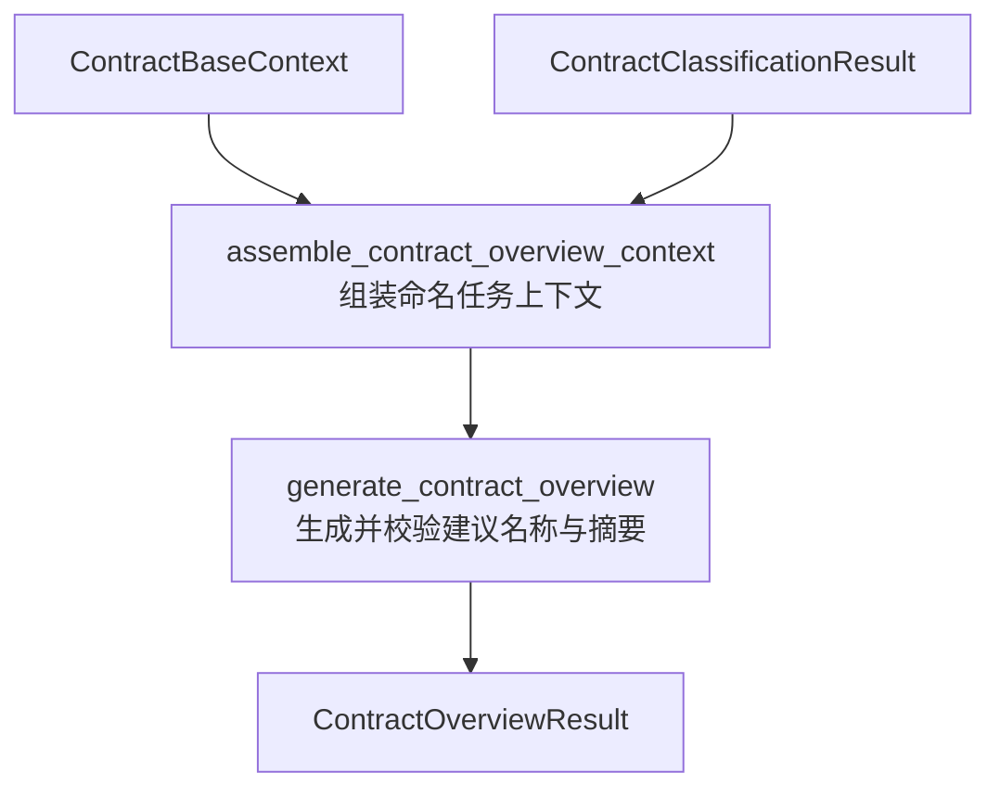

# 合同概览生成子图

> **当前状态：** 上下文组装、合同概览生成、确定性提示词、模型工具循环、主图、应用服务、SSE 与运行历史投影均已实现。

本文说明合同概览生成子图的当前代码边界。公共提示词与工具协议分别遵循[提示词工程规范](../../../standard/prompt-engineering.md)和[多轮 Agent 上下文与记忆管理规范](../../../standard/agent-context-management.md)。

---

## 用途与拓扑

子图读取 `ContractBaseContext` 和分类结果，根据合同页面图像、权威文档结构和分类结果生成可供用户在正式入库前修改的 `file_name`。它不直接复用已经包含完整分类 YAML 的 `ContractPrefillContext`，避免为命名任务重复提供分类数据。

当前 `build_contract_overview_generation_subgraph` 已固定上述节点和边关系。`assemble_contract_overview_context` 形成确定性命名上下文，`generate_contract_overview` 使用该上下文执行有限多轮工具调用并形成成功或失败结果。合同提取主图按 `classification → contract_overview_generation → assemble_prefill_context` 串行调用；HTTP 应用服务也在分类成功后执行同一子图，成功后才启动 Core、Clause 与 Retrieval 三个分支。

---

## 状态契约

| 状态字段 | 类型 | 职责 |
| --- | --- | --- |
| `base_context` | `ContractBaseContext` | 包含合同页面图像和权威文档结构的只读公共前缀。 |
| `classification` | `ContractClassificationResult` | 分类节点形成的完整紧凑结果。 |
| `page_count` | `int` | 程序持有的合同总页数，用于校验模型提交的证据页码。 |
| `contract_overview_context` | `ContractOverviewGenerationContext` | 追加命名任务后的不可变模型上下文。 |
| `contract_overview` | `ContractOverviewResult` | 经模型与程序形成的 `generated` 合同概览（名称与摘要）或不携带半成品的 `failed` 结果。 |

`contract-overview-generation-v2` 提示词从基础上下文复制消息，在其末尾依次追加分类摘要与命名任务。分类摘要按原有命中顺序为每个类别建立 Markdown 分组，每组只展示 `category_name`、`reasoning_summary` 和 `scenario`；换行等空白会被折叠，避免动态文本破坏固定排版。`unmapped` 单独展示未映射类型说明，`partial` 明确提示类别集合不完整，`failed` 被拒绝组装。

命名任务把原始标题视为命名素材而非默认结果。模型先判断标题的信息量；“买卖合同”“采购合同”“服务合同”“合作协议”等只表达通用文种或交易类别的标题均视为泛化标题，必须根据页面可确认的核心标的、具体项目或实际服务内容重新凝练，优先形成“核心内容 + 合同类型”的友好名称。只有原始标题已经包含足够具体且与正文一致的核心内容时才直接沿用。

`v6` 进一步区分“删除文件管理冗余”和“改写业务事实”：主体全称、日期、编号、型号、规格、数量与价格可以按辨识需要省略，但页面明确给出的单一商品、设备、项目或服务名称被视为不可随意拆分的核心事实短语，必须保留决定对象含义的构成词。多标的场景只能采用页面明确出现的上位概称，不能自行把具体对象泛化为类别。模型在正式提交前还需逐词对照 `evidence`，确认凝练没有改变核心对象。提示词内的正反例全部使用虚构场景，不复用质量实验样本，避免示例泄漏测试答案。

模型只生成名称主体，不附加任何扩展名。原始标题泛化或缺失时，正式输出必须提供支持凝练内容的页面证据，并在命名理由中解释标题为何不足以及新名称如何由页面事实支持。

工具版本为 `contract-overview-generation-tool-v2`，固定使用 `strict:false + tool_choice:auto`：

- `think(reasoning)`：提供过程性命名推理空间，不提交正式名称；模型可按需调用，但不得连续超过两次。
- `submit_contract_overview(evidence, reasoning, file_name, summary)`：唯一终止工具，按页面证据、简洁命名理由、最终名称和合同摘要的顺序提交。

`evidence` 至少包含一条并按物理页码升序排列；单条原文最多 300 个字符。`reasoning` 与 `file_name` 均不得为空，最终名称最多 255 个字符，并拒绝路径字符、控制字符、句点首尾、常见文件扩展名以及已枚举的纯泛化标题。参数解析兼容模型工具解析器把嵌套对象编码为 JSON 字符串的情况，但最终仍由严格 Pydantic Schema 拒绝宽松类型和额外字段。校验失败会形成“参数位置、具体问题、修正方向”的最小反馈。

## 上下文组装节点

`assemble_contract_overview_context` 只接受同一 `document_id` 的 `ContractBaseContext` 与紧凑 `ContractClassificationResult`。分类运行审计、占位对象和跨文档分类结果会被明确拒绝。节点调用唯一消息构造器，深复制基础上下文后依次追加分类 Markdown 与命名任务，不修改共享的页面图像和文档结构前缀。

节点输出不可变 `ContractOverviewGenerationContext`，保存 `contract-overview-generation-v2`、完整消息元组及确定性 SHA-256 指纹。相同输入重复组装会得到相同消息和指纹；分类状态为 `failed`、分类状态与命中集合矛盾，或最后一条基础消息不是内容块列表时，构造过程直接失败，不形成可供生成节点消费的半成品上下文。

## 合同概览生成节点

`generate_contract_overview` 在请求模型前校验合同总页数、上下文提示词版本、消息指纹，以及基础上下文、分类结果和命名上下文三者的 `document_id`。模型请求固定使用 `after_task` 工具布局、开启原生思考，使用[提取专用强度与统一输出预算](readme.md#原生思考配置)。

节点最多执行六轮，每轮必须且只能调用一个当前工具。有效 `think` 最多连续两次，`reasoning` 参数最多2000字符，不再以包含原生思考的整轮 token 数限制工具内容；终止工具的证据页码还会结合 `page_count` 校验，工具 Schema 无法接受的越界页码不会进入正式结果。工具调用之外的普通文本、零工具、多工具、未知工具、参数错误、泛化文件名和越界页码均进入同一临时纠错范围；下一个动作通过全部校验后，整段失败轨迹从模型上下文清除，但继续保存在 `ContractOverviewGenerationToolCallAudit` 私有审计中。

成功结果使用 `status=generated`，包含页面证据、命名理由、最终 `file_name`、合同 `summary`、模型与提示词/工具版本、轮次、耗时、token 汇总和完整工具审计。MLLM 请求失败、连续三轮没有形成单个合法工具调用，或六轮结束仍无有效终态时使用 `status=failed`；失败结果只保留错误与运行审计，不发布任何半成品名称或摘要。

结果字段使用 `file_name`，其业务含义是用户可编辑的展示文件名，不承担文档唯一身份或物理存储路径职责；文档身份仍由 `document_id` 表达。

---

## 应用层接入与恢复

应用执行器通过 `generate_contract_overview(ExtractionContext)` 调用子图；`status=failed` 会转换为阶段错误，不会把半成品写入公共状态。应用将其暴露为第 5 个用户阶段 `contract_overview_generation`，阶段失败可在最多尝试次数内复用已经成功的分类上下文重试，成功后才启动三个业务分支。

成功结果经过投影后同时进入三个恢复面：`stage.completed` SSE 事件携带名称、理由、证据和合同摘要；单任务 GET 快照的 `run.contract_overview` 持续保留同一完整投影；运行历史列表以顶层 `suggested_file_name` 返回名称字符串。完整模型响应和工具审计只保存在该阶段不可覆盖的内部尝试记录中。正式入库仍以用户提交的 `file_name` 为准，服务不要求它与建议值相同，也不直接把自动建议写入 Elasticsearch。

---

## 合同摘要与提交边界

当前版本在保留命名约束的基础上，生成简洁的合同内容概览。终止工具更名为 `submit_contract_overview`，参数模型为 `SubmitContractOverviewArguments`；旧工具名不再注册。`summary` 为最后一个必填字符串，去除首尾空白后非空，最多 3000 个字符。名称和摘要必须同时通过校验才能形成正式结果，不因名称正确而接受缺失摘要。

摘要以全部合同页面为唯一事实依据，用 1～2 个简洁自然段介绍合同主题、项目或标的、核心交易或服务内容及各方主要分工。通常一段即可，第二段仅用于必要的独立核心范围；不使用标题、列表，不将条款清单拼成长段。不逐项总结付款、验收、违约、争议解决等条款，也不罗列金额、日期和技术明细；只有直接决定主题或范围的信息才保留。不补充缺失事实或法律评价。

1～2 段是模型生成的表达要求，不新增段落数硬校验；3000 字符仍是工具和入库请求的最大合法长度，不是生成目标。用户审核后的摘要仍按现有入库契约接收。程序校验类型、长度与非空，不把这些校验等同于摘要质量验证。

生成结果沿用 `ContractOverviewResult`，增加 `summary`。成功结果必须具有非空摘要；失败结果禁止携带摘要。摘要保存在主图结果及应用阶段的内部结果中，SSE `stage.completed.contract_overview.summary` 与 GET 快照 `run.contract_overview.summary` 使用同一投影同步返回，正式入库时由前端提交用户确认后的 `summary` 并写入 SQLite `contracts.summary`，不自动使用生成值替代缺失参数。现有名称展示、用户改名与三个提取分支的上下文不变。

离线测试 `tests/test_contract_overview.py` 覆盖实际 Schema 字段与嵌套描述、兼容解析、旧工具名拒绝、非法摘要、失败结果隔离，以及摘要校验失败后修正并进入正式结果。当前变更尚未执行真实模型效果测试。

阶段状态文字同步说明“建议名称与摘要”；使用 `contract_overview_generation` 阶段码与 `contract_overview` 包络，沿用原事件类型。摘要完整生成后一次返回，不增加 delta 事件。运行历史列表仍只提供名称字符串，完整摘要通过单任务快照恢复。

---

## 命名与对外兼容

内部实现包为 `app.agent.contract_extraction.subgraph.contract_overview_generation`，入口为 `build_contract_overview_generation_subgraph`，节点为 `assemble_contract_overview_context` 和 `generate_contract_overview`，正式结果为 `ContractOverviewResult`，内部状态使用 `contract_overview`。模型终止工具仍为 `submit_contract_overview`。

HTTP/SSE 阶段码统一改为 `contract_overview_generation`；阶段枚举、快照 stages 键及重试参数同步修改，旧阶段码不再接受。结果包络统一改为 `contract_overview`，旧 `suggested_file_name` 对象不再返回，其中包含 `file_name`、`reasoning`、`evidence`、`summary`。前端需同步阶段映射与重试参数；本次变更不调整正式入库行为。
