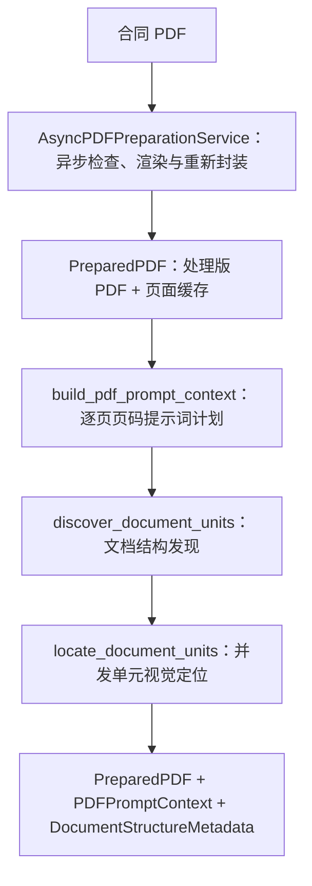

# PDF 准备服务与文档结构理解子图

> **用途：** 本文定义工作流外的异步 PDF 准备服务，以及直接消费 `PreparedPDF` 的文档结构理解子图。

---

## 子图定位

创建合同任务时，应用层先通过异步服务形成处理版 PDF 和同源标准页面；只有成功得到 `PreparedPDF` 才注册任务并进入 Agent。文档结构理解子图为后续分类以及字段、条款、检索视图子图提供提示词页面和权威文档结构，但不再读取或渲染原始文件。

`app.service.pdf_preparation` 拥有 PDF 检查、哈希、视觉预算、渲染和处理版重新封装职责；`subgraph/document_understanding/node.py` 只保存 `build_pdf_prompt_context`。子图状态以 `PreparedPDF` 为必需输入，不再接受 `ContractExtractionRequest`。



---

## 异步 PDF 准备服务

`AsyncPDFPreparationService.prepare` 在创建请求中调用，检查文件存在性、空文件、PDF 格式、加密状态和页数，计算原始文件 SHA-256，并按原始页序调用[PDF 视觉压缩与重新封装工具](../../../capability/document/pdf-page-compression.md)。同步 PyMuPDF 调用整体放入工作线程，不阻塞 API 事件循环；每页独立渲染和缩放，同一 PDF 内不得假设所有页面尺寸相同。预算内页面随后重新封装成处理版 PDF。准备失败时创建接口返回 `422`，且不会注册任务或产生 `run_id`。

任务聚合明确持有且只持有处理版 PDF 字节；原始上传字节在创建请求返回后释放。`document_id` 使用处理版 PDF 哈希，作为后续入库和所有工作流结果的权威文档身份；系统不计算或记录原始文件哈希。`source_file_size_bytes` 只保留原文件大小数值，`processed_file_size_bytes` 表示处理版大小。逐页 PNG 是从同一次渲染得到的工作流缓存，不是另一份原始 PDF。

当前 `PreparedPDFPage` 已记录物理页码、PNG 字节、渲染宽高、实际渲染比例、视觉 token、图像 SHA-256 和是否缩放。后续如需扩展页面事实，应由本节点程序化补充：

```yaml
page_number: 1
source:
  width_points: 595.0
  height_points: 841.0
  rotation_degrees: 0
  has_text_layer: false
rendered:
  width_pixels: 1190
  height_pixels: 1682
  render_scale: 2.0
  visual_tokens: 2014
  was_scaled: false
content_sha256: "..."
```

原始宽高使用旋转生效后的页面可见矩形；文本层状态只表示程序能否读取非空文本，不代表文本完整或可信。模型不得重新生成或覆盖这些确定性字段。

服务根据启动期注入的 MLLM 配置动态计算视觉容量：扣除最大生成、公共提示词和多轮工具历史预留后，视觉总预算随文档页数增长，直至容量上限。全部页面共享该容量；页数增加后，服务等比分摊单页预算并按需缩放，使整组页面图像始终构造成一个连续公共前缀，不切分请求。

---

## `build_pdf_prompt_context` 节点

节点只读取 `PreparedPDFPage` 已有的页码和当前图像宽高，将其转换为轻量、确定性的 `PDFPromptContext`。它不重新打开 PDF、不重新计算尺寸，也不保存 Base64 图片副本。页码进入模型公共前缀；宽高继续保留为程序事实，只用于结果校验和坐标换算，不再写入模型可见文本。

每页描述紧邻对应图片，格式固定为：

```text
第 1 页
[第 1 页图像]

第 2 页
[第 2 页图像]
```

页面尺寸不进入模型可见描述，避免把渲染尺寸与后续视觉定位使用的坐标系混淆。节点仍按整组页面保存页码、宽高和描述文本，并校验每条描述与页面事实一致；视觉定位坐标契约确定后，可按对应页面自己的宽高执行坐标换算。

---

## `discover_document_units` 节点

节点读取 `PreparedPDF` 和 `PDFPromptContext`，在稳定页面图像公共前缀之后追加结构发现任务，通过异步 strict function calling 生成合同整体认识和宏观连续内容单元。模型可见公共阅读提示词版本为 `contract-page-reading-v4`，只描述页面图像与物理页码，不暴露源文件格式。结构发现使用 start、可空的有序 `navigation_anchors` 和 end 描述连续语义范围，不负责生成坐标，并直接输出 `DocumentStructureMetadata`。

工具、状态、提示词和详细边界规则统一位于 `subgraph/document_understanding/document_structure/`，具体设计见[文档结构发现节点](document-structure.md)。

---

## `locate_document_units` 节点

节点位于结构发现之后，为所有语义单元并发建立独立的 `think / draw_bbox / finish` 工具循环。每个会话只选择该单元 start～end 涉及的页面，跨度外页面不编码进请求；每张选中图像仍由公共构造器在图像前标记明确物理页码。

节点程序化生成有序锚点、补充无显式锚点中间页的 `page_body`，使用 non-strict 工具并执行本地严格坐标顺序校验，把成功结果写入 `DocumentStructureMetadata.unit_locations`。详细状态机与失败隔离规则见[文档结构与视觉定位节点](document-structure.md)。

---

## 输出与所有权

`PreparedPDF` 是进入 Agent 后的处理版文档和页面事实唯一来源，保存处理版标识与 PDF 字节、来源展示路径、原始与处理版大小、总页数、动态预算和完整页面缓存；`PDFPromptContext` 是从页面事实生成的轻量提示词计划；`DocumentStructureMetadata` 保存合同主题、内容单元和逐单元视觉定位结果。这三项共同传给后续节点。原始上传字节在创建请求结束后不再由运行聚合持有。

结构发现节点只读使用页面产物。若模型语义结果与程序页面事实冲突，程序事实优先，冲突必须保留在证据或审核信息中，不能静默覆盖。

---

## 配置与验证

渲染比例、视觉 patch、单页上限和上下文预留均从 MLLM 配置读取；单请求预算由上下文窗口动态推导，也可通过环境变量显式设置更小上限。实现或调整 PDF 准备与文档结构理解逻辑时，应验证：

- 每页渲染结果不超过单页视觉 token 预算。
- 整份 PDF 的视觉 token 总量不超过动态请求预算。
- 页码连续、唯一，页面事实与渲染结果一一对应。
- 每页提示词描述只包含对应物理页码并紧邻该页图片，不暴露渲染宽高。
- 提示词不出现“压缩后尺寸”等模型无法直接验证的实现表述。
- 同一输入重复构造时，公共消息前缀和前缀指纹保持稳定。
- 文档结构结果与页面事实使用同一文档标识，且全部物理页面被宏观单元覆盖。
- 每个视觉定位会话的图片页码集合与对应单元跨度完全一致。
- 每张选中图片前具有对应物理页码标签，定位工具页码不能越出该集合。
- 只有完成全部锚点并成功 `finish` 的定位框进入权威 `unit_locations`。

当前完整流程的真实数据验证入口见[合同提取质量与推理指标实验](../../../../experiment/contract-extraction-quality/README.md)。
