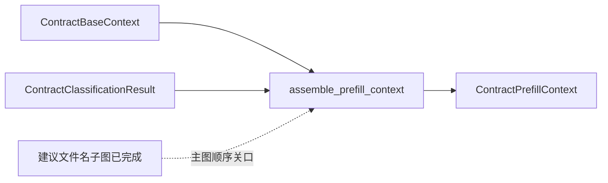

# 最终公共前缀组装节点

> **用途：** 本文定义合同分类完成后，如何把分类结果稳定追加到基础前缀，并将统一上下文交给三个并行下游子图。

---

## 节点定位

`assemble_prefill_context` 是主工作流中的确定性节点。建议文件名子图先独立消费分类结果，随后本节点组装三个业务分支需要的最终公共前缀；建议名称本身不进入该前缀。

节点不调用模型、不产生 token，也不再属于独立预热子图。

---

## 输入与输出

节点要求分类结果必须是正式 `ContractClassificationResult`，并与 `ContractBaseContext` 使用相同 `document_id`。占位对象、分类运行审计或其他文档的结果都会被拒绝。

节点复制基础消息，在末尾以带字段注释的简洁 YAML 追加分类状态、命中卡片及必要的未映射类型描述，生成版本化、带 `prefix_sha256` 的不可变 `ContractPrefillContext`。失败类别 code、未命中证据和工具历史不会进入下游公共前缀。

三个下游子图只读复用该上下文，并在末尾追加自己的任务、工具和动态目标；不得原地修改公共消息。

---

## 设计决策

原实现还包含 `prefill_contract_context`，使用无工具单 token 请求显式预热最终前缀。隔离 A/B 实验显示，该请求无法覆盖三个分支不同的工具模板：计入预热成本后没有节约计算 token，墙钟耗时反而增加。因此已经删除显式预热请求、`ContractPreheatResult` 和最终结果中的预热审计字段，只保留确定性上下文组装。

Core 与条款原有的专用单 token 预热也已删除；它们现在只保留必要的确定性公共上下文组装，并由并发业务请求自然建立前缀缓存。

---

## 依赖与验证

- 消息构造由 `context.build_contract_prefill_messages` 负责。
- 节点实现在 `app.agent.contract_extraction.node.assemble_prefill_context`。
- 主图顺序固定为“分类 → 建议文件名生成 → 最终前缀组装 → 三个并行分支”；建议名称不改变最终公共前缀内容。
- 相同输入必须产生相同消息和指纹，且不得修改 `ContractBaseContext`。
- 工作流最终结果不再包含通用预热状态。
