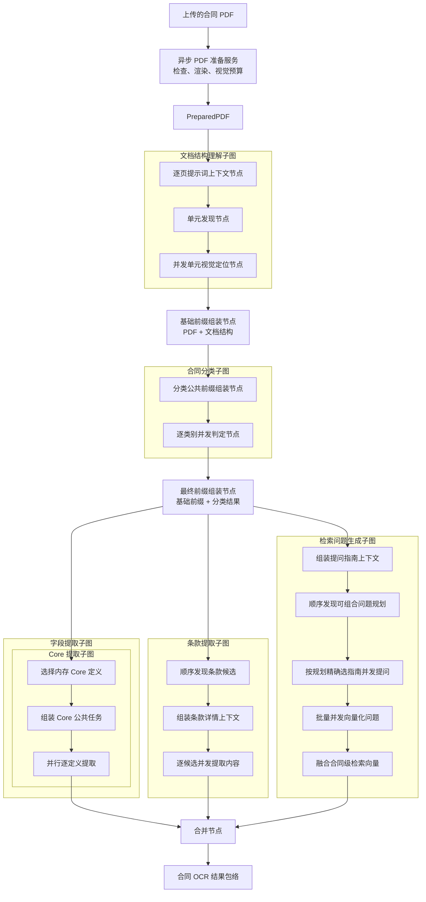

# 合同信息抽取 Agent 工作流

> **用途：** 本文定义合同信息抽取 Agent 的节点拓扑、子图边界和共享状态。Agent 直接接收应用服务准备好的 `PreparedPDF`，不负责文件检查和页面渲染。

---

## 任务包导航

本目录只维护合同提取工作流。应用层内存任务、HTTP/SSE 阶段和分支重试见[合同提取应用运行时](../../system/contract-extraction-runtime.md)；Core、类别、检索指南和正式索引结构等数据契约统一位于 [`architecture/data/`](../../data/)。

| 专题 | 职责 |
| --- | --- |
| [PDF 准备与文档结构理解](document-understanding.md) | 定义工作流外的 PDF 准备，以及文档结构理解子图入口。 |
| [文档结构发现](document-structure.md) | 定义合同内容单元发现与并发视觉定位。 |
| [合同分类](classification.md) | 定义逐类别并发判断和紧凑分类结果。 |
| [最终公共前缀组装](final-context-assembly.md) | 定义分类结果如何进入三个并行分支共享的稳定上下文。 |
| [Core 字段提取](field-extraction.md) | 定义固定 Core 目录选择与逐字段并行提取。 |
| [条款提取](clause-extraction.md) | 定义候选发现、上下文组装和逐条款并发提取。 |
| [检索问题生成](retrieval-view-generation.md) | 定义关注点规划、问题生成、向量化和融合。 |

---

## 总体结构

应用服务在创建请求内异步形成 `PreparedPDF`，Agent 工作流从该不可变输入开始构造页面提示词上下文、发现结构并完成逐单元视觉定位。主图随后组装“PDF + 文档结构”基础前缀并执行分类；最终前缀组装节点将分类结果追加到基础前缀末尾。字段、条款和检索问题生成三个子图随后并行执行，合并节点只在三者均结束后运行。

---

## PDF 准备服务与文档结构理解子图

`AsyncPDFPreparationService` 位于应用服务层，在创建任务时调用[PDF 页面压缩工具](../../../capability/document/pdf-page-compression.md)，检查文件有效性、加密状态和页数，计算原始文件 SHA-256，并按整份合同的动态视觉预算逐页等比渲染。PyMuPDF 同步工作通过 `asyncio.to_thread` 执行，不阻塞 API 事件循环；无效 PDF 在任务注册前返回请求错误。

`PreparedPDF` 以处理版 PDF 的 SHA-256 作为权威 `document_id`，保存处理版 PDF 字节、原始与处理版大小、页数、动态预算、总视觉 token 和完整页面缓存，但不计算或记录原始文件哈希。每页保存稳定的 PNG 字节、实际尺寸、渲染比例、视觉 token、图像 SHA-256、随机媒体 UUID 和是否发生缩放；任务聚合不保存原始 PDF 字节。媒体 UUID 的首次填充、并发等待和后续引用由[vLLM 多模态媒体引用](../../../capability/infrastructure/vllm-media-reference.md)统一处理。

文档结构理解子图直接接收 `PreparedPDF`，内部拓扑为 `build_pdf_prompt_context → discover_document_units → locate_document_units`。`build_pdf_prompt_context` 将每页页码和模型实际接收的图像宽高转换为确定性提示词计划，每条描述紧邻对应图片且不暴露压缩实现。公共阅读规范、页面消息和构造器统一位于 `subgraph/document_understanding/prompt.py`。

`discover_document_units` 复用同一 PDF 前缀，通过 `summary`、`think`、`generate_unit` 和 `finish` function tools 形成语义结构。随后 `locate_document_units` 为所有单元并发建立独立的 `think`、`draw_bbox`、`finish` 循环；每个会话只发送对应单元跨度内的带页码页面，并把完整结果写入权威结构元数据。两者均使用 `strict:false + tool_choice:auto`，并由客户端执行统一的有界协议恢复与本地严格校验。相关工具、状态和专属提示词内聚在 `subgraph/document_understanding/document_structure/`。完整职责见[PDF 准备服务与文档结构理解子图](document-understanding.md)和[文档结构与视觉定位节点](document-structure.md)。

---

## 基础前缀组装节点

`assemble_base_context` 是主图中的独立节点，不属于文档结构理解子图。它复用 `document_understanding.prompt.build_pdf_common_messages`，在 PDF 前缀后以带字段注释的稳定 YAML 追加包含 `unit_locations` 的 `DocumentStructureMetadata`，并输出版本为 `contract-base-context-v3` 的不可变 `ContractBaseContext`。分类子图必须直接读取该上下文，不能重新编码 PDF 或重新序列化文档结构。

---

## 合同分类子图

`classification` 包含 `assemble_classification_context` 和 `classify_contract`。节点一复制 `ContractBaseContext` 并追加所有单类别请求共享的多标签分类规则，形成版本为 `classification-common-v7` 且带独立指纹的 `ClassificationContext`；节点二读取启动期内存目录，为每个类别并发执行独立工具循环。所有请求使用相同工具定义、`before_task` 布局和公共消息前缀；页面已经由前置结构理解请求填充 vLLM 媒体缓存，因此分类并发只发送 UUID 引用，同时继续复用模型 prefix cache。具体类别资料和工具历史只属于分类子图，不写回基础前缀。

分类只使用文档结构中的单元页码、文字锚点和摘要辅助导航，忽略 `unit_locations` 坐标，不按定位框裁剪页面，也不在分类证据中输出视觉位置；导航不足时必须回退完整相关页面核查。

分类节点把完整逐类别审计保留在私有 `classification_run`，只把紧凑 `classification` 写回主图。最终前缀的模型可读投影仅追加状态、命中卡片和必要的未映射类型描述，不注入失败类别 code、未命中证据或工具历史。完整边界见[合同分类子图](classification.md)。

---

## 最终公共前缀组装节点

`assemble_prefill_context` 位于分类与三个并行子图之间。它复制 `ContractBaseContext`，在末尾稳定追加分类结果，生成新的 `ContractPrefillContext` 与独立指纹。该节点是确定性组装，不调用模型。

三个并行子图必须直接复用 `ContractPrefillContext.messages`，只在末尾追加各自任务，以获得最大前缀匹配。原通用单 token 预热经隔离 A/B 验证没有净时间或 token 收益，现已删除。完整职责见[最终公共前缀组装节点](final-context-assembly.md)。

---

## 并行子图

| 子图 | 内部节点 | 当前职责 |
| --- | --- | --- |
| 字段提取 | `core_extraction`，内部为 `select_core_definitions` → `assemble_core_context` → `extract_core` | 选择启动期 Core 快照、组装公共任务并逐定义并发提取。 |
| 条款提取 | `discover_clause_candidates` → `assemble_clause_extraction_context` → `extract_clause_contents` | 顺序发现包括子层级在内的全部候选，确定性组装详情提取共享上下文，再逐候选并发提取直接内容；三个节点均已实现。 |
| 检索问题生成 | `render_question_guides` → `discover_question_focuses` → `generate_questions` → `embed_questions` → `fuse_question_embeddings` | 先用全量指南顺序发现可组合问题规划，再按规划并发生成问题和逐问题向量，最后确定性融合合同级向量。 |

三个业务模块在最终前缀组装完成后并行执行，可只读使用 `ContractPrefillContext`、`PreparedPDF` 和 `DocumentStructureMetadata`，但字段、条款与检索问题不得共享可变状态；子图只能回写自己拥有的结果键，避免并行分支同时覆盖父图状态。

字段提取模块只保留 Core 子图，不阻塞条款和检索问题模块。它从启动期 `FieldDefinitionCatalog` 选择定义，按“选择定义 → 组装公共任务 → 并行逐字段提取”运行，并把结果包装为 `FieldExtractionResult.core`。完整边界见[字段提取子图](field-extraction.md)。

检索问题生成模块已经完成提问指南契约、启动加载、Bullet 渲染、问题规划、按规划并发生成、逐问题向量化和合同向量融合。问题规划会话首轮强制调用 `think`，随后逐个生成关注点规划；每份规划建立隔离会话生成带证据的问题。成功思考、正式动作和最小工具反馈保留在对话轨迹中，不另建模型可见工作区。模块正式输出键为 `retrieval_questions`、`retrieval_question_embeddings` 和 `contract_retrieval_vector`，不再生成问题答案。完整设计见[检索问题生成子图](retrieval-view-generation.md)。

---

## 合并与输出

`merge_extraction_results` 汇集分类、文档结构、字段、条款、检索问题、逐问题向量与合同融合向量，形成单一合同结果包络。后续实现应在此处保留节点级错误、模型与提示词版本、字段目录版本和原始证据索引，而非直接丢弃失败分支。

当前异步 PDF 准备、结构单元发现、基础前缀组装、合同并行分类、最终公共前缀组装、Core 字段提取、条款三节点子图、检索问题生成、逐问题向量化和合同向量融合已经可用；正式索引和专家确认接口尚未接入主图。因此合并结果仍属于自动提取草稿。

HTTP 应用不会用主图末尾的三路汇合等待用户查看结果。服务层复用相同节点和子图完成公共前置处理，随后独立调用 Core、Clause 与 Retrieval 分支：任一路成功即可原子提交增量草稿，失败阶段可从断点重试。这是应用交互与容错编排，不改变 Agent 子图内部职责；完整状态机见[合同提取应用运行时](../../system/contract-extraction-runtime.md)，外部协议见[合同 API](../../../api/contract.md)。

---

## 扩展顺序

1. 使用真实合同验证逐类别判定准确率、工具重试、并发稳定性和分类公共前缀缓存命中率。
2. 设计主类别、次类别或并列关系的独立汇总规则，不让单类别会话越权决定类别关系。
3. 使用缓存指标验证三个下游请求对最终前缀的实际命中率。
4. 使用不同页数、缓存压力和并发请求继续校准动态页面预算与 prefill 策略。
5. 使用测试合同验证 Core 字段准确率、放弃边界、并发稳定性和公共前缀缓存命中率。
6. 使用真实查询评估合同融合向量的召回质量，并实现 Elasticsearch 投影。
7. 最后实现合并后的结果契约、失败隔离和专家审核。
