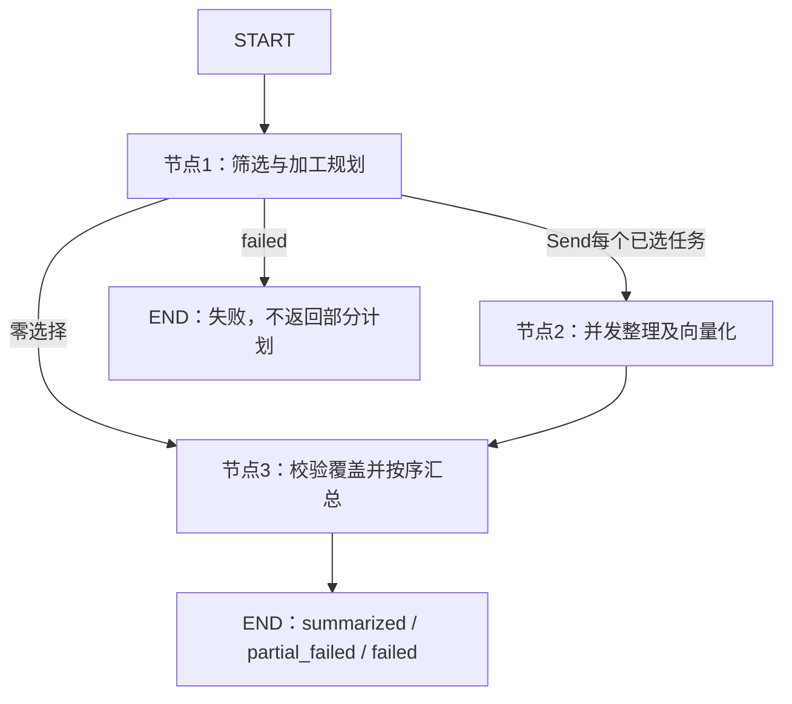

# 会话记忆加工工作流

> **实现状态：** 已实现节点1筛选、LangGraph Send并发节点2单任务整理及总结侧向量化、节点3待入库数据汇总。本图不写文件或SQLite；[归档Service](../../system/communication-archive.md)已接通定时分批、落盘和安全驱逐，查询端尚未实现。

---

## 包结构与职责

| 文件 | 职责 |
| --- | --- |
| `workflow.py` | 装配三节点图、Send分发及并发限制；筛选失败直接结束。 |
| `state.py` | 批次输入、完整计划、失败及私有审计输出。 |
| `node.py` | 两类节点共享的有限模型循环、单任务整理及确定性汇总。 |
| `tool.py` | 节点1三工具及节点2两工具的独立Schema、严格参数解析和顺序校验。 |
| `prompt/planning.py` | 系统提示词、业务字段投影与确定性任务渲染。 |
| `prompt/summarizing.py` | 节点2单任务记忆整理提示词与消息构造，已接入工具循环。 |
| `prompt/guidence.py` | 独立 user 纠错消息构造器。 |
| `prompt/embedding.py` | 双侧场景化固定指令与总结侧编码输入。 |
| `embedding.py` | 调用Embedding、校验响应、L2归一化及独立审计。 |

具体契约见[筛选规划提示词](planning-prompt.md)和[筛选工具](planning-tools.md)。

节点2详细规则见[单任务记忆整理提示词](summarizing-prompt.md)及[整理工具](summarizing-tools.md)。

向量化和后续查询端采用双侧场景化方案，固定指令统一见[会话历史检索向量化契约](retrieval-embedding.md)。节点2编码及节点3返回内容的完整契约见[待入库数据](pending-records.md)。

---

## 流程与输入输出



等价顺序：START → 节点1 → Send逐任务并发调用节点2 → 节点3 → END。筛选失败直接结束；零选择直接汇总为空结果。

MemoryGenerationInput.tasks 为同一授权范围内的非空有序批次，每项含唯一 task_id、六种终态之一的 status、原任务创建时间 created_at（UTC Unix毫秒，可空）和公开 input/trace payload。created_at 沿用历史字段，不在 payload 重复存储；调用方需传入真实时间，缺失不补填。模型看到展示序号及带 +08:00 偏移的创建时间，程序映射真实 ID。输入不接受模型生成的旧计划或审计；节点1重新校验并深拷贝，授权及批次规模由调用方保证。

输入另可携带activated_at与processing_duration_ms，作为原轨迹元数据复制到待入库记录，不注入总结向量，不用本次加工耗时替代。

MemoryGenerationOutput 包含：

| 字段 | 含义 |
| --- | --- |
| execution_status | planned仅表示节点1成功；summarized表示全部加工结束（非空正文已向量化，含无记忆及零选择）；partial_failed表示部分分支失败；failed表示筛选失败或全部已选分支失败；not_implemented仅为未运行DTO默认值。 |
| plans | 完整筛选计划；筛选失败为null。节点2失败不撤销节点1已完成计划。 |
| results | 按原计划顺序排列的所有已选任务终态；仅运行节点1或筛选失败时为null，零选择时为[]。 |
| error | failed或partial_failed状态有错误说明。 |
| planning_audit | 私有逐轮审计，不进入前端历史或模型上下文。 |
| pending_records | 已汇总的待入库内容，按原输入顺序包含成功和跳过任务，不含加工失败项；尚未汇总为null。 |

仅finish_selection被接受才发布完整计划；节点2不覆盖该计划及节点1审计。summarized表示加工结束，不表示持久化或业务目标完成。

results每项为MemoryTaskResult，包含task_id、task_number、status、retrieval_text、embedding、evidence、reasoning_summary、error、私有audit和embedding_audit。单任务status为summarized（有正文和有效向量）、no_memory（有依据和原因但正文/向量为null）或failed（有错误，不发布正文/向量/依据/整理理由半成品）。两类审计只供内部追溯，不拼入记忆正文或pending_records，不直接传前端。

---

## 节点1执行与上下文

- 每批独立持有工具状态、正常短期记忆、纠错边界和审计，无共享检查点。
- 读取启动加载的 tool_tag；使用 auto、before_task、tool_task_index=1 请求模型。额外 thinking 通道关闭，任务相关推理通过 think 参数表达，生成参数沿用 MLLM 配置。
- 每轮保存响应、全部工具参数、响应元数据、用量和耗时，再验证数量、附加普通文本、截断、参数及调用顺序。失败动作不进入计划。
- 连续失败最多允许两次修正机会，第三次失败结束；总轮次最多 128。较大批次需由后续 Service 控制规模。
- 工具自身错误（未知工具、JSON错误、重复属性、Schema参数错误及任务序号越界）通过与调用标识配对的tool消息返回具体原因，不额外插入system_guidence。参数错误反馈从实际工具定义读取允许字段并说明缺失、多余或类型/取值问题，不回显参数值或未知属性名称。
- 协议与流程违规（零/多工具、附加普通文本、截断、缺少调用标识、首轮顺序、连续think、回头选择）使用独立user身份的system_guidence；能配对单工具时同时保留未接受的tool反馈。以明确异常类型区分，不靠错误字符串判断。零/多工具或附加普通文本时仍提示真实tool_tag。
- 下一动作通过全部校验后，只移除本段纠错期间由程序插入的 system_guidence 消息。已经进入上下文的失败调用、失败工具反馈及正常交互均按原顺序保留，直到本批结束；失败动作不进入权威选择。普通文本或无合法单工具的原始响应仍只保留于审计，不伪造工具交互。
- 本节点按用户明确约定采用“只清理指引”的例外策略，不使用通用 ToolProtocolRecovery 的整段失败轨迹删除行为；以插入位置定位指引，不按内容匹配删除。连续失败时指引继续保留，完整校验成功才清理；私有审计始终完整。其他节点的清理策略不变。
- 本节点不将 select_task 当作裁剪上下文的检查点，也不以已选列表替换正常交互历史。权威选择仍由工具状态独立维护，think 中的安排不自动成为正式计划。该节点边界不同于通用规范中检查点重建的推荐策略；最多128轮的限制保持不变，上下文会随有效交互增长，批次规模需由调用方控制。
- 模型请求错误或不可用返回 failed，保留已有审计、不发布半成品；取消异常向上传播并关闭客户端。
- 工具块固定在索引1的初始任务前，不随正常工具交互或纠错消息移动。真实服务需要使用更新后的项目聊天模板。

审计随正常或显式失败结果返回内存调用方，尚无独立持久化审计通道；进程退出或外部取消时的审计备份仍需 Service 后续实现。上下文边界遵循[上下文规范](../../../standard/agent-context-management.md)。

---

## 调用及未实现边界

节点1完成后使用LangGraph的[Send机制](https://docs.langchain.com/oss/python/langgraph/graph-api#send)，每个分支仅携带一份深拷贝任务和对应选择。分支各自维护执行器、messages、纠错索引、失败计数、审计和客户端；通过内部task_results的列表追加reducer收集终态，不覆盖全局results。

节点3不调用模型，在分支结束后核对覆盖范围、唯一性、task_id及task_number，按原选择顺序输出。缺失、重复或计划外结果导致显式异常，不发布伪成功汇总。分支模型错误、连续三轮校验失败或轮次耗尽返回单任务failed；未预期分支异常仅暴露类型并保留已有审计，不影响兄弟任务。取消异常继续传播并关闭客户端。

节点2沿用节点1的反馈分流与历史保留策略，共享有限模型循环；每任务最多128轮。正文完成后独立调用Embedding，编码失败不交给MLLM纠错。图默认max_concurrency取MLLM和Embedding并发配置较小值，可在调用config中覆盖；它限制单次图调用的并发分支，不是跨请求/进程的全局限流。没有新增后台队列。

```python
from app.agent.conversation_memory import build_conversation_memory_graph
from app.core.config import get_settings
from app.core.tool_tag import initialize_mllm_tool_tag

# 独立脚本需要初始化；正式应用启动时已经加载。
initialize_mllm_tool_tag(get_settings().mllm)
graph = build_conversation_memory_graph()
# 在异步环境中调用；这会请求真实模型，vLLM 未启动时不要直接运行。
# output = await graph.ainvoke({"request": {"tasks": [
#     {"task_id": "t1", "status": "completed",
#      "payload": {"input": {"text": "仅比较付款条件"}, "trace": []}}
# ]}})
```

CommunicationArchiveService已调用本图，负责授权、十分钟扫描、至少10条且以completed结尾的正常批次、原记录身份映射、落盘、重试和驱逐。边界约束由Service执行，不在图内限制独立实验的批量大小；强制驱逐尾批可不足10条或以中断状态结束。检索文本不是上下文截断用的summary记录。

[统一驻留与后台备份](../../system/communication-history.md)继续运行，归档调度与原始备份独立，不修改原任务终态。没有新增 HTTP API。

---

## 验证

Map-reduce专项测试使用真实编译图和事件屏障验证两个Send分支同时进入、逆序完成仍按原任务排序、消息隔离、部分/全部失败、无记忆、覆盖校验及外部伪造结果不可注入。新增编码与待入库测试详见[待入库数据](pending-records.md)。节点2调用Embedding但不写业务存储。

总结侧向量化接入后，真实完整图再次处理24条轨迹，16条完成编码、8条跳过编码，节点3按原顺序返回24条待入库记录。全部4096维向量及原字段复制通过核对，详见[接入联调记录](../../../../experiment/conversation-memory-selection/output/20260909T050219.266017Z/analysis.md)。

2026-09-09已使用24条合成回归轨迹执行真实完整图，16条入选且全部生成总结，无调用失败，完整图耗时约57.5秒。但人工发现时间遗漏、额外推断及措辞强化，不能将技术成功等同于内容准确。原始总结和逐任务问题见[本次分析](../../../../experiment/conversation-memory-selection/output/20260909T043206.383334Z/analysis.md)。

离线 unittest 使用模拟客户端覆盖正常完成、全部跳过、工具错误与流程指引分流、连续混合错误期间指引保留与成功后清理、多次选择后成功think与计划保留、成功/失败工具交互顺序及配对、三次连续失败、轮次耗尽、截断、服务不可用、取消、身份映射、失败不发布半成品、输入重校验和批次隔离；另验证 Jinja 工具锚点及客户端参数透传。

真实模型实验入口及产物约定见[筛选与完整图实验](../../../../experiment/conversation-memory-selection/README.md)。使用 --run-graph 导出全任务台账、逐任务总结及候选语料，跳过/失败项不会伪造正文。历史实验不能替代后续版本的真实模型质量和token成本验证。

检索文本仅用于向量定位任务，后续模型应阅读回连的原始轨迹而非这段总结。独立[7题向量召回实验](../../../../experiment/conversation-memory-retrieval/README.md)已使用官方Qwen3-VL-Embedding指令编码16份原始总结，7个预设相关任务均位于Top 1；其中时间遗漏样本分差较小。具体证据与边界见[召回分析](../../../../experiment/conversation-memory-retrieval/output/20260909T045017.197016Z/analysis.md)。该实验只验证小语料精确向量排序和task_id回连，不代表正式图已接入向量化、SQLite检索或回答生成。

实验另支持 --variant official/scenario-query/scenario-both，对照官方基线、仅查询侧场景化与双侧场景化。本次三组均7/7首选正确；双侧场景化的平均正确/干扰分差较大，但不能据此证明准确率提升，详见[三组指令对照](../../../../experiment/conversation-memory-retrieval/output/20260909T045426.163563Z/analysis.md)。用户选定的双侧方案已用于节点2总结侧编码，查询端仍未实现；实验CLI默认保留官方基线，复现选定方案需显式使用scenario-both。
