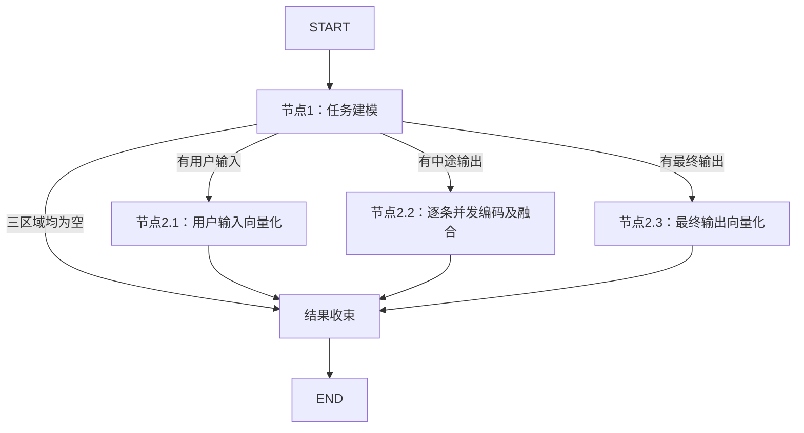

# 单任务记忆加工子图

> **当前边界：** 子图接受上游已经筛选过的一个终态任务，确定性提取用户输入、中途输出、最终输出，再按实际内容并发向量化。不接受任务列表，不执行筛选，不调用MLLM生成摘要，不写SQLite。外层归档Service已接通筛选、任务并发调用、原子提交及后台扫描。

---

## 节点与拓扑



等价顺序：一个建模节点 → 实际存在的编码分支并发执行 → 一个确定性收束节点。因此共有5个注册节点：1个建模、3个编码、1个尾部收束。收束不调用模型，负责覆盖校验和完整结果发布，不承担第四类编码。

三条外层分支处于同一执行层，完成后收束一次。用户输入分支内部对用户文字及每份文件并发编码，中途分支内部对各条消息并发编码，受局部Semaphore及EmbeddingClient进程级全局额度控制；不会在中途消息逐条完成时发布半成品。没有内容的分支不发请求，也不构造零向量。

---

## 输入与输出

入口：`build_conversation_memory_graph().ainvoke({'request': task})`，task为单个 `ConversationHistoryRecord` 或对应字典，必须是kind=task的终态记录，保留原record_id、sequence、turn_id、payload及创建/激活/处理时长。原始任务输入不能只给正文或任务ID，否则无法准备完整原记录；不得由模型生成身份与序号。上游负责筛选与授权，本图不决定哪些任务应该加工。

```python
from app.agent.conversation_memory import build_conversation_memory_graph
from app.schema.communication import ConversationHistoryRecord

# 调用会实际访问配置的Embedding服务。
task = ConversationHistoryRecord(
    record_id='原任务record_id', sequence=1, kind='task', turn_id='原轮次ID',
    status='completed', created_at=原任务创建时间毫秒,
    payload={'input': {'text': '核对付款条件', 'files': []}, 'trace': []},
)
# result = await build_conversation_memory_graph().ainvoke({'request': task})
```

`TaskMemoryOutput` 返回：

| 字段 | 含义 |
| --- | --- |
| execution_status | completed或failed，仅表示记忆加工状态，不改变原任务终态。 |
| record | 成功时为原ConversationHistoryRecord的完整副本，可供conversation_records备份；失败时为None。 |
| retrieval | 成功时为TaskRetrievalRecord对应字典：record_id及三组文本/向量；失败时为None。 |
| error | 编码失败的区域名称；不回显服务地址或异常敏感正文。 |
| audit | 按入口及原消息顺序保留Embedding调用审计，仅供内部使用。 |

三区域均空时成功返回全NULL投影，不调用模型。计算失败不能转成空区域。任一区域失败返回failed且record/retrieval均为None，其他区域的成功向量不作为部分可入库结果返回。取消异常向上传播并取消/清理在途协程。非法输入及内部覆盖不一致直接抛校验异常，不能标记任务已加工。

输入schema仅接受request通道；外部伪造branches、retrieval等状态不参与执行。节点1重新校验输入并深拷贝，图实例可复用，各次执行状态隔离。

---

## 任务建模规则

节点1通过程序投影，不生成新的判断、结论或摘要。

- 用户输入格式为“用户问题、文件名、展示名称、文件摘要”，缺失项省略；不加入file_id/page_count元数据。用户原文中明确以file_id=或file_id:标注的规范UUID/64位哈希也只在编码投影中去除，不改写权威轨迹，不猜测删除其他数字。
- 中途输出仅取trace中type=message、message_kind=intermediate且status=completed的消息；没有“中途提问”区域。每条输出独立保留，内容相同的不同消息不去重。同一message_id因工具穿插拆出的片段按原顺序拼回一条消息，保留片段间原始空格。
- 最终输出仅取已完成的final公开消息；没有实际最终输出则为空，不补造用户取消或方向调整的结论。
- agent_messages、events、内部思考、system-guidence、工具调用及反馈均不作为输出正文来源。仅有公开trace缺失的旧任务不会通过其他投影猜测恢复正文。
- 原始任务中保留文件身份、页面信息及调用轨迹供回连；检索投影的精简不删除权威数据。

---

## 编码与融合

使用现有EmbeddingClient和全局请求额度，当前契约为qwen3-vl-embedding-8b、4096维。用户问题及文件分别使用 `user-input-question-file-v1` 专用指令；中途输出保留 `three-view-excerpt-v2-readable-input` 通用指令，最终输出使用 `final-response-v1` 结论专用指令，由 `prompt/embedding.py` 构造，详见[编码指令](retrieval-embedding.md#用户问题与文件专用指令)。不需要初始化MLLM工具模板。

用户输入先拆成一个用户文字区块、每份上传附件及每份引用合同各一个格式化区块，分别并发编码，再将各单位向量等权平均并再次L2归一化。空白文字和无有效字段的附件跳过；只有文件也可编码。单份文件内部仍按“文件名、展示名称、文件摘要”拼接，支持仅含其中一个字段，不加入file_id/page_count。用户文字沿用“用户问题：”标签。每个非空区块权重相同，不按长度加权；文件越多，其合计权重越大。最终输出调用一次编码。中途输出逐条独立编码，结果各自L2归一化，再等权平均并再次L2归一化；单条消息保持其单位向量。条数不改变外层入口权重，图不计算额外综合任务向量。中途文本以 `numbered-intermediate-v1` 模板按原消息顺序编号并使用分隔线拼接存储；中途向量是逐条融合结果，不是对拼接文本再编码。用户输入同样保持原拼接文本存入user_input_text，但user_input_embedding改为区块融合向量；不新增SQLite字段，也不存储区块级向量。任一用户输入区块编码失败，整个任务失败，不能静默丢弃该区块。

客户端检查模型、数量、维度、有限值和非零范数；最终结果再经TaskRetrievalRecord检查。融合自身不保留先后顺序的语义，也不保证后续更正自动覆盖此前判断。实际核对仍回读任务及最终输出。

---

## 包结构与后续接入

| 文件 | 当前职责 |
| --- | --- |
| workflow.py | 正式单任务图装配。 |
| node.py | 单任务建模、分流、三路编码、融合、收束及新图状态。 |
| embedding.py | 任务片段编码及向量响应校验，仅暴露embed_task_text。 |
| prompt/embedding.py | 版本化Embedding指令与实际输入渲染。 |
| 输入契约 | 直接使用ConversationHistoryRecord，不保留批量DTO。 |


新结果已通过CommunicationArchiveService及ConversationHistoryService.commit_archive接入[SQLite三入口存储契约](../../data/communication-sqlite.md)。Service在外层筛选终态任务、并发执行本图，完整校验原任务及投影关联后按原顺序整批提交。正式后台扫描及安全驱逐已恢复，具体筛选、分批、重试和生命周期见[归档与驱逐](../../system/communication-archive.md)。

旧批量筛选、综合摘要节点、工具调用提示词、DTO及兼容入口已移除。历史实验原始输出保留；当前代码不再支持运行旧筛选实验。已有[三入口融合实验](../../../../experiment/memory-three-view-retrieval/README.md)和[真实归档链路实验](../../../../experiment/memory-persistence-live/README.md)继续使用当前实现。

---

## 验证

`tests/test_conversation_memory.py` 使用真实编译图、模拟Embedding验证三路与逐条并发、缺失区域跳过、空任务、单条失败不发布半成品、取消清理、状态隔离、拒绝批量输入及外部伪造结果、文件投影、消息拆片合并和融合边界。

旧批量图专用测试及模拟客户端已删除；Embedding响应校验测试已改为验证当前片段编码入口。新存储事务测试验证TaskRetrievalRecord的校验与恢复，归档链路测试覆盖正式调度及临时SQLite。真实Embedding联调记录见上述实验。

---

## 尾部收束与中途输出模板

`collect_task_retrieval` 是所有路径的最后一个节点，返回两份互相关联的内容：record用于原始任务表，retrieval用于检索表，两者record_id必须一致。原任务保持完整副本，包括原始文件身份与任务轨迹；只有检索投影采用精简格式。audit独立返回，不混入这两份待入库对象。

三类正文模板、编码边界和空值规则统一见[检索文本模板与向量化契约](retrieval-embedding.md)。中途输出采用 `numbered-intermediate-v1`，标题及分隔线只用于存储展示，不参与逐条编码；原消息通过record.payload.trace回连。

上层取得成功结果后，可将 `[result['record']]` 与 `[result['retrieval']]` 分别传给 `archive_tasks_with_workspace` 的 records/memories参数；会话所有权、工作区快照及期望版本仍由Service提供，不由子图生成。本图本身不执行落盘。


---

## 用户输入编码策略更新

当前用户输入采用分块并发融合，并按用户问题与文件分别注入专用指令；中文展示标签未改动。已加工任务不会自动重算；已有拼接编码向量保持原值，后续如需统一历史检索语义，应另行重建旧投影。此前指令实验使用整段用户输入编码，其指标不代表当前分块融合策略的召回质量。
