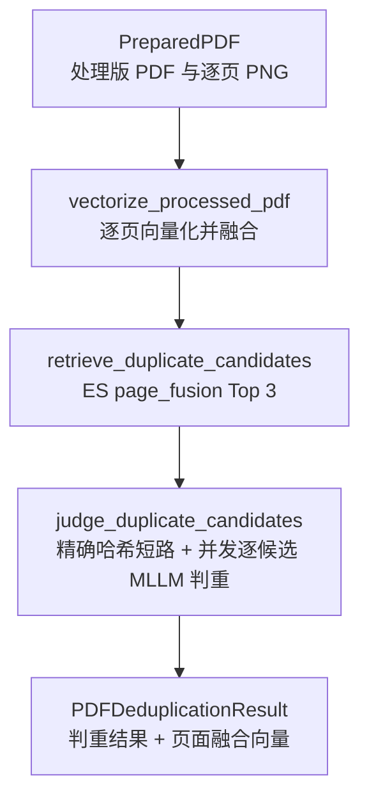
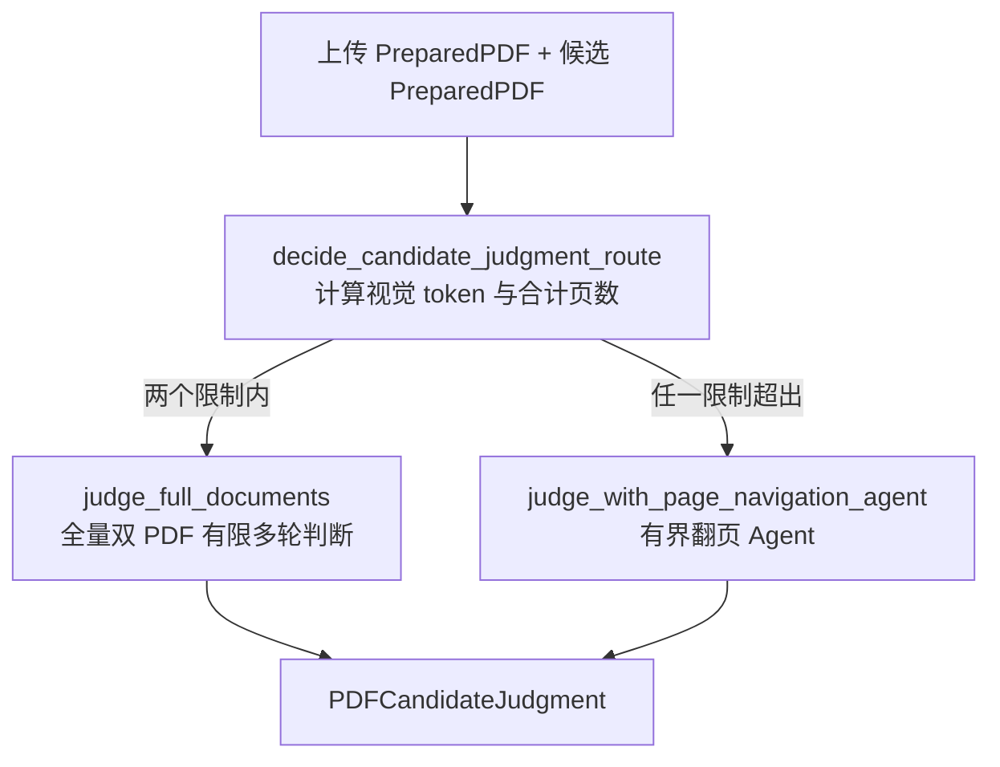

# PDF 查重 Agent 工作流

> **用途：** 本文定义处理版 PDF 在合同提取前执行向量召回与多模态判重的独立 Agent 工作流，包括三阶段节点、状态契约、失败边界和后续接入顺序。

> **实现状态：** 节点一已接入多模态 Embedding 并执行尾页加权融合，节点二已接入带最低 cosine 门槛的 Elasticsearch Top 3 召回；节点三已完成本地候选加载、并发编排、预算分流、全量双 PDF 判断及候选页面导航判断。应用运行时已在合同结构识别之前接入本工作流，并形成最长 10 分钟的前端确认暂停点。

该工作流位于 `app.agent.pdf_deduplication`，与[合同信息抽取 Agent 工作流](../contract-extraction/readme.md)并列。它只接收 PDF 准备服务已经生成的 `PreparedPDF`，不重复校验、压缩或渲染上传文件。

---

## 目标与边界

PDF 查重有三个目标：

- 在合同提取和正式入库前识别已经存在的重复处理版 PDF。
- 将查重作为合同提取的前置门禁；完成后通过 SSE 只返回 Top-3 中确认重复或相似的合同、ES 友好文件名和文件地址，并等待前端继续请求。
- 将本次生成的页面融合向量保留在正式结果中，后续复核入库时可直接写入 `vectors.page_fusion`，不重复推理。

工作流只判断上传 PDF 与召回候选是否重复，不负责人工复核、正式入库、文件存储或索引文档写入。候选来自正式合同索引，Elasticsearch 不保存 PDF 字节；当前本地文件适配器把形如 `/<document_id>.pdf` 的 `file_uri` 解析为 `data/contract/<document_id>.pdf` 并读取处理版 PDF。

---

## 节点拓扑



三个节点顺序执行，第三个节点内部才按候选并发。向量召回通常只负责缩小候选范围，不能单独决定重复；唯一例外是候选 `document_id` 与上传处理版 PDF 的 SHA-256 完全一致，此时文件身份已经确定，无需 MLLM 即可判定重复。其他候选仍必须由 MLLM 对两份处理版 PDF 逐份比较。

---

## 页面向量输入策略

页面向量化正式采用 `contract-near-duplicate-v2`，权威定义位于 `app.agent.pdf_deduplication.prompt`。system instruction 固定为：

```text
为合同页面图像近重复检索表示此页面。重点保留可见文字、数字、表格、版式、页面结构、页眉页脚、印章与签名；忽略压缩、缩放、渲染差异和轻微扫描噪声，但保留合同主体、金额、日期、条款、页码及签章等实质差异。
```

输入必须遵循以下规则：

1. 每次请求只编码 `PreparedPDF.pages` 中的一张处理版 PNG，不把多页图像放入同一次请求。
2. 上传 query 与已入库 gallery 使用完全相同的版本、system instruction 和消息结构，不使用 query/document 两套指令。
3. user 内容只包含页面图像和用于保持 Qwen3-VL-Embedding 官方消息形状的空文本；不注入 OCR、文件名、`document_id`、物理页码或总页数。
4. 页码、图片哈希、耗时和模型信息只进入程序状态或审计，不参与模型表征。
5. `embedding_input_version` 表示完整输入契约，包括指令文本、消息角色、内容块顺序和元数据排除规则；其中任一项发生实质变化都必须升级版本。

正式索引不额外保存单页向量或逐文档输入版本，因此同一个索引中的 `vectors.page_fusion` 必须由同一输入版本和同一融合版本生成。更换输入版本时必须为已有合同全量重算，并在新索引或隔离字段完成回填后整体切换；不得把不同版本向量直接混入同一个召回空间。

该策略由 [PDF 页面向量召回实验](../../../../experiment/pdf-page-embedding-recall/README.md)确定。扩充后的实验覆盖 9 份唯一合同、5 份多页合同和 88 次成功页面请求；推荐指令总体及多页子集 Recall@1 均为 100%，且平均正负间隔均优于官方默认指令。实验仍只验证重渲染变化，困难负样本、结构性页面变化和 Elasticsearch 实际召回属于后续验证范围。

`contract-near-duplicate-v2` 只调整模型可见的输入介质表述，历史实验产物仍记录并验证 `v1`。Embedding 输入版本不同的向量不得长期混用；升级后应重新生成正式索引中的 `vectors.page_fusion`，并使用同一版本重新验证召回指标。

---

## 节点职责

### 页面向量融合

`vectorize_processed_pdf` 负责：

1. 按物理页码读取 `PreparedPDF.pages` 中已经处理好的 PNG，不重新渲染 PDF。
2. 使用 `contract-near-duplicate-v2` 对称输入和多模态 Embedding 为每页生成固定维度向量。
3. 校验每页向量的维度、有限数值和归一化边界。
4. 对全部页面执行尾页 1.5 倍、其余页面 1.0 倍的加权平均，并重新 L2 归一化，形成 `PDFPageFusionVector`。融合版本应标记为 `tail-weighted-1.5-l2-v1`。

正式状态只保留融合向量、来源页码、模型与融合版本，不长期保存单页向量。融合必须覆盖全部处理版页面；任一页面失败时不能用部分页面向量冒充完整查重向量。

### Top 3 候选召回

`retrieve_duplicate_candidates` 使用 `PDFPageFusionVector.vector` 查询正式索引的 `vectors.page_fusion`，通过 Elasticsearch Async Client 的 kNN 查询返回最多三份候选。工作流构建时显式注入应用级共享客户端和索引名；每份 `PDFDuplicateCandidate` 保留排名、`document_id`、文件名、`file_uri`、页数和 ES 分数。

召回请求把 `PDF_DEDUP_MINIMUM_RECALL_COSINE_SIMILARITY` 直接传给 ES 的 `knn.similarity`，默认原始 cosine 门槛为 `0.60`。ES 在近邻探索后排除低于门槛的向量，因此结果可以是 0～3 条；候选为空表示当前索引没有达到最低相似度的 PDF，可以直接形成唯一结论。该参数只决定是否值得进入 MLLM，不直接形成重复关系。

`PDFDuplicateCandidate.score` 保存响应中的 ES `_score`，不是原始 cosine。当前 mapping 使用 cosine 时，二者满足 `_score = (1 + cosine) / 2`，所以默认原始门槛 `0.60` 对应 `_score 0.80`；节点使用 ES 原生 `similarity` 参数，避免在应用层混用两种口径。阈值来源、正负样本回放和风险边界见[尾页加权实验分析](../../../../experiment/pdf-page-fusion-weighting/output/20260901T114337.345239Z/analysis.md)。达到门槛的候选中仍可能存在同模板或关联合同，ES 分数只决定比较顺序，最终关系必须由 MLLM 判断。

### 并发逐候选判重

`judge_duplicate_candidates` 是候选集合的外层编排节点，负责：

1. 在加载候选前比较上传与候选的 `document_id`；完全一致时形成确定性的 `ExactDocumentDuplicateCandidate`。
2. 通过注入的 `PDFDuplicateCandidateLoader` 按 `file_uri` 加载其他候选处理版 PDF。
3. 为其余候选并发调用相互隔离的 `candidate_judgment` 子图。
4. 将候选加载、子图执行或输出身份错误隔离为该候选的 `failed`，不取消兄弟候选。
5. 按原召回顺序收集全部判断并形成 `PDFDeduplicationResult`。

精确哈希判断以 `match_basis=processed_pdf_sha256` 标记，`rounds=0`，且不携带模型、提示词版本、token 用量、工具轨迹或伪造的页面证据。其公开理由只说明处理版 PDF 字节身份一致。若候选集合全部是精确哈希命中，节点连候选判断子图都不会构建；混合候选中只有非精确项继续走文件加载和 MLLM。

启动期创建 `LocalPDFDuplicateCandidateLoader` 并把它注入查重工作流。加载器只接受严格的 `/<document_id>.pdf`，然后安全拼接到项目的 `data/contract` 根目录；协议、主机、查询参数、嵌套路径、路径穿越和符号链接逃逸均被拒绝。文件内容 SHA-256、ES `document_id`、文件名哈希和 ES `page_count` 必须一致。

加载过程原样保留文件字节，不再次压缩或重新封装 PDF，只按照当前 MLLM 视觉预算恢复逐页 PNG、尺寸和视觉 token，形成供候选子图使用的 `PreparedPDF`。任一文件缺失、哈希漂移、页数漂移、加密、损坏或渲染失败只会使当前候选形成 `failed`，不会取消兄弟候选。

候选为空时不调用加载器和模型，直接返回 `unique`。存在候选时，精确哈希命中或任一可靠的 MLLM `duplicate` 都优先形成最终 `duplicate`，即使其他候选失败也保留已发现的重复身份；没有重复但至少一个候选失败时返回 `failed`；只有全部候选可靠判定为 `similar` 或 `different` 才返回 `unique`。

只有 `document_id` 不同的“上传 PDF + 候选 PDF”才进入 `candidate_judgment` 子图。此时候选必须先加载为 `PreparedPDF`，使路由读取真实 `total_visual_tokens`，不能使用 ES 中的页数估算视觉容量。精确哈希命中停留在外层编排节点，不进入以下子图：



单次请求的视觉 token 上限为 `MLLMSettings.visual_token_ceiling × PDF_DEDUP_SINGLE_SHOT_VISUAL_TOKEN_RATIO` 向下取整，默认比例为 `0.75`；页数保护上限由 `PDF_DEDUP_SINGLE_SHOT_MAX_TOTAL_PAGES` 控制，默认两份 PDF 合计 `20` 页。等于上限仍走全量输入策略，只有严格超过任一限制才进入翻页 Agent。`PDFCandidateRoutingDecision` 保存两项实际值、两项限制、策略和原因，供测试与后续私有审计使用。

`judge_full_documents` 与 `judge_with_page_navigation_agent` 均已实现有限多轮工具循环。前者在每轮保留两份文档的全部页面图像；后者在每轮保留完整上传合同 A，只按需装载候选合同 B 的当前页面批次。任一路线发生模型请求、工具协议、页面预算或终态校验失败时，都会形成当前候选的 `FailedPDFCandidateJudgment`，不会误判为唯一，也不会取消其他候选。

“保留页面”描述的是模型每轮可见内容，不表示重复发送 Base64。统一 MLLM 客户端会让首次出现的 A、B 页面携带完整数据和随机 UUID，后续轮次与兄弟候选对已填充页面只发送 UUID 引用；候选翻页首次打开新页时才发送该页完整内容。vLLM 缓存淘汰或重启后的重填边界见[vLLM 多模态媒体引用](../../../capability/infrastructure/vllm-media-reference.md)。

### 共同关系判断标准

两个判重策略共享版本为 `contract-relation-standard-v2` 的关系判断提示词。该提示词只定义业务语义、证据优先级和失败边界，不包含首页、尾页、翻页顺序、页面配额或轮次等查看策略。模型可见文本只使用文档、页面与页面图像描述输入，不暴露源文件格式。完整文本和确定性追加函数位于 `app.agent.pdf_deduplication.prompt.relation_standard`。

上传文档继续原样复用 `contract-page-reading-v4` 公共前缀；其最后一页之后立即追加稳定文档边界，明确把此前第一组全部页面图像标记为“上传合同 A”，把随后任务提供的第二组页面图像标记为“候选合同 B”。A、B 的物理页码分别从 1 开始，任何证据必须携带文档标签和物理页码；输入先后不表示可信度高低。该位置既不会改写合同提取已经使用的上传页面视觉前缀，也避免模型仅凭页面顺序猜测两份文档身份。

成功判断只有三种业务关系：

| 关系 | 业务含义 | 是否阻止并存入库 |
| --- | --- | --- |
| `duplicate` | 同一合同或同一合同版本链，包括技术副本、缺页副本和修订替换版本。 | 是 |
| `similar` | 明确相关或高度相似，但属于应独立保存的补充协议、附件、同模板合同等文件。 | 否 |
| `different` | 合同身份和交易事项独立，且没有值得保留的明确业务关联。 | 否 |

`similar` 不能表达证据不足。模型成功时只能提交三种业务关系；共同提示词本身不把 `failed` 暴露为第四个关系选项。关键页面不可读、证据冲突或无法区分版本延续和独立合同时，模型应使用具体查看策略提供的补充证据或无法判断出口，最终由运行时形成 `failed`。共同提示词要求模型综合合同身份、交易事实、版本连续性、关键条款、签章和视觉结构，先提交双侧物理页码证据，再给简洁推理摘要，最后选择三种关系之一。

### 全量查看策略提示词

`judge_full_documents` 使用版本为 `full-document-relation-judgment-v4` 的专属策略提示词。它追加在“上传页面阅读前缀 + 共同关系标准”之后，再次确认 A 是前面已经提供的上传合同、B 是随后提供的候选合同，只规定两份文档当前包含的全部页面图像一次性提供时如何核对，不重复三分类定义。完整文本和确定性追加函数位于 `app.agent.pdf_deduplication.prompt.full_document`。

该策略要求按两份文档各自物理页码核对全部可用页面图像，不把“全部可用”误解为原始合同必然无缺页，并禁止请求未提供的额外页面。每轮只允许一个工具动作：`think` 提供真实分析与推理空间，包含工具结构在内的整轮响应最多使用 `1024 completion tokens`，并且最多连续调用两次；证据充分时使用 `submit_contract_relation`；只有材料本身无法支持任何关系且至少完成一次 `think` 核对后，才能使用 `report_unable_to_determine_relation`。工具调用必须遵循项目统一 XML 协议。

模型可见内容严格按以下顺序排列：

1. 上传文档的 `contract-page-reading-v4` 公共前缀及全部 A 页面图像。
2. `上传合同 A 结束` 分隔线、A/B 身份说明、共同关系标准和全量查看任务。
3. 独立最后一个 user 消息中的 `候选合同 B 开始` 分隔线及全部 B 页面。
4. `候选合同 B 结束` 分隔线和 `可用工具与输出协议` 分隔线，随后是工具使用行为规则。
5. vLLM 聊天模板以 `tool_placement="after_task"` 渲染真实函数工具定义。

提示词不解释 Pydantic、vLLM 或工具 Schema 的实现方式。三个函数工具由 `candidate_judgment.tool` 中的 Pydantic 模型单一生成：`think` 接收真实推理，并要求整轮工具响应不超过 `1024 completion tokens`；`submit_contract_relation` 按“跨文档证据、推理摘要、最终关系”顺序提交成功决定；`report_unable_to_determine_relation` 提交材料不足的失败出口。所有模型可见属性都具有字段级 `description`，服务端工具采用 non-strict 自动选择，本地仍执行 strict Pydantic 校验。

上传合同的页面图像及其后稳定任务在同一候选集合内保持字节一致；候选页面开始后才产生候选专属分叉。

全量执行循环最多进行 `8` 轮，每轮最多生成 `4096 tokens`，并始终关闭模型私有思考模式。程序只接受恰好一个工具调用：连续三轮未形成单工具协议时安全失败，Pydantic 参数错误、证据页码越界和动作状态错误会得到有限纠错反馈。单次 `think` 只有在响应提供 `completion_tokens` 且包含工具结构在内的整轮响应不超过 `1024 completion tokens` 时才被接受；连续第三次 `think` 会被拒绝。无法判断出口还要求此前至少存在一次已接受的 `think`。

每个候选的成功动作和失败动作都写入 `PDFCandidateToolCallAudit`，包含轮次、工具名、原始参数、有限 assistant 普通文本、反馈、耗时、响应 ID 与 token 用量。协议或参数失败只在连续纠错期间进入模型上下文；后续动作通过全部校验后会清除整段失败轨迹，但审计不会删除。正式终态只写入通过校验的三分类决定；无法判断、请求失败、协议超限或轮次耗尽均形成 `FailedPDFCandidateJudgment`，不会把半成品关系传给下游。

### 候选页面导航提示词

长文档路线使用版本为 `candidate-page-navigation-judgment-v4` 的专属提示词，完整文本、确定性组装函数和逐轮上下文构造函数位于 `app.agent.pdf_deduplication.prompt.page_navigation`。候选页面查看和观察记录工具使用独立 Pydantic 契约，候选指南、证据工作区及有限执行循环已经接入 `judge_with_page_navigation_agent`。

该路线采用不对称查看：上传合同 A 的全部可用页面始终位于共同关系标准之前，候选合同 B 不一次性提供全部视觉页面，而是先提供确定性 JSON 导航指南。当前指南只包含文档标识、页数、各页尺寸、方向、视觉 token 及首页、尾页和四分位回退位置；尚未接入复核后 Core、条款页定位或页面摘要。指南只具有导航作用，未实际查看的候选页面不能进入正式页面证据。

模型可见内容按以下顺序排列：

1. 上传合同 A 的页面图像阅读前缀和全部 A 页面。
2. `上传合同 A 结束` 分隔线、共同关系标准和稳定候选查看策略。
3. `候选合同 B 导航指南开始` 分隔线、确定性序列化的候选指南、结束分隔线及导航行为规则。
4. 执行器以 `tool_placement="before_task"` 渲染真实函数工具定义。
5. 逐轮追加短期记忆、仅当前可见的 B 页面图像，最后以独立 user 消息追加最新 JSON 证据工作区；工作区始终是模型本轮看到的最后一段真实输入。

首次动作必须查看候选合同的身份页和文件边界页：指南已经可靠定位时按指南选页，否则查看 B 首页和尾页。后续根据当前关系假设选择页面：`duplicate` 必须继续覆盖交易事实、版本关系、关键条款、签章或文件边界，并至少查看一个正文内部位置；`similar` 必须同时核对关联证据和独立保存依据；`different` 优先验证至少两个独立核心差异。指南没有定位能力时退回首页、尾页和正文四分位覆盖，发现断页、附件起点或条款跳转时查看必要相邻页。

提示词为工具循环约定五类互斥动作：`inspect_candidate_pages` 查看 B 页面，`record_candidate_page_observations` 把当前视觉批次的精简双侧观察提交到证据工作区，`think` 在单轮 `1024 completion tokens` 与最多连续两次的限制内推理，以及复用 `submit_contract_relation` 和 `report_unable_to_determine_relation` 形成终态。固定五工具集合及解析入口位于 `candidate_judgment.navigation_tool`，版本为 `candidate-page-navigation-tool-v2`。

`inspect_candidate_pages` 只接收升序且不重复的 `page_numbers`、具体 `purpose` 和可空的 `revisit_reason`，单批最多三页。`record_candidate_page_observations` 保持最小结构，只接收可为空的跨文档 `observations` 和非空 `next_focus`；跨文档观察直接复用终态的 `ContractRelationEvidence`。模型不重复填写页面状态、查看次数或隐藏动作，这些事实由后续执行器根据当前工作区维护。

页面观察通过检查点后，执行器隐藏旧候选页面图像，并在工作区保留“已查看、当前隐藏”的页面状态、查看次数和通过校验的精简双侧观察。隐藏页的既有观察仍可用于终态；新增或修改视觉细节必须携带 `revisit_reason` 重新打开该页。终态若引用隐藏页，证据的 A 页码、B 页码和观察文本必须与工作区记录完全一致。

执行循环最多 `24` 轮、查看 `6` 个页面批次和 `12` 个不同候选页，单批最多 `3` 页。每批 B 页面的视觉 token 总量不能超过“全量 A 常驻后”的剩余视觉预算；若完整 A 已无法为任一 B 页面留出空间，当前候选直接安全失败。第一次有效动作必须是查看页面；`think` 单轮仍受 `1024 completion tokens` 和最多连续两次限制。工具或动作失败仅在连续纠错期间进入下一轮输入，后续动作通过校验后清除该纠错段；页面状态和已接受观察不受影响。

---

## 状态契约

`PDFDeduplicationState` 依次拥有四个键：

| 状态键 | 写入方 | 说明 |
| --- | --- | --- |
| `prepared_pdf` | 调用方 | PDF 准备服务输出的处理版 PDF、权威哈希和逐页 PNG。 |
| `page_fusion_vector` | 页面向量融合节点 | 可供查重和后续入库复用的合同级页面融合向量。 |
| `duplicate_candidates` | 候选召回节点 | 按相似度排序且最多三份的 ES 候选。 |
| `result` | 并发判重节点 | 最终状态、融合向量、候选、逐候选决定和重复文档身份。 |

`PDFDeduplicationResult.status` 只允许：

| 状态 | 成立条件 | 合同提取门禁语义 |
| --- | --- | --- |
| `unique` | 无候选，或全部候选均可靠判定为 `similar` 或 `different`。 | 允许继续合同提取。 |
| `duplicate` | 至少一份候选的处理版 SHA-256 完全一致，或被 MLLM 可靠判定为 `duplicate`。 | 阻止重复入库，并返回重复文档身份。 |
| `failed` | 没有确认重复，但向量化、召回、候选加载或判断无法可靠完成。 | 不得默认放行，需要重试或人工处理。 |

最终结果内嵌 `page_fusion_vector`，使应用层继续合同提取后仍能把同一份向量传递给后续入库投影。该向量对应处理版 PDF 的 `document_id`，不能与源文件或其他渲染版本混用。

---

## 应用运行时接入

当前 `workflow.py` 已装配三个异步节点，并要求构建方显式传入共享 Elasticsearch Client、索引名和 `PDFDuplicateCandidateLoader`。应用 bootstrap 使用 `data/contract` 本地适配器完成依赖注入，并通过 `AgentPDFDeduplicationExecutor` 把已编译查重图交给合同提取服务。

应用流程在合同文档识别可靠判定为合同后、合同结构识别前运行查重；非合同不会进入本工作流。应用层从内部 Top-3 判断中过滤出 `duplicate` 和 `similar` 前端对象，每项只公开原始 cosine、关系、简洁理由，以及 Elasticsearch 原样提供的 `document_id`、友好 `file_name`、`file_uri` 和页数；`different`、`failed`、页面融合向量、完整工具轨迹及内部错误仍留在聚合私有状态。过滤后保留原始 ES 排名，因此 `rank` 可以不连续。SSE 发布 `run.deduplication_review_required` 后停止推进，运行状态变为 `awaiting_deduplication_review`，等待期最长 600 秒；普通快照、SSE 订阅与心跳均不续期。前端通过 `POST .../{run_id}/continue` 消费一次暂停点后，才依次开始合同结构识别、分类、建议名称生成和三个业务分支。

候选 PDF 不以内联 Base64 进入 SSE，也不再生成依赖当前运行生命周期的 `pdf_url`。前端把 `file_uri` 作为查询参数传给[资源文件 API](../../api/resource.md)以读取处理版 PDF；资源接口独立执行路径限制和存在性校验。前端通过其他独立接口删除或处理候选时，不得直接修改本次运行已经形成的查重结果。

后续仍需使用真实模型扩展 `similar`、`different`、无法判断及协议恢复样本，并根据测试结果优化证据引用和页面查看预算；这些验证不改变当前暂停与继续协议。
