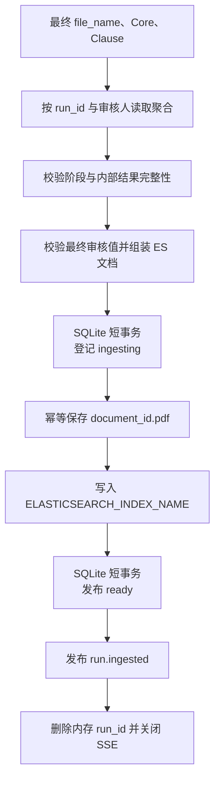

# 复核后合同正式入库

> **用途：** 本文说明审核用户如何基于内存 `run_id` 提交最终文件名、Core 和 Clause，以及服务端如何协调 SQLite 文件目录、处理版 PDF 和正式 Elasticsearch 索引。

SQLite 字段以[合同 SQLite 元数据结构](../../architecture/data/contract-sqlite-metadata.md)为准，最终 Elasticsearch 字段以[合同 Elasticsearch 文档结构](../../architecture/data/contract-elasticsearch-document.md)为准；HTTP 请求和响应见[合同 API](../../api/contract.md#正式入库合同)。

---

## 职责与输入

正式入库由 `app.service.contract_ingestion.ContractIngestionService` 承担投影与三处持久化编排，`app.infrastructure.contract_metadata_store.SQLiteContractMetadataStore` 使用短事务维护文件目录和状态，`ContractExtractionService` 负责按 `run_id` 定位运行、校验所有权和控制生命周期。

调用方只提交三项最终审核值：

- `file_name`：最终展示名称，不作为物理存储路径；
- `core`：包含启动期 Core 目录全部稳定 `code` 的完整对象，没有最终值时使用 `null`；
- `clauses`：按原合同阅读顺序排列的完整最终条款。

服务端从运行聚合补齐：

- 处理版 PDF 的 `document_id`、字节、页数和 `file_uri`；
- 已确认的合同分类；
- Retrieval 分支的问题融合向量；
- PDF 查重阶段的页面融合向量；
- 当前登录审核人的名称和带时区入库时间。

审核人不由请求体提供。入库调用继续执行与快照、SSE、重试相同的运行所有权校验，跨用户访问按任务不存在处理。

---

## 入库条件与校验

八个用户业务阶段必须全部为 `succeeded`，并且内存聚合中必须同时存在分类、建议名称、Core、Clause、Retrieval 和 PDF 查重结果。分支结果可以是 `partial`：用户提交的完整最终值会替换自动 Core 和 Clause，且最终文件名可以与自动建议不同；两个合同级向量仍必须已经成功形成。

Core 按启动期不可变字段目录执行动态校验：

- 顶层必须精确包含全部 Core `code`，拒绝未知或缺失字段；
- `single` 单属性字段使用标量，`single` 多属性字段使用对象，`multiple` 字段使用对象数组；
- 对象拒绝未知属性，并要求所有 `required: true` 属性存在；
- 字符串、整数、数值和布尔值必须符合定义类型，字符串不能为空白，数值必须有限；
- 顶层 `null` 和空多值数组在最终投影时省略，不写入 Elasticsearch。

Clause 至少包含一条，并校验 `clause_id` 唯一、`order` 按数组顺序从 1 连续增长、父条款先于子条款出现、页码不超过处理版 PDF 总页数，以及编号、路径和正文非空。`title`、`parent_clause_id` 为 `null` 时在最终文档中省略。

`file_name` 会去除首尾空白，并拒绝路径分隔符、控制字符、平台保留符号、首尾句点和超过 255 个字符的名称。它不决定物理文件名；处理版 PDF 始终使用 `document_id.pdf`。

---

## 持久化与失败边界



SQLite 默认位于 `data/abstract/contracts.db`。服务首先以短事务写入名称、类别摘要、Core `signing_date`、文件地址、审核人和入库时间，并把状态设为 `ingesting`；SQLite 事务提交后才开始文件和 ES I/O，不会在网络调用期间持有写锁。普通文件管理只能读取 `ready` 记录。

处理版 PDF 先保存到 `data/contract/<document_id>.pdf`。文件存储重新计算 SHA-256，拒绝字节与身份不一致的内容；写入使用同目录临时文件和原子替换，已有同身份文件会先核对内容后直接复用。

ES 写入使用 `ELASTICSEARCH_INDEX_NAME`，默认 `contracts-v1`，并以 `document_id` 同时作为 `_id` 和 `_source.document_id`。同一 `document_id` 再次写入会覆盖该合同文档，支持审核用户在查重后选择更新同身份合同；不会使用实验索引配置。

PDF 或 ES 明确失败时，SQLite 状态转为 `failed` 并保存失败原因；内容寻址文件可以安全保留，运行聚合不会删除，用户能够使用同一 `run_id` 重试。ES 请求超时或连接中断时会立即实时读取同一 `_id`，只有完整元数据匹配才按成功收敛。ES 成功后还必须把 SQLite 状态提交为 `ready`，服务才发布 `run.ingested`、从内存注册表删除运行并关闭现有 SSE。之后该 `run_id` 的查询、重复入库或重试均返回不存在。

同一进程内相同 `document_id` 的入库尝试串行执行，防止并发 ES 覆盖与 SQLite 状态错配。应用启动时扫描 `ingesting` 和 `failed`：重新核验 PDF 哈希以及 ES 中的名称、地址、审核人、入库时间、类别摘要和签订日期，全部匹配时恢复为 `ready`，否则保持不可见并标记失败。ES 在对账期间不可访问会阻止应用启动。

---

## 依赖与验证

应用启动时由 `app.bootstrap` 使用共享 `AsyncElasticsearch`、正式索引名、固定 Core 目录、向量维度、本地合同文件存储和 SQLite 元数据存储装配入库服务。SQLite 路径由 `CONTRACT_METADATA_DATABASE_FILE` 配置，默认 `data/abstract/contracts.db`。

不连接外部服务的基础静态验证命令为：

```bash
python -m compileall -q app
```

联调时还应确认正式索引 mapping 已完成启动同步，并分别验证正常写入、覆盖同 `document_id`、非法 Core/Clause、ES 不可用后重试、非 `ready` 记录不进入文件列表、启动对账恢复，以及入库成功后 `run_id` 返回 `404`。
