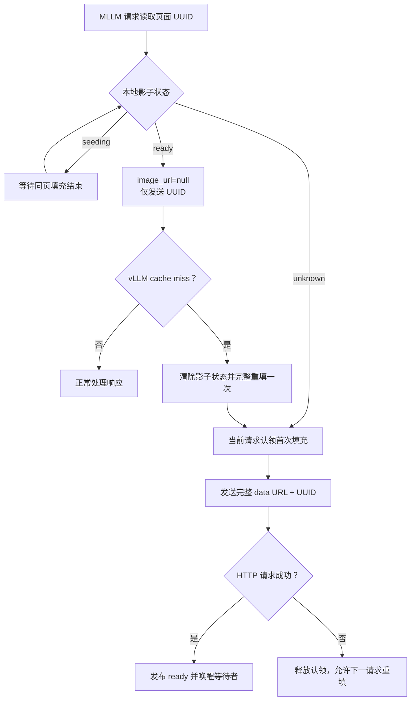

# vLLM 多模态媒体引用

> **用途：** 本文说明合同视觉页面如何通过 vLLM 媒体 UUID 完成一次填充、多请求引用，避免并发请求重复持有和传输 Base64 图片。

---

## 适用范围

该能力位于 `app.infrastructure.vllm_media_reference`，由统一 `MLLMClient` 自动使用。它覆盖合同结构理解、分类、Core、条款、检索问题生成以及 PDF 查重中的 MLLM 图片内容块，不改变 Agent 节点的模型可见任务、工具、短期记忆或工作区。

页面 Embedding 不使用该能力：每个页面在当前向量化流程中只发送一次，没有跨请求重复的同一视觉输入；其连接、批次和归一化仍由 `EmbeddingClient` 负责。

远端服务必须为支持 OpenAI Chat Completions 媒体 `uuid` 与空媒体引用的 vLLM 版本，并启用多模态处理器缓存或 prefix cache。当前已对 vLLM `0.26.0` 验证该协议。

---

## 传输流程

`PreparedPDFPage` 在形成时获得一个随机 UUIDv4 `media_uuid`。消息构造器仍保留完整 `image_url` data URL，同时把该 UUID 写入同一个图片内容块。协调器决定本轮真正发送完整内容还是空引用：



同一事件循环内，协调器按 `base_url + model` 隔离。不同媒体可以并行首次填充；包含重叠 UUID 的请求只等待重叠页面，不会同时各自序列化同一组 Base64。请求成功表示 vLLM 已接受并处理媒体，此时即使模型工具输出随后不满足业务 Schema，页面仍可以供下一纠错轮次引用。

---

## 缓存失效与失败边界

应用只在 vLLM 返回 `HTTP 400` 且正文同时包含 `Cache miss for ... data is not provided` 的稳定语义时执行一次透明重填。该情况可能来自服务重启、媒体 LRU 淘汰或请求被负载均衡到没有相同缓存的 API worker。

其他 `400`、连接失败、超时和服务错误继续沿用 `MLLMClient` 的既有错误分类，不会被误判为缓存失效。首次填充失败或任务取消时，协调器清除 `seeding` 状态并唤醒等待者，防止后续请求永久等待。

客户端只保留最多 4096 个 `ready` UUID 的 LRU 影子状态。被客户端淘汰的页面会在下次使用时重新发送完整数据；该状态不保存图片、合同文字或响应，只保存 UUID 和两态标记。

---

## 安全与模型视角

媒体身份使用每个 `PreparedPDFPage` 独占的随机 UUIDv4，不使用文件名、页码、用户 ID 或可预测顺序值。UUID 只用于传输层多模态缓存，不由 chat template 渲染给模型，也不进入模型任务说明。

协调器替换内容块时只浅复制消息容器，未替换的 Base64 字符串保持单一 Python 对象引用。原始稳定消息始终保留完整 data URL，因此 cache miss 重填无需从模型历史或外部文件恢复图片。

> **边界：** 媒体 UUID 只能复用完全相同的页面对象；不得让不同图片共享同一 UUID。当前页面 UUID 随 `PreparedPDF` 生命周期生成，进程重启后不会依赖远端遗留缓存。

---

## 配置

```dotenv
VLLM_MLLM_USE_MEDIA_REFERENCES=true
```

- `true`：启用首次完整填充、后续 UUID-only 引用和一次 cache-miss 自动重填。
- `false`：统一客户端在发送前移除 vLLM 专属 `uuid`，恢复标准 OpenAI 完整 `image_url` 请求。

该开关默认开启。若目标并非 vLLM，或 vLLM 未启用多模态缓存，应显式关闭。

---

## 性能影响与限制

对当前 21 页处理版合同的公共页面消息进行本地 JSON 序列化验证：首次完整消息约 `26,973,869` bytes，UUID-only 消息约 `3,445` bytes，视觉消息载荷减少约 `99.987%`。该数据只说明客户端消息体积，不代表模型生成加速比。

首次出现的页面仍需完整上传；不同合同、不同候选 PDF 或首次打开的新候选页不能凭空引用。vLLM prefix cache 继续负责复用模型 token 前缀，媒体 UUID 负责减少图片哈希、处理以及重复网络载荷，两者互补而不互相替代。

服务端媒体缓存容量不足时会增加透明重填次数，但不会使用错误页面继续推理。多 API worker 部署应保证请求粘滞或每个 worker 均支持相同缓存协议，否则仍可能出现一次重填开销。

---

## 验证

```bash
.venv/bin/python -m unittest tests.infrastructure.test_vllm_media_reference
.venv/bin/python -m unittest discover -s tests -p 'test_*.py'
```

测试覆盖并发等待、首次填充失败接管、影子状态 LRU、显式失效、关闭能力回退和 `MLLMClient` cache-miss 自动重填。真实服务接入时还应验证首轮完整请求、第二轮空 `image_url` 引用、服务重启后的自动恢复，以及峰值 RSS 与请求上传字节。
