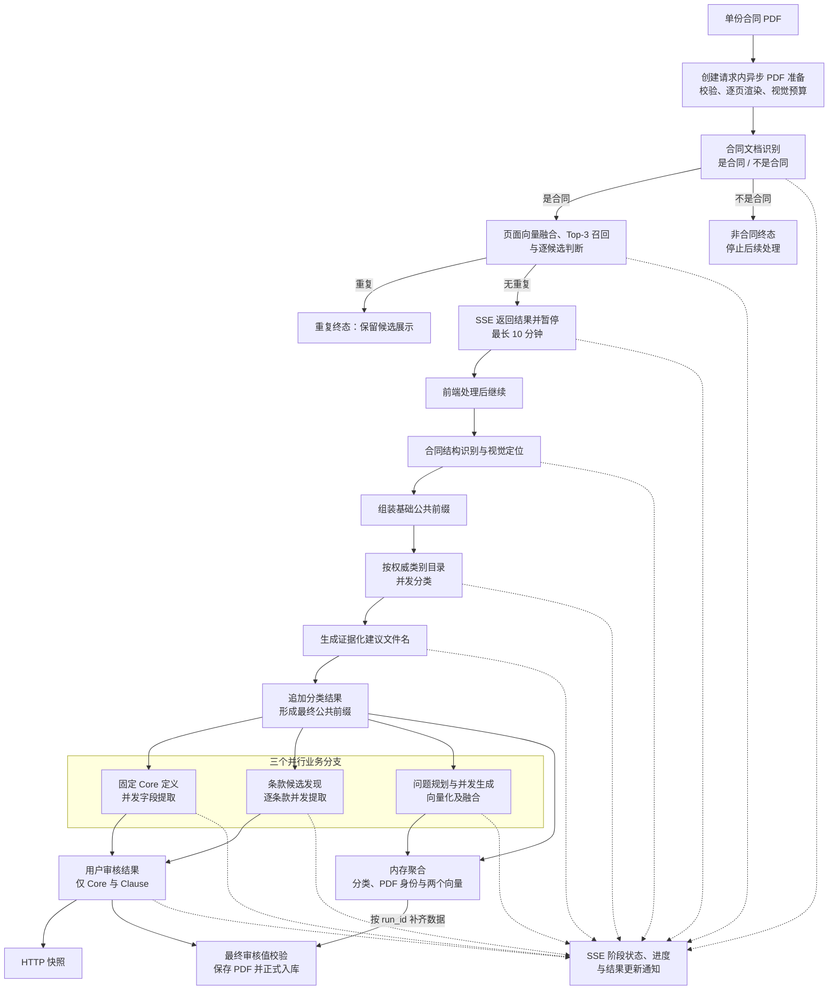

# 合同信息抽取 Agent：项目说明

> **项目定位：** 本项目面向单份 PDF 合同，使用本地多模态模型完成文档结构理解、合同分类、固定 Core 字段提取、条款提取和检索问题生成，并通过 HTTP/SSE 提供可追溯的增量审核草稿。

本文件只说明当前已经实现的能力、全局边界和阅读入口。字段契约、子图流程、接口协议与运行方式分别由对应专题文档维护，并统一收录在[项目文档导航](readme.md)中。

---

## 1. 项目目标

项目将合同 PDF 转换为具有原文证据、稳定身份和运行审计的结构化草稿，使调用方能够逐步查看并核对以下结果：

- 合同与权威交易类别目录的逐类别匹配结果。
- 结合页面事实、文档结构与分类结果生成的可修改建议文件名。
- 按启动期固定 Core 目录提取的结构化字段对象。
- 按原合同阅读顺序保留的规范性条款及其层级路径。
- 根据权威提问指南动态生成的自然语言检索问题。
- 逐问题检索向量及经算术平均、重新 L2 归一化得到的合同级向量。

系统以证据正确性、机器约束和失败隔离为优先，不让模型自由创造字段定义，也不把自动结果视为法律意见或无需核对的最终事实。

---

## 2. 当前实现范围

### Agent 工作流

- 会话记忆加工子图已支持批量筛选、并发单任务总结及总结侧向量化，并按原顺序返回包含原轨迹的待入库内容；归档服务已接通十分钟分批扫描、向量落库及空闲会话安全驱逐，查询端尚未实现，详见[会话记忆加工工作流](architecture/workflow/conversation-memory/readme.md)。
- 创建任务后先通过独立 MLLM Agent 判断处理版 PDF 是否属于合同文档；只有可靠判定为合同时才执行 PDF 查重，非合同形成可见终态并停止后续处理。
- PDF 查重包含处理版 PDF 逐页向量化、尾页加权融合、ES Top 3 阈值召回、处理版 SHA-256 精确重复短路、`data/contract` 候选加载、候选并发与失败隔离，以及按视觉 token 与合计页数分流；短 PDF 采用全量双文档判断，长 PDF 采用完整上传合同与候选按页导航判断。
- 创建请求接收 PDF 字节，校验并按视觉 token 预算逐页渲染；计算处理版 PDF 的 SHA-256 后只驻留页面 PNG，预览与入库时按需重新封装。
- 发现合同内容单元，为单元建立页码、文字锚点、摘要和视觉位置。
- 读取启动期不可变类别目录，为每个合同类别并发执行独立判定。
- 在分类后根据页面、文档结构和分类摘要生成带页面证据的友好建议文件名。
- 将分类结果稳定追加到公共模型前缀，供三个下游分支复用。
- 按固定 Core 定义并发提取字段，校验证据、基数和动态对象 Schema。
- 顺序发现条款候选，再按候选并发提取完整直接正文。
- 顺序规划检索问题关注点，再并发生成问题、批量向量化并融合合同向量。
- 为多轮工具调用提供协议恢复、临时失败记忆清理、私有审计和并发会话隔离。

### 应用接口

- Communication 附件可通过资源接口读取：仅授权本人已驻留任务轨迹中的 `accepted` 附件，优先读取内存、归档后回退磁盘，不自动加载未驻留历史，详见[会话附件读取](api/resource.md#读取已驻留会话任务的-pdf-附件)。

- Communication 门禁所有已知未放行结果统一进入拒绝回复节点，依据精简业务日志生成自然反馈；回复故障仍兜底为 rejected，SSE、快照、历史同步且附件不落盘，详见[统一拒绝与响应](architecture/workflow/contract-communication/business-gate.md#统一拒绝与响应)。

- Communication 已通过 `can_interrupt` 同步创建响应、SSE、快照和历史恢复：完整门禁通过并进入后续执行前禁止用户取消或替代，服务端返回 `409` 且不改变旧任务，详见[门禁阶段的用户中断限制](architecture/workflow/contract-communication/user-context.md#门禁阶段的用户中断限制)。

- Communication 用户恢复通过精简 SSE 展示记录读取，不再展示内部工具轨迹；不保存 delta，中断消息收束为 `message.completed(status=interrupted)` 后随任务备份，详见[用户展示 Payload](api/communication.md#用户展示-payload)。
- Communication 已支持本人会话改名和 SQLite 级联删除，删除时同步驱逐会话轨迹及事件运行时，并与后台备份协调。
- Communication 已实现 open 按最新摘要加载历史、refresh 向前扩展至更早摘要，模型历史候选始终限定最新摘要及其后记录；不加载检索文本和向量。
- `GET /communication/conversations` 已支持当前用户全部持久化会话的轻量列表，返回 ID、名称和创建时间，并按密钥隔离。
- `/communication/conversations` 已支持首次输入与可选名称创建持久化会话、空工作区及待激活首轮；后续轮次须引用存在且归属当前密钥的会话，任务有序轨迹统一驻留，终态后自动后台备份，不阻塞历史展示。
- `/communication` 已支持表单暂存文字与 PDF、创建或替换待激活轮次；须在 180 秒内首次订阅激活，否则释放输入并返回 `410`。SSE 与快照支持用户隔离、交错输出、`intermediate/final`、回放及终态关闭。正式执行器激活后调用文件可读性门禁，校验统一展示“正在思考”，拒绝提示流式输出，终态同步写入驻留历史并后台备份；支持取消执行及输入清理。
- 支持审核用户仅凭配置密钥登录，签发带 TTL 的进程内免登码。
- 除健康检查和登录外，所有 HTTP/SSE 接口统一校验 Bearer 免登码并注入审核人名称。
- 用户具有三级合同权限，所有等级可查看，1、2 级可新增；1 级可通过正式删除接口清理 ES、PDF 和 SQLite 合同数据。
- 合同任务在创建时绑定当前审核人名称；运行列表、快照、SSE、继续和重试只允许任务所有者访问，跨用户请求按任务不存在处理。
- 支持按正式合同文档的 `file_uri` 安全读取 `data/contract` 中的 PDF。
- 提取任务快照和运行列表返回处理版 PDF 的 `file_id`，复用任务 UUID；资源接口按所有者鉴权、从内存页面按需组装 PDF，支持任务保留期内恢复预览，任务释放后失效。
- 支持读取启动期固定的 Core 表单定义，使前端能够识别字段属性、数据类型、必填规则和单项/多项基数。
- 支持读取 SQLite 全部合同类别的 ID、代码与名称，供前端构建类别选项。
- 支持已登录审核人读取全部已成功入库合同的轻量元数据目录。
- 支持列出当前进程内正在处理、等待人工操作或已经形成提取结果但尚未入库的运行；列表以 `processing | blocked` 区分自动推进与人工介入，并在可用时提供建议文件名摘要，供前端选择 `run_id` 后恢复快照、SSE 和处理版 PDF 元数据。
- 通过 HTTP 上传单份 PDF，并创建进程内合同处理任务。
- 通过快照接口返回八个用户阶段、合同文档判断、查重审核结果、建议文件名，以及用户必须复核的 Core 与 Clause；请求内 PDF 技术处理不作为用户阶段暴露。
- 通过 SSE 返回阶段开始、真实离散进度、查重暂停、继续、完成、失败、重试和草稿更新事件。
- 查重完成后返回重复或相似候选及 PDF 地址；哈希一致或模型判重时直接结束，保留候选展示但禁止继续、重试和入库。无重复时暂停最长 10 分钟，确认后执行结构识别、分类和提取；PDF 仍由独立资源接口读取。
- 分类完成后先生成建议文件名，再并行运行 Core、Clause 和 Retrieval 三个业务分支；Core 或 Clause 成功后独立更新用户可见提取结果，Retrieval 结果只在内存中供后续入库使用。
- 合同分类成功事件通过 SSE 及时返回类别 `code`、名称和当前合同场景；同一精简结果持续保存在单任务 GET 快照中供恢复，但不进入可编辑的 Core/Clause 草稿。
- 建议名称成功事件通过 SSE 返回 `file_name`、命名理由和页面证据；同一结果保存在单任务快照中，运行历史列表保留名称摘要，供断线和重新进入任务时恢复。
- 八个用户业务阶段失败后均可从失败点重试并复用成功前置结果；任一阶段一旦成功便不允许重跑。
- 支持审核用户主动取消自己的内存任务，终止后台协程与 SSE，并立即释放处理版 PDF、草稿和中间结果。
- 正式入库按生成顺序将检索问题原文保存至 ES `retrieval_questions`，供后续更换 Embedding 模型时重算问题融合向量；旧合同不自动回填。
- 支持任务所有者提交最终展示文件名、完整 Core 和 Clause；服务端补齐分类、两个合同级向量、处理版 PDF 身份和审核信息后，以 SQLite 状态机协调文件与正式 Elasticsearch 写入，并释放对应运行。
- 支持有界事件回放、心跳、任务 TTL 和慢订阅者隔离。

### 基础设施

- Communication 已提供会话、任务/摘要、工作区的 SQLite 三表及基础读写，启动时初始化；会话同时驻留轨迹与工作区，每批终态轨迹备份在同一事务同步保存工作区，模型整理工作区尚未接入，详见 [Communication SQLite 存储](architecture/data/communication-sqlite.md)。
- 应用启动时探测正式 Elasticsearch 索引，不存在时按当前契约创建，存在时增量补齐新增 Core 与检索问题原文 mapping；自动草稿不写入 Elasticsearch，最终审核值及后台检索数据在正式入库时统一写入。
- 正式合同的轻量文件目录保存在 `data/abstract/contracts.db`；普通文件管理只读取 `ready`，应用启动时对非就绪记录核验处理版 PDF 与 ES 文档。
- 根目录 Dockerfile 负责后端镜像构建；前端、后端与 Elasticsearch 的 Compose 编排由独立 `contract-service-deploy` 项目维护。
- 多模态生成和 Embedding 均通过环境变量连接本地 OpenAI 兼容服务。
- 全部模型客户端在单 worker 内共享两类独立的全局请求配额，默认 MLLM 20、Embedding 10；节点局部限制继续保留，详见[模型全局并发额度](capability/infrastructure/model-concurrency.md)。
- MLLM 页面首次发送完整视觉内容，后续并发与多轮请求通过 vLLM 媒体 UUID 引用同一页面，并在缓存失效时自动重填一次。
- 合同类别、Core 字段和检索问题指南在应用启动时全量加载并形成不可变快照。
- 审核用户 YAML 在应用启动时全量校验并形成不可变内存用户对象。
- 免登码以“免登码 → 审核人名称”保存于当前 API 进程内存，成功访问受保护接口时刷新配置时效。

---

## 3. 当前边界

- 面向用户的[合同沟通智能体](architecture/workflow/contract-communication/readme.md)已有门禁与[文件可读性子图](architecture/workflow/contract-communication/file-readability.md)，已实现顺序打开、按文件 Map-Reduce 渲染与视觉判断、JSON Schema 约束解码、有限纠错及尾部熔断，并已接入正式 Communication 服务。可读性通过后已接入逐文件并发命名与摘要；文件、文字业务相关性、文件与文字整体判断、上下文相关性及加权阈值聚合已实现；服务端选取最新摘要之后最多五轮有效历史并排除拒绝任务。核心问答上下文继承、记忆、规划或合同查询工具仍未实现。已确认需求与待定边界见 [Communication 总体设计](architecture/system/contract-communication.md)。
- Communication 附件已支持[准入后延迟落盘](architecture/system/communication-history.md#附件准入与延迟落盘)：注册只暂存内存，执行层显式批准后随终态备份保存；拒绝或未判定就结束的附件仅保留不可用元数据。正式门禁不因可读性通过就提前批准附件；启用混合联调时，完整门禁通过后批准附件并串接模拟问答，未启用时仍返回后续能力未接入提示。独立演示脚本保留纯模拟准入。
- 系统只支持固定 Core 提取，不包含候选字段生成、归并、统计或治理流程。
- Core 只能来自启动期通过严格校验的固定字段目录；运行时不得创建目录外字段。
- 合同提取任务的原始 PDF 只在创建请求期间存在；任务长期只保存页面 PNG 与元数据，Base64 和整份处理版 PDF 均按需生成、不写回任务。communication 附件注册时只暂存内存，只有已准入附件随终态备份写入 upload；运行时终态释放输入，已准入字节在历史层保留至记忆归档成功。已备份的会话轨迹可跨进程重启读取；实时 SSE 和尚未备份轨迹、附件不可保证恢复。
- 当前没有独立的专家编辑版本或审核历史；正式入库接口直接接收有新增权限的任务所有者提交的最终文件名、Core 和 Clause。
- 当前注册表不跨进程共享，开发热更新会清空任务；合同处理服务必须使用单 worker。
- 免登校验确认审核人身份，结合三级操作权限和合同任务所有权隔离；免登码缓存和任务注册表均不跨进程共享，重启即清空。
- 系统不替代合同审阅、法律意见或合同效力判断。
- 检索问题只生成问题和向量，不生成配套答案。

---

## 4. 核心术语

| 术语 | 当前含义 |
| --- | --- |
| Core | 由固定目录定义的结构化合同字段；每个定义包含稳定索引代码、语义、排除边界、基数、扁平属性 Schema 和可选分词策略。 |
| Clause | 具有独立视觉边界和法律效果的规范性条款；保留原始顺序、层级路径、起止证据和直接正文。 |
| Retrieval Question | 根据提问指南和合同事实动态生成的自然语言检索问题；不包含答案。 |
| Contract Retrieval Vector | 对成功问题向量执行算术平均并重新 L2 归一化得到的合同级检索向量。 |
| `document_id` | 任务实际保存并计划入库的处理版 PDF 字节 SHA-256；不使用可空或可重复的合同编号替代。 |
| 增量草稿 | 面向人工核对的内存对象，包含分类以及当前已完成的 Core、Clause 和 Retrieval 分区。 |
| 私有审计 | 不向前端直接公开的模型响应、工具参数、反馈、用量、耗时和内部错误记录。 |

---

## 5. 规范职责与优先级

> **机器规范优先：** 权威定义、输出 Schema 与程序校验共同构成可执行契约；提示词和说明文档不得替代机器约束。

- 合同类别定义负责类别身份、核心权利义务结构、包含与排除边界及专家正反例。
- Core 定义负责字段及属性的稳定索引代码、字段语义、别名、基数、扁平属性类型、必填约束和 Elasticsearch 分词策略。
- Retrieval View 指南负责问题关注点、适用条件、重点事实和排除边界。
- 程序负责工具协议、动态 Schema、页码、状态、数量、顺序、向量维度和归一化校验。
- 提示词负责向模型表达任务、证据顺序、工具使用和失败边界，但不能独自定义正式结果。
- 专题文档负责解释模块关系、设计决策、接口和运行限制。

模型可见上下文、权威工作区、临时纠错记忆、私有审计和下游状态必须相互隔离。某个动作通过全部校验后，连续失败轨迹必须从模型上下文清除，但仍完整保留在私有审计中。

---

## 6. 当前处理流程

分类与建议名称生成是三个业务分支的串行公共前置阶段；建议名称不进入三个分支的模型上下文。Core、Clause 和 Retrieval 分支只读同一份最终公共前缀，彼此不消费对方结果，也不共享可变模型上下文。应用服务按分支独立提交结果；Core 或 Clause 完成后即可供调用方查看，Retrieval 结果只留在内存中供后续入库使用。

---

## 7. 质量原则

- **证据优先**：字段、分类、条款和问题必须保留可回到原 PDF 核对的页码与精简原文。
- **固定定义优先**：Core 和类别身份只能来自启动期权威目录，模型不能改写或临时扩展。
- **程序校验优先**：工具调用只有通过协议、Schema、状态和业务校验后才能进入正式结果。
- **上下文清洁**：并发任务拥有独立短期记忆；失败轨迹不会污染兄弟任务、权威工作区或下游状态。
- **失败隔离**：单个类别、字段、条款或问题失败时保留其他有效结果；三个应用分支可以独立失败和重试。
- **真实进度**：SSE 只报告程序可知的离散总量与完成数，不估算模型生成百分比。
- **版本可追溯**：结果和私有审计记录模型、提示词、工具及目录指纹等运行信息。

---

## 8. 阅读入口

- 查找全部项目文档：阅读[项目文档导航](readme.md)。
- 了解完整节点拓扑：阅读[合同信息抽取 Agent 工作流](architecture/workflow/contract-extraction/readme.md)。
- 了解内存任务、三路并行、SSE 和重试：阅读[合同提取应用运行时](architecture/system/contract-extraction-runtime.md)。
- 对接合同上传、快照和 SSE：阅读[合同 API](api/contract.md)。
- 配置并启动后端：阅读[FastAPI 后端应用骨架](capability/application/backend-application.md)。
- 启动本地 Elasticsearch：阅读[Elasticsearch 本地开发部署](capability/infrastructure/elasticsearch-development.md)。
- 修改提示词：阅读[提示词工程规范](standard/prompt-engineering.md)。
- 修改多轮工具节点：阅读[多轮 Agent 上下文与记忆管理规范](standard/agent-context-management.md)。
- 新建或修改文档：阅读[文档撰写风格手册](documentation.md)。
