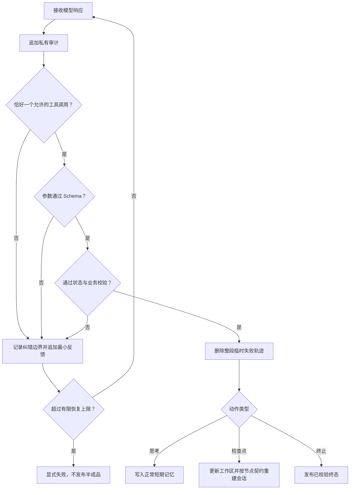

# 多轮 Agent 上下文与记忆管理规范

> **适用范围：** 本规范适用于 `app.agent` 中所有具有多轮模型交互、函数工具调用、状态机校验、工作区或失败恢复的节点，包括后续新增节点。
>
> **强制要求：** 模型纠错所需的失败轨迹只能临时存在；某个动作通过协议、Schema、状态和业务校验后，必须清除此前连续失败轨迹。私有审计必须完整保留，权威工作区和下游状态只能接收已校验结果。

---

## 1. 规范职责

本文件是多轮 Agent 上下文分层、记忆生命周期、错误恢复和审计隔离的权威规范。具体节点文档只说明自身保存哪些工作区对象、何时形成检查点以及允许调用哪些工具，不重复定义通用清理协议。

模型提示词的公共前缀、工具位置、合法调用格式和证据推理顺序遵循[提示词工程规范](prompt-engineering.md)。本规范负责回答：一轮响应进入哪里、失败如何反馈、纠正成功后删除什么、哪些内容可以进入长期状态，以及如何验证上下文始终清洁。

---

## 2. 上下文分层

每个多轮会话必须显式区分以下六层，不得使用一个无边界的 `messages` 列表同时承担全部职责。

| 层级 | 作用 | 是否给模型 | 生命周期 |
| --- | --- | --- | --- |
| 稳定前缀 | 公共规则、PDF、稳定任务和工具布局 | 是 | 同一任务内不可变；按缓存规范构造 |
| 权威工作区 | 已通过校验的阶段结论和继续工作所需的精简事实 | 是 | 由程序维护；检查点动作成功后更新 |
| 正常短期记忆 | 当前检查点后的有效 `assistant/tool` 交互，例如必要的 `think` | 是 | 保留到检查点成功、显式重建或终态 |
| 临时纠错记忆 | 从第一次连续失败开始的失败调用、最小反馈和后续修正尝试 | 是 | 下一次动作被完全接受时整体删除 |
| 私有审计 | 原始响应、普通文本片段、工具参数、反馈、token、耗时和错误 | 否 | 全程追加，清理模型上下文时不得删除 |
| 下游状态 | 供其他节点或最终结果消费的结构化对象 | 否 | 只接收已通过全部校验的正式结果 |

> **核心边界：** 模型消息不是事实存储，私有审计不是模型记忆，工作区也不是原始对话历史。三者必须分别维护。

---

## 3. 单轮接受流程

每轮响应必须按固定顺序处理，不能因为 JSON 可解析或工具名存在就提前写入状态。

等价的处理顺序为：先审计，再验证协议、工具名称、参数、状态和业务语义；任何一层失败都进入同一连续纠错范围；只有全部通过才清除该范围并提交动作。

---

## 4. 临时纠错记忆

### 4.1 建立边界

第一次出现以下任一失败时，程序必须记录当前模型消息长度作为 `memory_start` 或等价边界：

- 零个或多个工具调用。
- 未知、当前不可用或顺序非法的工具。
- JSON、Pydantic 或动态 Schema 参数错误。
- 页码、坐标、引用、重复对象、工作区顺序等状态错误。
- 业务语义、证据覆盖或终止条件校验失败。

后续连续失败的 assistant 调用和 tool/user 反馈只追加在该边界之后。不同错误类型共用这一边界，避免只清除最后一条反馈而残留更早的错误示例。

### 4.2 失败反馈

反馈必须简短，并说明字段位置、具体问题和可执行修正方向。没有合法工具调用时，使用[Non-strict auto 工具恢复](prompt-engineering.md#26-non-strict-auto-工具恢复)规定的真实 XML 模板。

不得向模型回显：

- 上一轮完整普通文本或完整无效参数。
- 异常堆栈、内部错误码和无关状态。
- 伪造的“修正后 JSON”或程序猜测的正式结果。

普通文本、伪工具调用和半成品只能进入受长度限制的私有审计，不能降级解析为正式参数。

### 4.3 接受与清理

“恰好一个工具调用”只代表协议格式恢复，不代表纠错完成。只有该动作同时通过工具名称、参数、状态和业务校验，程序才可以：

1. 删除从 `memory_start` 开始的全部失败调用、失败反馈和修正尝试。
2. 重置协议恢复计数和纠错边界。
3. 将当前正确动作写入正常短期记忆，或用更新后的权威工作区重建上下文。
4. 在私有审计中继续保留被删除的失败轨迹和本次纠正成功事实。

不得只删除错误反馈而保留产生错误的 assistant 工具调用，也不得在参数仍错误时仅因协议恢复就提前清理。

---

## 5. 正常短期记忆与工作区

### 5.1 普通有效动作

不改变权威工作区的有效动作，例如 `think`，可以保留在正常短期记忆中，帮助当前阶段连续推理。它必须有明确轮次上限，不得形成无界上下文。

如果 `think` 前存在连续失败链，本次 `think` 只有通过其自身参数和状态校验后，才先清除失败链，再作为新的有效短期记忆写入。

### 5.2 检查点动作

记录字段对象、条款候选或层级分析等检查点动作成功后，应优先把精简结果写入程序工作区，并从“稳定前缀 + 稳定任务 + 最新工作区 + 下一步方向”重建会话。此前的探索性 `think`、成功反馈和已解决错误不应继续重复占用注意力。

工作区只保存继续任务必需的稳定信息，并且：

- 身份、顺序和版本由程序生成或校验。
- 不保存失败调用、冗长推理草稿和完整原文副本。
- 每个字段有注释，模型不需要猜测 YAML 或 JSON 字段含义。
- 更新采用追加、最后一项修正或节点明确允许的有限操作，禁止模型任意改写历史。
- 重建后在动态消息尾部给出清晰的下一步方向，补偿短期历史被清空后的行动断点。

### 5.3 终止动作

终止工具只有在覆盖、数量、顺序和必要证据等终止条件全部通过后才形成结果。提前终止属于可恢复失败；超过有限上限后显式失败，不发布部分结果冒充完成状态。

---

## 6. 并发与隔离

并发任务必须为每个最小任务对象建立独立上下文，例如每个合同类别、字段、结构单元或条款候选分别维护：

- 独立的正常短期记忆和临时纠错边界。
- 独立的恢复计数、轮次上限和失败状态。
- 独立的工具审计轨迹。

一个并发会话的思考、错误反馈或失败不得进入其他会话。共享内容只能来自不可变公共前缀、只读目录快照或明确的权威工作区；共享并发信号量不等于共享消息历史。

---

## 7. 缓存与模型视角

稳定前缀、任务、工具块和动态工作区必须位于短期历史之前，具体聊天模板位置遵循[vLLM 自定义聊天模板](../capability/vllm-chat-template.md)。纠错只能追加在尾部，不能因重试改写公共前缀。

提示词可以向模型解释它能够观察的短期记忆、工作区和下一步动作，但不得暴露节点编号、缓存命中、调度或内部消息索引。模型只需要知道：已有资料是什么、哪些内容权威、当前任务是什么、上次动作哪里不合法以及现在应如何修正。

---

## 8. 实现与验证要求

共享协议能力位于 `app/agent/contract_extraction/tool_protocol.py`。新节点应复用 `ToolProtocolRecovery` 或提供行为等价且有充分理由的实现，禁止复制一套略有差异的清理逻辑。

每个多轮节点至少验证以下路径：

- 首轮合法动作正常提交。
- 零工具、多工具和普通文本经过有限恢复后成功或明确失败。
- Schema、状态和业务错误得到含修正方向的最小反馈。
- 连续出现不同类型错误时共用同一纠错边界。
- 合法工具调用但参数错误时不会提前清理。
- 下一次动作完全通过后，模型消息中的整段失败轨迹被删除。
- 正确动作、工作区和下游结果仍然保留。
- 私有审计完整保留已从模型消息删除的失败轮次。
- 并发会话之间没有消息、计数或结果泄漏。
- 达到恢复或轮次上限后明确失败，不发布半成品。

新增或修改多轮节点时，代码、提示词、节点架构文档和实验检查必须同步体现本规范。若某个节点因为只执行单轮、没有工具或使用外部会话存储而不适用，应在节点文档中明确说明例外边界。

---

## 9. 当前实现覆盖

当前以下节点已采用统一的临时纠错记忆和成功后清理逻辑：

- 文档结构单元发现与单元视觉定位。
- 合同类别并发判定。
- Core 字段并发提取。
- 条款候选顺序发现与单条款详情并发提取。
- 检索问题规划顺序发现与按规划并发生成正式问题。

后续新增字段发现或审核多轮会话时也必须直接遵循本规范；未实现能力不应预先伪造无效消息状态。
